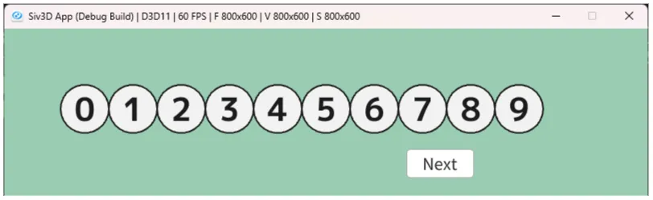

# フィッシャー–イェーツのシャッフル  
配列の中をシャッフルしたいという時は結構あると思う.  
こんな時は基本的に既に配列側に機能としてあったり、iteratorでshuffleする機能が合ったりするのでそれを使うのが普通だと思う.  
例えばC++には`std::shuffle`[^1]がある.これを使えば中身は知らずともシャッフルできるという寸法.  

とはいえ、中身をなんか実装してみたいということもある.今回は逆にそういう動機で実装しようと思ったわけである.  
調べた感じ、シャッフルには「フィッシャー–イェーツのシャッフル」[^2]というのがあるらしい.  

これは非常に単純で、アルゴリズム通りに実装するとこんな感じ.  
```c++
auto FisherYates = [&]()
{
    Clear();

    for (int index = dataList.size() - 1; index > 0; index--)
    {
        int flip = Random(0, index); // index == flipなので、同じ場所に来る可能性有
        std::swap(dataList[index].weight, dataList[flip].weight);

        weightList.push_back(dataList);
    }
};
```
indexをランダムに決めて、スワップする.  
これを繰り返すだけだ.  
今回は以下のようなツールを用意してみた.  



シャッフルした結果をステップ毎に確認できるツールだ.  
```c++
        weightList.push_back(dataList);
```
の部分がステップ毎のメモで、これを可視化してるだけである.  

今回一回やってみた感じは以下のようになった.  

```
選出側 | 決定側
0 1 2 3 4 5 6 7 8 9 |
9 1 2 3 4 5 6 7 8 | 0
9 1 2 3 4 8 6 7 | 5 0
9 1 7 3 4 8 6 | 2 5 0
6 1 7 3 4 8 | 9 2 5 0
6 1 7 8 4 | 3 9 2 5 0
6 1 4 8 | 7 3 9 2 5 0
8 1 4 | 6 7 3 9 2 5 0
8 4 | 1 6 7 3 9 2 5 0
8 | 4 1 6 7 3 9 2 5 0 終了
```

ランダムに選んだIndexのデータは確定したものとなる.  
そして、これを配列の端に配置して次のシャッフルからは選出しないようにする.  
これを繰り返してシャッフルをするわけだ、非常に単純で分かりやすいアルゴリズムだね.  

[^1]: [std::shuffle](https://cpprefjp.github.io/reference/algorithm/shuffle.html)  
[^2]: [フィッシャー–イェーツのシャッフル](https://w.wiki/Uhcu)  