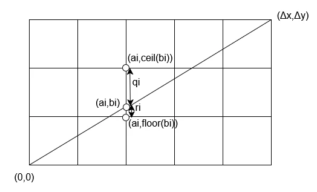
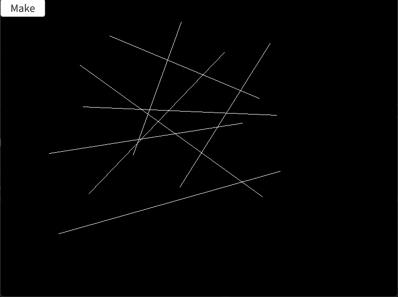

# Bresenhamのアルゴリズム  
Bresenhamのアルゴリズムはコンピュータで直線を引くためのアルゴリズム.  
直線を引くだけであれば簡単そうなイメージがあるけど、紙の上に直接引くようにはコンピュータでは中々上手くいかない...  

これは紙ではなく、「ドット絵の範囲で直線を引いてください」というように考えると分かりやすいかも？  
ドット絵だと点という離散な値しか取れない影響で、どうしても紙の上で描くような直線を描けない.  
このような直線を一定の手順で引けるようなアルゴリズムを開発したのがBresenhamですが、今回はこのアルゴリズムについて見ていく.  
論文は参照に貼っておく[^1].  

まずは図から見てみる.  

  

この図で直線を決めるために何処の点を塗るべきなのかというのを表しており、グリッド上の格子点の位置がピクセルの位置に相当.  
グリッド自体がピクセルではないので注意.  

そして、ここからの流れは第一象限限定で話を進める.  
更に言うと45度より傾きが小さいものを想定.  
これはx方向の長さが常に長くなるということ、単位円で45度までであればcosの値が大きいままであるのを考えれば分かりやすいかなと思う.  

まず、グリッド間と直線の交点を$`(a_{i}, b_{i})`$とする.  
グリッド間の距離は縦横どちらも1ピクセルと考えると、この交点は小数点と考えられるので、floorとceilを使って上下のピクセルを特定できる.  

つまり、$`(a_{i}, b_{i})`$より上のピクセルは$`(a_{i}, ceil(b_{i}))`$  
下のピクセルは$`(a_{i}, floor(b_{i}))`$で表される.  

この際上と下のどちらのピクセルを選択するべきかは縦の長さを基準にすればよく、
$`(r_{i} >= q_{i})`$なら下のピクセル.  
$`(q_{i} > r_{i})`$なら上のピクセルといったところ.  

この基準を測るためにこの差を取って横の長さを掛けた$`\nabla_{i}=(r_{i} - q_{i})\Delta x`$というパラメータを考える.  
この時、直線では上で述べたピクセル選択を考慮すると以下が言える.  

```math
\begin{equation}
    \begin{split}
        \begin{array}{llll}
            if \quad \nabla_i >= 0 \quad then \quad y_{i} = y_{i-1} + 1 \\
            if \quad \nabla_i < 0 \quad then \quad y_{i} = y_{i-1}
        \end{array}
    \end{split}
\end{equation}
```

これは単純に縦のピクセルとしてどっちが近いのかを指標としただけ、図を見れば明らか.  
そして、次にこの$`\nabla_{i}`$が決まればアルゴリズムが完成!  
この決め方ですが、以下のようになる.  

```math
\begin{equation}
    \begin{split}
        \begin{array}{llll}
            \nabla_1 = 2 \Delta y - \Delta x \\
            if \quad \nabla_i >= 0 \quad then \quad \nabla_{i+1} = \nabla_i + 2 \Delta y - 2 \Delta x  \\
            if \quad \nabla_i < 0 \quad then \quad \nabla_{i+1} = \nabla_i + 2 \Delta y
        \end{array}
    \end{split}
\end{equation}
```

これに関してはここから証明する.  
まず$`\nabla_{i}`$に関して各点のyに着目すると、以下のように式変形ができる.  

```math
\begin{equation}
    \begin{split}
        \nabla_{i} = (r_{i} - q_{i})\Delta x = ((y_{i} - floor(y_{i})) - (ceil(y_{i}) - y_{i}))\Delta x
    \end{split}
\end{equation}
```

また、傾きに関して比率を考えると$`y_{i} = \frac{\Delta y}{\Delta x}x_{i}`$と言えるので、これを利用すると以下のように式変形できる.  

```math
\begin{equation}
    \begin{split}
        \begin{array}{llll}
            \nabla_{i} = ((y_{i} - floor(y_{i})) - (ceil(y_{i}) - y_{i}))\Delta x \\
            = 2y_{i} \Delta x - (floor(y_{i}) + ceil(y_{i})) \Delta x \\
            = 2 \frac{\Delta y}{\Delta x} x_{i} \Delta x - (floor(y_{i}) + ceil(y_{i})) \Delta x \\
            = 2 x_{i} \Delta y - (floor(y_{i}) + ceil(y_{i})) \Delta x
        \end{array}
    \end{split}
\end{equation}
```

また、ここで交点部分の下のピクセルの位置を$`y_{i-1}`$とする.  
グリッドであることを考えると,$`floor(y_{i}) = y_{i-1}, \quad ceil(y_{i}) = y_{i-1} + 1`$と表せる.  
また、グリッド上であることを考えるとxの方に関しても$`x_{i} = x_{i-1} + 1`$となる.  
この二つを使ってさらに変形をしていく.  

```math
\begin{equation}
    \begin{split}
        \begin{array}{llll}
            \nabla_{i} = 2 x_{i} \Delta y - (floor(y_{i}) + ceil(y_{i})) \Delta x \\
            = 2 (x_{i-1} + 1) \Delta y - (2 y_{i-1} + 1) \Delta x \\
            = 2 x_{i-1} \Delta y + 2 \Delta y - 2 y_{i-1} \Delta x - \Delta x
        \end{array}
    \end{split}
\end{equation}
```

さて、そしたらまずは$`\nabla_{1}`$の場合を考えていく.  
まず左下の一番最初の場合は$`(0,0)`$なので、$`x_{0} = 0, \quad y_{0} = 0`$で表される.  
これを代入すると、  

```math
\begin{equation}
    \begin{split}
        \begin{array}{llll}
            \nabla_{1} = 2 x_{0} \Delta y + 2 \Delta y - 2 y_{0} \Delta x - \Delta x \\
            = 2 \Delta y - \Delta x
        \end{array}
    \end{split}
\end{equation}
```

これで$`i=1`$の場合は証明できた.  
次は$`\nabla_{i}`$を場合分けして考えていく.  

もし$`\nabla_{i} >= 0`$なら、上と下のピクセルで上のピクセルを選択するべき.  
なので、$`y_{i} = y_{i-1} + 1`$という風に上を選択します。

この条件から次の$`\nabla_{i+1}`$を考えていく.  
上の条件と$`x_{i} = x_{i-1} + 1`$を使って式変形をする.  

```math
\begin{equation}
    \begin{split}
        \begin{array}{llll}
            \nabla_{i+1} = 2 x_{i} \Delta y + 2 \Delta y - 2 y_{i} \Delta x - \Delta x \\
                = 2 (x_{i-1} + 1) \Delta y + 2 \Delta y - 2 (y_{i-1} + 1) \Delta x - \Delta x \\
                = (2 x_{i-1} \Delta y + 2\Delta y - 2y_{i-1} \Delta x - \Delta x) + 2 \Delta y - 2 \Delta x \\
                = \nabla{i} + 2\Delta y -2 \Delta x
        \end{array}
    \end{split}
\end{equation}
```

次に$`\nabla_{i} < 0`$の場合を考えていく
この場合は下のピクセルが選択されるべきなので、$`y_{i} = y_{i-1}`$となる.  
先ほどと同じように式変形をしてみる.  

```math
\begin{equation}
    \begin{split}
        \begin{array}{llll}
            \nabla_{i+1} = 2 x_{i} \Delta y + 2 \Delta y - 2 y_{i} \Delta x - \Delta x \\
                = 2 (x_{i-1} + 1) \Delta y + 2 \Delta y - 2 y_{i-1} \Delta x - \Delta x \\
                = (2 x_{i-1} \Delta y + 2\Delta y - 2y_{i-1} \Delta x - \Delta x) + 2 \Delta y \\
                = \nabla{i} + 2\Delta y
        \end{array}
    \end{split}
\end{equation}
```

これで全部の条件が求まった!!   
後は求めた式通りに実装をするだけ.  
今回の条件は一旦45度の第1象限のみのものとする.  

```c++
auto Bresenham = [&image](Point p1, Point p2)
    {
        int dx = p2.x - p1.x;
        int dy = p2.y - p1.y;

        int d = 2 * dy - dx;
        image[p1.y][p1.x] = Palette::White;
        
        int y = p1.y;
        for (int x = p1.x; x <= p2.x; x++)
        {
            if (d > 0)
            {
                y = y + 1;
                image[y][x] = Palette::White;
                d = d + (2 * dy - 2 * dx);
            }
            else
            {
                image[y][x] = Palette::White;
                d = d + (2 * dy);
            }
        }
    };
```

これで論文に書かれていた通りに描画が可能.  
とはいえ、できればどの方向でも直線を引けるようにしたいものにしたい.  
そのためには8象限分を考えてあげる必要がある.  
これはどの方向に足すかといったことを考える必要があるが、ほぼ似たような式で行ける.  
論文内でもこのことは言及がありますが、自分は以下のように実装してみた.  

```c++
auto BresenhamAll = [&image](Point p1, Point p2)
    {
        int dx = p2.x - p1.x;
        int dy = p2.y - p1.y;
        int diffX = dx >= 0 ? 1 : -1;
        int diffY = dy >= 0 ? 1 : -1;

        // プラスにしておく
        dx = abs(dx);
        dy = abs(dy);

        int x = p1.x, y = p1.y;
        int d = diffX >= diffY ? 2 * dy - dx : 2 * dx - dy;
        image[y][x] = Palette::White;

        if (dx >= dy)
        {
            while (x != p2.x)
            {
                x += diffX;
                if (d >= 0)
                {
                    y += diffY;
                    d -= 2 * dx;
                }
                d += 2 * dy;
                image[y][x] = Palette::White;
            }
        }
        else
        {
            while (y != p2.y)
            {
                y += diffY;
                if (d >= 0)
                {
                    x += diffX;
                    d -= 2 * dy;
                }
                d += 2 * dx;
                image[y][x] = Palette::White;
            }
        }
    };
```

これで全方向に対応した直線が引けるようになった!!  
実際に描画した結果は以下のようになる.  

  

色々な直線が引かれているのが分かるかと思います。  
Bresenhamのアルゴリズムの証明と実装を行いました。  
中々直線を引くといったことだけでもここまで色々考えることがあるのは面白い.  
証明に関して重要な点はピクセル間と直線の交点の距離に着目することで直線が引けるという点ですね.  
証明などもそこまで難しくないので、実際に手計算してみると良いかと思います.  

これは以前に自分がまとめてたものをまとめただけであるけども、それを公開してみた.  
なんか当時ハマってたのよね...古い論文を読んで実装してみるという行為.  

[^1]: [Algorithm for computer control of a digital plotter](https://ieeexplore.ieee.org/document/5388473)  