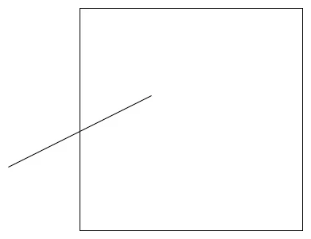
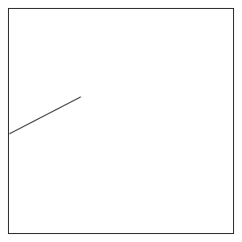
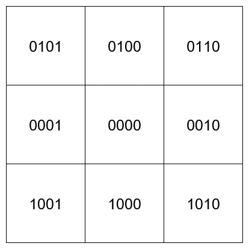
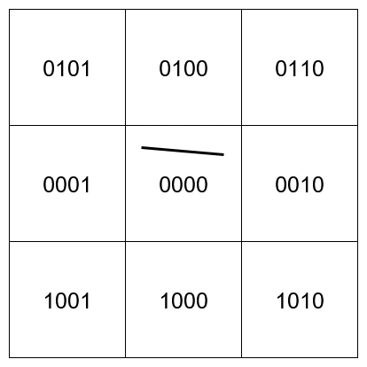
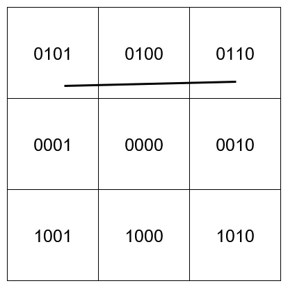
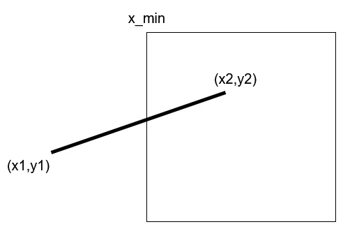
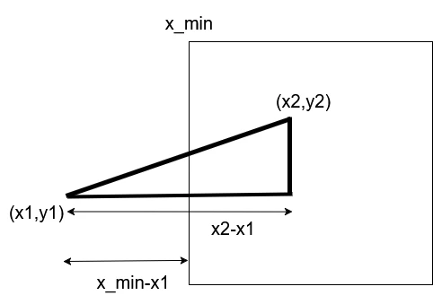
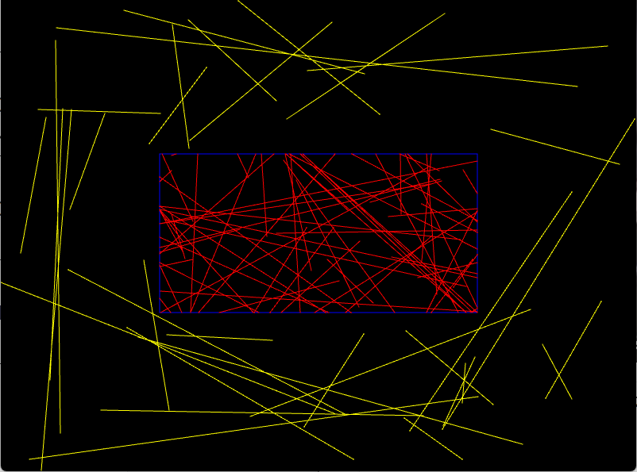

# Cohen-Sutherlandのアルゴリズム  
線分クリッピングのアルゴリズム、Wiki[^1]が詳しいと思います.  
確かCG-Artsの本にも載ってたはず[^2],現時点で手元にないので調べられないけども...(どこにやったっけ...)  

線分のクリッピングでやりたいことっていうのは非常に簡単.  
まず以下の図のような場合を考える.  

  

矩形があってそれに飛び出してる線がある.  
線は矩形の中に納まってほしいわけである.  

  

矩形内に収まると嬉しいことは何かというと、矩形外の処理を省略できる点である.  

そしたら実際に見ていく.  
まず先ほどの矩形の周りに8個の矩形を用意する.  
用意した後に4bitで番号を振り分ける.  

  

まず,`0000`がクリッピングしたい矩形となる.  
この四角形の外にある場合は基本的にはクリッピングするものと考えて良い.  
そして各ビットの意味も特に難しくはない.  

* `0001`: 1ビット目が立っている→対象矩形より左にある矩形
* `0010`: 2ビット目が立っている→対象矩形より右にある矩形
* `0100`: 3ビット目が立っている→対象矩形より上にある矩形  
* `1000`: 4ビット目が立っている→対象矩形より下にある矩形

こんな感じ.4ビットを使って上下左右を上手く表してるわけ.  
なので例として`0101`なら、左上と分かる訳だね.  

まずはこれを表すわけだけど、プログラムで書くのは簡単.  
```c++
constexpr int INSIDE	= 0;	// Windowの内側:0000

auto ComputeRegion = [&](Vec2 p)
    {
        int region = INSIDE;

        if (p.x < WINDOW_X_MIN)
        {
            region |= 1;	 	// Windowの左側:0001
        }
        else if (WINDOW_X_MAX < p.x)
        {
            region |= 1 << 1;	// Windowの右側:0010
        }

        if (p.y < WINDOW_Y_MIN)
        {
            region |= 1 << 2;	// WINDOWの上側:0100
        }
        else if (WINDOW_Y_MAX < p.y)
        {
            region |= 1 << 3;	// WINDOWの下側:1000
        }

        return region;
    };
```
0を用意してあげる.これは内側.  
pと対象となる矩形、今回はWindowで見てるのでそれと比較を行う.  
左に出ていれば1ビット目を立てたいので、0回左シフト.  
右に出ていれば2ビット目を立てたいので、1回左シフト.  
という風に左シフトを駆使して上手くビットを立ててあげるだけで良い.  
XとYの判定があるので、そこだけ注意してあげれば特に問題はない.  

そしたらこれを使って実際にクリッピングしていく処理を見ていく.  
今回は2点を`p1`と`p2`で取って、`result`に結果として受け取ることになる.  
返り値にboolで返すため、そもそもクリッピングがいらない場合はそっちで判断可能!!  
```c++
auto ComputeCohenSutherland = [&](Vec2 p1, Vec2 p2, std::pair<Vec2, Vec2>& result)
{
    // ...
}
```

まず`p1`と`p2`に対して先ほどの処理を適用して、4ビットの値に変えてあげる.  
その後は条件を満たすまで、以下の処理を行う.  
```c++
    int regionP1 = ComputeRegion(p1);
    int regionP2 = ComputeRegion(p2);

    while (true)
    {
        // ...
    }
```

まずは単純なパターンから.  
`regionP1`と`regionP2`の両方とも0のパターン.  
```c++
        if (regionP1 == 0 && regionP2 == 0)
        {
            // 両方ともWindow内
            result.first = p1; result.second = p2;
            return true;
        }
```
0というのは`0000`と同じこと、つまり両方の点が内側にあるということである.  

  

この場合は単純に点はそのままでOKなので、`result`に`p1`と`p2`を格納するだけでOK.  
勿論返り値は`true`で返してあげればよい.  

次のパターン.  
```c++
        else if (regionP1 & regionP2)
        {
            // 両方ともWindow外の同じ位置
            return false;
        }
```
`&`演算子を行うことで、同じビットが立っているときは外側と判定して返り値として`false`で返す.  
これは単純で例えば、一番上のところに線がある場合を考えると分かりやすい.  

  

左上の点は`0101`,右上の点は`0110`となる.  
これに`&`演算子を適用すると`0100`となり値を持つ.  
つまり、外側で同じ範囲を持っている場合は、確実に弾くことができるということだ. 

因みに、外側の同じ範囲の場合もちゃんと弾くことができる.  
`0100`に両方ともある場合は`0100 & 0100 = 0100`みたいな感じになるので、絶対立つからだ.  

更に言うと、中央が絡む範囲はダメである.  
`0001`と`0010`の二点の場合は`0001 & 0010= 0000`なので、確かに成り立ってない.  
あくまで外側のみが限定である.  

ここまでできれば、クリッピングを実際に行っていく必要がある.  
クリッピングの計算に関してはちょっと細かく見ていこう.  
今回は左側のクリッピングを見ていく.  
他もやること自体は同じなので、1つだけ見ればよい.  

  

クリッピングする必要があるのが見つかったということは

* 片方の点が外側に出てる
* 両方の点が外側に出ている

のどちらかとなる.上の図だと前者である.  
そのため、まずは外側になっている点を見つけ出す.  
もし2つある場合も今回は`while`を使ってるので、2回目のループで勝手にクリッピングされる寸法.  
```C++
        else
        {
            // 両方が全く違う位置の場合
            // 少なくともどっちかは外なので、それをpickする
            int outRegion = regionP1 != INSIDE ? regionP1 : regionP2;

            // ...
        }
```

このとき、次のような三角形を考える.  

  

まずx軸の縮め方は簡単、すでに矩形の最小値はわかるはずなのでそこに合わせればよい.  
この最小値を$`x_{min}`$とするならば、$`x=x_{min}`$である.  

問題はy軸の縮め方、ここがちょっと面倒.  
面倒だけど、三角形の合同を考えればそこまで難しくない.  
求めたい値は`y`としておく.  
三角形の合同より次が言える.  

```math
\begin{equation}
    \begin{split}
    (x_{min}-x_{1}) : (x_{2}-x_{1}) = (y - y_{1}) : (y_{2} - y_{1})
    \end{split}
\end{equation}
```

後はこれを使って変換するだけ.  

```math
\begin{equation}
    \begin{split}
    & \frac{y-y_{1}}{y_{2}-y_{1}} = \frac{x_{min} - x_{1}}{x_{2}-x_{1}} \\ 
    & y = y_{1} + (y_{2}-y_{1}) 
    \frac{x_{min} - x_{1}}{x_{2}-x_{1}}
    \end{split}
\end{equation}
```

これで式は求まったので、後は実際に計算をしてあげるだけ.  
やることは単純で、どこのビットが立ってるのかを見て,各方向に適用してあげるだけ.  
上記の式は`LEFT`の部分に相当するが、それ以外も大体同じような処理になってるのでまとめて書いてある.  
```c++
            Point p;
            if (outRegion & 1)
            {
                // LEFT
                p.y = p1.y + (p2.y - p1.y) * (WINDOW_X_MIN - p1.x) / (p2.x - p1.x);
                p.x = WINDOW_X_MIN;
            }
            else if (outRegion & (1 << 1))
            {
                // RIGHT
                p.y = p1.y + (p2.y - p1.y) * (WINDOW_X_MAX - p1.x) / (p2.x - p1.x);
                p.x = WINDOW_X_MAX;
            }
            else if (outRegion & (1 << 2))
            {
                // TOP
                p.x = p1.x + (p2.x - p1.x) * (WINDOW_Y_MIN - p1.y) / (p2.y - p1.y);
                p.y = WINDOW_Y_MIN;
            }
            else if (outRegion & (1 << 3))
            {
                // BOTTOM
                p.x = p1.x + (p2.x - p1.x) * (WINDOW_Y_MAX - p1.y) / (p2.y - p1.y);
                p.y = WINDOW_Y_MAX;
            }
```

最後にどの点をクリッピングしたかを判定し、クリッピングした方の点を縮めてあげればOK.  
次の`while`による更新に備えてregionも更新しておく.  
```c++

            // 新しい範囲を指定
            bool isRegionP1 = outRegion == regionP1;
            Vec2& newP = isRegionP1 ? p1 : p2;
            int& newRegion = isRegionP1 ? regionP1 : regionP2;
            newP = p;
            newRegion = ComputeRegion(newP);
```

今回はWikiに揃えてコードを書いたが、while省略して両方の点を一気に調べてしまうのも手かとは思う.  
というかそっちの方が綺麗に書けそうな気はした、まあ今回はこれでOKということで...  
ということで結果を見てみる.  

  

今回は青い枠に収まるようにするプログラムを書いた.  
黄色が外側と判定されたもの.  
赤がクリッピングされたもの,結構上手くいってるんじゃない？  

線分クリッピングはまだ他にもあるので、やるかもしれないしやらないかもしれない.  
少なくともCyrus–Beckはやろうかな...動画でも扱いましたからね.  

[^1]: [Cohen–Sutherland algorithm](https://en.wikipedia.org/wiki/Cohen%E2%80%93Sutherland_algorithm)  
[^2]: [コンピュータグラフィックス [改訂新版]](https://www.cgarts.or.jp/books_detail/ece_1/)