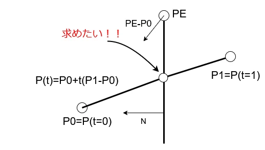
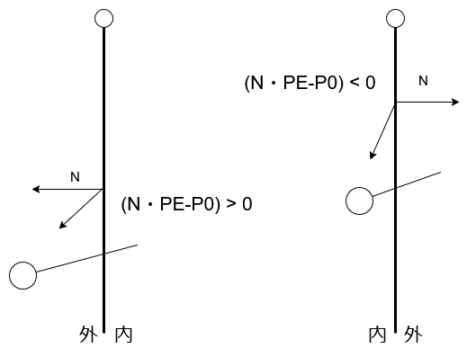
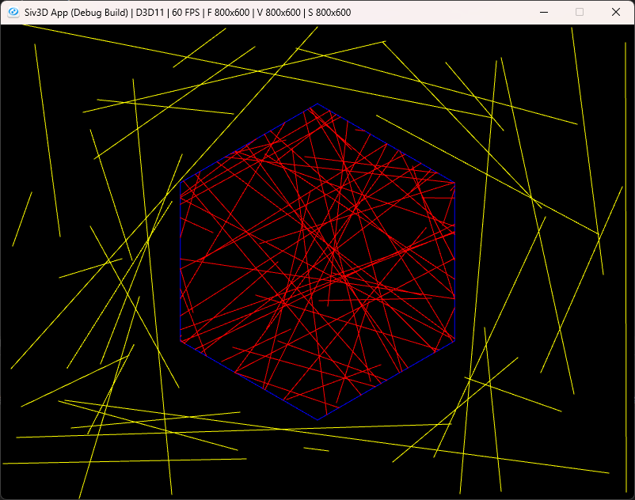

# Cyrus-Beckのアルゴリズム  
今回は多角形でのクリッピング.  
Cohen-Sutherlandなんかは矩形限定だけど、そうでない多角形でもクリッピングがしたい場合に便利な方法.  

今回は線分を上手く使ってクリッピングを行っていく.  

  

まずクリッピングの基準となる線分とそれと交差する線分の2つを考える.  
上図の場合はクリッピングの基準となるのは上から下に直線となっている線分.  
交差するのは斜めに横断する方の線分だね.  

この後者の線分を媒介変数表示で考える.  

```math
\begin{equation}
    \begin{split}
    P(t) = P_{0} + t(P_{1} - P_{0})
    \end{split}
\end{equation}
```

$`t=0`$なら$`P(0)=P_{0}`$で、$`t=1`$なら$`P(1)=P_{1}`$となるわけだね.  
lerpさせてるような感じのものになるわけだ.  
こうすることで$`t`$を求めることで交差点が求まるという利点がある.  

さて、では交差点を求める前にどういう方向に縮めるべきかを考える必要がある.  
上図であれば$`P_{1}`$が内側とわかっていれば、$`P_{0}`$をtの位置に持ってくる必要があるとなるわけである.  
これを求めるために二つのベクトルを考える.  
まず一つは外側に向かうようなベクトルを$`N`$として定義.  
そしてもう一つは$`P_{0}-P_{E}`$といった風なベクトルを考える.  
要はクリッピング基準の線分から点の方向を表すものだね.  
この二つのベクトルから関係を導き出せる.  

  

まず左の場合について考える.  
この場合は内積が正、つまり外側に向くベクトルと同じ方向にある場合.  
この場合は外に点があるとわかるため、$`P_{0}`$側の点を縮めるだけで良いわけです.  

次に右の場合.  
この場合は内積が負、つまり外側に向くベクトルと違う方向の場合.  
この場合は$`P_{0}`$は内側となる訳なので、$`P_{1}`$側を縮めればよいと分かる訳である.  

つまり、基準の点$`P_{0}`$を取り、$`N`$と内積を取る.  
内積が正なら$`P_{0}`$を採用、違うなら$`P_{1}`$側を採用というのをすればよいわけである.  

縮める方向が分かれば後は交差点を求めるだけ.  
交差点の求め方は簡単で、交差する$`t`$の時は直線内のため、法線とは必ず垂直となる.  
そのため、以下が成り立つ.  

```math
\begin{equation}
    \begin{split}
    N \cdot (P(t) - P_{E}) = 0
    \end{split}
\end{equation}
```

あとは媒介変数表示を入れて、計算をゴリゴリ進めるだけ.  

```math
\begin{equation}
    \begin{split}
    & N \cdot (P_{0} + t(P_{1} - P_{0}) - P_{E}) = 0 \\
    & N \cdot (P_{0} - P_{E}) + N \cdot t(P_{1}-P_{0}) = 0 \\
    & N \cdot t(P_{1} - P_{0}) = -N \cdot (P_{0} - P_{E}) \\
    & t = - \frac{N \cdot (P_{0} - P_{E})}{N \cdot D} (D= P_{1} - P_{0})
    \end{split}
\end{equation}
```

これで求まった、ただしtが正しい範囲かとそもそも0除算をしてないかといったことには注意が必要.  

さて、コードを書いていこう.  
まずは多角形を表す線を`objectLines`に格納する.  
そして、法線に関しては`objectNormals`に格納.  
法線はSiv3Dにある関数を使っている.外側なのでマイナス.    
```c++
// 多角形の頂点を抽出
int lineCount = object.num_lines(CloseRing::Yes);
Array<Line> objectLines; objectLines.resize(lineCount);
Array<Vec2> objectNormals; objectNormals.resize(lineCount);
for (int i = 0; i < lineCount; i++)
{
    objectLines[i] = object.line(i, CloseRing::Yes);
    objectNormals[i] = -objectLines[i].normal();
}
```

そしたら$`P_{1}-P_{0}`$のベクトルを生成しておき、tの範囲の初期値を入れておく.  
```c++
// P1-P0
Vec2 P10 = line.end - line.begin;

Vec2 tempT = { 0.0, 1.0 };
```

あとは式通りに計算するだけ.  
計算した後は法線とのベクトルから正負を決定.  
この正負を見て、縮める方向を決定するだけ.  
これをすべての多角形に対して行う.  
```c++
for (int i = 0; auto& objectLine : objectLines)
{
    // PE-P0
    Vec2 pE0 = objectLine.begin - line.begin;

    double numerator = Dot(objectNormals[i], pE0);
    double denominator = Dot(objectNormals[i], P10);

    // 各辺でtを計算して更新
    double t = numerator / denominator;
    if (denominator > 0)
    {
        tempT.x = Max(tempT.x, t);
    }
    else
    {
        tempT.y = Min(tempT.y, t);
    }

    i++;
}
```

全部の線分でやってるのはいいの？となるかも.  
でも、これは範囲外の場合$`t`$は0\~1に収まらなくなるのでこれでいいので`Min`と`Max`で排除できる.  

さて、多角形の外の場合ですが、これはTの範囲が逆転してる場合.  
この時は明らかにおかしいので排除してあげる.  
```c++
// 逆転しているのは外側と等しいので打ち切り
if (tempT.x > tempT.y) { return false; }
```

ここまで来てるということは$`t`$は正しい値なので、これを使って交差点に縮めてあげれば終わりとなる.  
```c++
result.begin = line.begin + P10 * tempT.x;
result.end = line.begin + P10 * tempT.y;

return true;
```

結果は以下の感じ.  

  

うん、いい感じ.  
他のアルゴリズムもやる気が起きたらやろうかな.  