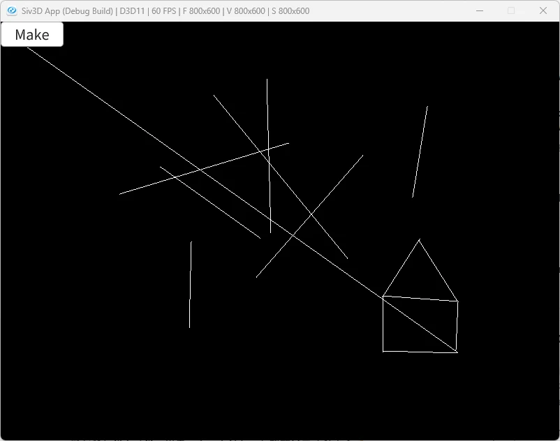

# DDA  
ちょうど今読んでるものにBresenhamが出てきたのだけれど、実装面倒なのでDDAで実装しようと思ったのが動機.  
Bresenhamは別途記事は書いてるけど、そういえば元となるDDAに関しては書いてなかったし、これを機に書くか～となったわけである.  
DDAはDigital differential analyzerの略である、デジタル微分解析器.かっこいい～.  
内容としてはWiki[^1]が分かりやすいので、こちらを参考にすると理解しやすいかと思う.  

今回は特に難しくはないので、コードを見つつ流れを追っていこう！  
まず最初に二点の差分を求める.  
二点を求めた後はXとYの絶対値を計算し、大きい方を採用する.  
```c++
auto DDA = [&image](Vec2 p1, Vec2 p2)
    {
        Vec2 d = p2 - p1;
        double step = Abs(d.x) >= Abs(d.y) ? Abs(d.x) : Abs(d.y);

        // ...
    };
```

次に境界判定.  
stepが0の場合は1つの点だけ打って終了する.  
これを入れる理由は非常に単純で、ゼロ除算をしないようにするためである.  
そもそも絶対値を取った値が0というのは、XもYも差分が0になってるということ.  
つまり、これは始点と終点が同じなので、単純に点を表しているのと変わらない.  
なので、点を打って終了となるわけである.  
```c++
        // 0の場合は完全に1点のみなので省く
        if (step <= 0.0)
        {
            image[static_cast<int>(p1.y)][static_cast<int>(p1.x)] = Palette::White;
            return;
        }
```

次に先程の差分`d`を`step`で割る.  
`d`の差分というのは、データとしては$`(x,y)=(dx,dy)`$というデータと同じである.  
そしてstepで`Abs(d.x)`が採用された場合を考えると、この座標は$`(x,y)=(1, \frac{dy}{dx})`$となるわけである.  
これが各stepにおける点の増分となるわけだ.  

増分の回数はstepで`Abs(d.x)`が採用された場合、`dx`だけ移動したい.  
x方向は1stepで1だけ移動するので、`dx`回移動すればちょうど直線を描き終えたことになる.  
要は$`1 * dx = dx`$というわけだ.  

ではこの場合`dy`だけ移動する場合は何回移動すればいいか？  
こちらも`dx`回移動すればよいということになる.  
$`\frac{dy}{dx} * dx = dy`$という単純な論理である.  

なので、全体でいうと`step`回だけ`d`を開始位置から足し合わせればよいということになる.  
これをプログラムで落とし込むと以下のようになる.  
```c++
        d /= step;

        int count = 0;
        while (count <= step)
        {
            image[static_cast<int>(p1.y)][static_cast<int>(p1.x)] = Palette::White;
            p1 += d;
            count++;
        }
```

あとは結果を見るだけ.  



うん、それっぽく線が引けているので問題なさそう.  
余談だけど、DDAのWikiの記事[^1]を見てる際、Bresenham[^2]の方を見たら他にも  

* Xiaolin Wu's line algorithm
* Kahan summation algorithm
* Midpoint circle algorithm

というのが目についたので、こっちもそのうちやりたいなと思った.  
まあその時が来たらまた書こうかなと思う.  

[^1]: [Digital differential analyzer (graphics algorithm)](https://w.wiki/6RSQ)  
[^2]: [ブレゼンハムのアルゴリズム](https://w.wiki/P2G)  
