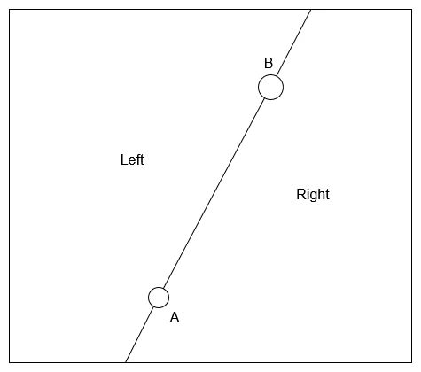
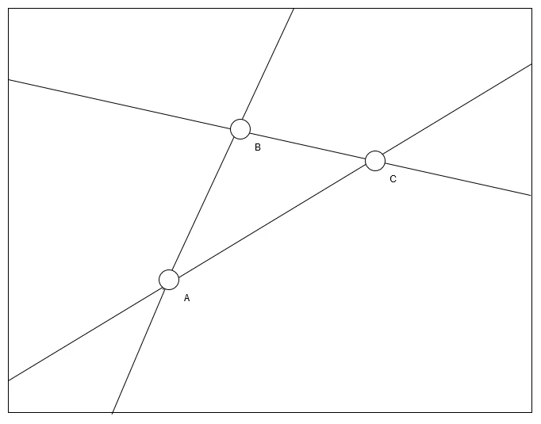
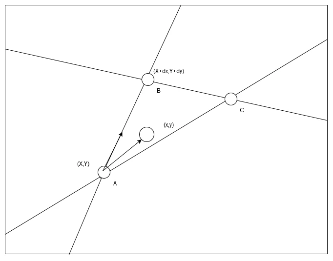
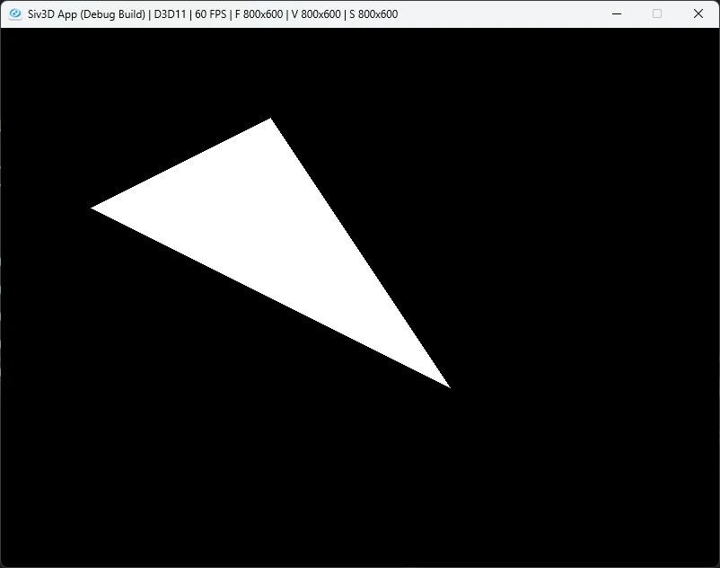
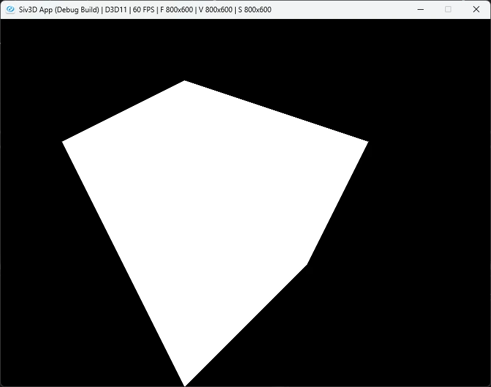

# ラスタライズをやってみる  
3Dの描画はGPUでは基本的に次の流れで行われる.  

* Vertex Shader
* 3Dから2Dへ
* Rasterization
* Pixel Shader

基本的にDirectXだったりOpenGL,Vulkanを使う場合は設定のみをしてこの辺を自分で書くことはない.  
ただ、やっぱりこういうのは自分で組んでみると理解度が深まるため,やっておきたいところ.  

今回の主とする場所は上の処理の中で`Rasterization`の部分.  
Vertex Shaderで頂点の処理も終えて、2D上の頂点の位置が分かった.  
ここまで来たら次の処理となるのがRasterization.  
三角形の内側を判定してあげて、これをPixel Shaderに渡すことで必要なPixelだけ処理を行うという寸法になるわけだ.  

では、どうやって三角形の内側っていうのを決めればいいんだろう？  
これは分かりやすい論文[^1]があるため、こちらを参考にしつつ実際に試していこう.  

まずは領域を線分で分けることを考えてみる.  

  

AとBという二点を通る線を考えると、四角形の領域を右と左に分けることが可能.  
この際$`\vec{B}-\vec{A}`$を考える.  
こうすれば単位ベクトルを考えることができ、外積を上手く使うことで線分の分類が可能になる.  

ここで$`\vec{A},\vec{B},\vec{C}`$を頂点とした三角形を考えてみる.  

  

この三角形の各辺について考えてみる.  
$`\vec{B}-\vec{A}`$の場合、三角形は直線に対して右にある.  
$`\vec{C}-\vec{B}`$の場合、これも三角形は直線に対して右にある.  
$`\vec{A}-\vec{C}`$の場合、これも同様に直線に対して右にある.  

つまり、時計回りにベクトルを生成して、右側かどうかを判定できれば三角形の中かの判定が可能になる.  

ちゃんと式として立式してやってみる.  

  

AとBの関係で考えてみよう.  
Aを$`(X,Y)`$とし、BはAからの差分で$`(X+dx,Y+dy)`$と$`(dx,dy)`$だけずれたものとして考える.  
そして、今回内側かどうかを判定したい点を$`P:(x,y)`$とする.  

この時,$`(X,Y)`$を原点に移動すると,$`A:(X,Y)→(0,0),B:(X+dx,Y+dy)→(dx,dy),P:(x,y)→(x-X,y-Y)`$となる.  
$`AP=(x-X,y-Y),AB=(dx,dy)`$の2ベクトルに対して外積を取ると、次のようなEdge Functionと呼ばれるものを定義可能.  

```math
\begin{equation}
    \begin{split}
    E(x,y) = (x-X)dy - (y-Y)dx
    \end{split}
\end{equation}
```

外積は反時計回りなら正、時計回りなら負といった風に分類ができ、この性質から右か左かが判定可能.  
こちらは実際に目で確認できる参考物[^2]を貼っておくので、こちらで確認してみてもよいかもしれない.  

兎に角外積で計算された$`E(x,y)`$があるため、後はこれの正負で判定が可能になったという訳だ.  
これは次のように分類ができる.  

```math
\begin{equation}
    \begin{split}
    \begin{array}{llll}
    E(x,y) > 0: (x,y)は右側 \\
    E(x,y) = 0: (x,y)は線上 \\
    E(x,y) < 0: (x,y)は左側
    \end{array}
    \end{split}
\end{equation}
```

後はこれを計算するだけ.  
まず状態を右、左、線上の3つで定義しておく.  
```c++
	enum class EdgeResult
	{
		Right, Left, OnLine
	};
```

そして、$`E(x,y)`$の計算を行う関数を用意.  
```c++
	auto CalculateEdge = [](Point p, Point origin, float dx, float dy)
		{
			return (p.x - origin.x) * dy - (p.y - origin.y) * dx;
		};
```

後は正負を見て右か左かを判定すれば終わり.  
```c++
	auto EdgeFunction = [&](Point p, Point origin, float dx, float dy)
		{
			float edge = CalculateEdge(p, origin, dx, dy);

			if (Abs(edge) < 0.00001f) { return EdgeResult::OnLine; }

			return edge > 0 ? EdgeResult::Right : EdgeResult::Left;
		};
```

今回はお試しで3点を用意.  
```c++
	Point p0 = { 300,100 };
	Point p1 = { 500,400 };
	Point p2 = { 100,200 };
```

各点に対するベクトルを愚直に用意する.  
あまりきれいな方法ではないけど、まあごり押しにはこれくらいでもいいね.  
```c++
float dx01 = p0.x - p1.x;
float dy01 = p0.y - p1.y;
float dx12 = p1.x - p2.x;
float dy12 = p1.y - p2.y;
float dx20 = p2.x - p0.x;
float dy20 = p2.y - p0.y;
```

後は全てのPixelに置いて、内側かどうかの判定を行うだけ.  
Leftが出てきた場合は外側確定なので、すぐに打ち切ってしまう.  
線上に関しては今回は三角形の内側ということにしておいた.  
```c++
for (int x = 0; x < image.width(); x++)
{
    for (int y = 0; y < image.height(); y++)
    {
        Point p{ x,y };
        if (EdgeFunction(p, p0, dx01, dy01) == EdgeResult::Left) { continue; }
        if (EdgeFunction(p, p1, dx12, dy12) == EdgeResult::Left) { continue; }
        if (EdgeFunction(p, p2, dx20, dy20) == EdgeResult::Left) { continue; }

        image[y][x] = Palette::White;
    }
}
```

結果は以下のような感じ.  

  

うん、いい感じで三角形が塗れている！  
今回は三角形だけど、別段三角形じゃなくて多角形でも同様の手順で内側の判定は可能.  
試しに5角形に対して判定したのが以下のようなもの.  

  

要は全ての辺に対して内側と判定させるだけなので、どんな形状でもOKという訳だ.  
次はこれをどう最適化するか？という話をやろうと思う.  

[^1]: [A parallel algorithm for polygon rasterization](https://dl.acm.org/doi/10.1145/54852.378457)  
[^2]: [ベクトルの外積の特性](https://www.nekonecode.com/math-lab/pages/vector2/cross2/)