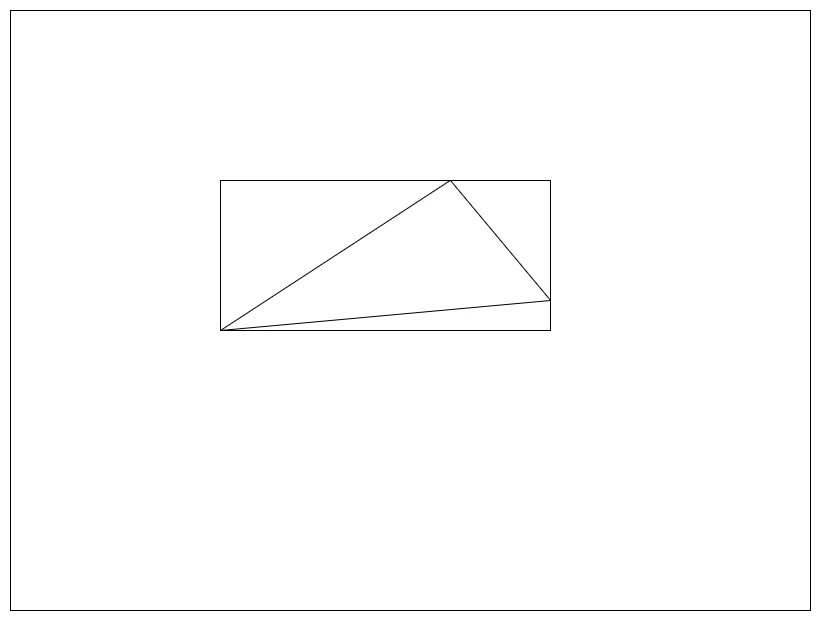
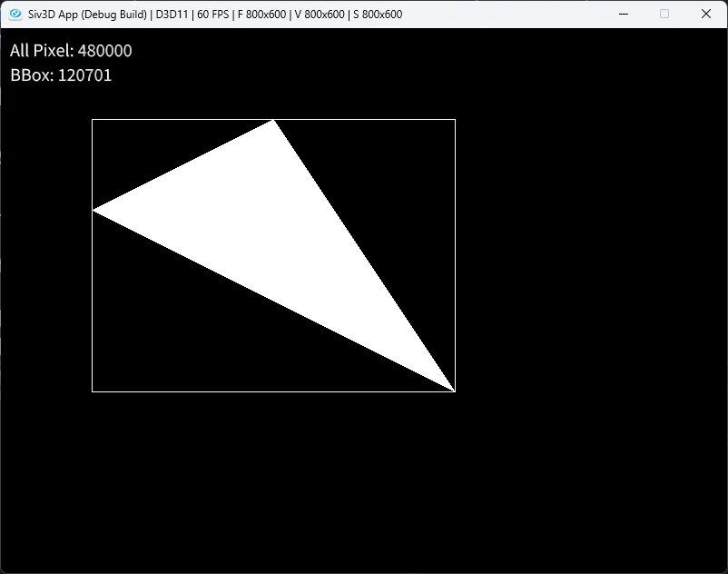
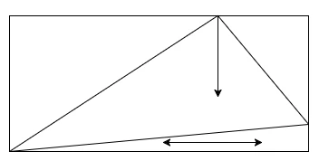
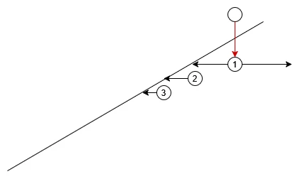
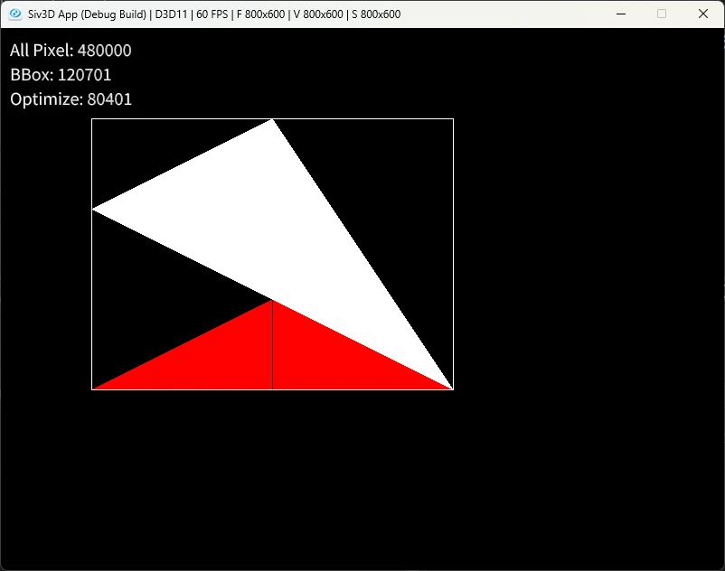
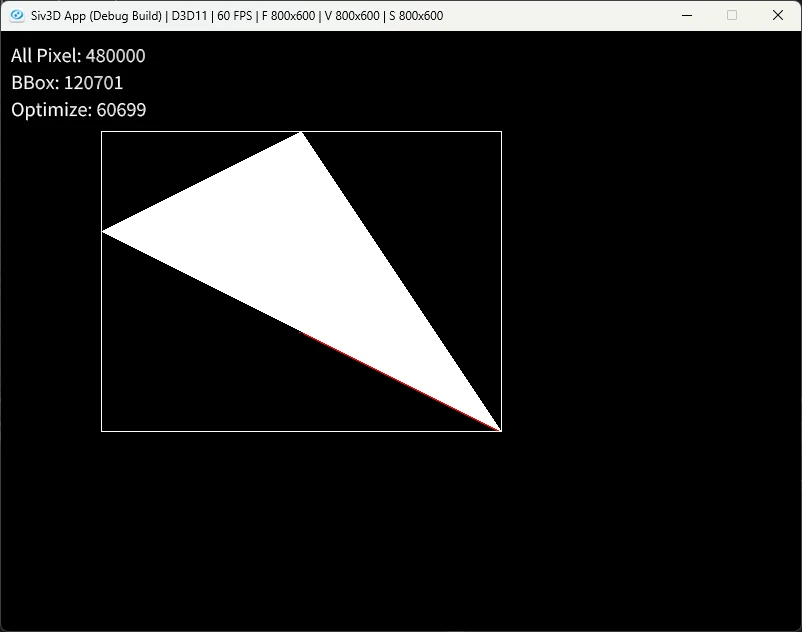

# ラスタライズの最適化  
ラスタライズによる三角形の内部決定を前にやったが、あれは結構無駄が多い.  
全ピクセルに対して処理を行っているのが特に無駄がおおいので、できるだけ無駄を減らしていきたい.  
今回はこの最適化を行っていくのが目標！参考にするのは前回の論文[^1]を参照にしていく.  

まず最初の最適化.  
一番簡単に考えられるのは三角形を覆うような四角形、つまりBounding Boxを考えてあげる方法.  

  

基本的に三角形はWindowよりも小さいことがほとんどなので、これだけでも判定量はぐっと減る.  

ということでコードに落とし込んでいこう.  
まずはBonding Boxだけど、これは最小値と最大値を求めるだけで決定が可能.  
```c++
Point BoundingX = { Min({p0.x,p1.x,p2.x }), Max({ p0.x,p1.x,p2.x }) };
Point BoundingY = { Min({p0.y,p1.y,p2.y }), Max({ p0.y,p1.y,p2.y }) };
```

あとはBounding分のみを足していくだけでOK.  
シンプルですね、これだけでも範囲は一気に絞られてます.  
```c++
// X方向をBoundingのみの範囲に
for (int x = BoundingX.x; x <= BoundingX.y; x++)
{
    // Y方向をBoundingのみの範囲に
    for (int y = BoundingY.x; y <= BoundingY.y; y++)
    {
        count_01++; // 計測用
        Point p{ x,y };
        if (EdgeFunction(p, p0, dx01, dy01) == EdgeResult::Left) { continue; }
        if (EdgeFunction(p, p1, dx12, dy12) == EdgeResult::Left) { continue; }
        if (EdgeFunction(p, p2, dx20, dy20) == EdgeResult::Left) { continue; }

        image[y][x] = Palette::White;
    }
}
```

これで結果を見てみよう.  
  

通常の場合は480,000回処理されているのに対して、Bounding Boxの場合は120,701回となっている.  
こんな簡単な対応だけで1/4まで処理が短縮されているのである.  
もちろん三角形がもっと小さければさらに高速だし、大きかったらその分高速化の恩恵は小さくなる.  

さて、更に最適化を進めていく.  
今の段階だとまだBBox内に無駄な空白が存在しているため、できるだけ内部で完結するように塗りつぶしたい.  
今回は三角形の一番上にある頂点に着目する.  

  

一番上というのはY方向に一番高い位置にいるものである.  
ウィンドウは下にいくほど数値が大きくなるため、一番Yが小さい頂点ともいえる.  
```c++
Point minPoint{ 0,99999 }; // 最小点を得る
if (minPoint.y > p0.y) { minPoint = p0; }
if (minPoint.y > p1.y) { minPoint = p1; }
if (minPoint.y > p2.y) { minPoint = p2; }
```

そしたらこのYを軸に下に探索を行う.  
まず最初にそもそも三角形の中かを判定する.  
```c++
for (int y = BoundingY.x; y <= BoundingY.y; y++)
{
    Point BasePoint{ minPoint.x, y };

    // Baseについて先に計算して内外を決めておく
    bool isInside = true;
    if (EdgeFunction(BasePoint, p0, dx01, dy01) == EdgeResult::Left) { isInside = false; }
    if (EdgeFunction(BasePoint, p1, dx12, dy12) == EdgeResult::Left) { isInside = false; }
    if (EdgeFunction(BasePoint, p2, dx20, dy20) == EdgeResult::Left) { isInside = false; }

    // ...
```

内側の場合は非常に簡単.  
左右に対して外に出るまで判定を取り続けるだけである.  
三角形の内部なので、左右が出るまではずっと内なのは当たり前なので、これで横方向はちゃんと塗れるわけである.  
```c++
    if (isInside)
    {
        int dxLeft = 1, dxRight = 1;
        bool isFinishLeft = false, isFinishRight = false;

        while (true)
        {
            if (!isFinishLeft)
            {
                image[BasePoint.y][BasePoint.x] = Palette::White;
                count_02++;

                Point leftPoint{ BasePoint.x - dxLeft, BasePoint.y };
                if (EdgeFunction(leftPoint, p0, dx01, dy01) == EdgeResult::Left) { isFinishLeft = true; }
                if (EdgeFunction(leftPoint, p1, dx12, dy12) == EdgeResult::Left) { isFinishLeft = true; }
                if (EdgeFunction(leftPoint, p2, dx20, dy20) == EdgeResult::Left) { isFinishLeft = true; }

                // まだ中なら処理
                if (!isFinishLeft)
                {
                    image[leftPoint.y][leftPoint.x] = Palette::White;
                    dxLeft++;
                    count_02++;
                }
            }

            if (!isFinishRight)
            {
                Point rightPoint{ BasePoint.x + dxRight, BasePoint.y };
                if (EdgeFunction(rightPoint, p0, dx01, dy01) == EdgeResult::Left) { isFinishRight = true; }
                if (EdgeFunction(rightPoint, p1, dx12, dy12) == EdgeResult::Left) { isFinishRight = true; }
                if (EdgeFunction(rightPoint, p2, dx20, dy20) == EdgeResult::Left) { isFinishRight = true; }

                // まだ中なら処理
                if (!isFinishRight)
                {
                    image[rightPoint.y][rightPoint.x] = Palette::White;
                    dxRight++;
                    count_02++;
                }
            }

            // 両方出てたら終了
            if (isFinishLeft && isFinishRight) { break; }
        }
    }
```
そして、外に出た場合.これはちょっと特殊.  

  

三角形の外の場合、左右を探索して中となる場合を探す.  
中が見つかった場合はそれ以降は外に出るまではずっと中のため、外に出るまで判定を続ければよい.  
これを何度も続ければ以下のように塗ることが可能.  

  
赤が外に出たところの部分.  
結構綺麗に塗れてるけど、でもまだ無駄が多い感じがする...  
左右に探索をしてしまってるのが原因で、これのせいで探索範囲が倍かかってるのである.  
ここでエッジに着目すると、②,③のように出てから2回目以降は同じ方向に辿るだけで綺麗にいける.  
なので、1回目にどっちの方向に内側があるのかをキャッシュして、更にその時の位置もキャッシュして次回の探索の時に生かすようにすればよい.  
これを組んだのが以下.  
```c++
    else
    {
        int dxLeft = 1, dxRight = 1;
        int isLeftDir = false;

        if (isFirst)
        {
            while (true)
            {
                // まずは中を探す

                // 左
                bool isLeft = false;
                Point leftPoint{ BasePoint.x - dxLeft, BasePoint.y };
                if (EdgeFunction(leftPoint, p0, dx01, dy01) == EdgeResult::Left) { isLeft = true; }
                if (EdgeFunction(leftPoint, p1, dx12, dy12) == EdgeResult::Left) { isLeft = true; }
                if (EdgeFunction(leftPoint, p2, dx20, dy20) == EdgeResult::Left) { isLeft = true; }
                count_02++;

                if (isLeft)
                {
                    // まだ外
                    image[leftPoint.y][leftPoint.x] = Palette::Red;
                    dxLeft++;
                }
                else
                {
                    // 中なら終了
                    image[leftPoint.y][leftPoint.x] = Palette::White;
                    dxLeft++;
                    isLeftDir = true;
                    break;
                }

                // 右
                bool isRight = false;
                Point rightPoint{ BasePoint.x + dxRight, BasePoint.y };
                if (EdgeFunction(rightPoint, p0, dx01, dy01) == EdgeResult::Left) { isRight = true; }
                if (EdgeFunction(rightPoint, p1, dx12, dy12) == EdgeResult::Left) { isRight = true; }
                if (EdgeFunction(rightPoint, p2, dx20, dy20) == EdgeResult::Left) { isRight = true; }
                count_02++;

                if (isRight)
                {
                    // まだ外
                    image[rightPoint.y][rightPoint.x] = Palette::Red;
                    dxRight++;
                }
                else
                {
                    // 中なら終了
                    image[rightPoint.y][rightPoint.x] = Palette::White;
                    dxRight++;
                    isLeftDir = false;
                    break;
                }
            }

            // 確定したものを保持しておく
            dd = isLeftDir ? -1 : 1;
            base = isLeftDir ? dxLeft : dxRight;
            baseCache = base - 1;
        }
        else
        {
            base = baseCache;
            // 内に入るまでやる
            while (true)
            {
                bool isOutside = false;
                Point pp{ BasePoint.x + base * dd, BasePoint.y };
                if (EdgeFunction(pp, p0, dx01, dy01) == EdgeResult::Left) { isOutside = true; }
                if (EdgeFunction(pp, p1, dx12, dy12) == EdgeResult::Left) { isOutside = true; }
                if (EdgeFunction(pp, p2, dx20, dy20) == EdgeResult::Left) { isOutside = true; }
                count_02++;

                // まだ外なら処理
                if (isOutside)
                {
                    image[pp.y][pp.x] = Palette::Red;
                    base++;
                }
                else
                {
                    image[pp.y][pp.x] = Palette::White;
                    baseCache = base - 1;
                    break;
                }
            }
        }

        // 外に出るまでやる
        bool isOutside = false;
        while (true)
        {
            Point pp{ BasePoint.x + base * dd, BasePoint.y };
            if (EdgeFunction(pp, p0, dx01, dy01) == EdgeResult::Left) { isOutside = true; }
            if (EdgeFunction(pp, p1, dx12, dy12) == EdgeResult::Left) { isOutside = true; }
            if (EdgeFunction(pp, p2, dx20, dy20) == EdgeResult::Left) { isOutside = true; }
            count_02++;

            // まだ中なら処理
            if (!isOutside)
            {
                image[pp.y][pp.x] = Palette::White;
                base++;
            }
            else
            {
                break;
            }
        }

        isFirst = false;
    }
```

こうしてできた探索結果が以下.  

  

エッジに沿うようになり、ほぼほぼ赤色が消えた！！
ここまでくると12倍まで高速化が達成できているし、Bounding Boxから見ても2倍くらい高速化できている！！  

論文では更にこれをブロック単位で並列に処理とかしてるが、今回はこの辺で辞めておこうかと思う.  
またやる気が出たりしたら漁るかもしれない.  

[^1]: [A parallel algorithm for polygon rasterization](https://dl.acm.org/doi/10.1145/54852.378457)  