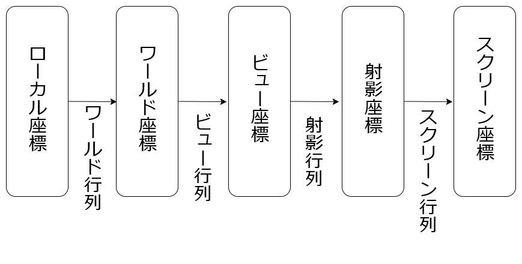
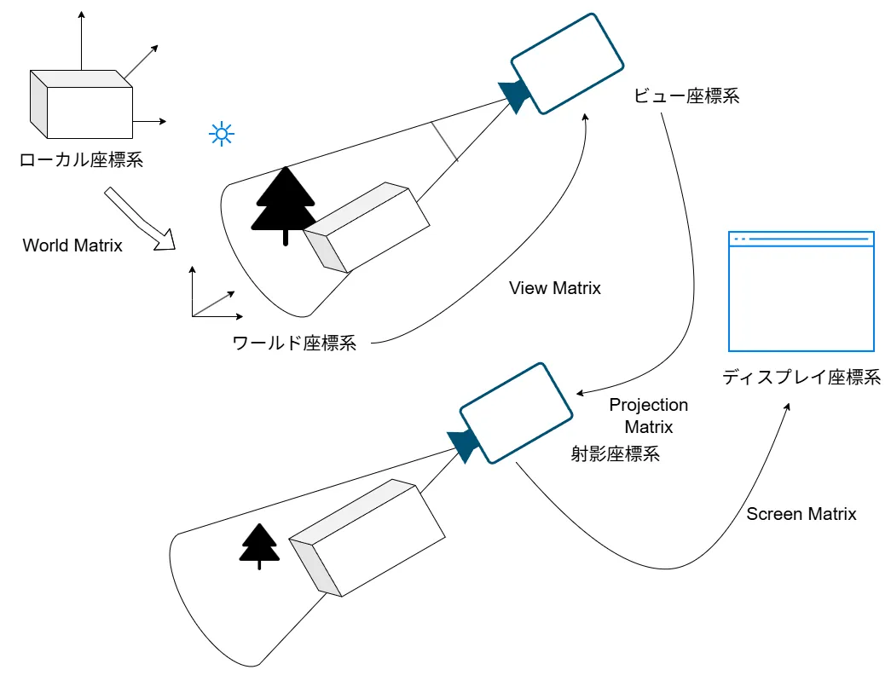
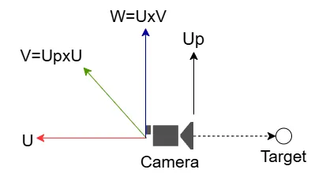
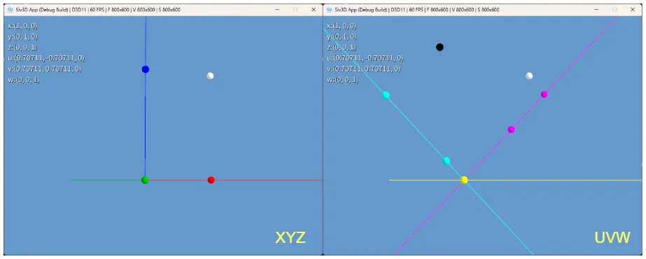
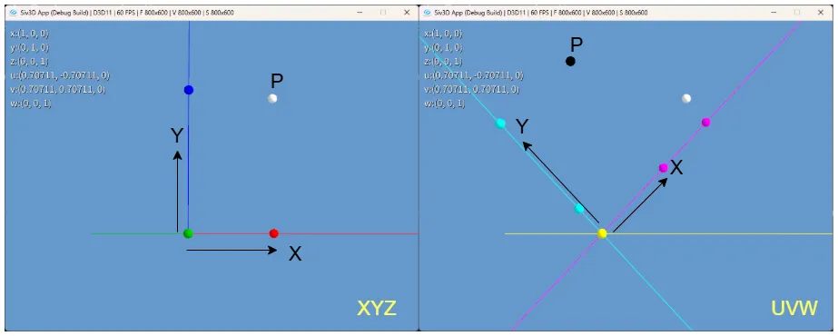
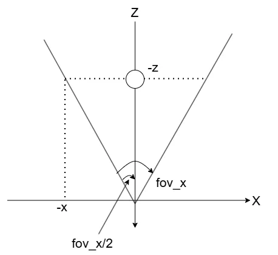
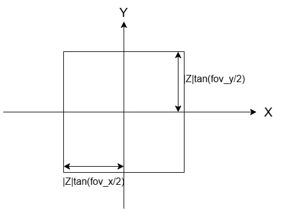
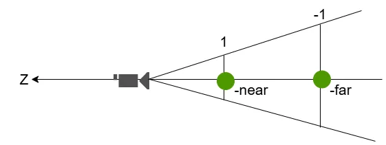
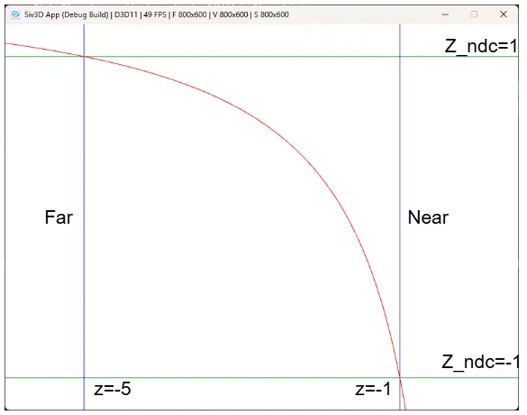
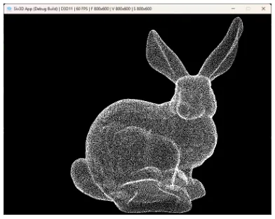

# 3D座標変換  
CGで画面に描画を行うためには3D座標系からディスプレイ内という2D座標系に持っていく必要がある.  
今回はこれを実際に見ていくことにする.  
3Dの座標変換は以下のような流れで行われる.  

  

座標系は色々あるけど、基本的にはこの形.  
まずローカル座標というモデル固有の座標があり、BlenderとかMayaとかでDumpしてくるとまずはこの状態.  

これをWorld行列で変換すると、実際にゲームとかで表示するようなMap内の位置となる.  
要は実際にキャラをどこに配置とか、背景をここに配置とかはこの変換を加えるのと同じとなる.  

そして、次にワールド基準からカメラの位置を基準にしたい.  
これを行うために掛けるのがビュー行列で、こうするとカメラ基準のビュー座標になる.  

そして、絵画とかが分かりやすいが遠近法というものがある.  
遠いものは小さく、近いものは大きく見えるという性質.  
これを実際に行うために透視投影を行う.  
これは射影行列により行うことができ、そうして射影座標系に移る.  

そして、最終的に結果の出力を行うのはディスプレイ.  
ディスプレイは2次元なので、2次元にあわしたデータ構造が必要である.  
そのため、2Dへの変換を行うためにスクリーン行列というものを掛けて、ディスプレイ上を起点としたスクリーン座標系に移す.  

ここまでの流れがざっと必要な3D座標変換となる.  
図にしてみると以下のような感じ.  

  

この変換を辿っていくのが今回の主な目標！  
参考にするのはこちら[^1],ほかにも色々参考にしつつまとめてみる.  

まずはWorld行列.  
スケール・移動・回転を行うことで実際の配置を決定していく.  
一つずつ見ていこう.  

* スケール  
スケールはまず以下の形.  
```math
\begin{equation}
    \begin{split}
    S = 
    \begin{bmatrix}
    s_{x} & 0 & 0 & 0 \\
    0 & s_{y} & 0 & 0 \\
    0 & 0 & s_{z} & 0 \\
    0 & 0 & 0 & 1
    \end{bmatrix}
    \end{split}
\end{equation}
```

$`v=(x,y,z,1)`$と書けるとわかりやすい.  

```math
\begin{equation}
    \begin{split}
    Sv = 
    \begin{bmatrix}
    s_{x} & 0 & 0 & 0 \\
    0 & s_{y} & 0 & 0 \\
    0 & 0 & s_{z} & 0 \\
    0 & 0 & 0 & 1
    \end{bmatrix}
    \begin{bmatrix}
        x \\ y \\ z \\ 1
    \end{bmatrix}
    = 
    \begin{bmatrix}
        s_{x}x \\ s_{y}y \\ s_{z}z \\ 1
    \end{bmatrix}
    \end{split}
\end{equation}
```

要は$`s_{x},s_{y},s_{z}`$で倍にしてるわけだ.  

* 移動  
移動の場合は次の行列.  
```math
\begin{equation}
    \begin{split}
    T = 
    \begin{bmatrix}
    1 & 0 & 0 & t_{x} \\
    0 & 1 & 0 & t_{y} \\
    0 & 0 & 1 & t_{z} \\
    0 & 0 & 0 & 1
    \end{bmatrix}
    \end{split}
\end{equation}
```

これも掛け合わせると分かりやすい.  
```math
\begin{equation}
    \begin{split}
    Tv = 
    \begin{bmatrix}
    1 & 0 & 0 & t_{x} \\
    0 & 1 & 0 & t_{y} \\
    0 & 0 & 1 & t_{z} \\
    0 & 0 & 0 & 1
    \end{bmatrix}
    \begin{bmatrix}
        x \\ y \\ z \\ 1
    \end{bmatrix}
    = 
    \begin{bmatrix}
        x + t_{x} \\ y + t_{y} \\ z + t_{z} \\ 1
    \end{bmatrix}
    \end{split}
\end{equation}
```

要は$`t_{x},t_{y},t_{z}`$で移動量を表してるわけだ.  

* 回転  
回転が一番大変.  
クォータニオンとか色々あるけど、一番シンプルなのはX軸,Y軸,Z軸の回転を行列で表して組み合わせる方式.  

まずX軸の回転.  
```math
\begin{equation}
    \begin{split}
    R_{x} = 
    \begin{bmatrix}
    1 &  0  & 0 & 0 \\
    0 & \cos{\theta} & -\sin{\theta} & 0 \\
    0 & \sin{\theta} & \cos{\theta} & 0 \\
    0 & 0 & 0 & 1
    \end{bmatrix}
    \end{split}
\end{equation}
```

次にY軸.  
```math
\begin{equation}
    \begin{split}
    R_{y} = 
    \begin{bmatrix}
    \cos{\theta} & 0 & \sin{\theta}  & 0 \\
    0 & 1 & 0 & 0 \\
    -\sin{\theta} & 0 & \cos{\theta} & 0 \\
    0 & 0 & 0 & 1
    \end{bmatrix}
    \end{split}
\end{equation}
```

最後にZ軸.  
```math
\begin{equation}
    \begin{split}
    R_{z} = 
    \begin{bmatrix}
    \cos{\theta} & -\sin{\theta}  & 0 & 0 \\
    \sin{\theta} & \cos{\theta} & 0 & 0 \\
    0 & 0 & 1 & 0 \\
    0 & 0 & 0 & 1
    \end{bmatrix}
    \end{split}
\end{equation}
```

非常に面倒な形ではあるけども、二次元の回転  

```math
\begin{equation}
    \begin{split}
    \begin{bmatrix}
    v_{x^{\prime}} \\ v_{y^{\prime}}
    \end{bmatrix}    
    = 
    \begin{bmatrix}
    \cos{\theta} & -\sin{\theta}\\
    \sin{\theta} & \cos{\theta}
    \end{bmatrix}
    \begin{bmatrix}
    v_{x} \\ v_{y}
    \end{bmatrix}    
    \end{split}
\end{equation}
```

を使って上手い具合に回転させてるんだ～くらいに思うと頭の中にすっと入ってきやすい.  
自分は毎回2D回転を覚えてるので、後はこれをどう当てはめるのかをパズルする感じで3Dを作ってる.  

まあそれは置いといて、この3軸があれば以下の回転が表現できる.  

```math
\begin{equation}
    \begin{split}
    R_{xyz} = R_{z}R_{y}R_{x}
    \end{split}
\end{equation}
```

こんな感じで3軸を上手く回転することで表現可能！  
勿論ジンバルロックとか問題もあるけど、最初はこれくらいシンプルなものの方が理解しやすい.  

さて、とはいえこの行列を表記するのはめんどいので今後は以下のように表記するようにしておく.  

```math
\begin{equation}
    \begin{split}
    R = 
    \begin{bmatrix}
    R_{11} & R_{12} & R_{13} & 0 \\
    R_{21} & R_{22} & R_{23} & 0 \\
    R_{31} & R_{32} & R_{33} & 0 \\
    0 & 0 & 0 & 1
    \end{bmatrix}
    \end{split}
\end{equation}
```

これでスケール・回転・移動が揃った!!  
この行列を組み合わせてWorld行列を作る.  
基本的には

```math
\begin{equation}
    \begin{split}
    WorldMatrix = TRS
    \end{split}
\end{equation}
```

という風に構築を行う.  
一番大事なのは回転が先で移動が後.  
基本的にローカル座標は$`(0,0,0,1)`$が中心となりやすい.  
これを基準に回転させる方が面倒が少ないからである.  
何ともわかりづらい人は$`(10,5,-10,1)`$とか適当にずらした後、回転をする計算をやってみるとわかりやすいと思う.  
本当に変な場所に行くので.  
逆にこの変な場所に行く計算、確かCG検定の上級(だったけ)で昔と変わらなければ頻出なので、受ける人は頭の体操にもなると思う.  
スケールは影響を受けにくいのでとにかく1番最初に掛けてしまうのが定番.  

これでワールド空間に移せた！  
次はビュー座標系を見ていこう.  

ビュー座標系は今回はLookAt方式というのを使ってやっていく.  
まずビュー座標系ではカメラの位置が原点となる.  
つまりカメラが$`T_{cam}=(t_{cam:x},t_{cam:y},t_{cam:z})`$という位置にあるとする.  
ここを原点$`(0,0,0)`$とするためには$`(t_{cam:x},t_{cam:y},t_{cam:z})`$だけずらす必要がある.  
先ほどやった移動を考えると、これは簡単に表せて、

```math
\begin{equation}
    \begin{split}
    T_{cam} = 
    \begin{bmatrix}
    1 & 0 & 0 & -t_{x:cam} \\
    0 & 1 & 0 & -t_{y:cam} \\
    0 & 0 & 1 & -t_{z:cam} \\
    0 & 0 & 0 & 1
    \end{bmatrix}
    \end{split}
\end{equation}
```
と言えるわけだ.  

次が面倒な点、Look-At方式.  
まずカメラの位置$`P_{cam}`$とターゲット、つまり見たい位置を$`P_{target}`$とする.  
そして、基準ベクトルとして$`up`$というベクトルを用意.  
こうすることで基準の軸を用意する.  

  

カメラの座標系はこんな感じになる.  
まず$`P_{cam}`$と$`P_{target}`$を使うことでUを生成する.  
これはターゲットの位置と逆向きが正となる.  

```math
\begin{equation}
    \begin{split}
    u = \frac{P_{cam} - P_{target}}{|P_{cam} - P_{target}|}
    \end{split}
\end{equation}
```

あくまで方向がわかりゃいいので、正規化をしておく.  
次に$`u`$と垂直なベクトルを生成する.  
基準となる$`up`$ベクトルがあるので、これを使って$`v`$を生成.ここも正規化を忘れずに.  

```math
\begin{equation}
    \begin{split}
    u = \frac{up \times u}{|up \times u|}
    \end{split}
\end{equation}
```

ここで2軸ができたなら、後はこの外積を取れば3軸の完成！  
ここでは正規化されてるので、正規化しなくても問題ないはず.  
```math
\begin{equation}
    \begin{split}
    w = u \times v
    \end{split}
\end{equation}
```

この3つの規定座標を使って$`E`$という基底軸による変換行列を作ればOK.  

```math
\begin{equation}
    \begin{split}
    E = 
    \begin{bmatrix}
    v_{x} & v_{y} & v_{z} & 0 \\
    w_{x} & w_{y} & w_{z} & 0 \\
    u_{x} & u_{y} & u_{z} & 0 \\
    0 & 0 & 0 & 1
    \end{bmatrix}
    \end{split}
\end{equation}
```

3DではXYを基本的にディスプレイ方向とし、深度という形でディスプレイに対して垂直な方向をZとするため$`u`$がzの位置になってる.  
$`u`$が見ている方向なので、そう考えると分かりやすい.  
これらを組み合わせたものがビュー行列となる.  

```math
\begin{equation}
    \begin{split}
    ViewMatrix = ET_{cam}
    \end{split}
\end{equation}
```

さて、基底についてはちょっと見ておこうか.  
この辺は説明としてはこの辺[^2]も分かりやすいため、参考にするとよいと思う.  
今回のカメラの座標軸というのは、基底の変換が行われることになる.  
例えば点$`(x,y,z)=(0.2,0.3,0.0)`$という点があったとして、これをそれぞれの軸で見ると次のようになる.  

  

白い点が分かりやすいね.  
赤と青の点は射影した形だけど、UVWの方のマゼンタとシアンの射影した点では全く尺度が違う.  
要はこれが規定が違うということなわけだ.  
因みにX->赤,Y->青,Z->緑であり、U->シアン, V->マゼンタ-,W->イエローである.  

ここで上記の$`E`$の行列を掛けるというのはUVWをXYZの座標系に戻すような行為ともいえる.  
今回$`E`$を適用したものは黒い点で表している.  

  

こんな感じで$`E`$を作用させることで元の座標系に戻すことを行う操作となる訳である.  
とはいえ、今回のView行列には$`T_{cam}`$がある.  
そのため、完全に戻るかと言われると、カメラ基準の位置にずらしてるためNOではある.  
あくまで$`E`$のみを作用させた際の効果は上記の図のようになると捉えるのが良い.  

ここまで来たらやっとProjection行列である.  
Projection行列の説明としてはここ[^3]が個人的には分かりやすくて好き.  
図としてはここ[^4]も分かりやすくて良いかも.  

さて、現状ではクリッピング空間まで持ってきた$`(x,y,z,1)`$が分かっている状態である.  
この時、ある$`z`$があるとき、まずは$`x`$に着いてから始めよう.  
以下のような図を考える.  

  

ある$`z`$が決まると、そこに収まるために必要な$`x`$の範囲はFrustumなので直線で決まる.  
この時三角形を考えてあげると、以下のような式が成り立つ.  

```math
\begin{equation}
    \begin{split}
    \frac{|z|}{|x|} &= \tan{\frac{fov_{x}}{2}} \\
    |x| &= |z|\tan{\frac{fov_{x}}{2}}
    \end{split}
\end{equation}
```

この時の式は最大値の場合の$`x`$なので、負を付ければ負の側のものとなる.  
そのため、xの範囲は以下のように言える.  

```math
\begin{equation}
    \begin{split}
    -|z|\tan{\frac{fov_{x}}{2}} \le x \le |z|\tan{\frac{fov_{x}}{2}}
    \end{split}
\end{equation}
```

今回、最終的には$`[-1,1]`$と範囲に収めたい.  
これは正規化View Volumeで色々とこうなるように収まっていた方が嬉しい.  
この計算は単純で、$`|z|\tan{\frac{fov_{x}}{2}}`$で割ってあげればよい.  

```math
\begin{equation}
    \begin{split}
    -1 \le \frac{x}{|z|\tan{\frac{fov_{x}}{2}}} \le 1
    \end{split}
\end{equation}
```

これで$`x`$については完了！  
$`y`$についても考えてみよう.  
まず、全く同じ方式で以下が求まる.  

```math
\begin{equation}
    \begin{split}
    -1 \le \frac{y}{|z|\tan{\frac{fov_{y}}{2}}} \le 1
    \end{split}
\end{equation}
```

ここまでは良い.  
次にある$`z`$に対して、XY-平面として切り取ると以下のような図が手に入る.  

  

この時アスペクト比を考えてみる.  
Y方向のfovの方に合わせて変形を行う.  

```math
\begin{equation}
    \begin{split}
    aspect &= \frac{Width}{Height}=\frac{2|z|\tan{\frac{fov_{x}}{2}}}{2|z|\tan{\frac{fov_{y}}{2}}} \\
    |z|\tan{\frac{fov_{y}}{2}} &= \frac{|z|\tan{\frac{fov_{x}}{2}}}{aspect} 
    \end{split}
\end{equation}
```

つまり$`fov_{y}`$はなくても$`aspect`$を使えば、$`fov_{x}`$だけで表せるのが肝！  

こうすると先ほどの変形は以下のようになる.  
```math
\begin{equation}
    \begin{split}
    &-1 \le \frac{y}{\frac{|z|\tan{\frac{fov_{x}}{2}}}{aspect}} \le 1 \\
    & -1 \le \frac{y}{|z|\tan{\frac{fov_{x}}{2}}}aspect \le 1
    \end{split} 
\end{equation}
```
$`y`$側に適用してるが、もちろん$`x`$側に適用するのでもよい.  

```math
\begin{equation}
    \begin{split}
    |z|\tan{\frac{fov_{x}}{2}} &= |z|\tan{(\frac{fov_{y}}{2})}aspect
    \end{split}
\end{equation}
```
として考えてあげて、$`x`$側に突っ込むと,  
```math
\begin{equation}
    \begin{split}
    &-1 \le \frac{x}{|z|\tan{(\frac{fov_{y}}{2})}aspect} \le 1
    \end{split} 
\end{equation}
```

これでもよい,$`x,y`$の好きな方に$`aspect`$を適用してあげればいい感じになる.  

とりあえずここまでで$`x,y`$の変形式は求まった！  
ということでここまでの時点の行列を構築してみよう.  

```math
\begin{equation}
    P=
    \begin{split}
    \begin{bmatrix}
    \frac{1}{\tan{\frac{fov_{x}}{2}}} & 0 & 0 & 0 \\
    0 & \frac{1}{\tan{\frac{fov_{x}}{2}}}aspect & 0 & 0 \\
    0 & 0 & 0 & -1 \\
    0 & 0 & 0 & 0 \\
    \end{bmatrix}
    \quad or \quad P=
    \begin{bmatrix}
    \frac{1}{\tan{(\frac{fov_{y}}{2})}aspect} & 0 & 0 & 0 \\
    0 & \frac{1}{\tan{\frac{fov_{y}}{2}}} & 0 & 0 \\
    0 & 0 & 0 & -1 \\
    0 & 0 & 0 & 0 \\
    \end{bmatrix}
    \end{split}
\end{equation}
```

さて、左側の行列の方で見てみようか.  
$`v=(x,y,-z,1)`$とすると、  

```math
\begin{equation}
    \begin{split}
    v^{\prime} = vP &=
    \begin{bmatrix}
    x & y & z & 1
    \end{bmatrix}    
    \begin{bmatrix}
    \frac{1}{\tan{\frac{fov_{x}}{2}}} & 0 & 0 & 0 \\
    0 & \frac{1}{\tan{\frac{fov_{x}}{2}}}aspect & 0 & 0 \\
    0 & 0 & 0 & -1 \\
    0 & 0 & 0 & 0 \\
    \end{bmatrix}
    \\
    &= \begin{bmatrix}
    x\frac{1}{\tan{\frac{fov_{x}}{2}}} & y \frac{1}{\tan{\frac{fov_{x}}{2}}}aspect & 0 & -z
    \end{bmatrix}
    \end{split}
\end{equation}
```

$`x,y`$は上手く変換ができているようにみえるが、$`|z|`$が足りない...  
$`|z|`$が足りないと正規化されてはいないことになるので、これでは困る.  
ここで$`w`$のパラメータを見ると$`z`$が存在している！  
こいつで割ることでちゃんと正規化された状態になる.  

```math
\begin{equation}
    \begin{split}
    x_{ndc} = \frac{x^{\prime}}{w^{\prime}}= x\frac{1}{\tan{\frac{fov_{x}}{2}}} \frac{1}{|z|},y_{ndc} = \frac{y^{\prime}}{w^{\prime}}= y \frac{1}{\tan{\frac{fov_{x}}{2}}}aspect \frac{1}{|z|}
    \end{split}
\end{equation}
```

やっとこれで$`x,y`$に関しては完了～.ふう,大変だこりゃ...  

さて、それでは最後に$`z`$に入ろう.  
こいつがまた面倒で、$`z`$を今までの方式でやろうと思うと、最後の除算時に$`\frac{z}{|Z|}=1`$みたいなことが起きる.嬉しくない.  
ではどうしようか、$`z`$は以下のような変換を行っていこうというのが肝.  

```math
\begin{equation}
    \begin{split}
    z^{\prime} = \frac{Az + B}{|z|}
    \end{split} 
\end{equation}
```

この式に対して$`|z|`$で割ることで、$`near,far`$を駆使してAやBを解いてくことで求めていくのである.  
この際の$`near,far`$は以下のような感じ.  

  

一番手前がNear Plane,奥がFar Planeというもので、ここの範囲で描画しますよ～というやつ.  
この際、今回は$`z=-near`$の場合は$`z^{\prime}=1`$となり、$`z=-far`$の場合は$`z^{\prime}=-1`$となるようにする.  
別段ほかでもいいっちゃいいのには注意、DirectXなんかは$`[0,1]`$になるように調整されてるとかもあるので.  

そしたらまずは$`z=near`$から.  

```math
\begin{equation}
    \begin{split}
    z^{\prime} &= \frac{-A \cdot near + B}{near} \\
    & = -A + \frac{B}{near} = 1
    \end{split} 
\end{equation}
```

次は$`z=far`$の場合.  

```math
\begin{equation}
    \begin{split}
    z^{\prime} &= \frac{-A \cdot far + B}{far} \\
    & = -A + \frac{B}{far} = -1
    \end{split} 
\end{equation}
```

この2つがあれば、$`A,B`$が導出可能！  
まず2つを引く.  

```math
\begin{equation}
    \begin{split}
    (-A + \frac{B}{near}) - (-A + \frac{B}{far}) &=
    \frac{B(far - near)}{near \cdot far}= 1 - (-1) = 2 \\
    B & =\frac{2far \cdot near}{far - near} 
    \end{split} 
\end{equation}
```
Bが求まったら、$`near`$の方に$`B`$を代入すると,  

```math
\begin{equation}
    \begin{split}
    -A + \frac{2far \cdot near}{far - near}\frac{1}{near} &= 1 \\
    A &= \frac{2far}{far - near} - 1 \\
    &= \frac{2far - (far - near)}{far-near} \\
    &= \frac{far+near}{far-near}
    \end{split}
\end{equation}
```

これでAとBも求まったので、後はこれを先ほどの行列に組み込んでみる.  

```math
\begin{equation}
    P=
    \begin{split}
    \begin{bmatrix}
    \frac{1}{\tan{\frac{fov_{x}}{2}}} & 0 & 0 & 0 \\
    0 & \frac{1}{\tan{\frac{fov_{x}}{2}}}aspect & 0 & 0 \\
    0 & 0 & \frac{far+near}{far-near} & -1 \\
    0 & 0 & \frac{2far \cdot near}{far - near}  & 0 \\
    \end{bmatrix}
    \end{split}
\end{equation}
```
これに$`v`$を作用すると、  

```math
\begin{equation}
    \begin{split}
    v^{\prime} = vP &=
    \begin{bmatrix}
    x & y & z & 1
    \end{bmatrix}    
    \begin{bmatrix}
    \frac{1}{\tan{\frac{fov_{x}}{2}}} & 0 & 0 & 0 \\
    0 & \frac{1}{\tan{\frac{fov_{x}}{2}}}aspect & 0 & 0 \\
    0 & 0 & \frac{far+near}{far-near} & -1 \\
    0 & 0 & \frac{2far \cdot near}{far - near} & 0 \\
    \end{bmatrix}
    \\
    &= \begin{bmatrix}
    x\frac{1}{\tan{\frac{fov_{x}}{2}}} & y \frac{1}{\tan{\frac{fov_{x}}{2}}}aspect & \frac{far+near}{far-near}z + \frac{2far \cdot near}{far - near} & z
    \end{bmatrix} \\
    &= \begin{bmatrix}
    x\frac{1}{\tan{\frac{fov_{x}}{2}}} & y \frac{1}{\tan{\frac{fov_{x}}{2}}}aspect & Az + B & -z \\
    \end{bmatrix}
    \end{split}
\end{equation}
```
うん、ちゃんと求まってるね！  
$`|z|`$で割ると、  

```math
\begin{equation}
    \begin{split}
    z_{ndc} = \frac{z^{\prime}}{w^{\prime}}=(Az+B)\frac{1}{|z|}
    \end{split}
\end{equation}
```
となって正規化されたものも無事求まる.  

今回ちょっとわかりやすいように$`near=1,far=5`$の時,横軸$`z`$,縦軸$`z_{ndc}`$でプロットをしてみる.ここ[^1]でも描かれてるものと同じ奴.  

  

赤が横軸$`z`$,縦軸$`z_{ndc}`$の曲線.  
そして、緑が$`z_{ndc}=-1,1`$の線.  
青は$`z=-5,-1`$の線,つまり$`near=1,far=5`$である.  
ここまで見るとやっとNearとFarで綺麗に$`[-1,1]`$に収まるように補間しているというのが見えてくるわけだ！  

そしたら最後にビューポート変換.  
これでディスプレイに持ってくることになる.  
基本的に1080pの場合で考えてみよう.  
この時は1920x1080のため、$`w=1920,h=1080`$となる.  
そして、ウィンドウの原点を$`ox,oy`$とすると、以下のような風にすればよい.  

```math
\begin{equation}
    \begin{split}
    M=
    \begin{bmatrix}
    \frac{w}{2} & 0 & 0 & \frac{w}{2} + ox \\
    0 & -\frac{h}{2} & 0 & \frac{h}{2} + oy \\
    0 & 0 & \frac{far-near}{2} & \frac{far+near}{2} \\
    0 & 0 & 0 & 1 \\
    \end{bmatrix}
    \end{split}
\end{equation}
```

計算してみよう.  
今回は簡略化のため$`ox=0,oy=0`$としておく.  
$`p_{ndc}=(x_{ndc},y_{ndc},z_{ndc,1})`$とすると,  

```math
\begin{equation}
    \begin{split}
    p_{screen} = Mp_{ndc} =
    \begin{bmatrix}
    \frac{w}{2}x_{ndc} + \frac{w}{2} \\
    -\frac{h}{2}y_{ndc} + \frac{h}{2} \\
    \frac{far-near}{2}z_{ndc} + \frac{far+near}{2} \\
    1
    \end{bmatrix}
    \end{split}
\end{equation}
```

となる.  
一つずつ見ていこう.  

xから、$`-1 \le x_{ndc} \le 1 `$であった.  
$`-1`$のとき$`\frac{w}{2} \cdot (-1) + \frac{w}{2} = 0`$である.  
$`1`$の時は$`\frac{w}{2} \cdot 1 + \frac{w}{2} = w=1920`$となる.  
つまり,$`0 \le x_{screen} \le 1920`$となる.  

次はy,$`-1 \le y_{ndc} \le 1 `$であった.  
$`-1`$のとき$`-\frac{h}{2} \cdot (-1) + \frac{h}{2}=h = 1080`$である.  
$`1`$の時は$`-\frac{h}{2} \cdot 1 + \frac{h}{2} = 0`$となる.  
つまり,$`0 \le y_{screen} \le 1080`$となる.  
ここで$`y_{ndc}=-1`$の時に$`1080`$となる点は注意.  
理由は簡単で、WindowはY軸に関しては0がTopで値が大きくなるBottomになる.  
これはY軸が上向きなイメージとかみ合わないので、そこの補正をしてるだけである.  

最後にZ,これも$`-1 \le z_{ndc} \le 1 `$であった.  
$`-1`$のとき$\frac{far-near}{2} \cdot (-1) + \frac{far+near}{2}=near$である.  
$`1`$のとき$\frac{far-near}{2} \cdot 1 + \frac{far+near}{2}=far$である.  
つまり、$`near \le z_{screen} \le far`$となる.  

上手～く範囲を絞れてるのがちゃんと計算するとわかるね.  
ここまでの変換をすべて施せば、やっと終わりな訳です.  
数式が出揃えば後は実際に組んでみるだけ.  
今回はStanford Bunnyを自力で出してみよう.  

まずはWorld行列,今回はスケールだけ入力するようにしてみる.  
```c++
	// ワールド座標変換行列
	Mat4x4 worldMatrix = Mat4x4::Scale(0.9);
```

次にビュー変換行列.  
カメラのパラメータとしてはカメラ位置の`origin`,見てる位置の`lookPoint`,上ベクトル`up`の3つ.  
そして、これを使って3軸を作れば、あとは行列を作るだけ.  
```c++
	// ビュー変換行列
	Vec3 origin = { 0.2,0.8,-1.5 };
	Vec3 up = { 0.0, 1.0, 0.0 };
	Vec3 lookPoint = { 0.0,0.8,0.0 };
	Vec3 z = (origin - lookPoint).normalize();
	Vec3 x = up.cross(z).normalize();
	Vec3 y = z.cross(x).normalize();

	Mat4x4 tempMat1 = Mat4x4::Set
	(
		x.x, x.y, x.z, 0,
		y.x, y.y, y.z, 0,
		z.x, z.y, z.z, 0,
		0, 0, 0, 1
	);

	Mat4x4 tempMat2 = Mat4x4::Set
	(
		1, 0, 0, -origin.x,
		0, 1, 0, -origin.y,
		0, 0, 1, -origin.z,
		0, 0, 0, 1
	);

	Mat4x4 viewMat = tempMat1 * tempMat2;
```

透視投影は`near,far`を用意.  
スクリーンのサイズから`aspect`を用意.  
そして、`fov`を用意して$`\tan{\frac{fov}{2}}`$を計算.  
今回は別段$`2`$での除算はせずに定数の方で組み込んだ.  
後は式通りに入れるだけ.  
```c++
	// 透視投影行列
	double near = -1.0, fov = Math::Pi / 6.0;
	double aspect = Scene::Size().x / static_cast<double>(Scene::Size().y);
	double far = 10.0;
	double f = Cos(fov) / Sin(fov);
	Mat4x4 perspectiveMat = Mat4x4::Set
	(
		f / aspect, 0, 0, 0,
		0, f, 0, 0,
		0, 0, (far + near) / (far - near), (2.0 * near * far) / (far - near),
		0, 0, -1.0, 0
	);
```

スクリーン行列は定数のみで用意,いらない計算はしないようにする.  
今回は深度の計算とかは別にいらないので、XYの変換だけするように用意.  
```c++
	float wx = Scene::Size().x / 2.0f, ox = 0.0f;
	float wy = Scene::Size().y / 2.0f, oy = 0.0f;
```

そしたら片っ端から行列を掛ける.  
World->View->Projectの順に掛けて、z値除算により正規化をする.  
ここで範囲外になってるなら外側なので弾く.  
最後にScreen空間にXYだけ持っていけば終わり.  
```c++
	for (auto& v : vertices)
	{
        // world
		auto tempV = DirectX::XMVector4Transform(DirectX::XMVectorSet(v.x, v.y, v.z, v.w), worldMatrix);
		
        //view
        tempV = DirectX::XMVector4Transform(tempV, viewMat.transposed());
		
        // proj
        tempV = DirectX::XMVector4Transform(tempV, perspectiveMat.transposed());
		
        // 正規化デバイス座標へ
		tempV.m128_f32[0] = tempV.m128_f32[0] / tempV.m128_f32[3];
		tempV.m128_f32[1] = tempV.m128_f32[1] / tempV.m128_f32[3];
		tempV.m128_f32[2] = tempV.m128_f32[2] / tempV.m128_f32[3];
		tempV.m128_f32[3] = 1.0f;

        // -1 <= x <= 1,-1 <= y <= 1となってない場合は画面外なので早めに除外
		if (tempV.m128_f32[0] < -1.0 || tempV.m128_f32[0] > 1.0) { continue; }
		if (tempV.m128_f32[1] < -1.0 || tempV.m128_f32[1] > 1.0) { continue; }

        // スクリーン座標へ
		tempV.m128_f32[0] = tempV.m128_f32[0] * wx + wx + ox;
		tempV.m128_f32[1] = tempV.m128_f32[1] * -wy + wy + oy;

        // 保存！
		v = Vec4{ tempV.m128_f32[0], tempV.m128_f32[1],tempV.m128_f32[2],tempV.m128_f32[3] };
	}
```
あとは点の位置が正しいならTexture内に点を打つ,これで終わり!!
```c++
	int count = 0;
	for (int i = 0; i < vertices.size(); i++)
	{
		auto& v = vertices[i];

		if (v.x >= image.width() || v.x < 0) { continue; }
		if (v.y >= image.height() || v.y < 0) { continue; }
		if (IsNaN(v.x) || IsNaN(v.y)) { continue; }
		image[static_cast<int>(v.y)][static_cast<int>(v.x)] = Palette::White;
	}
```

結果を見てみよう.  

  

うん、いい感じだ.  
座標変換ってやる分には簡単だけど、実際に1つずつ追うと予想の数倍大変な部分も多い.  
これを機に基礎に戻るのは大事だなぁと思いつつこの辺で終わっとく.  

[^1]: [３次元座標変換のメモ書き](https://zenn.dev/mebiusbox/articles/8e765148576919)
[^2]: [基底の座標変換](https://hooktail.sub.jp/vectoranalysis/BaseTransform/)  
[^3]: [透視投影変換行列の数学](https://qiita.com/ryutorion/items/0824a8d6f27564e850c9)  
[^4]: [第７回 カメラパラメータ](https://tokoik.github.io/blog/2009-09-07.html)  