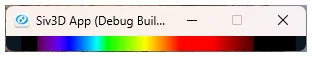

# Dan Brutonの波長近似アルゴリズム  
色空間について色々調べていると、可視化の際に波長をnmと対応して描画をしたいときがある.  
この時ちゃんとCIE規格からちゃんと計算...みたいな方法が一番良い方法.  
ちゃんとした規格なので、これに沿って波長のサンプルをすればスペクトルレンダリングもできたりする.  

でも、可視化したいだけでそれっぽい近似で簡単に実装さえできればいいんだよなぁ...というときも結構ある.  
そんなときに便利なのがBrutonのアルゴリズムというもの.  
Dan Bruton先生という物理学者の方が考えたアルゴリズムらしい.  
先生自身のサイトは見つけられなかったけど、解説してるサイト[^1]は見つかったので、これに沿って実装を行ってみる.  

やることは本当に簡単で380,440,490,510,580,645,780mmという間隔でそれっぽい色でLerpさせるだけ.  
色としては波長が短ければ青に近い色に、中央が緑、長い方に赤となるようにしてるだけ.  
近似であればこれくらいで問題ない.  
```c++
auto BrutonWaveLengthColor = [](const double waveLength)
    {
        ColorF color = Palette::Black;

        // 紫~青
        if (380.0 <= waveLength && waveLength < 440.0)
        {
            color.r = -(waveLength - 440.0) / (440.0 - 380.0);
            color.b = 1.0;
        }
        // 青~シアン
        else if (440.0 <= waveLength && waveLength < 490.0)
        {
            color.g = (waveLength - 440.0) / (490.0 - 440.0);
            color.b = 1.0;
        }
        // シアン~緑
        else if (490.0 <= waveLength && waveLength < 510.0)
        {
            color.g = 1.0;
            color.b = -(waveLength - 510.0) / (510.0 - 490.0);
        }
        // 緑~黄色
        else if (510.0 <= waveLength && waveLength < 580)
        {
            color.r = (waveLength - 510.0) / (580.0 - 510.0);
            color.g = 1.0;
        }
        // 黄色~赤
        else if (580.0 <= waveLength && waveLength < 645.0)
        {
            color.r = 1.0;
            color.g = -(waveLength - 645.0) / (645.0 - 580.0);
        }
        // 赤
        else if (645.0 <= waveLength && waveLength <= 780.0)
        {
            color.r = 1.0;
        }

        // ...
    };
```

また、左端の380nm,420nmと右端の701nm,780nm当りは係数を掛けて強さを調節する.  
これよりも小さいor大きい場合は可視光線の範囲ではなくなってしまうため、黒で表示する.  
黒で表示するというのはつまり、`factor=0`のままということである.  
```c++
        // スペクトルの端ではフェードするように
        double factor = 0.0;
        if (380.0 <= waveLength && waveLength < 420.0)
        {
            // 左端
            factor = 0.3 + 0.7 * (waveLength - 380.0) / (420.0 - 380.0);
        }
        else if (420.0 <= waveLength && waveLength < 701)
        {
            // 中間
            factor = 1.0;
        }
        else if (701.0 <= waveLength && waveLength <= 780.0)
        {
            factor = 0.3 + 0.7 * (780.0 - waveLength) / (780.0 - 701.0);
        }

        return color * factor;
```

これを表示した結果が以下である.  



うん、いい感じにそれっぽくなっている！  
今後、ちょっと色空間についてやっていく予定だが、一旦波長の色を表示したい場合はこのアルゴリズムで代用しようと思う.  

[^1]: [Conversion of wavelengths into RGB values](https://www.eureca.de/5116-1-Bruton-color-mapping.html)  