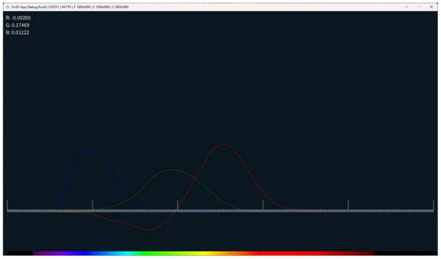
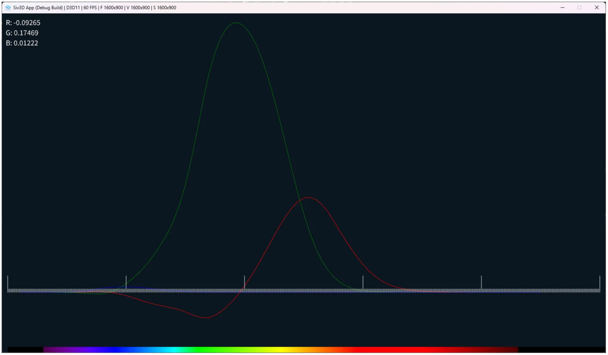

# CIE1931のRGB値を描画してみる  
今回は等色実験から調べていく.  
前と同じで主に参考にしているのはこの記事[^1],非常にためになる...  

等色実験に関してはCCSの光と色の話の記事[^2]が非常に分かりやすい.これを読めば大体は掴めるはず.  
今まで色々と色を調べたことにより、三色説を考えればRGBの三原色の色の強さを調整すると、これに応じてLMS錐体によって色を再現できるはずである.  

ここで、色$`F`$となるようなある波長$`\lambda`$を入射して、$`[S]`$を作る.   
もう片方では$`\lambda_{R},\lambda_{G},\lambda_{B}`$を入射させて、$`[R],[G],[B]`$を混ぜ合わせる.  
$`[R],[G],[B]`$は「原刺激値」と呼ぶ.  
この三色を混ぜ合わせた状態とある波長$`[S]`$が同じ状態になる、つまり二つの色が同じに見える「等色」の条件を探そう！というのが等色実験である.  

等色実験の内容はこちらの記述[^3]も非常に分かりやすい.  
まず$`[R],[G],[B]`$において、基準となる波長を見てみよう.  
最初に$`[G],[B]`$について、基準となる波長は$`\lambda_{G}=546.1nm, \lambda_{B}= 435.8nm`$という数値.  
これは水銀の輝線スペクトルを基準にして選ばれており、ここの記事のグラフ[^4]が分かりやすいが、確かにスペクトルのピークが青と緑に合わさっている.  
逆に言うとこれだと赤のスペクトルが判断できないという問題もある、赤の範囲には全くピークが立っていないのが分かるだろう.  
そういえば、銀塩写真なんかは赤が出しにくいんだっけか.あれもこの辺が関係あるのかなと今更に思った.  
さて、では$`[R]`$の波長はというと、これは切りのいい$`\lambda_{R}=700nm`$が選ばれたらしい.  
まあ確かにキリのいい数値感はあるね.  

ここまでくると求めたい式というのは、以下のような形をしているというのが見えてくる.  

```math
\begin{equation}
    \begin{split}
    [S]_{\lambda} = \bar{r}(\lambda)[R] + \bar{g}(\lambda)[G] + \bar{b}(\lambda)[B]
    \end{split}
\end{equation}
```

この時実験内で分かっているのは$`[S],[R],[G],[B]`$なので、求めたいのは$`\bar{r},\bar{g},\bar{b}`$ということになる.  
この$`\bar{r},\bar{g},\bar{b}`$を「等色関数」というらしい.  

さて、これを求めるにあたって前回の分光視感効率を思い出してほしい.  
明るさっていうのには波長によって強さに違いがあり、緑は強く感じて、青と赤はそれに比べると弱いのであった.  
そうなると、$`[R],[G],[B]`$をそのまま混ぜ合わせるのではなく、明るさに対する比率が必要なのでは...？と感覚的に疑問に思うはず.  
そのため「明度係数」という係数を考慮することで、原刺激値の単位をちゃんと揃えてあげる必要がある.[^5]  
この係数は以下のような感じとなる.  

```math
\begin{equation}
    \begin{split}
    l_{r}:l_{g}:l_{b} = 1:4.5907:0.0601
    \end{split}
\end{equation}
```

つまり、この係数で割ってあげた数値を採用することで、RGBそれぞれが$`1:1:1`$となるわけである！  
試しに以下のように定義しておこう.  

```math
\begin{equation}
    \begin{split}
    \bar{r^{\prime}} &= \frac{\bar{r}}{l_{r}} \\
    \bar{g^{\prime}} &= \frac{\bar{g}}{l_{g}} \\
    \bar{b^{\prime}} &= \frac{\bar{b}}{l_{r}}
    \end{split}
\end{equation}
```

これで書き換えてあげると、やっと式の完成！  

```math
\begin{equation}
    \begin{split}
    [S]_{\lambda} = \bar{r^{\prime}}[R] + \bar{g^{\prime}}[G] + \bar{b^{\prime}}[B]
    \end{split}
\end{equation}
```

こうして実際に実験をして$`\bar{r^{\prime}},\bar{g^{\prime}},\bar{b^{\prime}}`$を求めたのが、CIE1931である.  
上で述べたようなものを実際にウィリアム・デビッド・ライト[^6]とジョン・ギルド[^7]の2人が行い、その実験データを信頼できるデータと判断して構築されたものらしい.  

まず今回はこのデータを実際に描画してみよう.  
探してみたところデータに関してはXYZのものは落ちているが、なぜかRGBの方は見つからなかった...  
どっかにあるんかな？とりあえずいつも通りcvrl[^8]から落とす.  
`CVRL Database→CMFs→CIEFunctions→CIE 1931 2-deg, XYZ CMFs`のような感じで辿ってデータを落とせばOK.  

落とし終えたら今まで通りデータを抽出するのみでOK.  
ただし、今回落としたのは`XYZ`空間というもののため、`RGB`空間に変換を行う.  
`XYZ`空間は次回に回して、今回はあくまで`RGB`空間であるとして考えよう.  
今回はお試しで520nmの場合のパラメータも出力してみることにする.  
```c++
while (true)
{
    const double waveLength = Parse<double>(csvData[rows][0]);
    if (800 < waveLength) { break; }

    // データの抽出
    wavelengthes.push_back(waveLength);
    Float3 entry{ Parse<double>(csvData[rows][1]),Parse<double>(csvData[rows][2]), Parse<double>(csvData[rows][3]) };

    // XYZ->RGB変換を行う
    color_R.push_back(entry.dot({ 0.418466, -0.158661, -0.082835 }));
    color_G.push_back(entry.dot({ -0.091169, 0.252431, 0.015707 }));
    color_B.push_back(entry.dot({ 0.000921, -0.002550, 0.178599 }));

    if (Abs(waveLength - 520.0) < 1e-10)
    {
        Print << U"R: " << Format(color_R.back());
        Print << U"G: " << Format(color_G.back());
        Print << U"B: " << Format(color_B.back());
    }

    rows++;
}
```

あとはこれをグラフ内に出してみればOK！  
結果は以下のような感じになる.  



$`\bar{r^{\prime}} \to 赤,\bar{g^{\prime}} \to 緑,\bar{b^{\prime}} \to 青`$といったような色の対応関係と考えればOK.  

ここ[^1]で説明されている500nmの数値だけど、自分の環境だと何故かこの数値にならない...  
520nmの場合はちゃんと同じ数値になったので、なんか問題があるのかもしれない.  
さらに言うと550nmの方の数値はちゃんと合ってました、こっちは大丈夫.  

ともあれグラフとして出力が出来たため、一旦はOK.  
このグラフを眺めていると不思議な点がある.  
何故か赤がマイナスの方向に振り切れちゃっているのである.  
マイナスの色なんて存在しないのでは...というのはその通りなんだけど、これにはまたどうしようもない理由があるらしい.  
というのも単色光$`[S]`$が鮮やかなため、等色が出来ない範囲があるのである...  
ではどうしたか？答えは簡単で$`[G],[B]`$と$`[S],[R]`$のように単色光の方に$`R`$を移してしまったのである！  
つまり式で表すとこんな感じ.  

```math
\begin{equation}
    \begin{split}
    [S]_{\lambda} + \bar{r^{\prime}}[R] = \bar{g^{\prime}}[G] + \bar{b^{\prime}}[B]
    \end{split}
\end{equation}
```

もちろん$`\bar{r^{\prime}}[R]`$は正なので、移行すると次のようになる.  

```math
\begin{equation}
    \begin{split}
    [S]_{\lambda} = -\bar{r^{\prime}}[R] + \bar{g^{\prime}}[G] + \bar{b^{\prime}}[B]
    \end{split}
\end{equation}
```

うん、あくまで負の値は存在しない.  
だけど、混ぜる方向が変わったという意味で負が存在していたということになる！  
これである程度のグラフの意味も読み取れるようになった.  

因みにここでも[^5]書いてあるが、今のグラフに対して明度係数を掛けると以下のようなグラフに変化する.  



実は分光視感効率は以下のような形で表せるらしい.  

```math
\begin{equation}
    \begin{split}
    V(\lambda) = \bar{r^{\prime}} + 4.5907\bar{g^{\prime}} + 0.0601\bar{b^{\prime}}
    \end{split}
\end{equation}
```

この中でも特に緑が顕著で、確かに4.5907倍にすると前回求めた分光視感効率とほぼ同じ形になることが分かる.  
つまり、分光視感効率は等色関数に結構な影響を及ぼしてるどころか、それを元に構築されてるというのがグラフからも分かるのである.  

さて、ではここで光について考えてみる.  
今までのは特定の波長における等色であったが,光は波長が複数入り混じった状態になっているはずである.  
こうなると現状のものだけでは等色できないのでは...？となりそうだけど、結局は各波長を足し合わせてしまえば同じように計算が可能.  
例えば各刺激値$`R,G,B`$としてやれば、あとは足し合わせてあげればよい.  

```math
\begin{equation}
    \begin{split}
    (R,G,B) = \int_{0}^{\infty} 
    a(\lambda)(\bar{r^{\prime}}[R],\bar{g^{\prime}}[G],\bar{b^{\prime}}[B])
    d\lambda
    \end{split}
\end{equation}
```

$`a(\lambda)`$は光の放射量なので、こんな感じで足し合わせてあげれば、光のような複数波長に対する刺激値もちゃんと求まるわけである.  

そしたら次のような実験をしてみよう.  
ニュートンは光は様々な波長の重ね合わせであると仮説を立てて、プリズムの分光実験を行った.  
つまり、全部の波長を足せば白色になるのでは？と考えられる.  
ということで試しに$`a(\lambda)=1`$として、実際にコードを書き換えて出力してみよう.  

やることは簡単で、波長のデータを片っ端から足し合わせるだけ.  
5を掛けてるのはちょっと不思議だけど、そもそものデータ自体が5刻みの波長データとなっている.  
なので、直線の矩形をとして切り取ってる感じ.  
積分を数値計算で求める際に台形公式があるけど、あれよりもさらに大雑把な近似を入れてるものかと思う.  
まあ今回位ならこれでも問題ないと思う.最後にLogを出力すればOK.  
```c++
	Vec3 sum = Vec3::Zero();

	while (true)
	{
        // ...

		sum.x += color_R.back() * 5.0;
		sum.y += color_G.back() * 5.0;
		sum.z += color_B.back() * 5.0;

		rows++;
    }
    
    Logger << U"SumR: " << Format(sum.x);
	Logger << U"SumG: " << Format(sum.y);
	Logger << U"SumB: " << Format(sum.z);
```

こうして得られた結果は以下の形になる.  
```
397: SumR: 18.91107
397: SumG: 18.91016
397: SumB: 18.91698
```

うん、確かに全部の波長の場合はちゃんと白のような値になるわけだなぁ.  
さて、今回はこの辺でやめとこうかと思う.  
次回はRGB空間について入っていければなぁと考えてます.  

[^1]: [XYZ色空間に迫る(1)](https://qiita.com/Ushio/items/203f16ad1e23fd42231c#wright--guild-1931-2-degree-rgb-%E7%AD%89%E8%89%B2%E9%96%A2%E6%95%B0cmf-color-maching-function)  
[^2]: [第30回 色の客観的な表現と伝達 （その4）](https://www.ccs-inc.co.jp/guide/column/light_color/vol30.html)  
[^3]: [色彩工学 (1) - CIE 1931色空間](https://henatips.com/page/37/)  
[^4]: [HIDランプについて色々と](https://elm-chan.org/docs/hid/hidlamp.html)  
[^5]: [XYZ表色系とは何か？～色空間とカラーマネジメントの基礎～ （前編）](http://compojigoku.blog.fc2.com/blog-entry-91.html)  
[^6]: [ウィリアム・デビッド・ライト](https://w.wiki/UY5C)  
[^7]: [John Guild](https://w.wiki/UY5h)  
[^8]: [CVRL](http://cvrl.ioo.ucl.ac.uk/cmfs.htm)