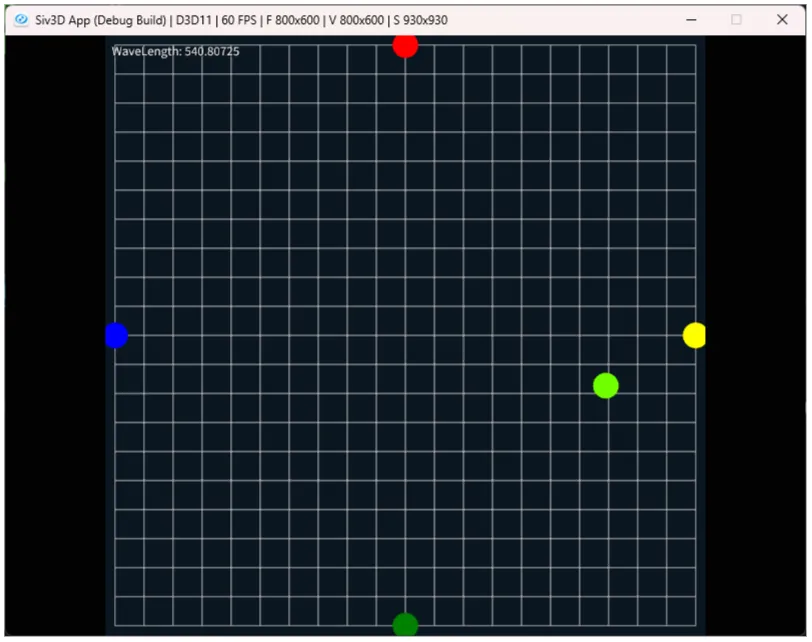

# 反対色説から段階説へ  
今回は反対色説というのを考える.  
前と同じで主に参考にしているのはこの記事[^4],非常にためになる...  

まず大事な考えとして、補色[^1]というものがある.  
色相を並べた際に真逆の位置にある2色が補色という立ち位置になり、この色の組み合わせは互いの色を目立たせてくれる.  
この補色は反対色ともいうが、この反対色の関係が人間の色覚に影響しているのは明らかで、この現象を元にして色を知覚しているのではと考えられる.  
まさしくこれと同じ考えをへリングという有名な学者が行っており、これを「へリングの反対色説」というらしい.  

この考えでは赤と緑の混色である「黄色」は、赤と緑とも全く異なる.  
そのため、黄色は混色ではなく独立した色だとする.  
そして黄色は青の反対色であり、赤は緑の反対色.  
よって、RGB+Y(Yellow:黄色のこと)の4色に関して、  

* R-G
* B-Y
* White-Black(明るさを表す)

という3つの色の補色を認識できる細胞があるのでは？と考えたわけである.  

これが正しいとすると,RGBの3つを知覚しているとする「三色説」とはまったく違うメカニズムで働くことになってしまう.  
なんか量子力学の波とも考えられるし、粒子とも考えられるけどどっちが正しいの？みたいなノリと同じものと自分は感じてしまった.  

さて、量子力学と言えばシュレーディンガー方程式、シュレーディンガー方程式と言えばエルヴィン・シュレーディンガー[^3].  
実はシュレーディンガー先生、色に関しても色々と研究しており、英語の方のwikiのColorの項を見るとそれっぽいのが出てくる.  
特にその中の
```
"Über das Verhältnis der Vierfarben- zur Dreifarben-Theorie", Mathematisch-Naturwissenschaftliche Klasse, Akademie der Wissenschaften, Wien, 134, 471, (On The Relationship of Four-Color Theory to Three-Color Theory)
```
これがそれっぽい、`On The Relationship of Four-Color Theory to Three-Color Theory`.  
つまり4色というのはへリングの反対色説で3色は三色説のことだと思う.  
この2つの関係において、シュレーディンガー先生は一次変換が可能ということを述べている.  
実際にそれっぽい記述を調べた感じ見つからなかったけど、基底変換してるそれっぽい資料はあった.  
私にはあまりわからないけど、きっと正しいのでしょう.  

ここで述べてるのは非常に簡単で、へリングのR-Gの感覚を$`x_{1}`$,B-Yの感覚を$`x_{2}`$とする.  
そして、三色説は普通に$`R,G,B`$とし、定数を$`C_{1}, C_{2}`$とすると以下が成り立つ.  

```math
\begin{equation}
    \begin{split}
    x_{1} = C_{1}(B - G) \quad x_{2} = C_{2}(G-R)
    \end{split}
\end{equation}
```

この図を実際にここ[^4]では出力しているが、自分でもちゃんと出力してみたい...  
前回で各錐体LMSのデータは取れているため、これを使って実際にへリングの反対説の色に変換してみよう.  
今回はTimerを使って0\~1に変化させるようなプログラムを書くことにする.  
そのため、まずはTimerを動かしつつ現在のWave位置を境界条件に気をつけながら取得する.  
```c++
auto CalculateOpponentColorPosition = [&](Vec2& pos, ColorF& color)
    {
        ClearPrint();
        if (timer.reachedZero()) { timer.restart(); }

        double wave = Math::Lerp(MIN_WAVE, MAX_WAVE, timer.progress0_1());
        int index = std::distance(wavelengthes.begin(),
            std::find_if(wavelengthes.begin(), wavelengthes.end(), [wave](const double& v)
            {
                return wave < v;
            }));

        // 境界条件での調整
        if (index == 0) { index++; }
        if (wavelengthes.size() <= index) { index = wavelengthes.size() - 1; }

        // ...
    };
```

Waveを取得したら、その後は現在のWave位置に対する閾値を取得.  
現状の波長間を直線で結ぶ際、どの位置に対応するかを求める.  
```c++
        // 区間上から[0,1]に変換
        double threshold = (wave - wavelengthes[index - 1]) / (wavelengthes[index] - wavelengthes[index - 1]);
        threshold = Math::Saturate(threshold);
```

これが出来たらLMSが取得可能！  
`index`で二点を取得し、`threshold`でlerpさせればそれっぽく取れる.  
ただし、軸を合わせるためOneminus的処理をしておく.軸ひっくり返すだけ.  
```c++
        // Lookup
        Vec3 lms = Vec3::Zero();
        lms.x = Math::Lerp(coneSpectralSensitivites_L[index - 1], coneSpectralSensitivites_L[index], threshold);
        lms.y = Math::Lerp(coneSpectralSensitivites_M[index - 1], coneSpectralSensitivites_M[index], threshold);
        lms.z = Math::Lerp(coneSpectralSensitivites_S[index - 1], coneSpectralSensitivites_S[index], threshold);

        // AdjustValue分の調整
        lms = Vec3::One() - lms;
```

後は先程の一次変換を施すだけ.  
定数は資料[^4]と同じ$`C_{1}=-0.7,C_{2}=-1.6`$を採用した.  
```c++
        // 線形化
        constexpr double X_CONSTANT = -0.7;
        constexpr double Y_CONSTANT = -1.6;
        pos.x = X_CONSTANT * (lms.z - lms.y);
        pos.y = Y_CONSTANT * (lms.y - lms.x);

        color = BrutonWaveLengthColor(wave);

        // 現所の値は描画しとく
        Print << U"WaveLength: " + Format(wave);
```

よし、描画をしてみよう！  



うん、確かにそれっぽく変換できてる気がする.  
ちゃんとLMSから`R-G,B-Y`っぽく変換が出来ていそうだ.  

この三色説とへリングの三色説が変換可能ということは実際にあり得るのか？と思うが、これは実際に細胞の構造に表れているらしい.  
ここの資料[^5]が非常に分かりやすいが,前回も行ったように錐体が三色説のLMSを表しているのであった.  
目に光が届くまでにはこの後に双極細胞というものを通る、これが反対色説と同じような処理を行っているらしい.  

つまり三色が錐体で認知されて、これが双極細胞で反対色に変換が行われる.  
これは先程のシュレーディンガー先生の示した仮説通りということになる！  
この三色説と反対色説が全く違うものではなく、あくまで最初に錐体で三色説が認識され、その後に双極細胞で反対色を認識するという段階を踏んでただけである.  
これを「段階説」というらしく、今の通説はこれらしい.面白いね.  
といったところで今回はこの辺までにしておこう.  

[^1]: [補色](https://w.wiki/3aDr)  
[^2]: [エヴァルト・ヘリング](https://w.wiki/3vc5)  
[^3]: [Erwin Schrödinger](https://w.wiki/Emcb)  
[^4]: [XYZ色空間に迫る(1)](https://qiita.com/Ushio/items/203f16ad1e23fd42231c#wright--guild-1931-2-degree-rgb-%E7%AD%89%E8%89%B2%E9%96%A2%E6%95%B0cmf-color-maching-function)  
[^5]: [カラー画像工学の基礎と応用](https://www.jstage.jst.go.jp/article/itej1978/47/1/47_1_68/_article/-char/ja/)  