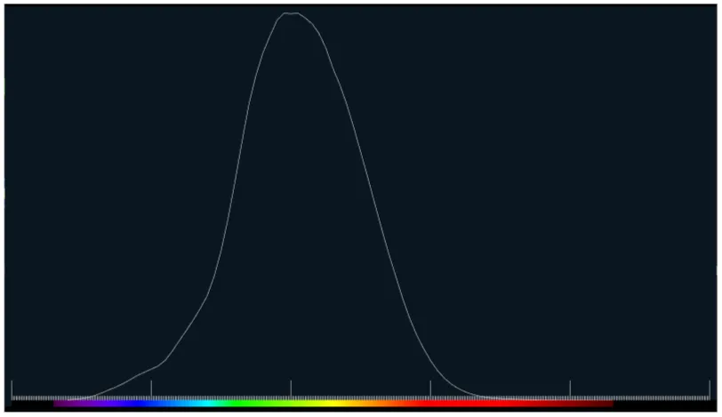

# 分光視感効率について  
今回は輝度について考える.  
前と同じで主に参考にしているのはこの記事[^1],非常にためになる...  

ここまでで光の色についてフォーカスしてきたが、次にフォーカスするのは光の明るさである.  
波長が違えば明るさも違う見た目になるらしく、確かに色によってもある程度違いはありそうな気はする...  
この明るさを物理量的に表したい、そんな時に使えるのが放射輝度.  
こいつは便利なんだけど、人間の目では見えない可視光線の外となる紫外線や赤外縁なんかも含んだ定量的な量[^2]となる.  

そうなると、人間基準のものが欲しいよね...  
要は可視光線内の明るさで定量的なものが欲しい...と思うのは確か.  
そんな時に便利なのが測光量[^3].  
こいつは人間の目を基準にした量で、特定の波長の光がどれくらい明るいかを定義として組み込んでいる.  
この量を分光視感効率$`V(\lambda)`$で表すが、今回はこれの描画をやってみる.  
今回もデータを取ってくるのはcrvl[^4]で、`luminous efficiency functions consistent with the Stockman & Sharpe cone fundamentals`の奴を取ってくればよい.  
データを取ってきたら後はSmith&Pokonyの時と同じ手順で描画するだけだが、今回はデータが1つだけなのに注意.  
LMSみたいに分かれてないので、あくまで1つ取ればよい.Logデータなので、10倍に関しては同じ.  
```c++
Array<double> wavelengthes;
Array<double> values;

for (int rows = 2; rows < csvData.rows(); rows++)
{
    // データの抽出
    wavelengthes.push_back(Parse<double>(csvData[rows][0]));
    double entry = Parse<double>(csvData[rows][1]);

    // Log値になってるので、10^xで元に戻す
    values.push_back(Pow(10, entry));
}
```

こうして描画したグラフは以下のようになる.  



一応波長に関しても重ねて描画をしてみた.  
こうやって見ると、青/赤はそこまで明るいと感じず、特に緑を明るいと人の目は感じるようになってわけか.  
そう考えると、緑が明るいということは緑を重視することがよくあるというのも分かる気がする.  
例えばグレースケール化、あれも緑が重要という性質を使って緑の重みを強く取り入れる.  
FXAAの実装においても、重要視する数値を選ぶ際は緑を主に見て判断を行う.  
この緑が重要という判断に関してはこの測光量というのが絡みついてるのかもしれない、とふと書いてて思った.  

さて、光には先程の放射輝度にもあるように「放射量」を基準にした定義と、人の感覚を基準にした「測光量」の2つがある.  
この二つはどうにかして変換が出来そうだなぁ、というのは直観的に思うはず.  
これは実際に変換は可能で、波長毎に分光視感効率を足してあげれば良い.  
これは以下のような式[^5]になる.  

```math
\begin{equation}
    \begin{split}
    \Phi_{v} = 683.002(lm/W) \int_{0}^{\infty} \bar{y}(\lambda) \Phi_{e,\lambda}(\lambda)d\lambda
    \end{split}
\end{equation}
```

これで求まるわけだが、可視光だけで問題ないため、CIEだと380\~780の範囲がデータとして配布されている.  
更に$`683.002`$は通常丸めて$`683`$を使うのが一般らしい、Wikiにもそう書いてある.  
この2つを適用すると以下のようになる.  

```math
\begin{equation}
    \begin{split}
    \Phi_{v} = 683(lm/W) \int_{380}^{780} \bar{y}(\lambda) \Phi_{e,\lambda}(\lambda)d\lambda
    \end{split}
\end{equation}
```

これでそれっぽい値は求まった！  
明るさについてちょっと詳しくなれた気がする、といったところで今回はここまで.  

[^1]: [XYZ色空間に迫る(1)](https://qiita.com/Ushio/items/203f16ad1e23fd42231c#wright--guild-1931-2-degree-rgb-%E7%AD%89%E8%89%B2%E9%96%A2%E6%95%B0cmf-color-maching-function)  
[^2]: [放射輝度 / Radiance](https://www.vstechnology.com/glossary/radiance/)  
[^3]: [測光量](https://www.ushio.co.jp/jp/technology/glossary/glossary_sa/photometric_quantity.html)  
[^4]: [crvl](http://www.cvrl.org/lumindex.htm)  
[^5]: [Luminous efficiency function](https://w.wiki/UQfY)