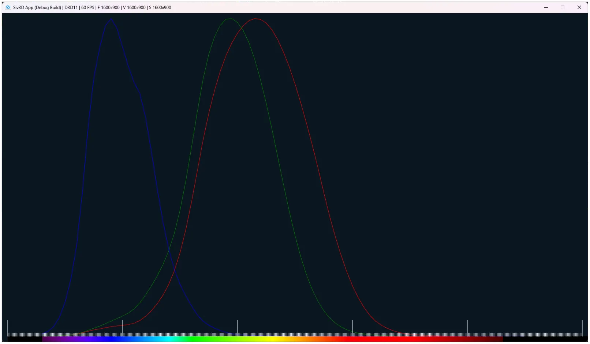

# 三色説と分光感度グラフ
今回は光の三原色について考えてみよう.  
主に参考にしているのはこの記事[^1],非常にためになる...  
3種類の色を混ぜ合わせることで色が再現できるというもので、ディスプレイであればRGBを用いて多くの色を再現してる.  

カメラであればBayar Filter何かも分かりやすい、イメージセンサーに対してR,G,Bのどれかに近い波長のみを通しておく.  
その後、周囲のイメージセンサのR,G,Bのパラメータを使って再構成することで、最終的に色を構築していくという寸法だ.  

こんな感じで、RGBの3つを組み合わせることで色を作れるという考えのもとにあるのが三色説となるっぽい.  
ただ、不思議なのは色を混ぜることで再現はできるのに、波長毎に混ぜて似た色を作ったとしても、その波長がどんな色かの区別はできない...  

光に似たもので音がある、音の場合は高い音と低い音が同時になっていたとしてもちゃんと区別が可能.  
これは音を聞き分ける耳の構造によるもので、この構造によってちゃんと区別が可能になっている.  
では、光でも同様に区別するような器官が存在するのでは？R,G,Bそれぞれを認知するセンサーがあり、このセンサーのバランスによって色ができるのでは？という考え方が「ヤング＝ヘルムホルツの三色説」[^2]となる.  

この細胞の感度を心理学的手法によりSmith&Pokornyが波長毎に分光感度[^3]としてグラフ化を行った.  
これは錐体[^4]という目の網膜にある細胞らしく、ここで光がどんな風に反応するかを見たわけである.  
人間にはL(Long),M(Middle),S(Short)の長波長、中波長、短波長に対応する錐体がある.  
この波長のデータはcvrl[^5]に落ちており実際に描画が可能.  
`Cone Fundamentals->2-deg fundamentals based on the CIE Judd-Vos 2-deg CMFs->Smith & Pokorny (1975) cone fundamentals`にあるため、ここのcsvを取ってくればよい.  

描画に関しては非常にシンプルで、csvをまず開く.  
そして最初の二行はコメントなので飛ばす.  
後はデータを抽出するだけ.  
LMSの値はLogオーダーになってるため、`Pow`関数で$`10^{n}`$のような計算にして保存しておく.  
```c++
	CSV csvData{ U"example/csv/sp.csv" };
	if (!csvData) { throw Error(U"Failed to load csv."); }

	Array<double> wavelengthes;
	Array<double> coneSpectralSensitivites_L;
	Array<double> coneSpectralSensitivites_M;
	Array<double> coneSpectralSensitivites_S;

	int rows = 2; // コメント二行を飛ばした位置から開始

	while (true)
	{
		const double waveLength = Parse<double>(csvData[rows][0]);
		if (800 < waveLength) { break; }

		// データの抽出
		wavelengthes.push_back(waveLength);
		Vec3 entry{ Parse<double>(csvData[rows][1]),Parse<double>(csvData[rows][2]), Parse<double>(csvData[rows][3]) };

		// Log値になってるので、10^xで元に戻す
		coneSpectralSensitivites_L.push_back(Pow(10, entry.x));
		coneSpectralSensitivites_M.push_back(Pow(10, entry.y));
		coneSpectralSensitivites_S.push_back(Pow(10, entry.z));

		rows++;
	}
```

そして、今回は見易さのために0\~1の値になるように調整を行う.  
最小値と最大値を取ってスケールするだけ.  
```c++
	auto AdjustValue = [](Array<double>& values)
		{
			auto maxValue = *std::max_element(values.begin(), values.end());
			auto minValue = *std::min_element(values.begin(), values.end());

			// [min, max] -> [0, 1]にスケール
			for (auto& value : values)
			{
				value = (maxValue - value) / (maxValue - minValue);
			}
		};

	AdjustValue(coneSpectralSensitivites_L);
	AdjustValue(coneSpectralSensitivites_M);
	AdjustValue(coneSpectralSensitivites_S);
```

こうして得られた画像が以下のような形.  

  

青がS錐体,緑がM錐体、赤がL錐体である.  
Short,Middle,Longなので波長の小さい順に並んでいる.  
人はこの3つの細胞によって波長を大雑把に認識しているということになる.  
この細胞を刺激すれば上手く色を認知できるし、何なら騙すことだってできるわけだね.  
ただし0\~1に強制的にスケールしている点は注意.  
Short,Middle,Longの波長に関して大体おんなじようなグラフになっているが、実際は認識スケールは全く違うことになる.  

[^1]: [XYZ色空間に迫る(1)](https://qiita.com/Ushio/items/203f16ad1e23fd42231c#wright--guild-1931-2-degree-rgb-%E7%AD%89%E8%89%B2%E9%96%A2%E6%95%B0cmf-color-maching-function)  
[^2]: [ヤング＝ヘルムホルツの三色説](https://w.wiki/UKA3)  
[^3]: [Spectral sensitivity](https://w.wiki/UKAo)  
[^4]: [Cone cell](https://w.wiki/Sphx)  
[^5]: [Colour & Vision Research Laboratory](http://www.cvrl.org/)