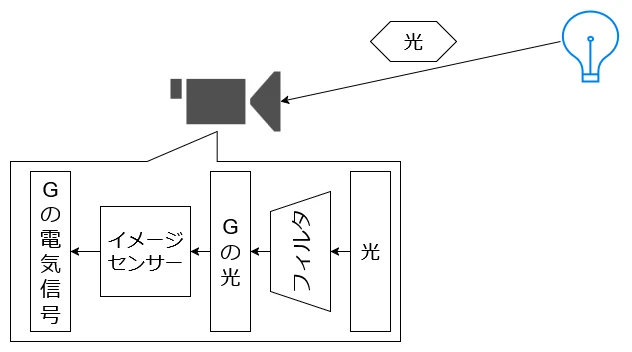
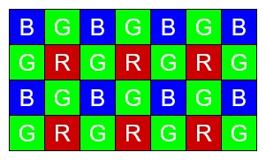
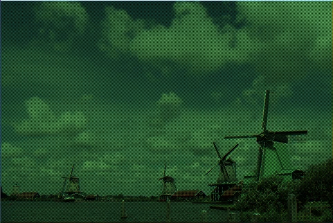
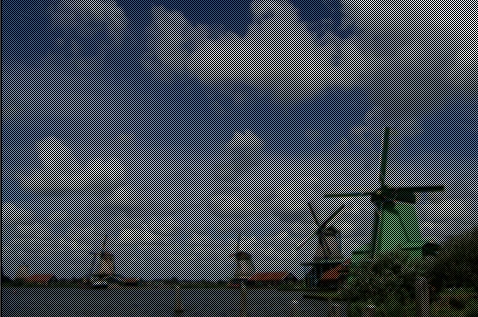

# BayarFilter  
カメラが画像を出力するまでは以下のような手順をたどる.  
  
光がレンズを通った後はフィルタを通して波長からRGBの1色をフィルタリングする.図ではG.  
そうしてGの波長はイメージセンサを通って、Gの電気信号として抽出されることになる.  
この流れの中でフィルタはどういう実装をするのか？というのが問題になるわけだけど,有名なのはベイヤーフィルターである.  
  
この図を見ればわかるが、R:G:B=1:2:1という風にGが多めの配置となっている.  
これはなんでかというと、Gは人の目でも特に敏感な処理であるからである.  
これはFXAAなんかも似たような特性を生かしてやってたりする.
まずはこのベイヤーフィルターを適用してみた画像を作ってみよう.  
まずは奇数か偶数かを判断できるようにindexを取っておく.  
```c++
int wIndex = w % 2;
int hIndex = h % 2;
```
図に着目してみよう.  
青は横が偶数,縦が偶数のindexとなる.  
赤は横が奇数,縦が奇数のindexとなる.  
そのため、Index=0 -> 赤, Index=1 -> 緑, Index=2 -> 青 となるように設定する.  
```c++
int rgbIndex = 1;
if (hIndex == 0 && wIndex == 0) { rgbIndex = 2; }
else if (hIndex == 1 && wIndex == 1) { rgbIndex = 0; }
```
あとはindexに基づいて、値を取りだすようにすればよい.  
```c++
result.x = rgbIndex == 0 ? result.x : 0;
result.y = rgbIndex == 1 ? result.y : 0;
result.z = rgbIndex == 2 ? result.z : 0;
```
全体のコードはこんな感じ.  
```c++
auto filterProcess = [&](int w, int h)
    {
        Vec3 result = static_cast<ColorF>(image[h][w]).rgb();

        int wIndex = w % 2;
        int hIndex = h % 2;

        int rgbIndex = 1;
        if (hIndex == 0 && wIndex == 0) { rgbIndex = 2; }
        else if (hIndex == 1 && wIndex == 1) { rgbIndex = 0; }

        result.x = rgbIndex == 0 ? result.x : 0;
        result.y = rgbIndex == 1 ? result.y : 0;
        result.z = rgbIndex == 2 ? result.z : 0;

        tempImage[h][w] = { ColorF(result, 1.0f) };
    };
```
これを適用した画像は以下である.  
  
こうしてできたデータで、次はデモザイク処理、つまり元の色を復元してみよう.  
まずは上下左右の値の平均を計算する.  
```c++
Vec3 first = static_cast<ColorF>(tempImage[h - 1][w]).rgb();
first += static_cast<ColorF>(tempImage[h + 1][w]).rgb();
first += static_cast<ColorF>(tempImage[h][w - 1]).rgb();
first += static_cast<ColorF>(tempImage[h][w + 1]).rgb();
first /= 4.0;
```
次に斜めの上下左右の値の平均を計算する.  
```c++
Vec3 second = static_cast<ColorF>(tempImage[h - 1][w - 1]).rgb();
second += static_cast<ColorF>(tempImage[h + 1][w - 1]).rgb();
second += static_cast<ColorF>(tempImage[h + 1][w + 1]).rgb();
second += static_cast<ColorF>(tempImage[h - 1][w + 1]).rgb();
second /= 4.0;
```
この後先ほど同じようなIndexの取得をしたら、色の確定をしていく.  
今回は緑の場合は試しに黒が出るようにする. 
```c++
else
{
    result.y = 0;
}
``` 
次に赤,赤の場合は赤のピクセルに対して緑は上下左右,青は斜めの上下左右を取ればよい.  
```c++
if (rgbIndex == 0)
{
    result.y = first.y; result.z = second.z;
}
```
青は青のピクセルに対して緑は同じように上下左右,赤は斜めの上下左右を取ればよい.  
```c++

else if (rgbIndex == 2)
{
    result.x = second.x; result.y = first.y;
}
```
この処理をまとめると以下のようになる.  
```c++
auto demosaicProcess = [&](int w, int h)
    {
        Vec3 result = static_cast<ColorF>(tempImage[h][w]).rgb();

        Vec3 first = static_cast<ColorF>(tempImage[h - 1][w]).rgb();
        first += static_cast<ColorF>(tempImage[h + 1][w]).rgb();
        first += static_cast<ColorF>(tempImage[h][w - 1]).rgb();
        first += static_cast<ColorF>(tempImage[h][w + 1]).rgb();
        first /= 4.0;

        Vec3 second = static_cast<ColorF>(tempImage[h - 1][w - 1]).rgb();
        second += static_cast<ColorF>(tempImage[h + 1][w - 1]).rgb();
        second += static_cast<ColorF>(tempImage[h + 1][w + 1]).rgb();
        second += static_cast<ColorF>(tempImage[h - 1][w + 1]).rgb();
        second /= 4.0;

        int wIndex = w % 2;
        int hIndex = h % 2;

        int rgbIndex = 1;
        if (hIndex == 0 && wIndex == 0) { rgbIndex = 2; }
        else if (hIndex == 1 && wIndex == 1) { rgbIndex = 0; }

        if (rgbIndex == 0)
        {
            result.y = first.y; result.z = second.z;
        }
        else if (rgbIndex == 2)
        {
            result.x = second.x; result.y = first.y;
        }
        else
        {
            result.y = 0;
        }

        resultImage[h][w] = { ColorF(result, 1.0f) };
    };
```
これを適用すると以下のようになる.  
