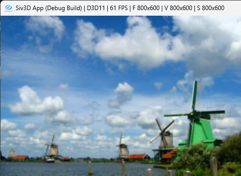

# BilateralFilter  
  
バイラテラルフィルタの実装.  
式としては以下のものを計算すればよい感じ.  
```math
\begin{equation}
    \begin{split}
    \frac{g(i,j) = \sum^{W}_{n=-W} \sum^{W}_{n=-W} w(i,j,m,n)f(i+m, j+n)}
    {\sum^{W}_{n=-W} \sum^{W}_{n=-W} w(i,j,m,n)}
    \end{split}
\end{equation}
``` 
i,jが現在の画素位置でm,nがフィルタのずらしを適用する際のパラメータ.  
wは重みなので、分母はガウシアンフィルタなんかと同じで重みの総計で割ってる感じ.  
fに関しては画素値なので、大事なものとなってくるのは重みの計算.  
重みは以下のように計算を行う.  
```math
\begin{equation}
    \begin{split}
    w(i,j,m,n) = \exp{(- \frac{m^2+n^2}{2\sigma^2_1})} \exp{(-\frac{(f(i,j) - f(i+m, j+ n))^2}{2 \sigma^2_2})}
    \end{split}
\end{equation}
```
二つのexpを掛けることによって処理を施している.  
分離してみていくとこれは結構わかりやすいかな～と思う.  
まず一つ目.  
```math
\begin{equation}
    \begin{split}
    \exp{(- \frac{m^2+n^2}{2\sigma^2_1})}
    \end{split}
\end{equation}
```
この式はガウシアンフィルタとほぼほぼ同じ式、フィルタ中心から離れた位置ほど影響が弱くなるようにしている.  
二つ目はこれ.  
```math
\begin{equation}
    \begin{split}
    \exp{(-\frac{(f(i,j) - f(i+m, j+ n))^2}{2 \sigma^2_2})}
    \end{split}
\end{equation}
```
fは画素値を取ってきているんだった.  
ということは左のfが現在の画素値,右のfはずらした位置の画素値との差となるので、画素値の差がどれくらいなのか？を見てると考えられそう.  
つまり画素値の差がなければ、それは重みとして重要なものとなりこのexpは大きくなり、差が大きくなればその分重みは小さくなっていくというのを表していることになる.  
ここまでのことをまとめると、1つ目は距離による影響を考えていたのに対し、2つ目は色の差による影響を取り入れるという二つのものを合わせたものがバイラテラルフィルタと言えそう.  
周囲のピクセルで近いものを取り入れるように考慮すると良さそうというのは感覚的にもあってそうな感じはある.  
あとはこれを実際に実装するだけ.  
まずはフィルタのサイズを取る.これは式内のm,nに相当.  
```c++
for (int i = -filterSize; i <= filterSize; i++)
{
    for (int j = -filterSize; j <= filterSize; j++)
    {
```
これができたらまずはfの値を計算する,要は画素値を取ってくるだけ.  
```c++
        ColorF current = image[h][w]; // f(i, j)
        ColorF next = image[h + i][w + j]; // f(i+m, j+n)
```
そしたらまずはexpの一つ目を計算.  
```c++
                float exp1 = Exp(-(i * i + j * j) / (2.0f * sigma1 * sigma1));
```
その次にexpの二つ目、画素値の差を取ってそれを使うだけ.  
それが終わったらexp1をかけ合わせてあげれば重みになる.  
```c++
                Vec3 p = current.rgb() - next.rgb();
                Vec3 exp2 = Exp(-(p * p) / (2.0f * sigma2 * sigma2));
                exp2 *= exp1; // これがw(i,j,m,n)
```
最後に結果を足しつつも、重みも蓄積しておく.  
重みはバイラテラルフィルタの分母に相当するので、最後に割ってあげる必要があるため.  
```c++
                result += exp2 * next.rgb();
                sum += exp2;
```
すべての処理が終わったら、結果を割ってあげれば終了.  
```c++
        result = result / sum;
```
これをまとめると以下のようになる.  
```c++
auto filterProcess = [&](int w, int h)
    {
        Vec3 sum = Vec3::Zero();

        Vec3 result = Vec3::Zero();
        for (int i = -filterSize; i <= filterSize; i++)
        {
            for (int j = -filterSize; j <= filterSize; j++)
            {
                ColorF current = image[h][w];
                ColorF next = image[h + i][w + j]; // f(i+m, j+n)

                // 重み計算
                float exp1 = Exp(-(i * i + j * j) / (2.0f * sigma1 * sigma1));
                Vec3 p = current.rgb() - next.rgb();
                Vec3 exp2 = Exp(-(p * p) / (2.0f * sigma2 * sigma2));
                exp2 *= exp1; // これがw(i,j,m,n)

                result += exp2 * next.rgb();
                sum += exp2;
            }
        }

        result = result / sum;
        resultImage[h][w] = { ColorF(result, 1.0f) };
    };
```