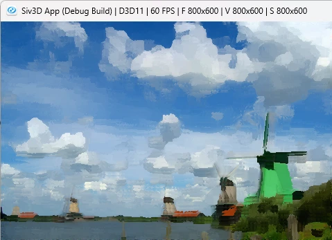

# Kuwahara Filter  
  
絵画風な雰囲気を作れるフィルタ、もともとはノイズ除去に使われる.  
Kuwaharaフィルタはまず大きな矩形を4つの矩形領域に分けて、まずは処理を行う.  
この処理をまずは見てみよう.  
必要な状態は平均値と標準偏差を計算する.  
これを入れる構造体をまずは用意しておく.  
```c++
struct RectData
{
    double sigma;
    double meanSigma;
    Vec3 mean;

    RectData() : sigma(0.0), meanSigma(0.0), mean(Vec3::Zero()) {}
};
```
まずは平均値を求めよう.  
簡単ではあるけど、平均は次のような感じで計算できる.  
```math
\begin{equation}
    \begin{split}
    \mu = \frac{1}{n} \sum^{n}_{i=1} x_i
    \end{split}
\end{equation}
```
これを実際に計算するところから始める.  
```c++
RectData data;
// 平均
float sum = (filterSize + 1) * (filterSize + 1);
for (int i = start.x; i <= start.x + filterSize; i++)
{
    for (int j = start.y; j <= start.y + filterSize; j++)
    {
        ColorF current = image[h + j][w + i];
        data.mean += current.rgb();

        HSV hsv{ current };
        data.meanSigma += hsv.v;
    }
}
data.mean /= sum;
data.meanSigma /= sum;
```
meanは色の平均なのでそのまま足すだけ.  
meanSigmaはHSVのV値,つまり輝度値基づいた値で同じく平均を計算しておく.  
meanSigmaは分散で使うが、そのまま色で使うと問題が生じるため、輝度で値を計算する.  
次に標準偏差、これは次のような式で計算可能.  
```math
\begin{equation}
    \begin{split}
    s = \sqrt{\frac{1}{n} \sum^{n}_{i=1} (x_i - \mu)^2}
    \end{split}
\end{equation}
```
$`\mu`$は先ほど計算したmeanSigmaなので、これを使って計算してあげればOK.  
```c++
// 標準偏差
for (int i = start.x; i <= start.x + filterSize; i++)
{
    for (int j = start.y; j <= start.y + filterSize; j++)
    {
        ColorF current = image[h + j][w + i];
        HSV hsv{ current };
        double param = hsv.v - data.meanSigma;
        data.sigma += param * param;
    }
}
data.sigma /= sum;
data.sigma = Sqrt(data.sigma);
```
ここまでをまとめるとこんな感じ.  
```c++
auto CalculateRect = [&](int w, int h, Vec2 start)
{
        RectData data;
        // 平均
        float sum = (filterSize + 1) * (filterSize + 1);
        for (int i = start.x; i <= start.x + filterSize; i++)
        {
            for (int j = start.y; j <= start.y + filterSize; j++)
            {
                ColorF current = image[h + j][w + i];
                data.mean += current.rgb();

                HSV hsv{ current };
                data.meanSigma += hsv.v;
            }
        }
        data.mean /= sum;
        data.meanSigma /= sum;

        // 標準偏差
        for (int i = start.x; i <= start.x + filterSize; i++)
        {
            for (int j = start.y; j <= start.y + filterSize; j++)
            {
                ColorF current = image[h + j][w + i];
                HSV hsv{ current };
                double param = hsv.v - data.meanSigma;
                data.sigma += param * param;
            }
        }
        data.sigma /= sum;
        HSV hsv;
        data.sigma = Sqrt(data.sigma);

        return data;
};
```
ここまでで計算に必要な情報が出揃った,あとは次の計算をすればよい.  
```math
\begin{equation}
    \begin{split}
    \Sigma (x,y) = \mu_{i}(x,y) \quad where \quad i = arg min_{j} \sigma_{j}(x,y)
    \end{split}
\end{equation}
```
要は標準偏差が最小の値となる平均値を結果とすればよい.  
最小となるということは複数個の中から選ぶわけだけど、これは4つの矩形領域のこと.  
まずはこの矩形領域に対して計算を行う.  
```c++
RectData leftTop = CalculateRect(w, h, Vec2{ -filterSize, -filterSize });
RectData RightTop = CalculateRect(w, h, Vec2{ 0, -filterSize });
RectData leftDown = CalculateRect(w, h, Vec2{ -filterSize, 0 });
RectData RightDown = CalculateRect(w, h, Vec2{ 0, 0 });
```
そしたら実際に標準偏差から平均値を選ぶ関数を用意する.  
```c++
auto CompData = [](RectData data, Vec3& result, float& minData)
    {
        if (data.sigma < minData)
        {
            result = data.mean;
            minData = data.sigma;
        }
    };
```
後はこれを矩形領域で適用させればよい.  
```c++
float minData = 1000000.0f;
CompData(leftTop, result, minData);
CompData(RightTop, result, minData);
CompData(leftDown, result, minData);
CompData(RightDown, result, minData);
```
これをまとめた全コードは以下.  
```c++
auto filterProcess = [&](int w, int h)
    {
        Vec3 result = Vec3::Zero();

        RectData leftTop = CalculateRect(w, h, Vec2{ -filterSize, -filterSize });
        RectData RightTop = CalculateRect(w, h, Vec2{ 0, -filterSize });
        RectData leftDown = CalculateRect(w, h, Vec2{ -filterSize, 0 });
        RectData RightDown = CalculateRect(w, h, Vec2{ 0, 0 });

        auto CompData = [](RectData data, Vec3& result, float& minData)
            {
                if (data.sigma < minData)
                {
                    result = data.mean;
                    minData = data.sigma;
                }
            };

        float minData = 1000000.0f;
        CompData(leftTop, result, minData);
        CompData(RightTop, result, minData);
        CompData(leftDown, result, minData);
        CompData(RightDown, result, minData);

        resultImage[h][w] = { ColorF(result, 1.0f) };
    };

int32 width = image.width();
int32 height = image.height();

image = resultImage;
for (int w = filterSize; w < width - filterSize; w++)
{
    for (int h = filterSize; h < height - filterSize; h++)
    {
        filterProcess(w, h);
    }
}

return resultImage;
};
```