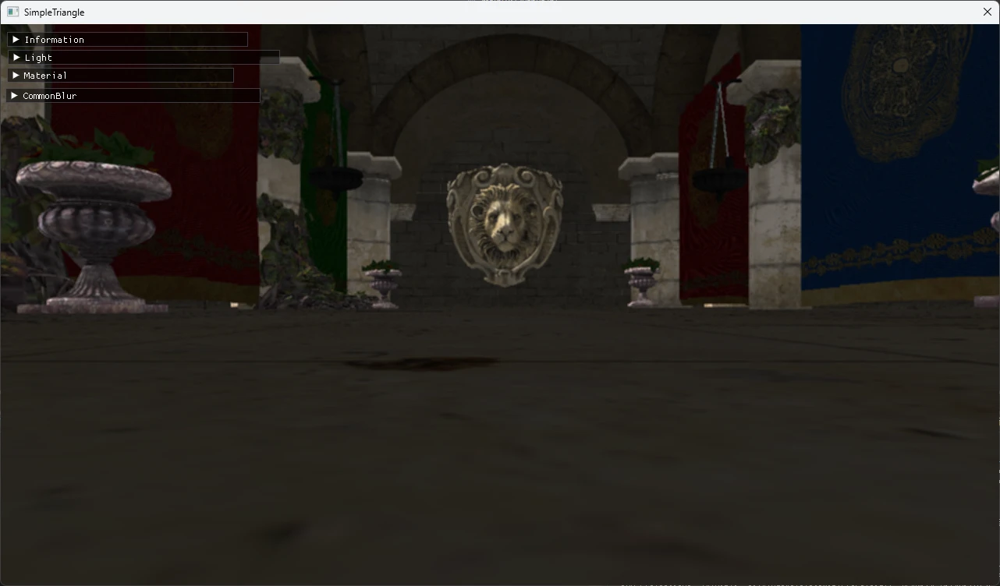

# Mean Filter  

平均値フィルタというやつ.  
フィルタは単純でこんな感じ.  
```math
\begin{bmatrix}
   \frac{1}{N} & \frac{1}{N} & \frac{1}{N} \\
   \frac{1}{N} & \frac{1}{N} & \frac{1}{N} \\
   \frac{1}{N} & \frac{1}{N} & \frac{1}{N}
\end{bmatrix}
``` 
Nはフィルタサイズで、上記なら3x3行列なので、N=9となる.  
もちろんフィルタの処理において掛け算は出せるので、  
```math
\begin{bmatrix}
   1 & 1 & 1 \\
   1 & 1 & 1 \\
   1 & 1 & 1
\end{bmatrix}
``` 
を適用後に、Nで割るという実装でもOK.  
これを実際に実装すればOK.  

```hlsl
// 平均フィルタ(3x3)
for (int i = -1; i <= 1; i++)
{
    for (int j = -1; j <= 1; j++)
    {
        float2 uv = In.UV + texelSize * float2(i, j);
        color += colorTexture.Sample(samp, uv).rgb;
    }
}
color /= 9.0f;
```