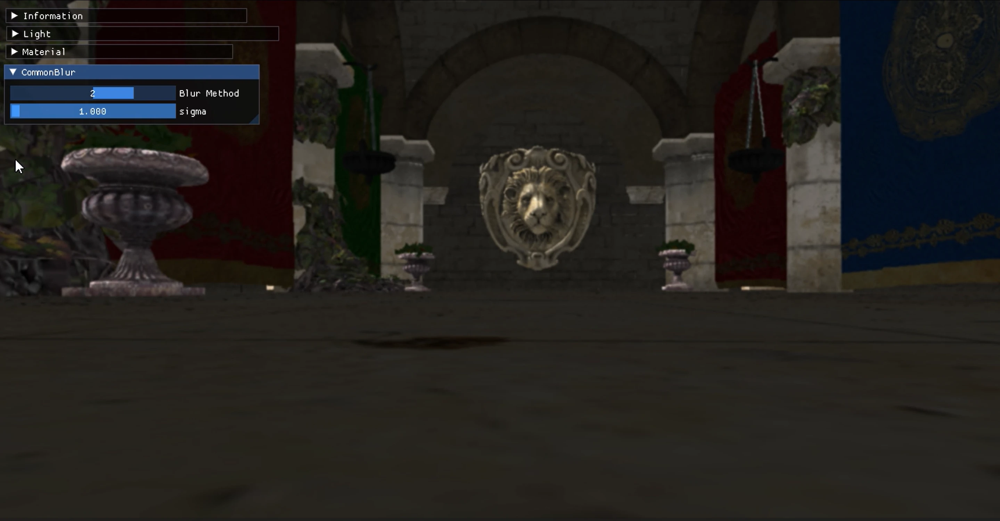

# OnePassGaussianFilter  
  
1Passのガウシアンブラーの実装.  
ガウシアンフィルタとしては愚直にやるのであれば、次の式を実装すればよい.  
```math
\begin{equation}
    \begin{split}
        G(x,y) = \frac{1}{2 \pi \sigma^2} \exp{(-\frac{x^2+y^2}{2 \sigma^2})}
    \end{split}
\end{equation}
``` 
まずはこれを計算するのが大事.  
なので、これを関数として用意してみる.  
```hlsl
float gauss(float x, float y, float sigma)
{
    float exponent = exp(-(x * x + y * y) / (2.0f * sigma * sigma));
    float denom = 2.0 * PI * sigma * sigma;
    return exponent / denom;
}
```
これができればあとはフィルタとして実装をすればOK.  
```hlsl
// ガウシアンブラー
float total = 0.0;
for (int i = -3; i <= 3; i++)
{
    for (int j = -3; j <= 3; j++)
    {
        float2 uv = In.UV + texelSize * float2(i, j);
        float weight = gauss(i, j, sigma); // ガウスを計算
        color += colorTexture.Sample(samp, uv).rgb * weight; // 蓄積

        // 重みも総計を計算しておく
        total += weight;
    }
}

// 最後に重みを割っておく
color *= (1.0f / total);
```