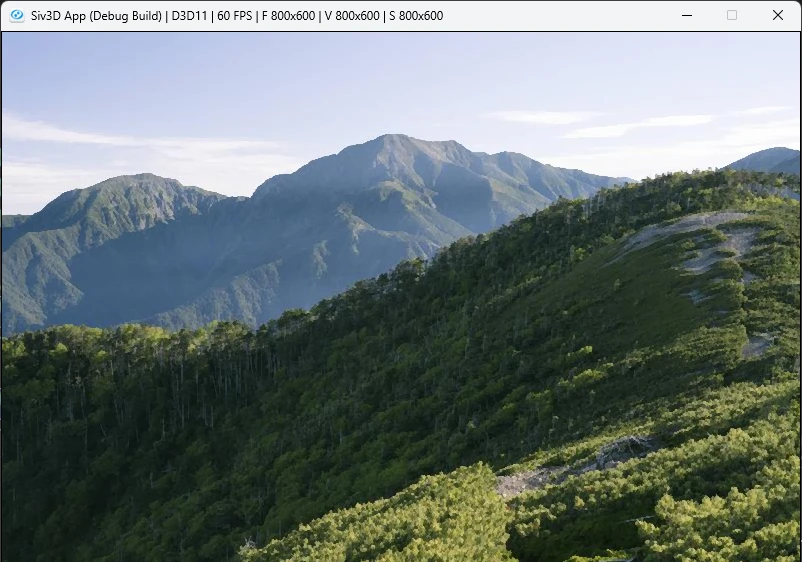

# SNN Filter  
  
Kuwahara Filterなんかと同じように絵画調にするために使われるフィルタ.  
ブループロトコルとかに使われてたやつ.  
対象ピクセルに対して対称になるように2ピクセルを取り出し、比較して近い方を採用するだけ.  
コードで見てみよう.  
```c++
        for (int j = 0; j <= filterSize; j++)
        {
            for (int i = -filterSize; i <= filterSize; i++)
            {
```
まず最初にずらしはiがheight方向で,jがwidth方向.  
今回はwidthの方向が0~filterSizeでフィルタの半分のサイズとなっている.  
これは対称にピクセルを参照するので、同じピクセルの取り方が出てしまう関係で同じ処理をしないための工夫.  
対称に着目して半分に抑えてるともいえるね.  
```c++
ColorF current = image[h][w];
ColorF top = image[h - i][w - j];
ColorF bottom = image[h + i][w + j];
```
そしたら、現在のピクセルと対称のピクセルを参照する.  
移動方向が逆になればいいので、top,bottomのように真逆の符号を取ればOK.  
```c++
// 各部分で色とどれくらい近いかを計算
Vec3 topDiff = (top.rgb() - current.rgb());
float topThreshold = Dot(topDiff, topDiff);

Vec3 bottomDiff = (bottom.rgb() - current.rgb());
float bottomThreshold = Dot(bottomDiff, bottomDiff);
```
そしたら閾値を計算.  
現在のPixelであるcurrentと内積を取って、どちらが近いかを閾値とする.  
```c++
result += topThreshold > bottomThreshold ? bottom.rgb() : top.rgb();
sum += Vec3::One();
```
後は値が小さい方を採用する、内積の値が近いということはつまりcurrentに近い色を採用してるのと同じ.  
最後に平均を取るためにsumによるカウントもしておく.  
```c++
// 重みを相殺しておく
result = result / sum;
```
最後に結果をsumで割れば終わり！  
まとめると以下のようになる.  
```c++
auto filterProcess = [&](int w, int h)
    {
        Vec3 sum = Vec3::Zero();

        Vec3 result = Vec3::Zero();

        for (int j = 0; j <= filterSize; j++)
        {
            for (int i = -filterSize; i <= filterSize; i++)
            {
                ColorF current = image[h][w];
                ColorF top = image[h - i][w - j];
                ColorF bottom = image[h + i][w + j];

                // 各部分で色とどれくらい近いかを計算
                Vec3 topDiff = (top.rgb() - current.rgb());
                float topThreshold = Dot(topDiff, topDiff);

                Vec3 bottomDiff = (bottom.rgb() - current.rgb());
                float bottomThreshold = Dot(bottomDiff, bottomDiff);

                result += topThreshold > bottomThreshold ? bottom.rgb() : top.rgb();
                sum += Vec3::One();
            }
        }

        // 重みを相殺しておく
        result = result / sum;

        resultImage[h][w] = { ColorF(result, 1.0f) };
    };
```