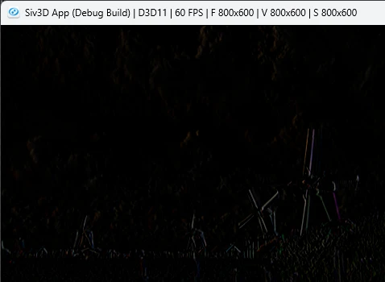

# Sobel Filter  
  
エッジ検出に使うソーベルフィルタ.  
横方向のフィルタはこんな感じ.  
```math
\begin{bmatrix}
   -1 & 0 & 1 \\
   -2 & 0 & 2 \\
   -1 & 0 & 1
\end{bmatrix}
``` 
縦方向のフィルタはこんな感じ.  
```math
\begin{bmatrix}
   1 & 2 & 1 \\
   0 & 0 & 0 \\
   -1 & -2 & -1
\end{bmatrix}
``` 
これは考えとしては単純で、中央のピクセルに対して、縦or横の差がなければ0.  
差があるのであれば何かしら差が出てくることになる.  
この差がエッジ検出の閾値となる.  
あとはこれを丁寧にフィルタの通りに計算するだけ.  
まずは横方向はこんな感じ.  
```c++
sum = static_cast<ColorF>(image[h - 1][w - 1]).rgb() * -1.0;
sum += static_cast<ColorF>(image[h - 1][w + 1]).rgb() * 1.0;
sum += static_cast<ColorF>(image[h][w - 1]).rgb() * -2.0;
sum += static_cast<ColorF>(image[h][w + 1]).rgb() * 2.0;
sum += static_cast<ColorF>(image[h + 1][w - 1]).rgb() * -1.0;
sum += static_cast<ColorF>(image[h + 1][w + 1]).rgb() * 1.0;
```
縦方向はこんな感じでやればよい.  
```c++
sum = static_cast<ColorF>(image[h - 1][w - 1]).rgb() * 1.0;
sum += static_cast<ColorF>(image[h - 1][w]).rgb() * 2.0;
sum += static_cast<ColorF>(image[h - 1][w + 1]).rgb() * 1.0;
sum += static_cast<ColorF>(image[h + 1][w - 1]).rgb() * -1.0;
sum += static_cast<ColorF>(image[h + 1][w]).rgb() * -2.0;
sum += static_cast<ColorF>(image[h + 1][w + 1]).rgb() * -1.0;
```
ちょっと強引な実装なので、フィルタとしてはもう少し凝った方がいいのかも？  