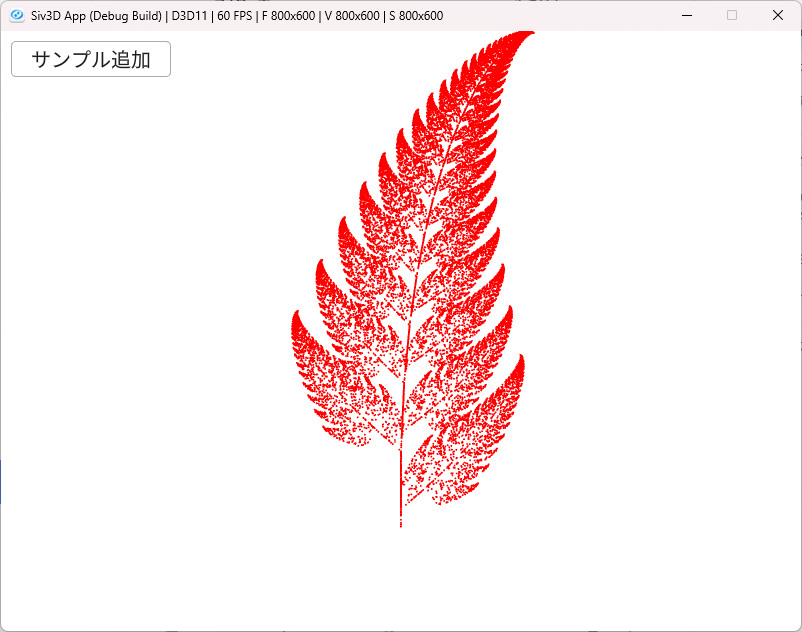

# Bernsley Fern(バーンズリーのシダ)  
今回のフラクタルはシダを描いていく.  
シダは見た目からして自己相似を含んでいるのは分かるが、これを実際に一定の操作のみで描くことが可能.  
数式は例によってWiki[^1]を参照していく.  

計算としては非常に簡単で,以下のようなアフィン変換を座標に施すだけである.  

```math
\begin{equation}
    \begin{split}
         f(x,y) = 
      \begin{bmatrix}
         a & b \\
         c & d
      \end{bmatrix}
      \begin{bmatrix}
         x \\
         y
      \end{bmatrix}
      +
      \begin{bmatrix}
         e \\
         f
      \end{bmatrix}
    \end{split}
\end{equation}
```

という処理、このfを4つに分割して、離散確率分布を利用して参照していく.  
4つのfは`シダの茎`,`連続する小さい葉`,`左側の大きな葉`,`右側の大きな葉`を表している.  

この4つの係数は以下のような感じ. 

シダの茎  
```math
\begin{equation}
    \begin{split}
      f_{1}(x,y) = 
      \begin{bmatrix}
         0 & 0 \\
         0 & 0.16
      \end{bmatrix}
      \begin{bmatrix}
         x \\
         y
      \end{bmatrix}
      +
      \begin{bmatrix}
         0 \\
         0
      \end{bmatrix}
      (p=0.01)
    \end{split}
\end{equation}
```

連続する小さい葉  
```math
\begin{equation}
    \begin{split}
      f_{2}(x,y) = 
      \begin{bmatrix}
         0.85 & 0.04 \\
         -0.04 & 0.85
      \end{bmatrix}
      \begin{bmatrix}
         x \\
         y
      \end{bmatrix}
      +
      \begin{bmatrix}
         0 \\
         1.6
      \end{bmatrix}
      (p=0.85)
    \end{split}
\end{equation}
```


左側の大きな葉  
```math
\begin{equation}
    \begin{split}
         f_{3}(x,y) = 
         \begin{bmatrix}
            0.2 & -0.26 \\
            0.23 & 0.22
         \end{bmatrix}
         \begin{bmatrix}
            x \\
            y
         \end{bmatrix}
         +
         \begin{bmatrix}
            0 \\
            1.6
         \end{bmatrix}
         (p=0.07)
    \end{split}
\end{equation}
```

右側の大きな葉  
```math
\begin{equation}
    \begin{split}
      f_{4}(x,y) = 
      \begin{bmatrix}
         -0.15 & 0.28 \\
         0.26 & 0.24
      \end{bmatrix}
      \begin{bmatrix}
         x \\
         y
      \end{bmatrix}
      +
      \begin{bmatrix}
         0 \\
         0.44
      \end{bmatrix}
      (p=0.07)
    \end{split}
\end{equation}
```

後はこれを実際にコードで書いてあげるだけ！  

今回はTransform関係は以下のように定義.  
2x2の行列はVec4で定義して、TranslationはVec2で表現.  
mat2x2がなかったので,Vec4で代用した感じ.  
3x3にしてもよかったけど、まあこれでもいいかぁという感じな怠惰.   
```c++
struct TransformFern
{
    Vec4 m_matrix;
    Vec2 m_translation;
};
```

次に4つのアフィン係数を定義.そのまま.  
```c++
std::array<TransformFern, 4> Transform;
// シダの茎
Transform[0] = TransformFern{ Vec4{0.0,0.0,0.0,0.16}, Vec2{0.0, 0.0} };
// 連続する小さい葉
Transform[1] = TransformFern{ Vec4{0.85,0.04,-0.04,0.85}, Vec2{0.0, 1.6} };
// 左側の大きな葉
Transform[2] = TransformFern{ Vec4{0.2,-0.26,0.23,0.22}, Vec2{0.0, 1.6} };
// 右側の大きな葉
Transform[3] = TransformFern{ Vec4{-0.15,0.28,0.26,0.24}, Vec2{0.0, 0.44} };
```

確率も定義.重み付き分布関数を作りたいので、`std::discete_distribution<size_t>`を使って表現してみた.  
```c++
Array<double> probabilities{ 0.01,0.85,0.07,0.07 };
std::random_device seed_gen;
std::uint32_t seed = seed_gen();
std::mt19937 engine(seed);
std::discrete_distribution<std::size_t> dist(
    probabilities.begin(),
    probabilities.end()
);
```

ここまでくれば後は処理.  
初期位置は`(x,y)=(0,0)`とする.  
```c++
auto MakeFern = [&](int loop)
{
    pointSet.clear();
    Vec2 point = Vec2::Zero();

    // ...
}
```

処理回数はloopで指定した回数.  
ループ内ではまず最初にindexでどの`f`のアフィン変換を行うかを決定する.  
```c++
    for (int i = 0; i < loop; i++)
    {
        auto index = dist(engine);

        // ...
    }
```

後は行列計算をしてtranslationを足せば終わり.  
```c++
        // 位置を計算
        double tempX =
            point.x * Transform[index].m_matrix.x +
            point.y * Transform[index].m_matrix.y +
            Transform[index].m_translation.x;

        double tempY =
            point.x * Transform[index].m_matrix.z +
            point.y * Transform[index].m_matrix.w +
            Transform[index].m_translation.y;
        point = { tempX,tempY };

        // 追加
        pointSet.push_back(point);
```

結果を見てみよう.  

  

うん、ちゃんとシダっぽいのが形成されている.  
他にも種類があるっぽいので、別のも描画して遊んでみると面白いかもしれない.  

[^1]: [バーンズリーのシダ](https://w.wiki/5Rkd)