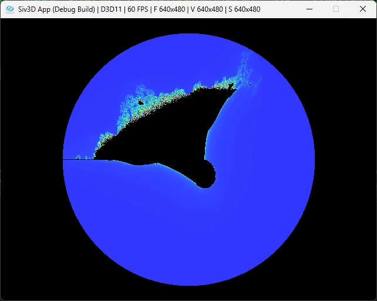
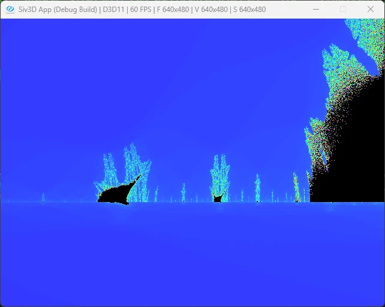

# BurningShip  
今回はマンデルブロ集合をちょっと変えるだけで実装可能なバーニングシップ[^1]を見る.  
バーニングシップは本当に単純で、マンデルブロ集合内で絶対値を取るだけである.  
式としても単純なので、計算してみよう.  
まずはZの定義はxとyに絶対値をつけたもの.  

```math
\begin{equation}
    \begin{split}
    z_{n} = |x_{n}|+i |y_{n}|, c = a + ib
    \end{split}
\end{equation}
```

これを実際に代入してみると以下のようになる

```math
\begin{equation}
    \begin{split}
    |x_{n+1}| + i |y_{n+1}| &= (|x_{n}| + i |y_{n}|)^{2} + (a+ib) \\
    &= x_{n}^2 + 2i |x_{n}y_{n}| - y_{n}^2 + (a+ib) \\
    &= (x_{n}^2 - y_{n}^2 + a) + i (2|x_{n}y_{n}| + b)
    \end{split}
\end{equation}
```

この時、実部と虚部を取ると,  

```math
\begin{equation}
    \begin{split}
        \begin{cases}
            & x_{n+1} = x_{n}^2 - y_{n}^2 + a \\
            & y_{n+1} = 2|x_{n}y_{n}| + b
        \end{cases}
    \end{split}
\end{equation}
```

うん、絶対値を取っただけでマンデルブロ集合とほぼ同じ形だ！  
こうなるとコードも前回のコピペでほぼいける.  

```c++
auto BurningShip = [](double a, double b)
{
    double x = 0.0, y = 0.0;
    for (int32 n = 0; n < 360; ++n)
    {
        // 実部 x(n+1) = x(n)^2 - y(n)^2 + a
        const double t = (x * x - y * y + a);
        // 虚部 y(n+1) = 2*|x(n)*y(n)| + b
        const double u = (2.0 * Abs(x * y) + b); // ここだけAbsにするように変更

        // 発散は |z_m| > 2 で判定可能
        // 発散する場合はその収束の速度を表示する
        if (4.0 < (t * t + u * u))
        {
            return n;
        }

        x = t;
        y = u;
    }

    return 0;
};
```

そしたら結果、確かに船みたいな形状が見える.  

  

これだけだと分かりにくいので、左下あたりを拡大してみよう.  

  

確かにフラクタル形状なので、拡大することで新たな船が見えてくる.  
これがバーニングシップなわけだね.  

[^1]: [バーニングシップ・フラクタル](https://w.wiki/UTuj)  