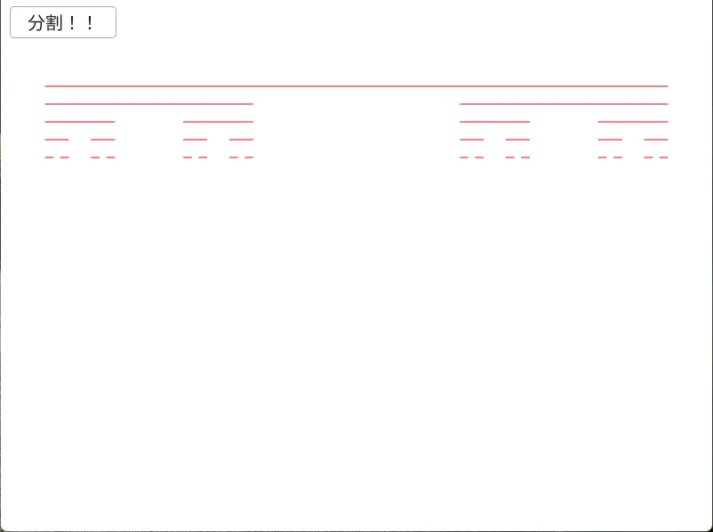

# Contor1D  
  
カントール集合は線分の真ん中を取り除く操作を繰り返せば、それっぽく描画できる.  
まずは線分ではなくてもいけるけど、まずは線分からやっていく.  
最初の条件は点として、始点を0,終点を1として考える.  
```c++
contorSet.push_back({ 0,1 });
```
そしたら以下の手順を再帰的に処理すればよい.  
まず最初に1/3の長さを求める、この辺はコッホ曲線と同じ感じ．  
```c++
double start = current[j], end = current[j + 1];
double nextLength = (end - start) / 3.0;
```
その後、開始位置から1/3の長さ進んだ点を結ぶ線分を作成.  
そして、終点から1/3の長さ戻った点を結ぶ線分も作っておく.  
これで中心が除かれた線分が除かれた状態が完成！！  
```c++
temp.push_back(start); temp.push_back(start + nextLength);
temp.push_back(end - nextLength); temp.push_back(end);
```
これをまとめた処理がこんな感じ.  
```c++
auto MakeCantor = [&](int loop)
{
    contorSet.clear();
    contorSet.push_back({ 0,1 });

    Array<double> current = contorSet[0];

    for (int i = 0; i < loop; i++)
    {
        Array<double> temp;

        // カントールを構築
        for (int j = 0; j + 1 <= current.size() - 1; j += 2)
        {
            double start = current[j], end = current[j + 1];
            double nextLength = (end - start) / 3.0;

            temp.push_back(start); temp.push_back(start + nextLength);
            temp.push_back(end - nextLength); temp.push_back(end);
        }

        contorSet.push_back(temp);
        current = temp;
    }
```
あとはできたデータを線分、つまりLineを生成してあげればOK.  
```c++
for(auto& contorData : contorSet)
{
    for (int i = 0; i + 1 <= contorData.size() - 1; i += 2)
    {
        double start = contorData[i], end = contorData[i + 1];
        Vec2 lineStart = StartPos + Vec2{ start * MaxLine, StartPos.y + offset * YOffset };
        Vec2 lineEnd = StartPos + Vec2{ end * MaxLine, StartPos.y + offset * YOffset };
        Line{ lineStart, lineEnd }.draw(Palette::Red);
    }

    offset++;
}
```