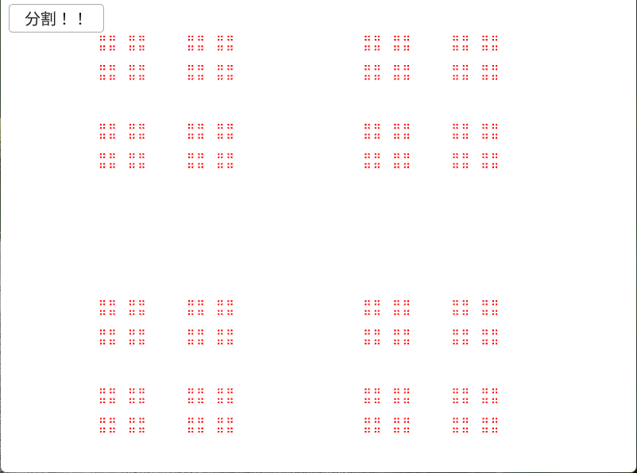

# Contor2D  
  
カントール集合を四角形でも作れる.  
集合の作り方は線分と同じだけど、あとはうまく四角形を出せばOK!  
```c++
auto contorData = contorSet.back();
for (int i = 0; i + 1 <= contorData.size() - 1; i += 2)
{
    double startX = contorData[i], endX = contorData[i + 1];
    double rectSize = (endX - startX) * MaxSize; // sizeは確定なので保持

    for (int j = 0; j + 1 <= contorData.size() - 1; j+=2)
    {
        double startY = contorData[j];

        Vec2 rectStart = StartPos + Vec2{ startX, startY } * MaxSize;
        RectF{ rectStart, rectSize }.draw(Palette::Red);
    }
}
```