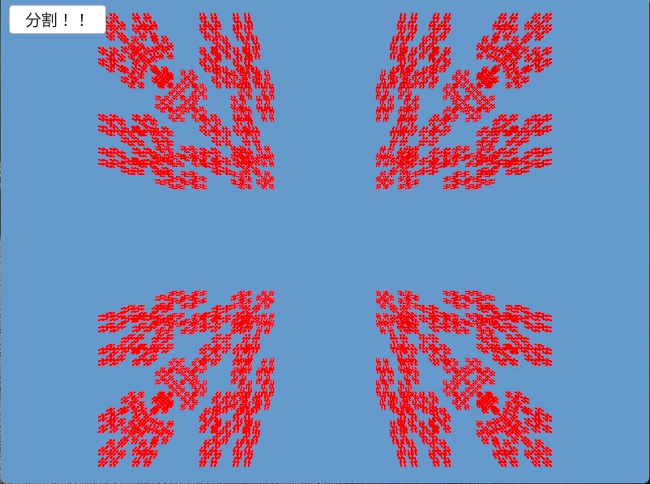

# Contor3D  
  
カントール集合をブロックでも作れる.  
集合の作り方は他と同じで、ブロックの場合もどうやって置いていくかを考えるだけ！  
```c++
auto contorData = contorSet.back();
for (int i = 0; i + 1 <= contorData.size() - 1; i += 2)
{
    // X軸
    double startX = contorData[i], endX = contorData[i + 1];
    double rectSize = (endX - startX) * MaxSize; // sizeは確定なので保持
    
    for (int j = 0; j + 1 <= contorData.size() - 1; j += 2)
    {
        // Y軸
        double startY = contorData[j], endY = contorData[j + 1];

        for (int k = 0; k + 1 <= contorData.size() - 1; k += 2)
        {
            // Z軸
            double startZ = contorData[k], endZ = contorData[k + 1];
            Vec3 boxStart = StartPos + Vec3{startX, startY, startZ} * MaxSize;

            Box::FromPoints(boxStart, boxStart + Vec3::One() * rectSize).draw(Palette::Red);
        }
    }
}
```