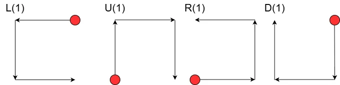
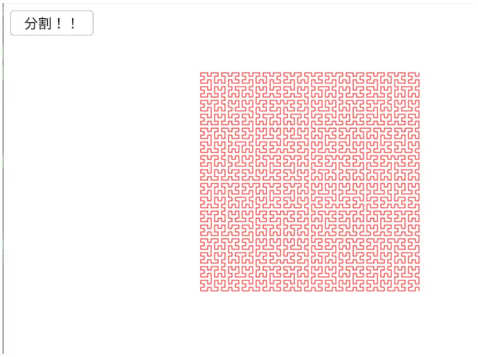

# ヒルベルト曲線  
ヒルベルト曲線[^1]もフラクタル図形の一つで、空間を覆いつくすような「空間充填曲線」という部類になるっぽい.  
同じ手順を繰り返すことで模様が出来ていくわけだが、繰り返しとしてはこの記事[^2]が分かりやすく一定の処理を再帰させることで構築が可能.  

まず最初に方向を選んだら勝手に`Offset`分を現在の位置から伸ばすような関数を用意.  
上下左右に対応しており、この方向に対して線が伸びていくことになる.  
```c++
// 方向に沿ってLineを伸ばすだけ
auto OffsetLine = [&](Direction dir)
{
    Vec2 temp = currentPos;
    switch (dir)
    {
    case Direction::up:
        currentPos.y -= LineOffset; break;

    case Direction::right:
        currentPos.x += LineOffset; break;

    case Direction::down:
        currentPos.y += LineOffset; break;

    case Direction::left:
        currentPos.x -= LineOffset; break;
    }

    lineList.push_back(Line{ temp, currentPos });
};
```
感覚としてはタートルグラフィックス[^3]に近い感じだね.  
`dir`で命令を投げると、移動を行いその際の軌跡を`lineList`に蓄積するわけだ.  

さて、ここまで考えれば後は命令を投げるだけ.  
ヒルベルト曲線は以下の規則に基づいて処理を行う.  

```math
\begin{equation}
    \begin{split}
    & L_{n} \to D_{n-1} \quad Left \quad L_{n-1} \quad Down \quad L_{n-1} \quad Right \quad U_{n-1} \\ 
    & U_{n} \to R_{n-1} \quad Up \quad U_{n-1} \quad Right \quad U_{n-1} \quad Down \quad L_{n-1} \\
    & R_{n} \to U_{n-1} \quad Right \quad R_{n-1} \quad Up \quad R_{n-1} \quad Left \quad D_{n-1} \\
    & D_{n} \to L_{n-1} \quad Down \quad D_{n-1} \quad Left \quad D_{n-1} \quad Up \quad R_{n-1}
    \end{split}
\end{equation}
```

なるほど、なんかよくわからないけど上手く再帰してるっぽい.  
これは$`n=1`$の場合を考えるともう少しわかりやすくなるかもしれない.  
基本的に$`n=0`$に到達した場合は何もしないということになる.  
そのため$`n=1`$のときは次のようになる.  

```math
\begin{equation}
    \begin{split}
        & L_{1} \to Left \quad Down \quad Right \\ 
        & U_{1} \to Up \quad Right \quad Down \\
        & R_{1} \to Right \quad Up \quad Left \\
        & D_{1} \to Down \quad Left \quad Up
    \end{split}
\end{equation}
```

これが基本格子というわけになるということだ.  
形としてはそれぞれ次のような感じかな？  

    

このようないろんな角度のコの字を再帰させることで模様を作っているわけだ.  
これを実際に$`n=6`$まで再帰させてみた結果は次のようになる.  

  

うん、いい感じに模様が作れている！  

[^1]: [ヒルベルト曲線](https://w.wiki/CH8f)  
[^2]: [NGraphicsを使ってヒルベルト曲線を描く](https://qiita.com/gushwell/items/d9bd5958e94ff0e38b78)  
[^3]: [Turtle Graphics](https://w.wiki/86ZN)  