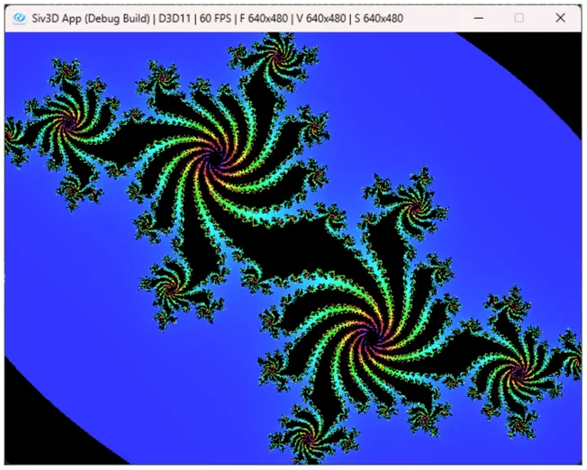

# ジュリア集合  
マンデルブロ集合に似たようなものとして、ジュリア集合[^1]というものがある.  
まずマンデルブロ集合の際の式を復習すると以下の形だった.  

```math
\begin{equation}
    \begin{split}
    \begin{cases}
        & z_{n+1} = z_{n}^{2} + c \\
        & z_{0}= 0
    \end{cases}
    \end{split}
\end{equation}
```

細かいことを抜きにして描画することのみを考えるなら、この時の$`c`$が定数となる場合がジュリア集合くらいの感覚で良い.  

これをコードで見ると以下のような感じ.  
```c++
auto Julia = [](double x, double y)
{
    // Julia集合の場合はCが固定
    constexpr double A = -0.3, B = -0.63;

    double a = x, b = y;
    for (int32 n = 0; n < 360; ++n)
    {
        // 実部 x(n+1) = x(n)^2 - y(n)^2 + a
        const double t = (a * a - b * b + A);
        // 虚部 y(n+1) = 2*x(n)*y(n) + b
        const double u = (2.0 * a * b + B);

        // 発散は |z_m| > 2 で判定可能
        // 発散する場合はその収束の速度を表示する
        if (4.0 < (t * t + u * u))
        {
            return n;
        }

        a = t;
        b = u;
    }

    return 0;
};
```

定数なので$`A=-0.3,B=-0.63`$で初期化されている.  
これを使いまわしていくのみである.因みに定数はここ[^2]のサイトを参考にした.    
こうして描画されるものは以下のような形となる.  



うん、いい感じのフラクタルが生成されてる！  

[^1]: [ジュリア集合](https://w.wiki/UK3f)  
[^2]: [ジュリア集合（Julia set）](https://mt-soft.sakura.ne.jp/kyozai/excel_vba/320_vba_high/11_julia/main.html)  