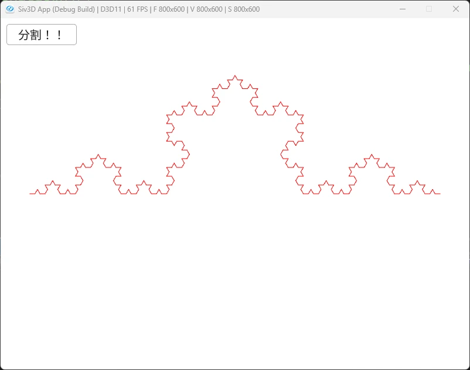

# KochCurve  
  
コッホ曲線は線分を三等分しつつ、正三角形を作る処理をしていくだけの処理.  
細かいことを除けばこれを繰り返すコードを書けばよさそう.  
今回はfor文でそれっぽく書いていくようにする.  
まずは現状の線分の長さを取り出して、三等分するために1/3の長さを求める.  
```c++
Vec2 start = current[j].first, end = current[j].second;
double nextLength = start.distanceFrom(end) / 3.0; // コッホ曲線の1辺の長さ
```
今回は直線の最初の位置と終わりの位置が分かる.  
ということは単位ベクトルは差を取れば求まるので、そのベクトルを60度回転してあげる.  
これで正三角形を作る際の点が求まる.  
```c++
// 新しい点を得るのに必要なベクトルを生成
Vec2 straightLineVec = (end - start).normalized();
Vec2 pointVec = straightLineVec.rotated(ToRadians(-60.0)); // 60度回転したベクトル生成
```
あとは頂点となる点を計算.  
これは1/3進んだ後に、60度回転したベクトルを1/3の長さで進めるだけ.  
```c++
// 点を生成
Vec2 topPoint = straightLineVec * nextLength + pointVec * nextLength;
```
最後に点を追加すれば終了.  
直線の場合は2点だけど、1回分割を行うと5点になることに着目して線分を登録すればOK.  
```c++
temp.push_back({ start, start + straightLineVec * nextLength });
temp.push_back({ start + straightLineVec * nextLength, start + topPoint });
temp.push_back({ start + topPoint,  start + straightLineVec * nextLength * 2.0 });
temp.push_back({ start + straightLineVec * nextLength * 2.0, end });
```
これをまとめると以下のような感じ.  
```c++
// コッホを構築
for (int j = 0; j < current.size(); j++)
{
    Vec2 start = current[j].first, end = current[j].second;
    double nextLength = start.distanceFrom(end) / 3.0; // コッホ曲線の1辺の長さ

    // 新しい点を得るのに必要なベクトルを生成
    Vec2 straightLineVec = (end - start).normalized();
    Vec2 pointVec = straightLineVec.rotated(ToRadians(-60.0)); // 60度回転したベクトル生成

    // 点を生成
    Vec2 topPoint = straightLineVec * nextLength + pointVec * nextLength;


    temp.push_back({ start, start + straightLineVec * nextLength });
    temp.push_back({ start + straightLineVec * nextLength, start + topPoint });
    temp.push_back({ start + topPoint,  start + straightLineVec * nextLength * 2.0 });
    temp.push_back({ start + straightLineVec * nextLength * 2.0, end });
}
```