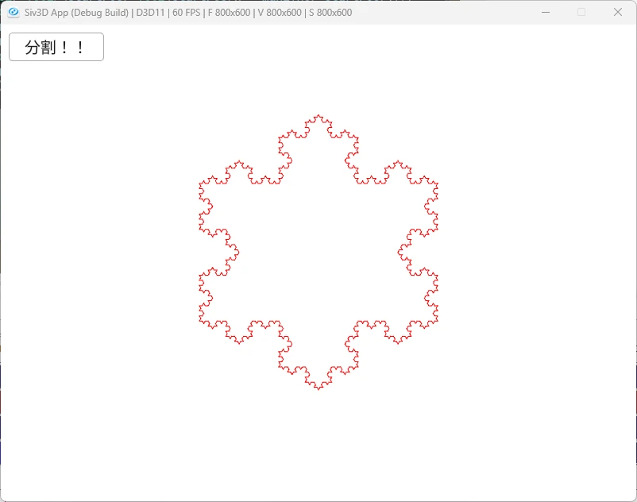

# KochSnowfrake  
  
やることはほぼコッホ曲線と同じ.変わるのは初期条件.  
コッホ曲線の場合は以下のような感じの条件.  
```c++
// 初期条件
kochSet.push_back({ std::pair<Vec2, Vec2>(StartPos, Vec2{StartPos.x + MaxLine, StartPos.y}) })
```
コッホ雪片の場合は線分を3つ用意するだけ,これだけで終わり!  
```c++
kochSet.push_back(
    {
        std::pair<Vec2, Vec2>(StartPos, Vec2{StartPos.x + MaxLine, StartPos.y}),
        std::pair<Vec2, Vec2>(
            Vec2{StartPos.x + MaxLine, StartPos.y},
            Vec2{StartPos.x + MaxLine / 2.0, StartPos.y + MaxLine / 2.0 * Sqrt(3)}),
        std::pair<Vec2, Vec2>(
            Vec2{StartPos.x + MaxLine / 2.0, StartPos.y + MaxLine / 2.0 * Sqrt(3)},
            StartPos),
    });
```