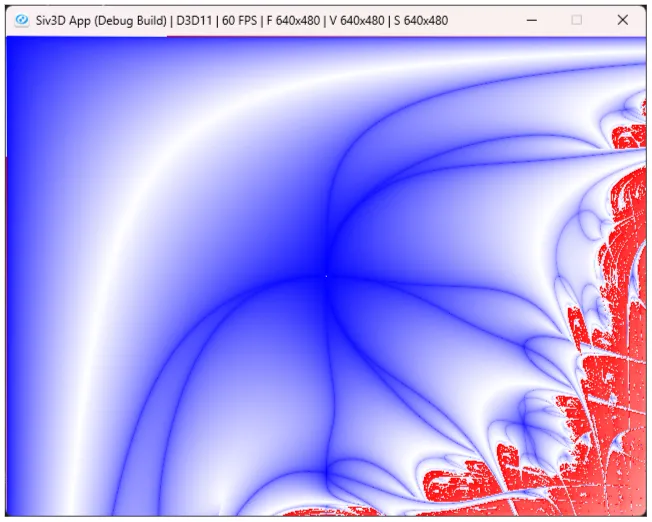

# リアプノフ・フラクタル  
ロジスティック写像を拡張したフラクタルにリアプノフ・フラクタル[^1]というものがある.  
一定の手順でこれは描画ができるので、今回はこれを見ていこう.  

まず最初に適当な長さのABからなる文字列を生成する.  
$`A=1`$,$`B=0`$として考えると、Wikiの$`AABAB`$に合わせてあげると以下のようになる.  
```c++
	// AABAB
	constexpr std::array<int, 5> sequence {1, 1, 0, 1, 0};
	constexpr int MaxIter = 5;
```

この文字列をN回繰り返した文字列を生成すればOK.  
今回は試しに200個の$`AABAB`$を並べるようなコード例を以下に書いてみた.  
```c++
const int loop = 200;
for (int32 n = 0; n < loop; ++n)
{
    for (int i = 0; i < MaxIter; i++)
    {
        // 200回の周期で生成
        auto s = sequence[i];
    }
}
```
今回は定数$`a,b`$を$`(a,b) \in [0,4] \times [0,4]`$となるように選ぶ.  
これをピクセル単位で選択するので、以下のように生成すればよい.  
生成した後は`lyapunov`という関数に渡して、計算をしていくことになる.  
```c++

			for (int i = 0; i < resolution.x; i++)
			{
				double a = Clamp(static_cast<double>(i) / resolution.x * 4.0, 0.0, 4.0);
				for (int j = 0; j < resolution.y; j++)
				{
					double b = Clamp(static_cast<double>(j) / resolution.y * 4.0, 0.0, 4.0);

					// 計算
                    auto lm = lyapunov(a, b);
                    
                    // ...
                }
            }
```

`lyapunov`内を見ていこう.  
初期値は$`x_{0}=0.5`$とする.  
結果は和を取っていったものなので、`result`として用意しておく.  
```c++
const int loop = 200;
double x0 = 0.5;
double result = 0.0;
```

周期を最初に述べたように取っていくが、$`A`$なら$`a`$を選択,$`B`$なら$`b`$を選択とする.  
この結果を$`r_{n}`$として保存しておこう.  
```c++
for (int32 n = 0; n < loop; ++n)
{
    for (int i = 0; i < MaxIter; i++)
    {
        // rnをAABABの周期で選択
        double rn = sequence[i] == 1 ? a : b;
        // ...
    }
}
```
そしたら$`x_{n+1}=r_{n}x_{n}(1-x_{n})`$を計算してあげればよい.  
```c++
        // 計算
        double xn = rn * x0 * (1.0 - x0);
```

後は$`\lambda`$を計算していくことになるが、これは以下のように定義される.  

```math
\begin{equation}
    \begin{split}
    \lambda = \lim_{N \to \infty} \frac{1}{N} \sum^{N}_{n=1} \log{|r_{n}(1-2x_{n})|}
    \end{split}
\end{equation}
```

という風に足し合わせてあげればよい.  
```c++
        double rr = Log(Abs(rn * (1.0 - 2.0 * xn)));
        result += IsInfinity(rr) ? 0.0 : rr;

        x0 = xn;
```
最後にちゃんと$`N`$分を割るのを忘れずに.  
```c++
return result / static_cast<double>(loop * MaxIter);
```

リアプノフは$`\lambda`$の値で色を塗り分ける.  
$`\lambda < 0`$なら安定、$`\lambda > 0`$ならカオスなので、これを基準に塗ればよい.  

```c++
// 計算
auto lm = lyapunov(a, b);

// 色付け
if (lm > 0)
{
    double value = Clamp(lm, 0.0, 1.0);
    image[j][i] = ColorF(1.0, value, value);
}
else
{
    double value = Clamp(Exp(lm), 0.0, 1.0);
    image[j][i] = ColorF(value, value, 1.0);
}
```

こうして得られた結果は以下のようになる.  

  

うん、いい感じに描画できた.  
一応条件はWikiのものに揃えたけど、見た目が若干違うので、どこか間違ってるかもしれない.  
文字列は今回$`AABAB`$としたが、別段他の文字でも行けるので色々試すと面白いかもしれない.  

[^1]: [リアプノフ・フラクタル](https://w.wiki/UQNe)  