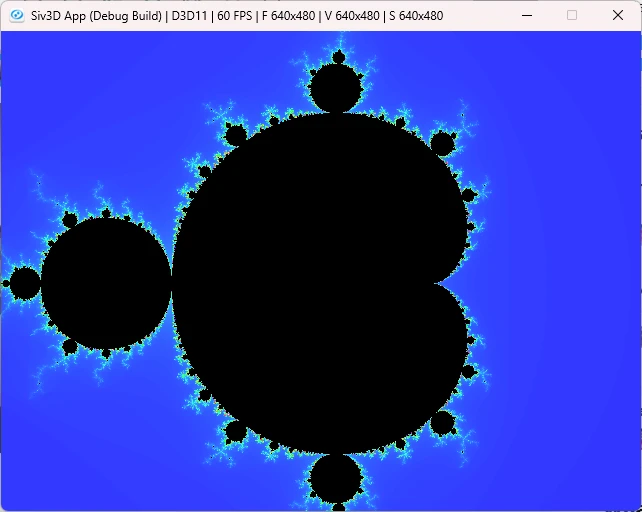

# Mandelbrot  
今回はフラクタルの中でも有名なマンデルブロ集合をやっていく.  
これはSiv3Dのサンプル[^1]にもあるため、こちらを参考にすれば簡単に組める. ~なんならコピーだけで行ける~  
なので、これを参考にしつつ実際に描画してみよう.  

まずマンデルブロ集合は以下の漸化式で描かれる.  
```math
\begin{equation}
    \begin{split}
        \begin{cases}
        & z_{n+1} = z_{n}^{2} + c \\
        & z_{0}= 0
        \end{cases}
    \end{split}
\end{equation}
```

この漸化式が収束しないときを黒で描画し、収束するときを収束速度で塗り分けるのが一般的なはず.  
黒で塗られ場部分がフラクタルの形になるわけである.面白いね.  
ただ、このままだと複素数なため、可視化が難しい...  
そこで実際には実数に落とし込んで計算を行う.  
実数への持って行く方法は非常にシンプル.  
まず以下のように複素数を定義する.  

```math
\begin{equation}
    \begin{split}
    z_{n} = x_{n}+i y_{n}, c = a + ib
    \end{split}
\end{equation}
```

これを実際に代入してみると以下のようになる

```math
\begin{equation}
    \begin{split}
    x_{n+1} + i y_{n+1} &= (x_{n} + i y_{n})^{2} + (a+ib) \\
    &= x_{n}^2 + 2i x_{n}y_{n} - y_{n}^2 + (a+ib) \\
    &= (x_{n}^2 - y_{n}^2 + a) + i (2x_{n}y_{n} + b)
    \end{split}
\end{equation}
```

この時、実部と虚部を取ると,  

```math
\begin{equation}
    \begin{split}
        \begin{cases}
            & x_{n+1} = x_{n}^2 - y_{n}^2 + a \\
            & y_{n+1} = 2x_{n}y_{n} + b
        \end{cases}
    \end{split}
\end{equation}
```

という風に綺麗にまとまる.  

さて、式が分かったなら計算すればいいだけなんだけど、もう一つ問題がある.  
そもそも収束するのはどういう時なのかということである.  
これは

```math
\begin{equation}
    \begin{split}
        |z_{m}| > 2を満たすmが存在する場合,\lim_{n \to \infty} z_{n}は発散する
    \end{split}
\end{equation}
```

と言える.  
証明は省略するが、ここ[^2]に書いてあるのが分かりやすいと思う.  

さて、ここまで分かれば実装をするのみ！  
まず最初にx-y軸は式内の`a,b`に対応するとする.  
そして最初のx,yは0から開始する.  
$`z(0)=0`$なので、こうしている感じ.  

```c++
auto Mandelbrot = [](double a, double b)
{
    double x = 0.0, y = 0.0;

    // ...
}

そしたら実部と虚部を計算して、発散判定.  
発散する場合は収束するまでの速度を描くために`n`を返すようにする.  
もし360回以内に発散しない場合は、強制的に収束するものとする.  
```c++
    for (int32 n = 0; n < 360; ++n)
    {
        // 実部 x(n+1) = x(n)^2 - y(n)^2 + a
        const double t = (x * x - y * y + a);
        // 虚部 y(n+1) = 2*x(n)*y(n) + b
        const double u = (2.0 * x * y + b);

        // 発散は |z_m| > 2 で判定可能
        // 発散する場合はその収束の速度を表示する
        if (4.0 < (t * t + u * u))
        {
            return n;
        }

        x = t;
        y = u;
    }

    return 0;
};
```

最後に実際に描画する場所を書く.  
各Pixelに対してマンデルブロを計算する.  
この値が0なら収束してるので、そこを黒にしてしまう.  
0以外なら発散してるので、HSVに色を当てはめて収束速度を描画する.  
```c++
for (auto y : step(resolutuion.y))
{
    const double yPos = yb + (d * y);

    for (auto x : step(resolutuion.x))
    {
        const double xPos = xb + (d * x);

        // 単純にPixel毎に判定するだけ
        if (const int32 m = Mandelbrot(xPos, yPos))
        {
            image[y][x] = HSV{ (240 - m), 0.8, 1.0 };
        }
        else
        {
            image[y][x] = Palette::Black;
        }
    }
}
```

これで結果を見てみると以下のようになる.  



うん、いい感じ.見たかった図形がちゃんと描画されている.  
これを起点に他にも図形が描けるので、今度はそれをやってみる予定でいる.  

[^1]: [Siv3D マンデルブロ集合](https://siv3d.github.io/ja-jp/samples/image/#9-%E3%83%9E%E3%83%B3%E3%83%87%E3%83%AB%E3%83%96%E3%83%AD%E9%9B%86%E5%90%88)  
[^2]: [マンデルブロ集合とは](https://azisava.sakura.ne.jp/mandelbrot/definition.html)  
