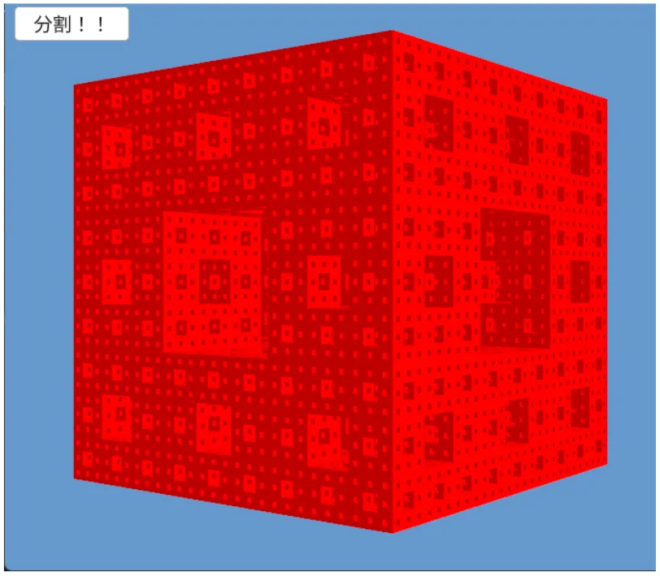

# メンガーのスポンジ  
シェルピンスキーのカーペットを3次元に拡張したものがメンガーのスポンジ[^1].  
これもカントール集合みたいな感じの実装で描画が可能なので、実際に見てみよう！  

まず最初にデータの用意.  
データに関しては`mengerSet`に入れることになる.  
入れるデータは各立方体の中心位置で,この後分解を行うがとりあえず現状は1つだけなので$`(0,0,0)`$のみを入れておく.  
立方体の大きさは一辺4として定義、後程段々小さくなっていく.  
```c++
auto MakeMenger = [&](int loop)
{
    mengerSet.clear();
    mengerSet.push_back({ Vec3::Zero()});

    length = 4.0;

    // ...
```

各iterationでは立方体を分割していくことになる.  
この分割において、立方体のサイズは$`\frac{1}{3}`$となるため、lengthを3で割っておく.  
カントールと似たような対応だ.  
```c++
    Array<Vec3> current = mengerSet[0];

    for (int i = 0; i < loop; i++)
    {
        Array<Vec3> temp;

        length = length / 3.0;

        // ...
```

各立方体の分割では、まず最初に中心位置を保持しておく.  
```c++
        for (int j = 0; j < current.size(); j++)
        {
            Vec3 start = current[j];
```

その後、X,Y,Zの各方向を3分割にする.  
これによって$`3*3*3=27`$という風に27個の立方体に分割されることとなる.  
```c++
            // 計27個のブロックを保持する
            for (int l = 0; l < 3; l++)
            {
                for (int m = 0; m < 3; m++)
                {
                    for (int n = 0; n < 3; n++)
                    {
                        // ...
```

ここが重要で27個に分けた立方体のうち、分ける前の立方体の面の各中心と立方体自身の中心を取り除く.  
立方体自身の中心はもちろん1つ.  
立方体の面の中心は、立方体の面が6面なので、6個取り除くことになる.  
つまり、$`1+6=7`$の計7個を取り除けばよい.  

この7個の取り除き方は簡単で、各ループの中心となるindex=1のものを選べばよい.  
この時、$`l=1,m=1の面 \to 3つ`$,$`l=1,n=1の面 \to 3つ`$,$`m=1,n=1の面 \to 3つ`$で9個取り除いてることになる.  
しかし$`l=1,m=1,n=1`$という中心の時が全ての条件において被るので、$`9-2=7`$でちゃんとこの条件で取り除くことが可能となっている.  
```C++
                        // 中心は無視
                        if (
                            l == 1 && m == 1 ||
                            l == 1 && n == 1 ||
                            m == 1 && n == 1
                        )
                        {
                            continue;
                        }

                        // ...
```

後はlengthを考慮して位置をずらしてあげれば良い.  
```c++
                        // 次のサイズ位置を保存
                        temp.push_back(start + (Vec3{ l, m, n } - Vec3::One()) * length);
                    }
                }
            }
        }

        mengerSet.push_back(temp);
        current = temp;
    }
};
```

これを再帰させていけばちゃんと描画が可能となる.  
結果は以下のような感じ.  

  

うん、立方体が再帰した感じでくりぬかれた形状になっている！  
ちょっと画像の圧縮と色味で分かりづらいので、実際に実行してみた方が分かりやすいかもしれない.  

[^1]: [メンガーのスポンジ](https://w.wiki/UWVo)