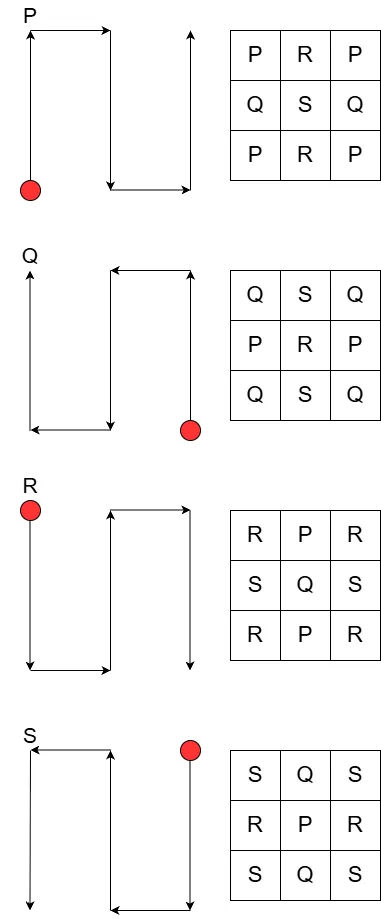
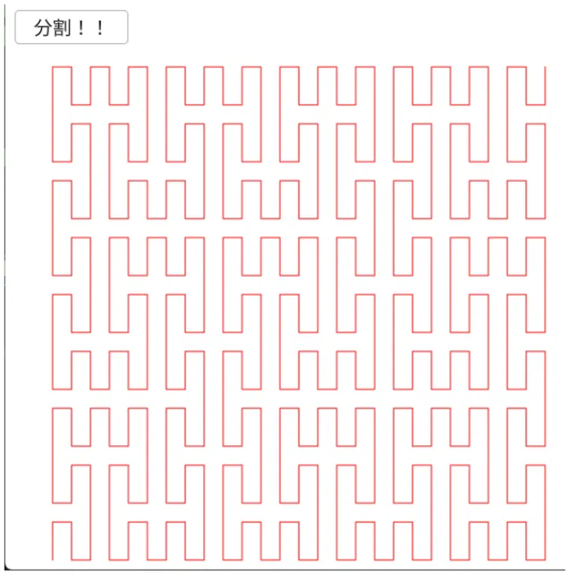

# ペアノ曲線  
ヒルベルト曲線と似たような手順で作るフラクタル,ペアノ曲線をやっていく[^1].  
どうも空間充填曲線の発見としてはこれが一番速いっぽい.  

手順に関しては図を描いてみた、これが一番の参考になる.  



まず一番基本となる動きは$`P,Q,R,S`$の形である.  
これは縦が横よりも大きく動くような計上なので、今回はY軸移動は2倍動くようにした.  
```c++
auto dr = [&](Array<Direction> dirList)
{
    // 必要な線を構築
    for (auto& dir : dirList)
    {
        Vec2 temp = currentPos;
        switch (dir)
        {
        case Direction::up:
            currentPos.y -= LineOffset * 2.0; break;

        case Direction::right:
            currentPos.x += LineOffset; break;

        case Direction::down:
            currentPos.y += LineOffset * 2.0; break;

        case Direction::left:
            currentPos.x -= LineOffset; break;
        }

        lineList.push_back(Line{ temp, currentPos });
    }
};
```

そして、一番根本の形はそのまま定義してあげればよい.  
例えばPであれば、上、右、下、右、上という動きになるため、そのまま組めば良い.  
```c++
auto PRoot = [&]() {dr({ Direction::up, Direction::right, Direction::down, Direction::right, Direction::up }); };
auto QRoot = [&]() {dr({ Direction::up, Direction::left, Direction::down, Direction::left, Direction::up }); };
auto RRoot = [&]() {dr({ Direction::down, Direction::right, Direction::up, Direction::right, Direction::down }); };
auto SRoot = [&]() {dr({ Direction::down, Direction::left, Direction::up, Direction::left, Direction::down }); };
```

そしたら次に再帰.  
再帰に関しては$`n=0`$の時はRootを描くとして、それ以外の場合は9この矩形をなぞるように移動をする.  
例えばPであれば、上、右、下、右、上という動きであった.  
これを矩形でなぞっていくと、$`PQP \quad RSR \quad PQP`$というような感じになる.  
あとはこれをそのままプログラムに落とし込めばよい.  
```c++
P = [&](int n)
{
    if (n <= 0) { PRoot(); return; }
    P(n - 1); OffsetLine(Direction::up);
    Q(n - 1); OffsetLine(Direction::up);
    P(n - 1); OffsetLine(Direction::right);
    R(n - 1); OffsetLine(Direction::down);
    S(n - 1); OffsetLine(Direction::down);
    R(n - 1); OffsetLine(Direction::right);
    P(n - 1); OffsetLine(Direction::up);
    Q(n - 1); OffsetLine(Direction::up);
    P(n - 1);
};
```

$`Q,R,S`$も同様に描く.  
```c++
Q = [&](int n)
{
    if (n <= 0) { QRoot(); return; }
    Q(n - 1); OffsetLine(Direction::up);
    P(n - 1); OffsetLine(Direction::up);
    Q(n - 1); OffsetLine(Direction::left);
    S(n - 1); OffsetLine(Direction::down);
    R(n - 1); OffsetLine(Direction::down);
    S(n - 1); OffsetLine(Direction::left);
    Q(n - 1); OffsetLine(Direction::up);
    P(n - 1); OffsetLine(Direction::up);
    Q(n - 1);
};

R = [&](int n)
{
    if (n <= 0) { RRoot(); return; }
    R(n - 1); OffsetLine(Direction::down);
    S(n - 1); OffsetLine(Direction::down);
    R(n - 1); OffsetLine(Direction::right);
    P(n - 1); OffsetLine(Direction::up);
    Q(n - 1); OffsetLine(Direction::up);
    P(n - 1); OffsetLine(Direction::right);
    R(n - 1); OffsetLine(Direction::down);
    S(n - 1); OffsetLine(Direction::down);
    R(n - 1);
};

S = [&](int n)
{
    if (n <= 0) { SRoot(); return; }
    S(n - 1); OffsetLine(Direction::down);
    R(n - 1); OffsetLine(Direction::down);
    S(n - 1); OffsetLine(Direction::left);
    Q(n - 1); OffsetLine(Direction::up);
    P(n - 1); OffsetLine(Direction::up);
    Q(n - 1); OffsetLine(Direction::left);
    S(n - 1); OffsetLine(Direction::down);
    R(n - 1); OffsetLine(Direction::down);
    S(n - 1);
};
```

これでペアノ曲線もできた、結果を見てみよう.  



うん、いい感じに模様が生成できている！  

[^1]: [ペアノ曲線](https://w.wiki/ULud)  
[^2]: [ペアノ曲線](https://tomari.org/main/java/kyokusen/peano_curve.html)  