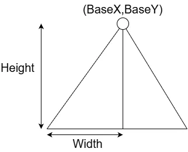
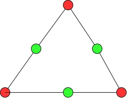
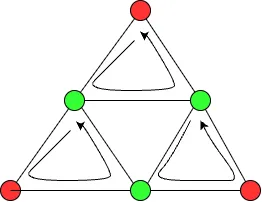
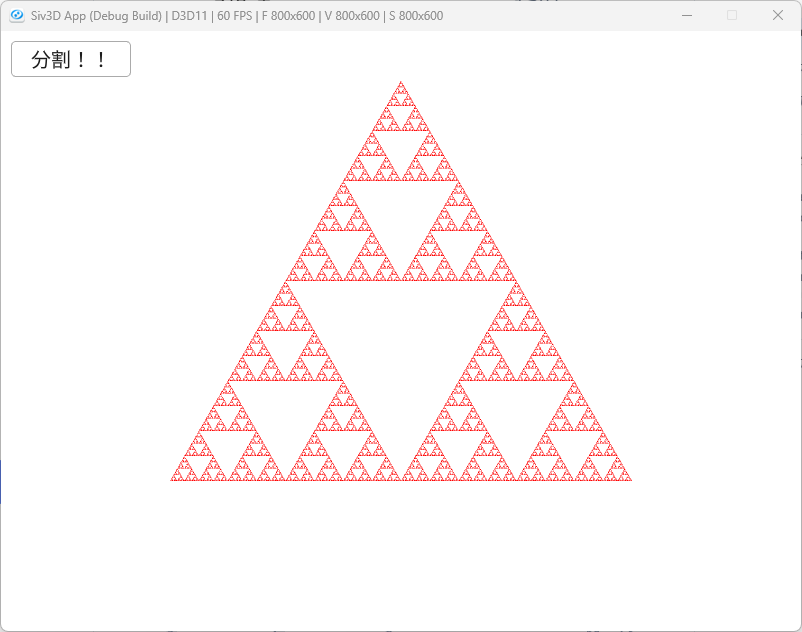

# Sierpinski Gasket  
今回描画するのはシェルピンスキーのギャスケット、よくある再帰の三角形をやっていく.  
今回もWiki[^1]が非常に分かりやすいかとは思う.  

作り方としては色々あるが、今回は三角形の中で中身をくり抜いていく方式でやっていこうと思う.  
ということでまず最初に三角形を作る.  
  
今回は基点となる点は`BaseX`,`BaseY`となり、三角形の高さのみ`Height`で与える.  
三角形の幅`Width`に関しては計算によって求める.  
今回は各三角形に対して、正三角形であるという条件を付ける.  
そのため、高さに関しては`Height`で分かっているため、比率を使えば以下のように計算可能.  

```math
\begin{equation}
    \begin{split}
        & width : height = 1 : \sqrt{3} \\
        & \frac{width}{height} = \frac{1}{\sqrt{3}} \\
        & width = \frac{height}{\sqrt{3}}
    \end{split}
\end{equation}
```

後は下の2点を決めるのは簡単、Yは単純に`Height`を足し合わせるだけ.  
Xは起点の`BaseX`に対して`Width`を足し引きすればよい.これで大元の三角形は完成する.  
```c++
auto MakeSierpinski = [&](int loop)
{
    gasketSet.clear();

    TriangleVertices start;
    const double BaseX = Scene::DefaultSceneSize.x / 2.0;
    const double Width = TriangleHeight / Sqrt(3.0);
    start.vertices[0] = Vec2{ BaseX, BaseY };
    start.vertices[1] = Vec2{ BaseX + Width, BaseY + TriangleHeight };
    start.vertices[2] = Vec2{ BaseX - Width, BaseY + TriangleHeight };

    gasketSet.push_back({ start });

    // ...
};
```

そしたら実際の分割.  
これは`loop`で分割回数を決めておき、後は同じ手順を繰り返すことで再帰して分割を行う.  
データはtempに蓄積をしていく.  
```c++
auto current = gasketSet[0];

for (int i = 0; i < loop; i++)
{
    Array<TriangleVertices> temp;

    // ...
}
```

gasketの構築は三角形の分だけ行う必要があるため、各三角形に同様の処理を施すようにする.  
```c++
    // gasketを構築
    for (int j = 0; j < current.size(); j++)
    {
        // ...
    }
```

まず最初にやるのは中点の導出.  
  
緑色の頂点の部分を生成していく.  
やることは簡単で各Edgeの2点の平均を取れば中点になる.  
```c++
    // gasketを構築
    for (int j = 0; j < current.size(); j++)
    {
        auto vertexData = current[j];

        // 頂点構築
        Vec2 edge0Start = vertexData.vertices[0], edge0End = vertexData.vertices[1];
        Vec2 edge1Start = vertexData.vertices[1], edge1End = vertexData.vertices[2];
        Vec2 edge2Start = vertexData.vertices[2], edge2End = vertexData.vertices[0];

        // 中点を求める
        Vec2 medium0Point = (edge0Start + edge0End) / 2.0;
        Vec2 medium1Point = (edge1Start + edge1End) / 2.0;
        Vec2 medium2Point = (edge2Start + edge2End) / 2.0;

        // ...
    }
```

最後に3つの三角形に分割するだけ.  
三角形の頂点の追加は簡単で、以下の図のような感じで反時計回りに頂点を設定するだけ.  
  
追加順序は中央上の頂点、左下頂点、右下頂点の順に各三角形の頂点を設定するだけ.  
どの三角形の粒度でもこの処理は変わらないため、そのまま突っ込んであげればよい.  
突っ込んだ後は登録してあげれば終わり.  
```c++
        // Triangleを構築
        TriangleVertices divide0Triangle, divide1Triangle, divide2Triangle;
        divide0Triangle.vertices[0] = edge0Start;
        divide0Triangle.vertices[1] = medium0Point;
        divide0Triangle.vertices[2] = medium2Point;

        divide1Triangle.vertices[0] = medium0Point;
        divide1Triangle.vertices[1] = edge1Start;
        divide1Triangle.vertices[2] = medium1Point;

        divide2Triangle.vertices[0] = medium2Point;
        divide2Triangle.vertices[1] = medium1Point;
        divide2Triangle.vertices[2] = edge2Start;

        // 構築した三角形を入れる
        temp.push_back(divide0Triangle);
        temp.push_back(divide1Triangle);
        temp.push_back(divide2Triangle);
    }

    gasketSet.push_back(temp);
    current = temp;
```

こうして得られた結果が以下の形.  

  

三角形毎に別れているのが分かる.これでSierpinski Gasketの完成！  

[^1]: [シェルピンスキーのギャスケット](https://w.wiki/ps3)  