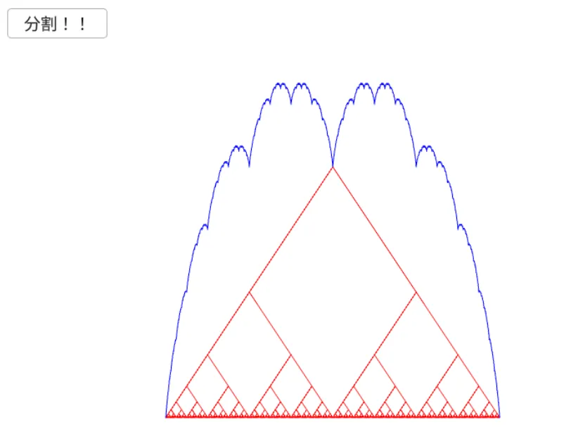

# 高木曲線  
これも一種のフラクタル、名前の通り日本人の数学者でも特に有名な高木 貞治先生が示したもの[^1].  
連続だが至る所で微分不可能な関数として構成したものらしい、難しそうなだなぁ...  
とはいえ、描画だけであれば細かいことは抜きにして可能であるため、今回は試しに描画してみよう.  

今回の曲線は以下の形式で定義が行われる.  

```math
\begin{equation}
    \begin{split}
	T(x) = \sum_{n=0}^{\infty} \frac{s(2^{n}x)}{2^{n}}
    \end{split}
\end{equation}
```

足し合わせるだけなので簡単.  
描画範囲は横軸において$`[0,1]`$と決まってるっぽい.ここは注意.  
今回で大事なのは$`s(2^{n}x)`$でこれは三角波を表す.  

```math
\begin{equation}
    \begin{split}
	s(x) = \min_{n \in \mathbb{Z}} |x-n|
    \end{split}
\end{equation}
```

となるらしい.  
ほ～んとなるが、要は三角波が作れればいいのでちょっと変わった感じに変えてみよう.  
三角波を描画するだけであれば以下の関数で計算が可能.  

```math
\begin{equation}
    \begin{split}
	s(x) = \arccos{(\cos{(x)})}
    \end{split}
\end{equation}
```

別段今回は三角波が分かればいいので、この計算でも問題ないはず.  
ただし$`\cos`$なので、周期が$`[0,2\pi]`$という範囲になってるため$`[0,1]`$と合わせるために調整は必要.  

ということでコードを書いていこう.  
関数はループの回数分計算を行う.  
```c++
	auto MakeTakagi = [&](int loop)
	{
		result.clear();
```

初期値を見ていこう.  
```c++
		// 評価する数
		int evaluate = Pow(2, loop);
```
評価する個数はloopの回数に対して,$`2^{n}`$個である.  

三角波は$`2^{n}`$個ずつ増えていくが、このとき

* 1つの波(／＼)の場合、3点で結べるため始点を除くと2点,つまり$`2^{1}`$個.  
* 2つの波(／＼／＼)の場合,5点で結べるため始点を除くと4点,つまり$`2^{2}`$個.  
* 4つの波(／＼／＼／＼／＼)の場合,9点で結べるため始点を除くと8点,つまり$`2^{3}`$個.  

こんな感じでループ回数によって足し合わせ個数は$`2^{n}`$で指定できるわけだ.  

```c++
		double frequency = Math::TwoPi;
		double period = 1.0 / evaluate;
		double denom = 1.0;
```
`frequency`は周期、初期値は$`2\pi`$.  
`period`は点の間隔だけど、これは$`[0,1]`$を$`2^{n}`$個に分けた物なので$`\frac{1}{2^{n}}`$  
`denom`は割る数で,$`2^{n}`$なので、初回は$`2^{0}=1`$.  

そしたら次に影響のある三角波の点の位置のパラメータを計算する.  
現状の点の位置を`currentPeriod`として求め、後はその位置に対して一番上の式と同じものを計算するだけ.  
計算が終わったら保存しておく.これで各周期のパラメータを用意していく寸法.  
```c++
		Array<Array<double>>  trigonometricSet;

		for (int i = 0; i < loop; i++)
		{
			Array<double> temp;

			// 三角波の現在の位置を生成
			// 三角波は arccos(cos(x)) で書ける
			for (int j = 0; j < evaluate; j++)
			{
				double currentPeriod = (j + 1) * period;
				temp.push_back(Math::Acos(Math::Cos(frequency * currentPeriod)) / denom);
            }

			trigonometricSet.push_back(temp);
```

次の周期では周期が2倍になる,つまり／＼／＼が／＼／＼／＼／＼になる.  
そのため2を掛けておく.  
更に、次の周回では分母は$`2^2`$が$`2^3`$という風にここも増加するため2倍しておく.  
```c++
			// 次の周波数へ
			frequency *= 2.0;
			denom *= 2.0;
        }
```

今回は一番最後尾の波を描画するために保持をしておく.  
```c++
		// 最後尾は新しくできた波なので、可視化のために保持しておく
		loopMap.push_back(trigonometricSet.back());
```

ここまでですべての$`\frac{s(2^{n}x)}{2^{n}}`$が出揃ったため、最後に足し合わせを行う.  
各点の波の数値が分かっているため、単純に足し合わせるだけで良い.  
```c++
		// 和を計算
		result.resize(trigonometricSet[0].size(), 0);
		for (auto& set : trigonometricSet)
		{
			for (int i = 0; i < result.size(); i++)
			{
				result[i] += set[i];
			}
		}
```

最後に最大値を計算しておく.  
波の大きさは徐々に大きくなっていってるため、可視化の際はある程度スケールさせるためだ.  
```c++
		// 最大値を計算
		maxValue = *std::max_element(result.begin(), result.end());
	};
```

ここまでできればあとは実行して結果を見てみよう.  



青が高木曲線で赤が現在の足し合わせた波となっている.  
こんな感じで段々と分割しつつ小さくなった波を足し合わせていくことで、特徴的な波が現れるわけだ.  
こういった行儀の悪い特徴を持つ関数を「病的関数」というらしい.  
他にもいくつかあるので、今度描画してみようかな.  

[^1]: [高木曲線](https://w.wiki/UaQs)  
[^2]: [病的な (数学)](https://w.wiki/UbCE)  