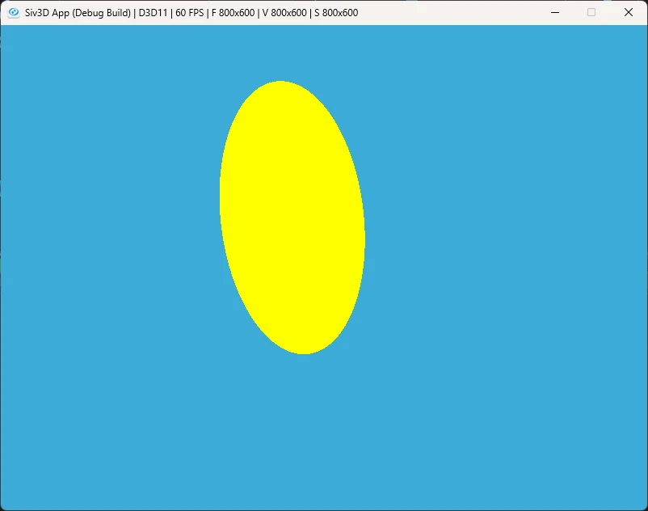

# Disk  
今回は円を扱う.  
円の描画は結構単純で面白いロジックでいける.  
まず最初に平面の判定、これは単純で$`t`$は以下の式で求まるのだった.  
```math
\begin{equation}
    \begin{split}
    t = \frac{(\vec{a} - \vec{o}) \cdot \vec{n}}{\vec{d} \cdot \vec{n}}
    \end{split}
\end{equation}
```
これに対して別の変数として`center`と`radius`を用意する.  
円の中心が`center`で円の半径が`radius`である.  
さて、平面に当たっているとすると、平面上の$`t`$は求まっていることになる.  
後はこの$`t`$を使って位置$`\vec{p}`$を$`\vec{p} = \vec{o} + t * \vec{d}`$で求まる.  
この位置と円の中心の距離が`radius`内に収まってればOK.  
つまり,  
```math
\begin{equation}
    \begin{split}
    (\vec{p} - center)^2 < radius
    \end{split}
\end{equation}
```
で求まる.  
後はこれをコードに落とし込む.  
まずは$`t`$が平面内かの判定を行う.  
```c++
double t = Dot(m_center - ray.origin.xyz(), m_normal) / Dot(ray.direction, m_normal);

if (t <= EPSILON_VALUE) { return false; }
```
もし$`t`$が範囲内なら$`\vec{p}`$を計算する.  
```c++
Vec3 p = ray.origin.xyz() + t * ray.direction;
```
あとは距離の判定を入れて、距離内ならtrue,距離外ならfalseとするだけである.  
```c++
if ((p - m_center).lengthSq() < m_radius * m_radius)
{
    record.m_t = t;
    record.m_p = p;
    record.m_normal = m_normal;
    record.m_material = this->m_material;
    return true;
}

return false;
```
これで終わり、まとめたコードは以下である.  
```c++
double t = Dot(m_center - ray.origin.xyz(), m_normal) / Dot(ray.direction, m_normal);

if (t <= EPSILON_VALUE) { return false; }

Vec3 p = ray.origin.xyz() + t * ray.direction;
if ((p - m_center).lengthSq() < m_radius * m_radius)
{
    record.m_t = t;
    record.m_p = p;
    record.m_normal = m_normal;
    record.m_material = this->m_material;
    return true;
}

return false;
```
結果は次のような感じ.  
今回もSiv3Dで描画をしています.  
  