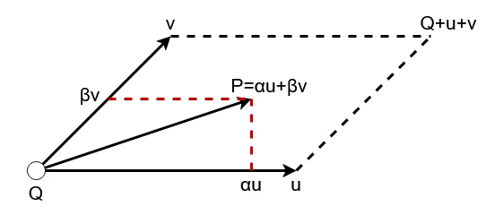

# Quad  
四角形との交差を考えていく.  
平面はあくまで無限に伸びていく感じだったけど,今回のは大きさがちゃんとある.  
以下のような感じで有限.  
  
起点となる$`Q`$があり、$`\vec{v}`$と$`\vec{u}`$のベクトルで平面を張る感じ.  
このベクトルが無限遠だったらPlaneと同じなんだけど、有限なのでそこがちょっと面倒ポイント.  
さて、そしたらまずは平面の方程式を考えてみる.  
こいつは以下のような形だった.  
```math
\begin{equation}
    \begin{split}
    Ax+By+Cz=D
    \end{split}
\end{equation}
```
これを$'\vec{n}=(A,B,C),\vec{w}=(x,y,z)'$とすると、以下のように書き換えられる.  
```math
\begin{equation}
    \begin{split}
    \vec{n} \cdot \vec{w}=D
    \end{split}
\end{equation}
```
さて、そしたらいつも通り光線$`\vec{r} = \vec{o} +t \vec{d}`$を代入する.  
これは$`\vec{r} = \vec{w}`$となる位置に代入すればよいので、以下のようになる.  
```math
\begin{equation}
    \begin{split}
    \vec{n} \cdot (\vec{o}+t\vec{d})=D
    \end{split}
\end{equation}
```