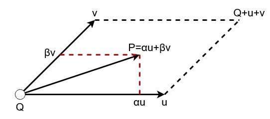
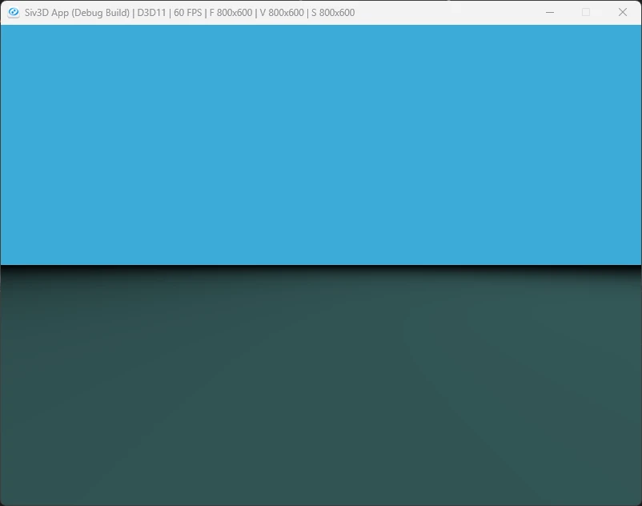
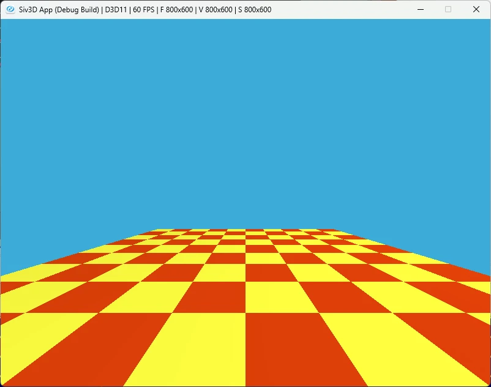

# Quad  
四角形との交差を考えていく.  
平面はあくまで無限に伸びていく感じだったけど,今回のは大きさがちゃんとある.  
以下のような感じで有限.  
  
起点となる$`Q`$があり、$`\vec{v}`$と$`\vec{u}`$のベクトルで平面を張る感じ.  
このベクトルが無限遠だったらPlaneと同じなんだけど、有限なのでそこがちょっと面倒ポイント.  
さて、そしたらまずは平面の方程式を考えてみる.  
こいつは以下のような形だった.  
```math
\begin{equation}
    \begin{split}
    Ax+By+Cz=D
    \end{split}
\end{equation}
```
これを$`\vec{n}=(A,B,C),\vec{w}=(x,y,z)`$とすると、以下のように書き換えられる.  
```math
\begin{equation}
    \begin{split}
    \vec{n} \cdot \vec{w}=D
    \end{split}
\end{equation}
```
この$`\vec{n}`$は法線ベクトルとなる.  
平面に対して垂直となるのが大事.  
さて、そしたらいつも通り光線$`\vec{r} = \vec{o} +t \vec{d}`$を代入する.  
これは$`\vec{r} = \vec{w}`$となる位置に代入すればよいので、以下のようになる.  
```math
\begin{equation}
    \begin{split}
    \vec{n} \cdot (\vec{o}+t\vec{d})=D
    \end{split}
\end{equation}
```
さて、変換をしていこう.  
```math
\begin{equation}
    \begin{split}
    & \vec{n} \cdot (\vec{o}+t\vec{d})=D \\
    & \vec{n} \cdot \vec{o} + t \vec{n} \cdot \vec{d} = D \\
    & t \vec{n} \cdot \vec{d} = D - \vec{n} \cdot \vec{o} \\
    & t = \frac{D - \vec{n} \cdot \vec{o}}{\vec{n} \cdot \vec{d}}
    \end{split}
\end{equation}
```
次はこの$`t`$を計算するために、わかってないパラメータ$`\vec{n},D`$を考える.  
まずは$`\vec{n}`$を考え直す.  
これは法線ということは$`\vec{u},\vec{v}`$で張る平面に垂直ということになるため、外積で表せる.  
```math
\begin{equation}
    \begin{split}
    \vec{n} = \vec{u} \times \vec{v}
    \end{split}
\end{equation}
```
これで法線はOK.  
次に$`D`$、これは(2)を解けばよい.  
(2)でわからないのは$`\vec{w}`$.  
これはどこかの点であればいいんだけど、図の中でわかってるのは起点$`Q`$である.  
つまり$`\vec{w}=Q`$としてしまえば以下のように言える.  
```math
\begin{equation}
    \begin{split}
    \vec{n} \cdot Q = D
    \end{split}
\end{equation}
```
あとはこれをコードに落とせばOK.  
まず変数は`m_q,m_u,m_v`の3つを用意.  
法線を計算した後に正規化しておく.  
あとは$`Q`$と$`\vec{n}`$の内積で$`D`$を計算するだけ.  
これで役者はそろった.  
```c++
Quad(const Vec3& q, const Vec3& u, const Vec3& v)
    : m_q(q)
    , m_u(u)
    , m_v(v)
{
    Vec3 n = Cross(m_u, m_v);
    m_normal = n.normalized();
    m_d = Dot(m_normal, m_q);
}
```
あとは$`t`$を計算してあげればOK.  
```c++
double denom = Dot(m_normal, ray.direction.xyz());
if (Abs(denom) < EPSILON_VALUE) { return false; }

double t = (m_d - Dot(m_normal, ray.origin.xyz())) / denom;
if (!interval.Contains(t)) { return false; }
```
これで結果を見てみる.  
  
見た目が平面と変わらない...  
範囲指定をしていないので当たり前ではある.  
平面上の矩形外はtをはじく必要があるが、現段階では省いてないのが問題.  
次はこれをやっていく.  
今回の四角形は$`Q`$,$`Q+\vec{u}`$,$`Q+\vec{v}`$,$`Q+\vec{u}+\vec{v}`$の4点が張る面である.  
ここで平面の点を$`P`$とすると,  
```math
\begin{equation}
    \begin{split}
    & P = Q + \alpha \vec{u} + \beta \vec{v} \\
    & 0 <= \alpha <=1, 0 <= \beta <=1
    \end{split}
\end{equation}
```
と表せる.  
ここで新しく$`\vec{p}`$を以下のように表してみる.  
```math
\begin{equation}
    \begin{split}
    \vec{p} = P-Q = \alpha \vec{u} + \beta \vec{v}
    \end{split}
\end{equation}
```
そしてこの$`\vec{p}`$と$`\vec{u}`$の外積を取ると,
```math  
\begin{equation}
    \begin{split}
    & \vec{u} \times \vec{p} \\
    & = \vec{u} \times (\alpha \vec{u} + \beta \vec{v}) \\
    & = \alpha \vec{u} \times \vec{u} + \beta \vec{u} \times \vec{v} \\
    & = \beta \vec{u} \times \vec{v}
    \end{split}
\end{equation}
```
となる.  
同様に$`\vec{v}`$に関しても計算すると,  
```math  
\begin{equation}
    \begin{split}
    & \vec{v} \times \vec{p} \\
    & = \vec{v} \times (\alpha \vec{u} + \beta \vec{v}) \\
    & = \alpha \vec{v} \times \vec{u} + \beta \vec{v} \times \vec{v} \\
    & = \alpha \vec{v} \times \vec{u}
    \end{split}
\end{equation}
```
さて、この後が妙な方法なんだけど、外積だと移項ができないので、内積にしてしまおうという考えで$`\vec{n}`$を掛ける.  
```math  
\begin{equation}
    \begin{split}
    & \vec{n} \cdot (\vec{v} \times \vec{p}) = \alpha \vec{n} \cdot (\vec{v} \times \vec{u}) \\
    & \vec{n} \cdot (\vec{u} \times \vec{p}) = \beta \vec{n} \cdot (\vec{u} \times \vec{v})
    \end{split}
\end{equation}
```
内積にしたので塊で移行ができる.  
$`\alpha,\beta`$はスカラーなのでこれもOKなはず.  
```math  
\begin{equation}
    \begin{split}
    & \alpha = \frac{\vec{n} \cdot (\vec{p} \times \vec{v})}{\vec{n} \cdot (\vec{u} \times \vec{v})} \\
    & \beta = \frac{\vec{n} \cdot (\vec{u} \times \vec{p})}{\vec{n} \cdot (\vec{u} \times \vec{v})}
    \end{split}
\end{equation}
```
さて、ここで
```math  
\begin{equation}
    \begin{split}
    \vec{w} = \frac{\vec{n}}{\vec{n} \cdot (\vec{u} \times \vec{v})} = \frac{\vec{n}}{\vec{n} \cdot \vec{n}}
    \end{split}
\end{equation}
```
という定義をしておくと、次のように綺麗にまとまる.  
```math  
\begin{equation}
    \begin{split}
    & \alpha = \vec{w} \cdot (\vec{p} \times \vec{v}) \\
    & \beta = \vec{w} \cdot (\vec{u} \times \vec{p})
    \end{split}
\end{equation}
```
これであとは$`\alpha,\beta`$が求まったので、これが範囲に収まってるかを調べるだけ!!  
これをコードに落とし込もう！  
まずは$`\vec{w}`$を計算しておく.  
これはコンストラクタで行っておく.  
```c++
Vec3 n = Cross(m_u, m_v);
m_normal = n.normalized();
m_d = Dot(m_normal, m_q);
m_w = n / Dot(n, n);
```
次に$`\alpha,\beta`$を計算しておく.  
```c++
Vec3 p = ray.point_at(t);
Vec3 planarHitPointVector = p - m_q;
double alpha = Dot(m_w, Cross(planarHitPointVector, m_v));
double beta = Dot(m_w, Cross(m_u, planarHitPointVector));
```
最後にこれが範囲内かを判定すればOK!!  
```c++
// 範囲内？
Interval unit{ 0.0,1.0 };
if (!unit.Contains(alpha) || !unit.Contains(beta)) { return false; }
```
ここまで出来たら結果を見てみよう.  
  
描画できてるね.  
この平面が6個あればBoxを作ることができる.  
RayTracing in One Weekendシリーズなんかはこれを6個並べてボックスを作って、並べることでコーネルボックスを構成してるね.  
これだけで出来ちゃうのが面白いところ、といったところで今回はここまで.  