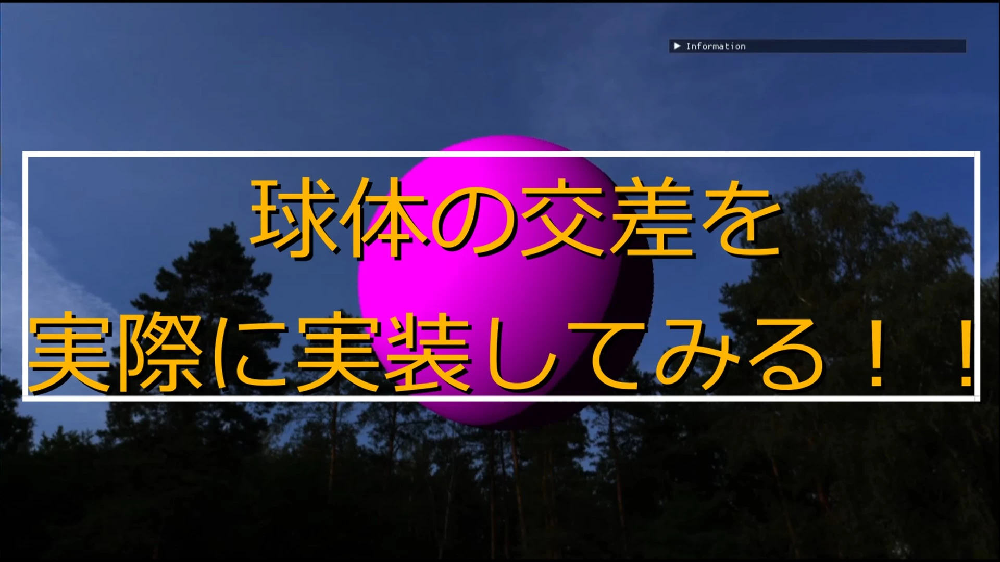

# Sphere  
一番メジャーな交差判定.  
まずは球を数式で表すと以下のような感じ.  
```math
\begin{equation}
    \begin{split}
    (x - c_x)^2+(y-c_y)^2+(z-c_z)^2=r^2
    \end{split}
\end{equation}
```
ここで$`\vec{p}=(x,y,z), \vec{c}=(c_x,c_y,c_z)`$とすると、内積を使うと以下のようになる.  
```math
\begin{equation}
    \begin{split}
    (\vec{p}-\vec{c}) \cdot (\vec{p}-\vec{c}) = r^2
    \end{split}
\end{equation}
```
そしたら光線は$`\vec{r} = \vec{o} +t \vec{d}`$なので、これを代入してtについて解く.  
$`\vec{r}=\vec{p}`$なので、これを代入してみると
```math
\begin{equation}
    \begin{split}
    & (\vec{o} + t\vec{d}-\vec{c}) \cdot (\vec{o}+t\vec{d}-\vec{c}) = r^2 \\
    & (\vec{d} \cdot \vec{d})t^2 + [2(\vec{o}-\vec{c}) \cdot \vec{d}]t + (\vec{o}-\vec{c}) \cdot (\vec{o}-\vec{c}) = r^2
    \end{split}
\end{equation}
```
ここで二次方程式として書くと、以下のようになる.  
```math
\begin{equation}
    \begin{split}
    & at^2+bt+c=0 \\
    & a = \vec{d} \cdot \vec{d}, b = [2(\vec{o}-\vec{c}) \cdot \vec{d}], c=(\vec{o}-\vec{c}) \cdot (\vec{o}-\vec{c}) - r^2
    \end{split}
\end{equation}
```
あとはこれを二次方程式の解として解けばいいだけ.  
実際にコードで見てみよう.  
今回はhlslによる実装、DXRで実装してたやつから持ってきた.  
まずは先ほどのa,b,cを計算する.  
計算した後にまず判別式(discriminant)を計算.  
```c++
float t;
float3 m = ObjectRayOrigin() - center; // o-c
float3 d = ObjectRayDirection(); // d
float a = dot(d, d); // a = d * d
float b = 2.0f * dot(m, d); // b = 2(o-c)*d
float c = dot(m, m) - radius * radius; // (o-c)*(o-c) - r^2
float disc = b * b - 4.0f * a * c; // discriminant
```
判別式が0より小さい場合は虚数解となる.  
これはレイトレとしては当たっていない場合と同じなので、falseとなる.  
```c++
if (disc < 0.0f) 
{
    return false;
}
```
次に当たり判定を入れておく.  
解としては1つか2つとなるわけだけど、tが小さい場合は球の手前、大きい場合はtが球の奥側となる.  
そして判定としてはtが0より大きい場合となる.  
負の場合もあるのでは？となるけど、負となる場合はrayの方向とは真逆の位置.  
当たったかの判定はrayの正の方向なので、負は考えなくても良いということになる.  
```c++
else
{
    float e = sqrt(disc);
    float denom = 2.0f * a;
    t = (-b - e) / denom; // smaller root

    if (t > EPSILON)
    {
        thit = t;
        normal = (m + t * d) / radius;
        return true;
    }

    t = (-b + e) / denom; // larger root
    if (t > EPSILON)
    {
        thit = t;
        normal = (m + t * d) / radius;
        return true;
    }
}
return false;
```
これをまとめたのが以下のようになる.  
```c++
float t;
float3 m = ObjectRayOrigin() - center; // o-c
float3 d = ObjectRayDirection(); // d
float a = dot(d, d); // a = d * d
float b = 2.0f * dot(m, d); // b = 2(o-c)*d
float c = dot(m, m) - radius * radius; // (o-c)*(o-c) - r^2
float disc = b * b - 4.0f * a * c; // discriminant

if (disc < 0.0f) 
{
    return false;
}
else
{
    float e = sqrt(disc);
    float denom = 2.0f * a;
    t = (-b - e) / denom; // smaller root

    if (t > EPSILON)
    {
        thit = t;
        normal = (m + t * d) / radius;
        return true;
    }

    t = (-b + e) / denom; // larger root
    if (t > EPSILON)
    {
        thit = t;
        normal = (m + t * d) / radius;
        return true;
    }
}
return false;
```
あとは結果.  
今回も昔の動画のものを貼っておく.  
