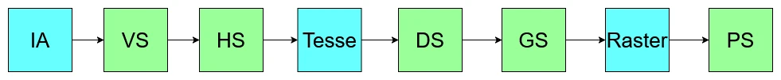
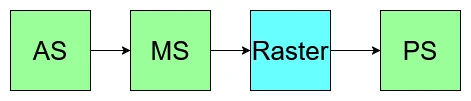
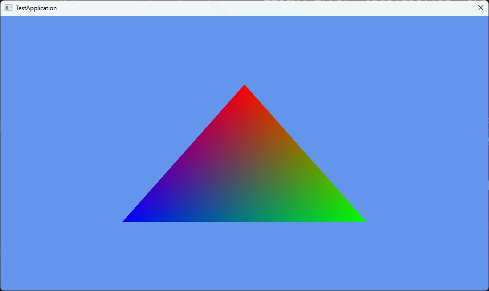

# MeshShaderでTriangleを描画  
MeshShaderの描画を組むシリーズを始めようと思う.  
理由は単純で、中級グラフィックス入門[^1]を見て、そういえばやったことなかったな～となったからである.  
とりあえずこの資料にあるものは一通り試すのを目標にやるつもりである.  
結構寄り道もあるかもだけど、お付き合い願いたいところ.  

ということで最初は三角形の描画から、一番単純なもの.HelloWorldだね.  
まずはPipelineの復習を軽くしてみよう！  
  
Vertex Shaderがあって、そのあとに頂点を増やしたり減らしたりするためのHull Shader,Domain Shader, Geometry Shaderがあり、そのあとにPixel Shaderという形.  
とはいえデフォルトではVertex Shaderで頂点処理、Pixel Shaderでピクセル処理をするのが基本なのが今までだった.  
結構こう見ると複雑なうえに、更にGPU駆動レンダリングというものが出てきた.  
これはGPUでカリングとかもやっちゃおうというもの.  
でも、これを考えてみるとパイプライン内でやれる場所は特にないので、一旦Compute Shaderで処理を行って、それが終わった後にそのデータを使ってやる...というボトルネックが発生しちゃう...  
それじゃ、そもそもの構造を変えましょうということで出てきたのがMesh Shaderによるパイプライン.  
  
これはAmplified Shader,Mesh Shader,Pixel Shaderの3つにまとまりました.非常にシンプル!!  
ASは頂点を増やしたり減らしたりカリングしたり、そしてShaderでMesh Shaderを起動するといった前処理をする場所です.  
ただ、ここに関しては特になくても問題ないです.  
Geometry Shaderとかと同じで、別段必要なければ書かないという選択肢もある.  
GPU駆動レンダリングでは重要なものなのですが、最初の内はASに関しては無視していきましょう.必要になったら書けばOK.  

そして次にMesh Shader、こいつは頂点シェーダみたいなものだけど、構造としてはCompute Shaderのような形になっている.  
DXRとかでもそうだけど、最近はまとまった処理はCompute Shaderチックに書くことが多いよね.  
頂点シェーダ相当ということは、こいつに関しては書くのは必須.なので、最初から扱う必要があります.  

そして最後にPixel Shader,こいつは今までと同じピクセルの処理です.勿論必須です.  

さて、軽く構造を見たところでまずは三角形を描画していこう.  
今回基盤に関してはDirect3D 12 ゲームグラフィックス実践ガイドの作者の方のコード,asdx12[^2]を参考にして自分である程度組んだものを使用する.  
なので、基盤に関しては省略してMesh shaderのためになる部分だけコードを見ていく.  

そしたらまずはPSO,これはMesh Shaderでは自分で定義をしていく必要がある.  
いままではPSOはすでにレイアウトが決まっていて、そこにパラメータを当てはめてく感じだった.  
そこが自分でレイアウトを決めるような感じになってる.  
上手く過去のものと互換性を持たせるためなんですかね？結構強引だけども、とはいえほぼ元のPSOとは同じ形となる.  
```c++
struct MsPsoDesc
{
    PSS_ROOT_SIGNATURE      RootSignature;
    PSS_AS                  AS;
    PSS_MS                  MS;
    PSS_PS                  PS;
    PSS_BLEND               BlendState;
    PSS_SAMPLE_MASK         SampleMask;
    PSS_RASTERIZER          RasterizerState;
    PSS_DEPTH_STENCIL       DepthStencilState;
    PSS_RTV_FORMATS         RTVFormats;
    PSS_DSV_FORMAT          DSVFormat;
    PSS_SAMPLE_DESC         SampleDesc;
    PSS_NODE_MASK           NodeMask;
    PSS_CACHED_PSO          CachedPSO;
    PSS_FLAGS               Flags;

    // ...
};
```
違うところといえばInputLayoutがなくなった点.  
頂点のメモリレイアウトを渡す必要がなくなりました！  
また、Shaderに関してはAS/MS/PSがあれば十分なので、それを用意するのみです.  
これさえ分かれば一旦は大丈夫なはず.  

そしてPSOは自分で定義した後どうするかというと、ポインタとして渡してそのサイズを定義してあげるだけ.  
結構簡単だね.あとはPSOを作成してあげるだけ.  
```c++
D3D12_PIPELINE_STATE_STREAM_DESC pssDesc = {};
pssDesc.pPipelineStateSubobjectStream = &msPsoDesc;
pssDesc.SizeInBytes = sizeof(msPsoDesc);

hr = device->CreatePipelineState(&pssDesc, IID_PPV_ARGS(m_state.GetAddressOf()));
if (FAILED(hr))
{
    ELOGA("Error: ID3D12Device::CreatePipelineState() Failed. errcode = 0x%x", hr);
    return false;
}
```
さて、そしたら実際にCommandListに命令を積みます.  
```c++
    // set descriptor heap table
    command->SetGraphicsRootShaderResourceView(0, m_vertexBuffer.GetGpuAddress());
    command->SetGraphicsRootShaderResourceView(1, m_indexBuffer.GetGpuAddress());
```
InputLayoutがないので、SRVに直接データを積みます.  
今までといえば
```c++
    command->IASetPrimitiveTopology(D3D_PRIMITIVE_TOPOLOGY_TRIANGLELIST);
    command->IASetVertexBuffers(0, 1, &m_vertexBufferView);
```
みたいにIAに渡してましたが、これをやらないで直接リソースを設定しちゃうのはちょっと新鮮だね.  
最後にDrawとしてDispatchを呼ぶ.  
```c++
    // Draw
    command->DispatchMesh(1, 1, 1);
```
これもちょっと特殊、Compute Shaderで`Dispatch`で起動するのに似てるね.  
こういうところからもMesh ShaderがCompute Shaderに近いというのはわかるかも？

そしたら次はShaderを見ていこう.  
まずはstruct定義から.  
Mesh ShaderでもVertex Shaderと同様に、入力とPixel Shaderへの出力を定義しておきます.  
入力に関してはStructured Bufferで受け取り、Index Bufferに関しても同様にStructured Buffer.  
SRVで先ほど渡したのはここで受け口になるわけだね.  
```c++
struct VertexInput
{
    float3 Position;
    float4 Color;
};
struct VertexOutput
{
    float4 Position : SV_POSITION;
    float4 Color    : COLOR0;
};

StructuredBuffer<VertexInput>   Vertices    : register(t0);
StructuredBuffer<uint3>         Indices     : register(t1);
```
そして、PrimitiveOutput.  
今回は定義するけど、特に理解しなくていいです.  
なんか渡してるんだなぁ～ふぅ～んくらいでいいです.  
```c++
struct PrimitiveOutput
{
    uint PrimitiveId : INDEX0;
};
```
そしたらまずはスレッド数から、最小の数32を設定しておく.  
32個のスレッドが動く予定だけど、今回は三角形なので頂点数は3.  
つまり使うのは3スレッドなので、まあ29個は動かないです.  
そして、出力するトポロジーは三角形.まあ基本的にそうよね.  
```c++
[numthreads(32, 1, 1)]
[outputtopology("triangle")]
```
次にmain関数の引数を見てみよう.  
```c++
void main
(
    uint groupIndex : SV_GroupIndex,
    out vertices VertexOutput verts[3],
    out indices uint3 tris[1],
    out primitives PrimitiveOutput prims[1]
)
```
groupIndexはcompute shader感の溢れるパラメータ.  
スレッドには番号がつけられるので、それを受け取るためのもの.詳しくは次回にちゃんと見る予定.  
次はラスタライズに使うパラメータ.  
頂点とインデックスです.  
Mesh ShaderはVertex Shaderの代わりなので、後の処理でラスタライズする必要がある.  
つまり座標変換した頂点だけでなく、三角形として認識するためのIndexも必要.  
なので、こんな感じでVerticesとindicesを用意するんだね.  
今回は頂点3個と三角形1個分のIndexなので、そのような設定になってます.  
そして最後は今回は気にしないでいいPrimitiveOutput.  
とりあえず用意だけはしておくけど、実は書かなくても問題はない.まあでも後々使うので一応ね...  

ここまでをまとめたのが以下の感じ.  
```c++
[numthreads(32, 1, 1)]
[outputtopology("triangle")]
void main
(
    uint groupIndex : SV_GroupIndex,
    out vertices VertexOutput verts[3],
    out indices uint3 tris[1],
    out primitives PrimitiveOutput prims[1]
)
```

さて、そしたら次にMesh Shader内を見ていく.  
```c++
{
    SetMeshOutputCounts(3, 1);

    if (groupIndex < 1)
    {
        tris[groupIndex] = Indices[groupIndex];
        prims[groupIndex].PrimitiveId = groupIndex;
    }

    if (groupIndex < 3)
    {
        VertexOutput vout;
        vout.Position   = float4(Vertices[groupIndex].Position, 1.0f);
        vout.Color      = Vertices[groupIndex].Color;

        verts[groupIndex] = vout;
    }
}
```
まず`SetMeshOutputCounts`は第一引数が出力する頂点数,つまり3つだね.  
そして第二引数はポリゴン数,つまり1つ.  

次にgroupIndexで分岐をする.  
今回は32個のスレッドを起動させて並列に処理してる.  
そして、この32個にIndexが振られてるので、0のIndexのスレッドだけに処理をさせてIndexを出力側に入れている.  
```c++
    if (groupIndex < 1)
    {
        tris[groupIndex] = Indices[groupIndex];
        prims[groupIndex].PrimitiveId = groupIndex;
    }
```
これでIndex側はOK.  
そして、入力頂点数3で出力頂点数も3なので、そちらも同じように処理.  
```c++
    if (groupIndex < 3)
    {
        VertexOutput vout;
        vout.Position   = float4(Vertices[groupIndex].Position, 1.0f);
        vout.Color      = Vertices[groupIndex].Color;

        verts[groupIndex] = vout;
    }
```
これで頂点側もOK.  

そしたら最後にPixel Shader.  
単純に色を出力するだけ.何もしない処理ともいえる.  
```c++
struct VertexOutput
{
    float4 Position : SV_POSITION;
    float4 Color    : COLOR0;
};

// Output Color Only.
float4 main(VertexOutput input) : SV_TARGET
{
    return input.Color;
}
```

そしたら結果の画像.  
  
ちゃんと三角形が出た！といったところで今回はここまで.  

次回はちゃんとレイアウトを見直してモデルを出そうと思います.  

[^1]: [こちらが中級グラフィックスのリンク](https://speakerdeck.com/projectasura/zhong-ji-gurahuitukusuru-men-xiao-lu-de-nametusiyuretutomiao-hua)

[^2]: [asdx12](https://github.com/ProjectAsura/asdx12)