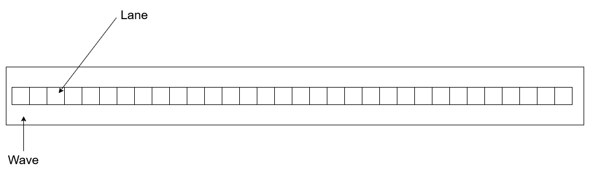
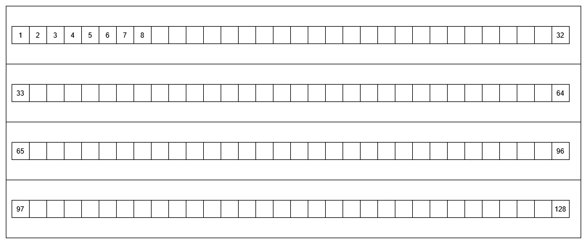
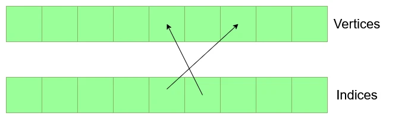
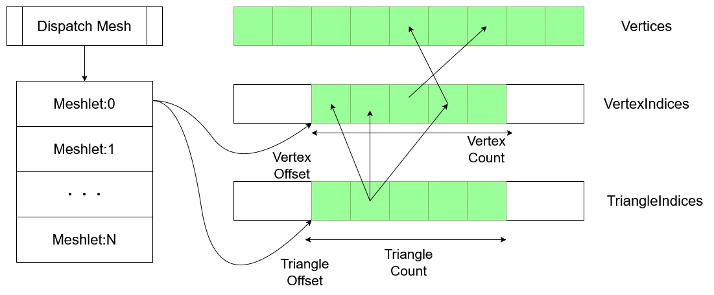
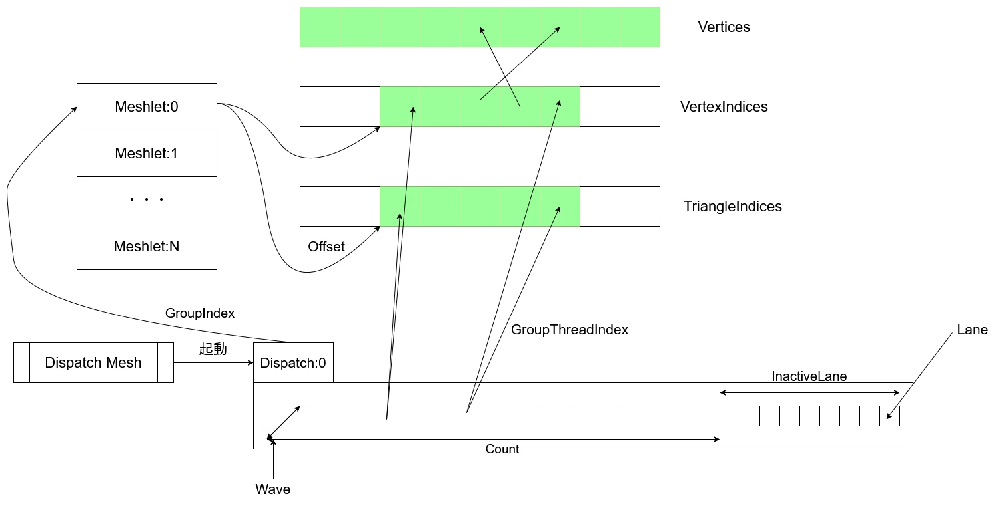

# Mesh Shaderでモデルを描画するための準備  
さて、今回でモデルの描画を行うための準備を行う.  
モデルを描画するためにはちゃんとMesh Shaderをフル活用するために構造を理解する必要がある.  
なので、細かい部分からちゃんと見ていくことにする.  

まずは処理単位から見ていく.  
  
GPUのスレッドはWaveという単位で処理を行う.  
このWave自体は図のようにLaneという更に小さな単位となるthreadを持っている.  
このLaneが最小単位となるわけだけど、WaveはこのLaneを32/64単位で持つのが基本的.  
NVIDIAは32Laneで、AMDは32/64Laneで切り替えれるっぽい.[^1]  
よくよく見たら自分が作った動画[^2]だとWaveで記入してました、なんというミス...  
さて、このLaneに関しては起動数を決めることができ、これは前回のhlslのコードでも見た`numthreads`の部分.  
```c++
[outputtopology("triangle")]
[numthreads(128, 1, 1)]
void main
```
今回は128と指定してあるが、これは次のような感じで4つのWaveがあるのと同じことになる.  
  
今回は32laneの4Waveだけど、64laneのWaveなら2Waveということになる.  
こうやって`numthreads`を定義してLaneを定義することで、Waveの起動も決まるということになる.  

因みにこのLaneが全部起動できないような数値にも設定は可能.  
例えば90とかで設定した場合は3Wave/96Laneという起動単位となる.  
つまり6Laneが浮くことになるけど、これはどうなるかというと単純に起動されないっぽい.  
実際につかうLaneは`Active Lane`で何もしない場合は`InAactive Lane`という名前がついており、ちゃんと区別ができる.  
そのため、Waveは32Lane単位で起動しちゃうため、`InActive Lane`があるとGPUをフル活用できていないということになっちゃう.  
そのため、指定はできるけどもし必要な場合はちゃんと90ではなく96と指定する必要があるということになる.  

さて、Waveが持つLane自体のIndexを取りたいというのは結構あると思う.  
例えば頂点を32個処理したいとすると、Indexが分かれば頂点の配列があるとすると、  
```c++
    int index = GetLaneIndex();
    Vertex v = Vertices[offset + index];
```
のような感じでまとめて処理することができるようになる.  
実際にこういう処理を書くことが今後あるためにIndexが欲しいんだけど、ちゃんとこれを取ることは簡単に可能.  
```c++
    uint groupThreadIndex : SV_GroupThreadID
```
これでLaneに対応したIndexが取れるということになる.  

さて、ここでLaneの最大数として設定できるのは128となります.  
なので、最大の単位は128個となる.Compute Shaderみたいなサイズ数よりは小さいね.  
128個では頂点を処理するのには全く足りないね.  
ということで例えば1000頂点を処理したい場合を考える.  
1000頂点を設定するのであれば、1000Laneが必要となる.  
つまり128Lane単位が8個あれば、128x8=1024Laneで処理が可能になりそう.  
ではこの8個というところを設定する場所がある.  
そう,`DispatchMesh`の処理である!!  
```c++
    // Draw
    command->DispatchMesh(8, 1, 1);
```
ShaderのLaneの処理単位が決まれば、あとは`DispatchMesh`で何個起動するかを決めるという手順になるってことになる.  
面倒ではあるけど、ここまで設定してやっと全頂点の処理が可能になるわけだね.  
さて、この8という数字はShader側でも勿論参照は可能.  
これに関しては以下のような感じで行ける.   
```c++
    uint groupIndex : SV_GroupID,
```

さて、ここまで見てくると漠然ではあるけど、mesh shaderでやらなきゃいけないことというのが見えてくる.  
まずVertex Shaderの処理について考えると、Vertex Shaderでは大量の頂点を処理する必要がある.  
この時の頂点の処理の仕方はプログラマが今まではそこまで考える必要がなかったわけです.  
とりあえず頂点のデータを渡せば、それっぽく向こうが頂点毎に分けてくれるので、1頂点にどういう処理をすればいいのかという点のみを考えるだけで済むわけです.  
Mesh Shaderの場合はこの頂点の処理をどうさせるか？というのを考えるためにLaneまで遡って考える必要がある.  
Compute Shaderのような形式になったことで、1つのグループで処理できる単位が決まっちゃってるのでその分を自分でやってあげる必要があるわけだね.  
Mesh Shaderは今までよりも自由に処理ができるようになった分、ちゃんと深いところまで考えなきゃいけない部分も出てきたことになる.  
なんというかDirectX11では考える必要がなかったメモリが、DirectX12で自由度が高くなった分ちゃんと考えなきゃいけなくなったのに近いものを自分は感じている.  
そうなるとやっぱり頂点のLayoutがどうなってるかも考える必要があるため、まずはこれを見ていく.  

まずは今までのVertex BufferとIndex Bufferを持たせる形式.  
  
頂点は複数のポリゴンと共有させることがあるので、Indexで参照することでメモリを減らせる.  
そのため図のような感じで頂点自体の情報をVertex bufferで持たせ、ポリゴンの情報はIndexで決めるといった形式になる.  
Vertex Shaderではあくまでこの二つのデータを渡せば、後はDirectX側がInputLayoutやポリゴンの関係を考慮して、勝手に処理を行ってくれることになる.  
そうすることで、先ほど言ったように頂点毎の処理のみをVertex Shaderに書けば済むということになるわけだね.  

Mesh Shaderは逆にこの辺をちゃんと記述することが必要になる.  
頂点のBufferとIndexのBufferを考慮して、三角形の情報を取り、頂点の処理を行うとともに、どの頂点が三角形になるのか？というのをデータとして渡す必要がある.  
なんでこれが必要かというと、三角形を考慮できることでGPU上でGPU上でカリングができるようになって、結果としてGPUカリングといったGPU駆動レンダリングが実現できるようになるから.  
Vertex Shader->頂点単位で処理するだけ Mesh Shader->頂点単位の処理+ポリゴンの認識 という違いによって自由度が上がることになるんだね.  

そうなるとMesh Shaderではそもそものリソース構造もちゃんと考える必要がある.  
これを自分なりにまとめた図が以下のような形.  
  

さて、先ほど言った通り,`DispatchMesh`でWaveを起動する.  
図ではN個のWaveを起動しており、この呼ぶ単位はMeshletというものと同じ単位となっている.  
このMeshletはIndexに関する情報を持った構造体のようなものである.  
Indexを表すためにOffsetとCountという情報を持っている.  
これがあればArrayの中を自在に参照できる.  
簡単に考えるのであれば、  
```c++
if (i < meshlet.count)
{
    foo = indices[meshlet.offset + i];
}
```
といったように連続したメモリを取ることができるからだね.  

さてこのMeshletは2つのIndexによる情報を持っているが、このIndexももちろん2つのリソースと関連づいている.  
この二つのリソースを見ていこう.  

一つ目はVertexIndicesというリソース.  
Vertex Bufferのどの頂点にアクセスできるかのリソースである.  
つまり、Index Bufferみたいなものだけど,Index Bufferと違う点はポリゴン的な関係を持っていない点である.  
Index Bufferは3つの連続するデータを参照すれば三角形になる、といったGeometry的な構造を持っていた.  
今回のVertex Indicesはあくまで頂点のIndexであって、3つの連続したデータを参照しても三角形になるとは言えない点が違うのである.  

では、このGometry的な構造は何処に？となると思うが、これを表すのがTriangleIndices.  
図のようにVertex Indicesの中のIndexとして機能している.  
これが3つの頂点を参照するため、結果としてGeometry的構造を参照できるようになるわけだ.  

つまり、ここまで見て分かることはIndex Bufferの機能を上手くVertexIndicesとTriangleIndicesにバッファを分けている.  
これをMeshletが参照するような構造になる、ということが分かるね.  

さて、更にResourceだけでは何ともなので、更に詳しく呼び出しも見てみよう.  

  

今後組んでいく流れはこの図の通り.  
Dispatch MeshでWaveをまず起動する.  
起動するとWave毎に`GroupIndex`を持っているため、これを使うとMeshletにアクセスができる.  
MeshletはVertexIndicesとTriangleIndicesのOffsetを持っているため、アクセスしたいメモリの開始位置が分かる.  
そして、WaveはLaneを起動しているが、Laneは`GroupThreadIndex`でどのLaneかが判定可能.  
そしてMeshletはCountで、データのサイズも分かる！！  
なので各Laneが`GroupThreadIndex`に沿ってアクセスを行ってくれることになる.  
LaneからVertexIndicesとTriangleIndicesに伸びてる矢印がアクセスするデータとなる.  
こうして受け取ったデータに対して処理を施す.これがMeshletの基本的なアクセス構造！！  

今回はここまで、次回は実際に組んでいこう！！  

[^1]: [GPUレイトレーシングにおける将来の標準かもしれない機能](https://qiita.com/shocker-0x15/items/b4b546171ba2a4573188)

[^2]: [【DX12】Meshletの構造をまずは理解しよう！～Mesh Shader Series Part.2～【ゆっくり】](https://youtu.be/IXtlb3OTPFE?si=z-G2ILwuaU5HHv0R)