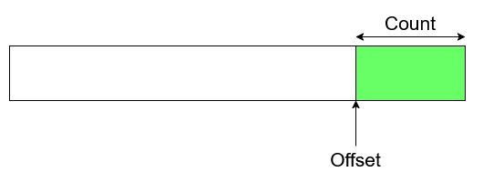
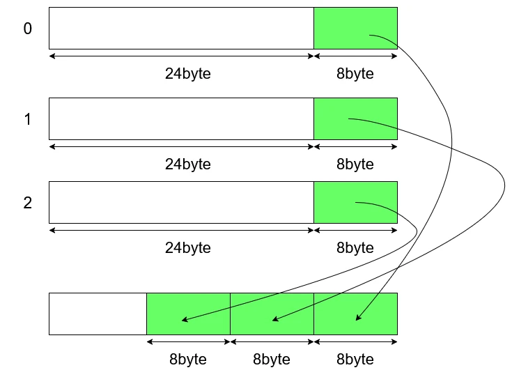
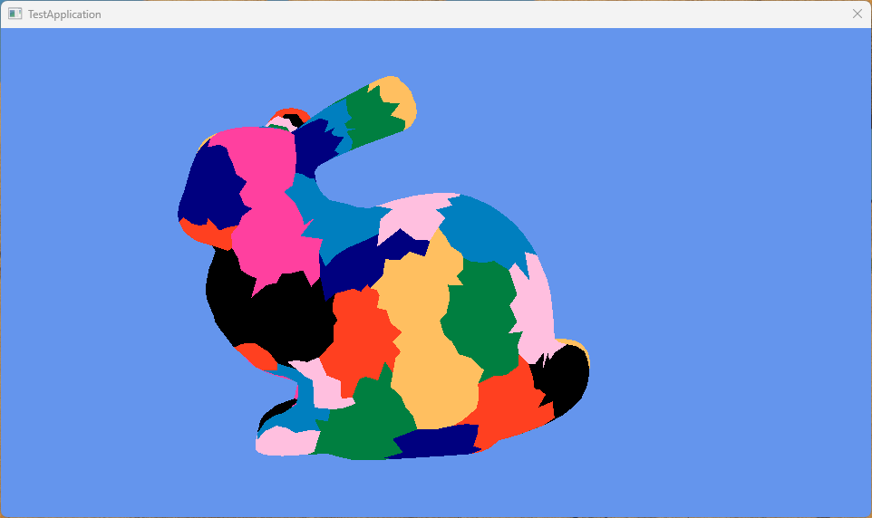
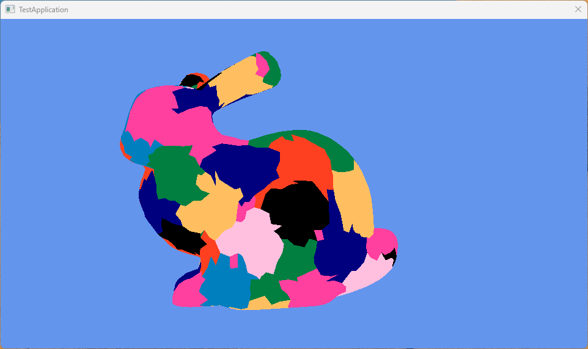

# Mesh ShaderでMeshletによる描画 API編  
さて、そしたら実際に描画を書いていく.  
meshletを作る方法だけど、これはmeshlet生成のパフォーマンスを各手法で行ったもの[^1]があり、こちらが参考になる.  
この論文では以下の5つを実装している.  

* DirectX Mesh
* MeshOptimizer
* Greedy
* Bounding Sphere
* k-medoids

この中で上2つがAPIを使う方法で、下の3つが自前で実装するものとなっている.  
k-medoids以外をすべて実装していくのが目標.k-medoidsもやりたいけど、力尽きました.簡単な資料があればそのうち書くかもだけど、未来の自分にご期待ください.  
さて、ということは4つを実装するわけだけど、今回は一番簡単なAPIを使う方法であるDirectX MeshとMeshOptimizerの二つに絞ってやっていく.  

まずはMeshOptimizerの方からやっていく.  
MeshOptimizer[^2]はGithubにあるので、そちらを参照するのが速いかと思います.とても便利なライブラリ.  
使い方に関しては中級グラフィックス入門[^3]の方を参考にするとよいです、結局これが一番詳しい！  
また今回はMesh Shading Part 1: Rendering Meshlets[^4]の記事の方を結構参考にしてます.これも非常に分かりやすいし、step by stepなので読みやすくて好き.  

さて、そしたら実際にコードを見ていこう.  
まずはMeshletの定義、これはOffsetとCountによる定義であった.  
なので、こんな感じにすればOK.  
```c++
struct ResourceMeshlet
{
	// Offset within meshlet vertices and meshlet triangles.
	// Count means number of vertices and triangles used in the meshlet.
	uint32_t m_vertexOffset;
	uint32_t m_vertexCount;
	uint32_t m_primitiveOffset;
	uint32_t m_primitiveCount;
};
```
アクセスしたいリソースは前回書いた通りVertexとPrimiveの二つなので、こんな感じで4つの`uint32_t`で表されている.  

次にMeshletが管理する最大頂点数とポリゴン数.  
```c++
private:
	// Max num of vertex and triangle
	static constexpr size_t MAX_VERTICES = 64;
	static constexpr size_t MAX_TRIANGLES = 124;
```
これは最大数でリソースで確保しておく量だけど、もちろんこれよりも小さくても構わない.  
けど、ぎっちり詰めた方がinactive laneが少なくなってよいはずだとは思うけどね.  

Meshletの構築で一番最初にやるのはMeshletの最大数を求めること.  
`meshopt_buildMeshletsBound`に投げると、実際にmeshletを構築するしたとき、最大でもどれだけのmeshletが必要なのかが分かる.  
```c++
// Calculate max num of meshlet
const size_t maxMeshlets = 
    meshopt_buildMeshletsBound(
        mesh->GetIndicesNum(), 
        MAX_VERTICES, 
        MAX_TRIANGLES);
```
こうして最大数が分かれば、用意しておくMeshletの数が分かる.  
つまり、これを使って最大数をあらかじめ確保することができる！！  
確保に関しては以下のようにやればOK.  
```c++
// alloc max size
std::vector<meshopt_Meshlet> meshlets; meshlets.resize(maxMeshlets);
mesh->m_uniqueVertexIndices.resize(maxMeshlets * MAX_VERTICES);
std::vector<uint8_t> meshletTriangles;
meshletTriangles.resize(maxMeshlets * MAX_TRIANGLES * 3);
```
meshoptimizerでは`meshopt_Meshlet`という型で各meshletを表すので、この分確保しておく.  
また、meshletは頂点を分割したものなので、全meshletと最大数を掛け合わせたもので大体の頂点数が分かるため、これもあらかじめ確保.  
更に更に、meshletは最大ポリゴン数も分かる.  
最大ポリゴン数が分かれば、Mesuletの数にポリゴンを構成する頂点数である3を掛ければ、全indicesの数も推測可能なため、こちらも計算しておく.  

必要な分が分かれば、後は`meshopt_buildMeshlets`を呼び出すだけで構築完了!!APIは楽でいいですね.  
```c++
size_t meshletCount = meshopt_buildMeshlets
(
    meshlets.data(),                                            // Output: meshopt_Meshlet
    mesh->m_uniqueVertexIndices.data(),                         // Output: meshlet to mesh index mapping
    meshletTriangles.data(),                                    // Output: triangle indices
    mesh->m_indices.data(),                                     // Input:  pointer indices
    mesh->GetIndicesNum(),                                      // Input:  number of indices
    reinterpret_cast<const float*>(mesh->m_positions.data()),   // Input:  pointer vertices
    mesh->GetVerticesNum(),                                     // Input:  number of vertices
    sizeof(XMFLOAT3),                                           // Input:  stride of vertices
    MAX_VERTICES,                                               // Input:  maximum number of vertices per meshlet
    MAX_TRIANGLES,                                              // Input:  maximum number of triangles per mehslet
    CONE_WEIGHT                                                 // Input:  cone weight
);
```
細かく分けて見ていこう、まずは出力側.  
```c++
meshlets.data(),                                            // Output: meshopt_Meshlet
mesh->m_uniqueVertexIndices.data(),                         // Output: meshlet to mesh index mapping
meshletTriangles.data(),                                    // Output: triangle indices
```
meshlet自体のデータ、そしてMeshletが参照するVertexIndicesとTriangleのIndicesの二つである.  
要は勝手にMeshletのOffsetとCountの指定とリソースの用意をやってくれるわけである.  
そして、分割するということは分割する前のデータが必要なのでそれを渡す.  
最初はインデックスバッファに相当するデータを渡す.  
```c++
    mesh->m_indices.data(),                                     // Input:  pointer indices
    mesh->GetIndicesNum(),                                      // Input:  number of indices
```
次に頂点バッファ、これはstrideも設定できるのがオシャレ.  
今回はpositionのみなので、`XMFLOAT3`にしてる.  
```c++
    reinterpret_cast<const float*>(mesh->m_positions.data()),   // Input:  pointer vertices
    mesh->GetVerticesNum(),                                     // Input:  number of vertices
    sizeof(XMFLOAT3),                                           // Input:  stride of vertices
```
最後に部分はmeshletの分割単位.  
先ほど設定した最大頂点数と最大ポリゴン数だね.  
これを設定することで、上手くmeshletを最大値を超えないように分割してくれるという感じ.  
`CONE_WEIGHT`は公式のREADME[^2]を読むと、カリング用で0ならCone Cullingしませんよ～という設定らしい、まあ今回は使わないので0にしてます.  
これだけ渡せば計算完了だけど、この関数は返り値で結局何個に分割したのかを返してくれてるので、これを保持しておく.  
```c++
size_t meshletCount = meshopt_buildMeshlets
```

さて、次はデータをshrinkする.  
最初にリソースを最大数で確保してたけど、最大まで使ってない場合もあるので、データを縮めてしまう訳.  
まずは全体のコード.  
```c++
// shrink vector size using meshlet size.
// triangle align to equal (x mod 4 = 0).
meshopt_Meshlet& last = meshlets[meshletCount - 1];
mesh->m_uniqueVertexIndices.resize(last.vertex_offset + last.vertex_count);
meshletTriangles.resize(last.triangle_offset + ((last.triangle_count * 3 + 3) & ~3));
meshlets.resize(meshletCount);
```
これも一つずつ見ていこう.  
まず最後尾のデータを参照する.  
そして、最後尾のデータのoffsetとcountを使ってVertexIndicesのデータをresizeしてしまう.  
```c++
meshopt_Meshlet& last = meshlets[meshletCount - 1];
mesh->m_uniqueVertexIndices.resize(last.vertex_offset + last.vertex_count);
```
前回の図を思い返すと、頂点バッファを分割してmeshlet毎に分けている.  
そのため、meshletの最後尾を参照するというのは、下の図のようにリソースの最後尾と一致することになる.  
  
なので、`Offset+Count`でresizeを行っているわけである.原理は簡単.  
次にTriangleのresize,これはちょっと複雑.  
```c++
meshletTriangles.resize(last.triangle_offset + ((last.triangle_count * 3 + 3) & ~3));
```
なんか不思議な計算をしてる.  
先ほどと同じで`offset+count`の計算であるが、`count`のみが謎の計算をしてる.  
これはcount=1,2,3,4の場合の計算をすると分かりやすい.  
```math
\begin{equation}
    \begin{split}
    & (1*3+3)\& \tilde{3} = 6 \& \tilde{3} = 00100 \& 11100 = 00100 = 4 \\
    & (2*3+3)\& \tilde{3} = 9 \& \tilde{3} = 01001 \& 11100 = 00100 = 8 \\
    & (3*3+3)\& \tilde{3} = 12 \& \tilde{3} = 01100 \& 11100 = 00100 = 12 \\
    & (4*3+3)\& \tilde{3} = 15 \& \tilde{3} = 01111 \& 11100 = 00100 = 12 \\
    \end{split}
\end{equation}
```
これは4で割り切れる数になってる.  
GPUのリソースとしては4byteでalignされてると嬉しいので、こうして調整してるわけだね.  
meshlet自体のresizeは簡単、先ほどの関数で数は分かったのでそれを使ってあげればよい.  
```c++
meshlets.resize(meshletCount);
```

さて、次にやるのはIndex Bufferの圧縮.  
今までのVS-PS方式のインデックスバッファは頂点バッファを直接参照する.  
そのため、32bitとか大きい値を表現できないといけなかった.  
Meshletは`MAX_VERTICES`で最大数が一気に小さくなっている！  
これによって8bit、つまり高々$`2^8=256`$で表すことができるので、圧縮が可能!!  
中級グラフィックス入門[^2]ではもっと賢く圧縮してるけど、今回は以下のような感じで圧縮を行う.  
  
現状は32bitに全部別れてるけど、32bitの中に8bitを3つ埋め込んでしまうのである!!  
実際はこれでも8bitの無駄があるけども、96bitから32bitへの変更は大きいね.  
更に8bitを削る方法に関してはまた今度やる予定だけど、今回に関しては単純な圧縮でやってみよう.  
圧縮の手順は以下の感じ.  
```c++
// repack triangles from uint8 to uint32
for (meshopt_Meshlet& meshlet : meshlets)
{
    // Current triangle offset for current meshlet
    uint32_t triangleOffset = static_cast<uint32_t>(mesh->m_primitiveIndices.size());

    // per triangle
    for (uint32_t i = 0; i < meshlet.triangle_count; ++i)
    {
        // pick up offset
        const uint32_t index = i * 3;
        uint32_t i0 = index + meshlet.triangle_offset;
        uint32_t i1 = index + 1 + meshlet.triangle_offset;
        uint32_t i2 = index + 2 + meshlet.triangle_offset;

        uint8_t vi0 = meshletTriangles[i0];
        uint8_t vi1 = meshletTriangles[i1];
        uint8_t vi2 = meshletTriangles[i2];

        // repack!!
        uint32_t packed = 
            ((static_cast<uint32_t>(vi0) & 0xFF) << 0) |
            ((static_cast<uint32_t>(vi1) & 0xFF) << 8) |
            ((static_cast<uint32_t>(vi2) & 0xFF) << 16);

        mesh->m_primitiveIndices.push_back(packed);
    }

    // adjust offset
    meshlet.triangle_offset = triangleOffset;
}
```
やってることは簡単なので、一つずつ見ていこう.  
forはmeshlet毎に行う.  
まずtriangleのoffsetを取得.これは配列のサイズを起点として決める.  
```c++
for (meshopt_Meshlet& meshlet : meshlets)
{
    // Current triangle offset for current meshlet
    uint32_t triangleOffset = static_cast<uint32_t>(mesh->m_primitiveIndices.size());

    // ...
}
```
meshletのcountを参照することで、現在のmeshletの持つtriangle数はわかるので、これでループ.  
indexは0から2まで増えるように調整.ポリゴンの持つ頂点は3つなので、これは正しそうね.  
ポリゴンのindexはoffsetの位置からずらして計算すればOK.  
後はこれを使って頂点を取り出せばよい.  
```c++
    // per triangle
    for (uint32_t i = 0; i < meshlet.triangle_count; ++i)
    {
        // pick up offset
        const uint32_t index = i * 3;
        uint32_t i0 = index + meshlet.triangle_offset;
        uint32_t i1 = index + 1 + meshlet.triangle_offset;
        uint32_t i2 = index + 2 + meshlet.triangle_offset;

        uint8_t vi0 = meshletTriangles[i0];
        uint8_t vi1 = meshletTriangles[i1];
        uint8_t vi2 = meshletTriangles[i2];
```
あとは実際に詰める.  
現在の値を255以上の数値の部分は0で埋めて、右シフトで詰めていくだけ.  
それができればあとはindexの部分にデータを溜めればOK.  
```c++
            // repack!!
            uint32_t packed = 
                ((static_cast<uint32_t>(vi0) & 0xFF) << 0) |
                ((static_cast<uint32_t>(vi1) & 0xFF) << 8) |
                ((static_cast<uint32_t>(vi2) & 0xFF) << 16);

            mesh->m_primitiveIndices.push_back(packed);
```
最後にtriangleのリソースの配置を変えたので、offsetを更新する.  
countに関してはポリゴン数に関しては全く変わってないため変更しなくてOK.  
```c++
        // adjust offset
        meshlet.triangle_offset = triangleOffset;
```
これで圧縮も完了.  

最後にMeshletのデータをこちら側が想定してるものに設定すれば終わり.  
実際これをやらないで`meshopt_Meshlet`前提でもいいんだけど、今回はとりあえず分ける想定にしてみた.  
```c++
    // set meshlet
    for (const meshopt_Meshlet& meshlet : meshlets)
    {
        ResourceMeshlet meshletResource;
        meshletResource.m_vertexOffset = meshlet.vertex_offset;
        meshletResource.m_vertexCount = meshlet.vertex_count;
        meshletResource.m_primitiveOffset = meshlet.triangle_offset;
        meshletResource.m_primitiveCount = meshlet.triangle_count;
        mesh->m_meshlets.push_back(meshletResource);
    }
```

さて、そしたら次はshader側を見てみる.  
meshletのリソースを用意する.  
前回とは違い`Meshlets`というMeshletのリソースが追加された.  
そして、前回の`Indices`は分割された結果`VertexIndices`と`TriangleIndices`に変わった.  
```c++
struct Meshlet
{
    uint VertexOffset;
    uint VertexCount;
    uint TriangleOffset;
    uint TriangleCount;
};

StructuredBuffer<VertexInput>   Vertices            : register(t0);
StructuredBuffer<Meshlet>       Meshlets            : register(t1);
StructuredBuffer<uint>          VertexIndices       : register(t2);
StructuredBuffer<uint>          TriangleIndices     : register(t3);
```
そしたら実際の処理.  
meshletは前回説明した通り、`groupIndex`で参照ができるのだった！  
なので、これを使って参照を行う.  
そしてMSが出力する頂点数とポリゴン数は事前に呼び出す必要があるため、`SetMeshOutputCounts`で設定をしておく.  
```c++
    // get meshlet from index
    Meshlet meshlet = Meshlets[groupIndex];

    // set output count
    SetMeshOutputCounts(meshlet.VertexCount, meshlet.TriangleCount);
```
まずTriangleの出力側から.  
現在のLaneは`groupThreadIndex`を使うことで特定が可能.  
そのため、これを使って現在のTriangleの位置を特定.  
そして範囲内なら`offset+index`でアクセスする.  
Indexに関してはCPU側で右シフトで詰めたので、左シフトした後0xFFとアンド演算を行い8bitのみ取り出すようにする.  
取り出した3つのindexが三角形となるため、これを出力すればOK.  
```c++
    // triangle index
    if (groupThreadIndex < meshlet.TriangleCount)
    {
        uint packed = TriangleIndices[meshlet.TriangleOffset + groupThreadIndex];
        uint vIndex0 = (packed >>  0) & 0xFF;
        uint vIndex1 = (packed >>  8) & 0xFF;
        uint vIndex2 = (packed >> 16) & 0xFF;
        triangles[groupThreadIndex] = uint3(vIndex0, vIndex1, vIndex2);
    }
```
次に頂点側の出力.  
アクセスの仕方はtriangle側とほぼ同じ.  
アクセスした後は頂点を座標変換して、試しに`groupIndex`を使って色を決定する.  
`groupIndex`はmeshlet毎なので、meshlet単位で同じ色になるはず!!  
```c++
    // vertex transform
    if (groupThreadIndex < meshlet.VertexCount)
    {
        uint vertexIndex = meshlet.VertexOffset + groupThreadIndex;
        vertexIndex = VertexIndices[vertexIndex];

        VertexOutput vout;
        vout.Position   = mul(Camera.MVP, float4(Vertices[vertexIndex].Position, 1.0f));   
        vout.Color      = float3(float(groupIndex & 1), float(groupIndex & 3) / 4, float(groupIndex & 7) / 8);        
        vertices[groupThreadIndex] = vout;
    }
```
ここまでをまとめたのが以下.  
```c++
    // get meshlet from index
    Meshlet meshlet = Meshlets[groupIndex];

    // set output count
    SetMeshOutputCounts(meshlet.VertexCount, meshlet.TriangleCount);

    // triangle index
    if (groupThreadIndex < meshlet.TriangleCount)
    {
        uint packed = TriangleIndices[meshlet.TriangleOffset + groupThreadIndex];
        uint vIndex0 = (packed >>  0) & 0xFF;
        uint vIndex1 = (packed >>  8) & 0xFF;
        uint vIndex2 = (packed >> 16) & 0xFF;
        triangles[groupThreadIndex] = uint3(vIndex0, vIndex1, vIndex2);
    }

    // vertex transform
    if (groupThreadIndex < meshlet.VertexCount)
    {
        uint vertexIndex = meshlet.VertexOffset + groupThreadIndex;
        vertexIndex = VertexIndices[vertexIndex];

        VertexOutput vout;
        vout.Position   = mul(Camera.MVP, float4(Vertices[vertexIndex].Position, 1.0f));   
        vout.Color      = float3(float(groupIndex & 1), float(groupIndex & 3) / 4, float(groupIndex & 7) / 8);        
        vertices[groupThreadIndex] = vout;
    }
```

最後にコマンド呼び出しをCPU側で行う.  
これは前も行ったDispatchMeshを呼び出せばOK.  
DispatchMeshはWaveの数だけ呼び出す必要があり、各Waveは各Meshletの処理を行う.  
つまり、Meshlet数で呼び出せばOK!!  
```c++
        // Draw
        command->DispatchMesh(static_cast<UINT>(mesh->GetMeshletCount()), 1, 1);
```

ここまで来れば何とか描画できる.  
結果は以下のような感じ.  
  
今回はstanford bunnyを選択、いい感じに描画できてる!!  

次はDirectX Meshをやっていこう.  
これはロジカルビートさんの記事[^5]でやってくれてるので、これが分かりやすいと思う.  
変える部分はCPU側のみで良いので、構築だけ見てみよう.  
構築、これは`ComputeMeshlets`という関数を呼び出すだけ.  
設定するものはほぼ同じ.  
個人的にはMeshOptimizerの方がstride設定できて好きだなぁとは思うけど、まあこれでも問題は特にはないね.  
```c++
    // construct meshlet
    HRESULT hr = DirectX::ComputeMeshlets
    (
        mesh->m_indices.data(),             // Input: pointer indices
        mesh->GetIndicesNum() / 3,          // Input: number of triangles
        mesh->m_positions.data(),           // Input: pointer vertex positions
        mesh->m_positions.size(),           // Input: number of vertex
        nullptr,                            // Input: adjacency
        meshlets,                           // Output: DirectX::Meshlet
        uniqueVertexIB,                     // Output: meshlet to mesh index mapping
        meshletTriangles,                   // Output: DirectX::MeshletTriangle
        MAX_VERTICES,                       // Input: maximum number of vertices per meshlet
        MAX_TRIANGLES                       // Input: maximum number of triangles per meshlet
        );
```
meshletの最大数は普通に出力側から取ればOK.  
```c++
size_t meshletCount = meshlets.size();
```
あとはちょっと変数名が違う部分があるので、そこを変更して書くだけ.  
圧縮のところで一例を示しておく.  
```c++
    // shrink vector size using meshlet size.
    // triangle align to equal (x mod 4 = 0).
    DirectX::Meshlet& last = meshlets[meshletCount - 1]; //DirectX::Meshletなのに注意
    mesh->m_uniqueVertexIndices.resize(last.VertOffset + last.VertCount); // VertOffset, VertCountとなってる
    meshletTriangles.resize(last.PrimOffset + ((last.PrimCount * 3 + 3) & ~3)); // PrimOffset, PrimCountとなってる
    meshlets.resize(meshletCount);
```
他は違いがないため省略、これでDirectX Meshの場合の結果も見てみよう.  
  
うん、いい感じ！  

これで今回はAPI編が終わった.  
次回からは自前でMeshletを組んでみるターン.  
正直やらなくてもいいんだけど、こういうのは自分でやって理解したくなっちゃうのよね.  
ということで次はGreedyから始めようと思います.  

[^1]: [Performance Comparison of Meshlet Generation Strategies](https://jcgt.org/published/0012/02/01/)  
[^2]: [meshoptimizer](https://github.com/zeux/meshoptimizer)  
[^3]: [中級グラフィックス入門～効率的なメッシュレット描画～](https://speakerdeck.com/projectasura/zhong-ji-gurahuitukusuru-men-xiao-lu-de-nametusiyuretutomiao-hua)  
[^4]: [Mesh Shading Part 1: Rendering Meshlets](https://chaoticbob.github.io/2024/01/24/mesh-shading-part-1.html)  
[^5]: [【C＋＋】Mesh Shaderでモデルを描画してみる](https://logicalbeat.co.jp/blog/7975/)  