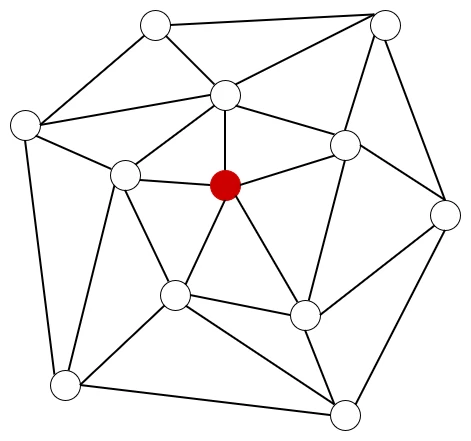
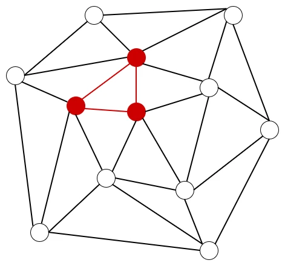
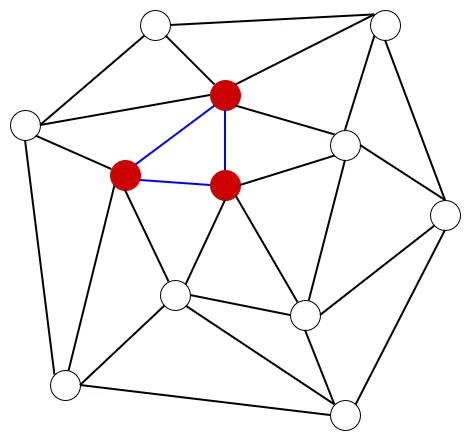
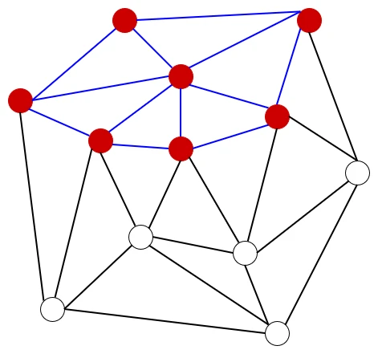
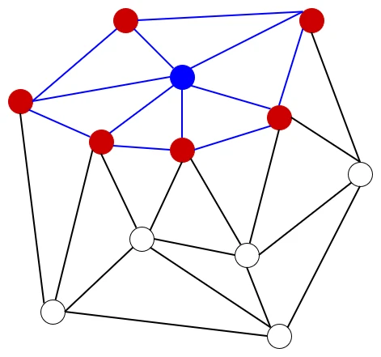
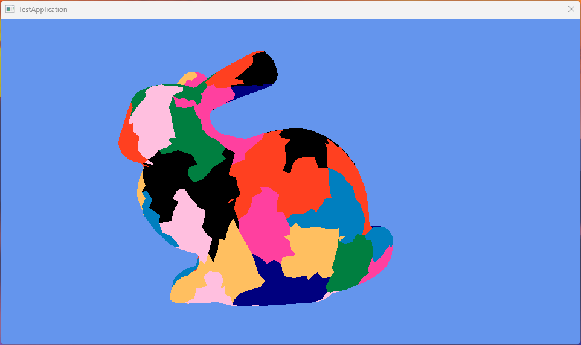

# Mesh ShaderでMeshletによる描画 Greedy編  
さて、前回に引き続いてMeshletの描画をやっていく.  
今回はAPIを使わず、自力でMeshletを作るのが目標!  
実装に関しては元論文のコードの1943行目からラストまで[^1]を参照してる、ということで始めよう！  

まず最初にデータの用意から.頂点のデータを用意していく.  
今回は頂点は位置とindexを取れるようにする.  
また、接続されている三角形も記録できるように`m_neighbors`で用意.  
更にこの頂点がすでに処理されているかを設定できるように、`m_isVisited`も用意した.  
```c++
struct Vertex
{
    XMFLOAT3 m_position;
    uint32_t m_index;
    std::vector<Triangle*> m_neighbors;
    bool m_isVisited = false;
};
```
三角形に関しては頂点のポインタで持たせるようにする、特に四角形と考慮はせずに3個のみ.  
そして`cetroid`,これはソート用に用意した変数.  
また、三角形に関しても`m_isVisited`で処理されているかを設定できるようにしてある.  
```c++
struct Triangle
{
    std::array<Vertex*, 3> m_vertices;
    XMFLOAT3 m_centroid; //for sort
    bool m_isVisited = false;
};
```

便利関数の用意、こちらはソート用.  
`sortIndex`を見て、軸指定で計算ができるようにしてある.  
0ならx,1ならy,2ならzといった感じ.  
Triangle側のソートは`centroid`を基準、これは後程何なのかわかる予定.  
頂点は`position`を基準、これは分かりやすいね、軸方向基準で一列になるようにソートしてるんだね.  
```c++
// sort function
int sortIndex = 0;
auto CompareTriangles = [sortIndex](const Triangle* t1, const Triangle* t2)
    {
        if (sortIndex == 1) { return t1->m_centroid.y < t2->m_centroid.y; }
        else if (sortIndex == 2) { return t1->m_centroid.z < t2->m_centroid.z; }
        return t1->m_centroid.x < t2->m_centroid.x;
    };
auto CompareVertices = [sortIndex](const Vertex* v1, const Vertex* v2)
    {
        if (sortIndex == 1) { return v1->m_position.y < v2->m_position.y; }
        else if (sortIndex == 2) { return v1->m_position.z < v2->m_position.z; }
        return v1->m_position.x < v2->m_position.x;
    };
```

そしたら変数周りの準備.  
最初はBBox,これは最小値点と最大値点があればどうにかなるので、`XMFLOAT3`2つで表現.  
```c++
    // BBox
    XMFLOAT3 minValue; minValue.x = (std::numeric_limits<float>::max)();
    minValue.y = minValue.x; minValue.z = minValue.x;
    XMFLOAT3 maxValue; maxValue.x = std::numeric_limits<float>::lowest();
    maxValue.y = maxValue.x; maxValue.z = maxValue.x;
```

次は頂点,単純に元のデータとなる頂点データは`pureVertices`で持たせる.  
ソートとかをする際は`vertices`というポインタ配列で`pureVertices`に参照を持たせる方式にしてみた.  
```c++
// Vertices
std::vector<Vertex> pureVertices; pureVertices.resize(mesh->GetVerticesNum());
std::vector<Vertex*> vertices; vertices.resize(mesh->GetVerticesNum());
```
さて、この頂点の配列は要はVertex Bufferの代替みたいなもの.  
なので、そのままVertex Bufferのパラメータを`pureVerticesに`移せばよい.  
indexは順に付けていき、`vertices`には参照として`pureVertices`につなげるだけ.  
```c++
for (auto i = 0u; i < vertices.size(); ++i)
{
    pureVertices[i].m_position = mesh->m_positions[i];
    pureVertices[i].m_index = i;
    vertices[i] = &pureVertices.at(i);
    
    // ...
}
```
そして、BBOXの値はそのまま最小値と最大値を決めるだけ.  
```c++
        minValue.x = min(minValue.x, vertices[i]->m_position.x);
        maxValue.x = max(maxValue.x, vertices[i]->m_position.x);
        minValue.y = min(minValue.y, vertices[i]->m_position.y);
        maxValue.y = max(maxValue.y, vertices[i]->m_position.y);
        minValue.z = min(minValue.z, vertices[i]->m_position.z);
        maxValue.z = max(maxValue.z, vertices[i]->m_position.z);
```
これで頂点は終わり!  

次はTriangle側の用意.  
頂点と同じようにpureとその参照で持たせる方式.  
```c++
std::vector<Triangle> pureTriangles; pureTriangles.resize(mesh->GetIndicesNum() / 3);
std::vector<Triangle*> triangles; triangles.resize(mesh->GetIndicesNum() / 3);
```
Triangleの方はIndex Bufferからアクセスを行う.  
Index Bufferがあれば3点は連続しているので、このアクセスで手に入る.  
なので、これを使ってまずはTriangleが参照する頂点のポインタを格納する.   
```c++
for (auto i = 0u; i < (mesh->GetIndicesNum() / 3); ++i)
{
    uint32_t index = i * 3;
    Triangle* triangle = &pureTriangles.at(i);

    // register vertices
    triangle->m_vertices[0] = &pureVertices.at(mesh->m_indices[index]);
    triangle->m_vertices[1] = &pureVertices.at(mesh->m_indices[index + 1]);
    triangle->m_vertices[2] = &pureVertices.at(mesh->m_indices[index + 2]);

    // ...
}
```
三角形の3頂点側はこの三角形を構成していることになる.  
なので、`m_neighbors`の方にこのtriangleを登録しておく.  
```c++
    // Register neighbor
    Vertex* vert1 = triangle->m_vertices[0];
    Vertex* vert2 = triangle->m_vertices[1];
    Vertex* vert3 = triangle->m_vertices[2];

    vert1->m_neighbors.push_back(triangle);
    vert2->m_neighbors.push_back(triangle);
    vert3->m_neighbors.push_back(triangle);
```
最後に`m_centroid`を計算.  
3頂点の位置を足して、3で割っている.  
これは三角形の重心の計算だね.  
centroidは重心の意だけど、これは三角形の重心なのでした.  
後は最後に`pureTriangles`の三角形を`triangles`に登録しておけば終わり！  
```c++
    // calculate simple average pos
    triangle->m_centroid.x = (vert1->m_position.x + vert2->m_position.x + vert3->m_position.x) / 3.0f;
    triangle->m_centroid.y = (vert1->m_position.y + vert2->m_position.y + vert3->m_position.y) / 3.0f;
    triangle->m_centroid.z = (vert1->m_position.z + vert2->m_position.z + vert3->m_position.z) / 3.0f;

    triangles[i] = triangle;
```

そしたら最後にソート処理を実行する.  
これは一番長い軸を対象として行う.  
頂点ならposition,triangleならcentroidだね.  
triangleは3点あるので、基準として重心を選んでる感じ.  
長い軸なのは論文をちゃんと読んでるわけではないのでわからないけど、まあ感覚的に狭いほど密になっちゃうので、長い軸を取りたいという気持ちはわかる...  
```c++
    // calculate length per axis
    XMFLOAT3 axis;
    axis.x = abs(maxValue.x - minValue.x);
    axis.y = abs(maxValue.y - minValue.y);
    axis.z = abs(maxValue.z - minValue.z);

    // sort by longest axis length!!
    if (axis.x > axis.y && axis.x > axis.z)
    {
        sortIndex = 0; // X
    }
    else if (axis.y > axis.z && axis.y > axis.x)
    {
        sortIndex = 1; // Y
    }
    else
    {
        sortIndex = 2; // Z
    }
    std::sort(vertices.begin(), vertices.end(), CompareVertices);
    std::sort(triangles.begin(), triangles.end(), CompareTriangles);
```

さて、なんでこういうソートをするの？という話だけど、Meshlet自体はある程度近い点を処理するのが良い.  
理由は簡単でカリングとかを今後行う場合はこのMeshlet単位となる.  
もしも離れている点があると、その点のせいでカリングが効いてない...ということになりかねないし、逆もしかりでなんか消えてる...といったことも起こりかねない.  
ということで近傍を保証するためにこういう処理をやってるのかなとは思う.  
まあ頂点同士の連結を見るので、大抵は気にしなくても問題なくはある.  

さて、そしたら実際にGreedyの処理に入る.  
まず処理する頂点を詰めるQueueを用意する.  
Meshlet単位で分割するvertexとtriangleは`tempVertices`と`tempTriangle`にため込んでいく.  
```c++
std::queue<Vertex*> verticesQueue;
std::vector<Vertex*> tempVertices;
std::vector<Triangle*> tempTriangles;
```

そしたらまずは頂点毎の処理.  
頂点が訪れていなければQueueに突っ込んで、`while`でQueueが空になるまで処理を繰り返す.  
```c++
for (Vertex* vertex : vertices)
{
    if (vertex->m_isVisited) { continue; }

    // push vertex
    verticesQueue.push(vertex);

    while (!verticesQueue.empty())
    {
        // ...
    }
```
これは要はまず適当な頂点を決めて突っ込んでるのに等しい.  
  

Queue内の処理に移る.  
まずQueueが空で内ならpopしてすでに訪れてるかを確認.  
既に訪れてるなら処理はいらないのでskipする.  
```c++
while (!verticesQueue.empty())
{
    // Get head data
    Vertex* currentVertex = verticesQueue.front();
    verticesQueue.pop();

    if (currentVertex->m_isVisited) { continue; }

    for (Triangle* triangle : currentVertex->m_neighbors)
    // ...
}
```
もしもまだ訪れたことがない場合、頂点のneighborsを見て、各triangleに対して処理を行っていくことになる.  
勿論Triangleもすでに追加済みだったらskip.  
処理していないTriangleであれば頂点を見て、まだ訪れたことがない頂点ならQueueに突っ込んでおく.  
```c++
for (Triangle* triangle : currentVertex->m_neighbors)
{
    Vertex* vert1 = triangle->m_vertices[0];
    Vertex* vert2 = triangle->m_vertices[1];
    Vertex* vert3 = triangle->m_vertices[2];

    // if not registered, register triangle.
    if (triangle->m_isVisited)
    {
        // if registered, skip.
        continue;
    }

    // if not searched, push queue.
    if (vert1->m_isVisited == false) { verticesQueue.push(vert1); }
    if (vert2->m_isVisited == false) { verticesQueue.push(vert2); }
    if (vert3->m_isVisited == false) { verticesQueue.push(vert3); }

    // ...
}
```
こうしてQueueにっつこむことで三角形が登録されたことになる.  
  

Queueに追加後はtempに頂点を追加できるかを確認する.  
すでにtempに追加されてる場合の二重登録を避けるためである.  
そして、追加できる頂点数を数えておく.  
```c++
    // hou much add vertex to temp vertex list?
    bool isVert1 = std::find(tempVertices.begin(), tempVertices.end(), vert1) == tempVertices.end();
    bool isVert2 = std::find(tempVertices.begin(), tempVertices.end(), vert2) == tempVertices.end();
    bool isVert3 = std::find(tempVertices.begin(), tempVertices.end(), vert3) == tempVertices.end();
    int mustAddVertexCount = 0;
    if (isVert1) { mustAddVertexCount++; }
    if (isVert2) { mustAddVertexCount++; }
    if (isVert3) { mustAddVertexCount++; }
```
次に追加予定の個数分の空きがあるかを確認する.  
meshletは最大数の縛りがあるので、ちゃんとここを満たすように分割する必要があるためである.  
```c++
    // is full triangle?
    bool isAddVertex = (tempVertices.size() + mustAddVertexCount) < MAX_VERTICES;
    bool isAddTriangle = (tempTriangles.size() + 1) < MAX_TRIANGLES;
```
そして突っ込めるかを確かめて、突っ込める場合を見ていく.  
突っ込める場合は頂点はまだ追加してない分のみ追加するようにする.  
Triangleもそのまま突っ込むが、triangleはここで訪れたマークを付けておく.  
Triangle自体はこれ以上別のところで追加されることはないからだね.  
頂点は複数のTriangleと結びついているため、ここで訪れたことにすることはできません.  
```c++
    if (!isAddVertex || !isAddTriangle)
    {
        // ...
    }
    else
    {
        // Add Vertex
        if (isVert1) { tempVertices.push_back(vert1); }
        if (isVert2) { tempVertices.push_back(vert2); }
        if (isVert3) { tempVertices.push_back(vert3); }

        // Add Triangle and flag on
        tempTriangles.push_back(triangle);
        triangle->m_isVisited = true;
    }
```
これで三角形に関しては訪れたことになったので、青にしておこう.  
  
さて、今の処理を何度も何度も行うと、段々と広がっていくことになる.  
  
そしてTriangleが全部tempに突っ込めた状態になったとき,初めて頂点は訪問した状態にできる.  
```c++
    for (Triangle* triangle : currentVertex->m_neighbors)
    {
        // ...
    }

    // if all triangle is registered, vertex don't have to search.
    // so flag on.
    currentVertex->m_isVisited = true;
```
こんな感じで片っ端に近いものを貪欲(Greedy)に突っ込んでいくので、Greedy法なんだね.  
  

さて、ではtempが全部埋まったときがそのうち来る.  
tempが埋まっているということはMeshletが全部埋まって分割できる状態になったということになる.  
なので、この場合は`Construct`関数を呼び出してmeshletの構築を行う.  
構築後は単純に現在のQueueを空にして、現在の頂点のみにしてやり直すだけ.  
```c++
    if (!isAddVertex || !isAddTriangle)
    {
        Construct();

        // init for next loop.
        std::queue<Vertex*>().swap(verticesQueue);
        verticesQueue.push(currentVertex);
        tempVertices.clear();
        tempTriangles.clear();

        break;
    }
```

さて,ということで`Construct`を見ていこう.  
Constructではまず現状のオフセットの位置を確定させる.  
今までに突っ込まれたmeshletのデータ数をOffsetにするだけ.  
```c++
auto Construct = [&]()
    {
        // calculate prev start point.
        ResourceMeshlet meshlet;
        meshlet.m_vertexOffset = mesh->m_uniqueVertexIndices.size();
        meshlet.m_primitiveOffset = mesh->m_primitiveIndices.size();
        
        // ...
    };
```

そしたらまずは頂点、こいつはデータをそのまま突っ込むだけでOK.  
Offsetはすでに取ってあるので無心で突っ込む!  
```c++
        // Add Vertex
        for (const Vertex* vertex : tempVertices)
        {
            mesh->m_uniqueVertexIndices.push_back(vertex->m_index);
        }
```

ポリゴンの場合はちょっと面倒.  
まず最初にポリゴンの頂点が頂点のどの位置にあるかを計算する.  
これは`find`で位置を確定させて、`distance`で距離を求めればOK.  
あとはpackして突っ込めばOK.  
```c++
        for (const Triangle* triangle : tempTriangles)
        {
            auto vertexIter = std::find(tempVertices.begin(), tempVertices.end(), triangle->m_vertices[0]);
            uint32_t vi0 = std::distance(tempVertices.begin(), vertexIter);
            vertexIter = std::find(tempVertices.begin(), tempVertices.end(), triangle->m_vertices[1]);
            uint32_t vi1 = std::distance(tempVertices.begin(), vertexIter);
            vertexIter = std::find(tempVertices.begin(), tempVertices.end(), triangle->m_vertices[2]);
            uint32_t vi2 = std::distance(tempVertices.begin(), vertexIter);

            uint32_t packed =
                ((static_cast<uint32_t>(vi0) & 0xFF) << 0) |
                ((static_cast<uint32_t>(vi1) & 0xFF) << 8) |
                ((static_cast<uint32_t>(vi2) & 0xFF) << 16);

            mesh->m_primitiveIndices.push_back(packed);
        }
```
頂点に対するIndexはあくまで`m_uniqueVertexIndices`.  
この`m_uniqueVertexIndices`のOffset位置からのIndexを入れてるのが`m_primitiveIndices`.  
二段階のindex構造というのがここのデータの突っ込み方を見るとちょっと理解が深まるかと思う,自分は深まった.  

ということで最後にCountで数を設定して、このデータをmeshletとして保存すれば終わり！！  
```c++
        // calculate size and store it.
        meshlet.m_vertexCount = tempVertices.size();
        meshlet.m_primitiveCount = tempTriangles.size();
        mesh->m_meshlets.push_back(meshlet);
```

さて、ここで注意、頂点のループの終わりにも`construct`は必要.  
```c++

for (Vertex* vertex : vertices)
{
    // ...
}

// when loop finished and triangle remained, make meshlet.
if (tempTriangles.size() > 0)
{
    Construct();
}
```
理由は簡単で、満タンになる前に全部の処理が終わる場合もあるからである.  
例えば頂点が700個だとしたら、`MAX_VERTICES=64`なので、meshletは10個は埋まるけど最後のmeshletは60頂点で満タンではない.  
でも、データとしては確定させる必要があるので、Constructの呼び出しが必要ってことだね.  

meshletのデータが完全にできた後は4bitalignを忘れずにやっておく.  
GPU上のデータは綺麗に揃える心が大事.  
```c++
ResourceMeshlet& last = mesh->m_meshlets[meshletCount - 1];
    mesh->m_primitiveIndices.resize(last.m_primitiveOffset + ((last.m_primitiveCount * 3 + 3) & ~3));
```

さて、そしたら結果.  
  
うん、いい感じで描画されてる！  

こうやって自分で組んでるとmeshletの構造も見えてくるので面白いもんですね.  
次回はもう少し違った手法、bounding sphereを見ます.  

[^1]: [meshletMeshDescriptor](https://github.com/Senbyo/meshletmaker/blob/main/core/meshletMeshDescriptor.cpp)