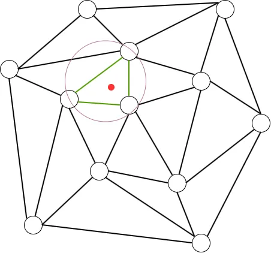
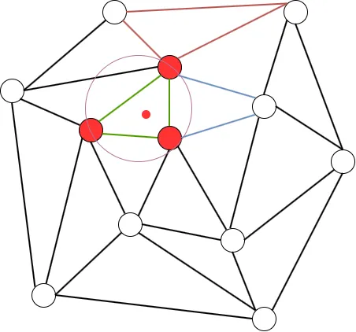
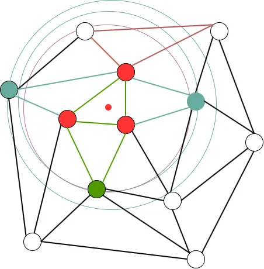
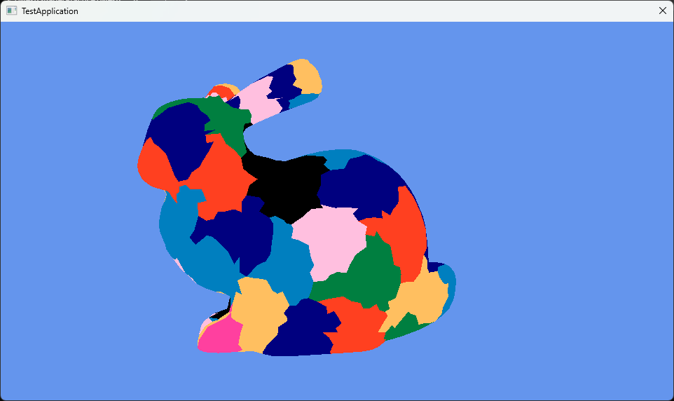

# Mesh ShaderでMeshletによる描画 Bounding Sphere編  
さて、今回がMeshlet生成のラスト.Bounding Sphereをやっていく.  
実装に関しては今回も元論文のコード,493行目からswitch内が終わるまで[^1]を参照してる、ということで始めよう！  

今回の実装は結構前回と被ってるところも多い.  
例えば一番最初の頂点とポリゴンの用意、ソート,そしてConstructの関数といったところは全く同じ.  
なので、同じような処理の部分はガンガン省いていく.  
正式なコードは別途貼ってあるので、そっちを参考にしれもらえればと思う.  

今回のStructはちょっと改造をする.  
まあたいしたことではないんだけど、Vertexから`m_isVisited`を消す.  
今回は頂点に対して訪れたかのマークはいらない.  
Triangle側のみ`m_isVisited`はあればよい.  
```c++
struct Vertex
{
    XMFLOAT3 m_position;
    uint32_t m_index;
    std::vector<Triangle*> m_neighbors;
};
```

今回も計算で使うちょっとした便利関数.  
単純に距離を計算するだけ,差を取って内積を計算してsqrtするだけ.  
```c++
auto LengthVec3 = [](XMFLOAT3& lhs, XMFLOAT3 rhs)
    {
        float x = lhs.x - rhs.x;
        float y = lhs.y - rhs.y;
        float z = lhs.z - rhs.z;
        return sqrt(x * x + y * y + z * z);
    };
```

今回は前回みたいにQueueではなく`radius`と`center`を用意する.  
```c++
float radius = 0.0f;
XMFLOAT3 center = XMFLOAT3(0.0f, 0.0f, 0.0f);
```

そしたら今回の処理は頂点を基準に始まる.  
終了条件は最後の頂点まで操作したら.  
ただしincrementは定義しない.  
ループの中で勝手に決まることになる.  
```c++
for (auto i = 0u; i < vertices.size(); /* no cond */)
{
    // ...
}
```
そしたら頂点はindexのものを取得.  
そして最適なTriangleのポインタと新しい頂点用のポインタを用意.  
Radiusも2つ用意して、scoreも用意しとく.  
これらを上手く駆使してデータを用意していくことになる.  
```c++
    Vertex* vertex = vertices[i];

    Triangle* bestTriangle = nullptr;
    Vertex* newVertex = nullptr;
    float newRadius = (std::numeric_limits<float>::max)();
    float bestNewRadius = newRadius - 1.0f;
    int bestVertexScore = 0;
```

そしたらまずは絶対に初回は通る処理.  
`bestTriangle`がnullptrの時.  
一番最初のBestなTriangleを探して指定する.  
勿論すでに処理したTriangleは除く.  
```c++
    if (bestTriangle == nullptr)
    {
        for (Triangle* triangle : vertex->m_neighbors)
        {
            if (triangle->m_isVisited) { continue; }

            // Register Triangle
            bestTriangle = triangle;
            
            // ...
        }
    }
```

そしたらパラメータも設定.  
中心を設定して、中心とTriangleのVertexの距離の中で最大のものを`bestNewRadius`として採用する.  
こうして`bestTriangle`が見つかったらbreakで終了.  
```c++
            // Update Parameter
            center = triangle->m_centroid;
            bestNewRadius = LengthVec3(center, triangle->m_vertices[0]->m_position);
            bestNewRadius = max(bestNewRadius, LengthVec3(center, triangle->m_vertices[1]->m_position));
            bestNewRadius = max(bestNewRadius, LengthVec3(center, triangle->m_vertices[2]->m_position));

            // find only a triangle.
            break;
```

ここまでの流れは図にすると次のような感じ.  
  
緑の三角形を一つ選んで、赤の中心から新しくピンクの円を作る.  
円は`center`を中心とした`bestNewRadius`を半径とした円だ.  

もしもここの処理でそもそもTriangleが見つからない場合もあり得る.  
既に近傍の頂点が持つTriangleを探し終えたということだ.  
この場合は次の頂点に移動する.for文ではやってないincrementはここで行われるのである！  
```c++
        // if not found next triangle, you can translate next loop!
        if (bestTriangle == nullptr)
        {
            ++i;
            continue;
        }
```

そしたら次は前回と同じ、追加する頂点かの判定.  
一つだけ違う点があるとすれば、ここで`newVertex`を選出している点だ.  
これは`temp`に追加される頂点から選出を行う.  
```c++
        // best Triangle vertex
        Vertex* vert1 = bestTriangle->m_vertices[0];
        Vertex* vert2 = bestTriangle->m_vertices[1];
        Vertex* vert3 = bestTriangle->m_vertices[2];

        // hou much add vertex to temp vertex list?
        bool isVert1 = std::find(tempVertices.begin(), tempVertices.end(), vert1) == tempVertices.end();
        bool isVert2 = std::find(tempVertices.begin(), tempVertices.end(), vert2) == tempVertices.end();
        bool isVert3 = std::find(tempVertices.begin(), tempVertices.end(), vert3) == tempVertices.end();
        
        // count and change new vertex.
        int mustAddVertexCount = 0;
        if (isVert1) { newVertex = vert1; mustAddVertexCount++; }
        if (isVert2) { newVertex = vert2; mustAddVertexCount++; }
        if (isVert3) { newVertex = vert3; mustAddVertexCount++; }
```

もし追加する予定の頂点がある場合は現状の`radius`と`center`を更新しておく.  
`radius`は一番大きいのにしておく.  
`center`は中心を再計算.`FLT_EPSILON`があることでcenterの位置よりも本当に少しだけ`newVertex`の位置に寄った位置にずれる.  
```c++
        radius = bestNewRadius;

        // if all vertex added but triangle isn't add pattern.
        // this pattern value is 0, it skip radius update.
        if (mustAddVertexCount != 0)
        {
            // Update
            XMFLOAT3 tempCenter;
            XMFLOAT3 pos = newVertex->m_position;
            tempCenter.x = pos.x + (radius / (FLT_EPSILON + LengthVec3(center, pos))) * (center.x - pos.x);
            tempCenter.y = pos.y + (radius / (FLT_EPSILON + LengthVec3(center, pos))) * (center.y - pos.y);
            tempCenter.z = pos.z + (radius / (FLT_EPSILON + LengthVec3(center, pos))) * (center.z - pos.z);
            std::swap(tempCenter, center);
        }
```

`newVertex`に寄った位置にずれるというのは多分こんな感じで理解すればいいはず.  
[meshlet_005_02](Image/meshlet_05_002.webp)  
緑の`newVertex`に向かって中心がずれてるという感じ.  
ちょっと大げさだけど、実際は凄い小さいスケールの動きではあると思う.  

そしたら最後の`Construct`,前と同じでこれ以上突っ込めないならmeshletとして確定させる.  
もしまだ突っ込める場合は、今のTriangleを確定させてtempに入れる.もちろん`visited`にマーク.  
そして頂点もtempに入れておく.  
今回はあくまで三角形単位にvisitedは決まるため、頂点はtemp内になければ突っ込む方針だね.  
```c++
        // is full triangle?
        bool isAddVertex = (tempVertices.size() + mustAddVertexCount) < MAX_VERTICES;
        bool isAddTriangle = (tempTriangles.size() + 1) < MAX_TRIANGLES;
        if (!isAddVertex || !isAddTriangle)
        {
            Construct();

            // init for next loop.
            tempVertices.clear();
            tempTriangles.clear();
            continue;
        }

        // register triangle and vertices.
        bestTriangle->m_isVisited = true;
        tempTriangles.push_back(bestTriangle);
        if (isVert1) { tempVertices.push_back(vert1); }
        if (isVert2) { tempVertices.push_back(vert2); }
        if (isVert3) { tempVertices.push_back(vert3); }        
```

さて、ここまでくるとfor文がまた最初に戻ることになる.  
このとき、1週目でtempにデータが入ったことで、今まで入ってなかったところの処理に入ることになる.  
それがここだ.  
突っ込まれた頂点を見て、その頂点が持つ三角形を処理できるかを確認する.  
もしすでに処理済みなら無視、といった感じを行う.  
あくまで今回は三角形単位となっており、三角形が主役.  
```c++
for (Vertex* v : tempVertices)
{
    for (Triangle* triangle : v->m_neighbors)
    {
        if (triangle->m_isVisited) { continue; }
        // ...
    }
}
```

そしたらまずは三角形の頂点を調べる.  
もし頂点がtempに突っ込まれてるなら`vertexScore`を+1しておく.  
もし突っ込んだことがなければ`newVertex`として登録.  
```c++
        // Get info about triangle
        int vertexScore = 0;
        for (int k = 0; k < 3; ++k)
        {
            Vertex* target = triangle->m_vertices[k];
            if (std::find(tempVertices.begin(), tempVertices.end(), target) == tempVertices.end())
            {
                // don't add meshlet yet.
                newVertex = target;
                continue;
            }

            // already add meshlet.
            ++vertexScore;
        }
```

そしたら次にTriangleの頂点から`neighbor`となるTriangleを調べる.  
自分は除きつつ`neighbors`を+1する.  
そして、すでに突っ込まれてる場合も`used`に+1しておく.  
最後に`used`と`neighbors`が同数か調べて、同数なら`vertexScore`を+1しておく.  
こうすることで`vertexScore`の最大は4となることが分かる.  
```c++
        // Search Triangle Neighbors
        int used = 0;
        int neighbors = 0;
        for (Vertex* v : triangle->m_vertices)
        {
            for (Triangle* neighborTriangle : v->m_neighbors)
            {
                // not add self.
                if (neighborTriangle == triangle) { continue; }

                neighbors++;
                if (neighborTriangle->m_isVisited) { used++; }
            }
        }

        if (used == neighbors) { vertexScore++; }
```

そしたら分岐で更新を考える.  
まず最初は`vertexScore`が3 or 4のとき.  
```c++
        // Update Radius
        if (vertexScore == 3 || vertexScore == 4)
        {
            // Score == 3 means that 3 vertex is added to meshlet.
            // Score == 4 means that 3 vertex is added to meshlet,
            // but triangle isn't added meshlet. it's corner case.
            newRadius = radius;
        }
```
3というのは全部の頂点がtempに突っ込まれている状態の時.  
つまり、Meshletに追加する必要がない場合.  
この場合はradiusはすでに存在するものに設定.  
次に4,これは全部の頂点はtempに突っ込まれてるし、neighborも全部突っ込まれてる場合.  
この時何故ここに入れてるかというと,もし入れてない場合この後の分岐で`newVertex`にアクセスすることになる.  
でも,3頂点がtempにあるので、`newVertex`がそもそも存在しないというコーナーケースとなる.  
この時アクセスしてもnullptrであるため、このように4の場合も半径の更新にとどめているのである.  

次のここはアルゴリズムに書いてあるもののあまりわかってない...  
まあtempに入ってない頂点が2つ以上ある場合は更新優先度が低いくらいでもいいのかもしれない.  
複数頂点が突っ込まれていない状態なので、頂点1つの場合があくまで優先的な.  
要は頂点一つの場合、辺が繋がってるわけはないのでねぇ.  
```c++
        else if (vertexScore == 1)
        {
            continue;
        }
```

ここの2頂点がtempにいる場合は更新になってる.  
この場合は辺の計算を行う.  
こう見ると基本的に辺のつながりがあるのを更新対象にしてるともいえそう.  
```c++
        else
        {
            newRadius = 0.5 * (radius + LengthVec3(center, newVertex->m_position));
        }
```

要はここの更新するかどうかの判定はこんな感じ.  
  
赤のように頂点が1つの場合はダメで、青のように2頂点を含んでいる場合は辺を接地していて1頂点のみとなるので突っ込むのOK的な.  
気持ちとしてはわかる気がする.  

では`vertexScore`が0の場合はどうなんだ？と思うかもしれないけど、たぶんこの場合はないんじゃないかなぁとは思う.  
そもそもここの処理に入るためには頂点がすでに入ってる状態で`neighbor`を調べるので、最低でも1つは存在していることになる.  
要は先ほどのように赤い頂点がtemp内にある状態でneighborを探すから,0にはなりえないということであるかと.  

さて、そしたら最後にデータを突っ込む処理.  
前半は簡単、頂点がデータに突っ込まれてるものを優先的に選ぶ.  
この条件は`vertexScore=3,4`のものが特に権限が強い.  
半径の内側なので優先しようということである.  
そしてこの条件を外れる場合は、その中で半径が小さいものを選ぶことになる.  
この条件を満たすものの`Score`と`Radius`を更新し、次にMeshletに突っ込む`Triangle`を選出する.  
```c++
        // Update best
        if (bestVertexScore < vertexScore || newRadius < bestNewRadius)
        {
            bestVertexScore = vertexScore;
            bestNewRadius = newRadius;
            bestTriangle = triangle;
        }
```
条件としてできるだけ最小のものを選んでいるというのは一目瞭然な処理であるね.  
最初の条件は内側なので、現状の最小円内なので優先.  
そして、その条件を外れる場合は、その周りの頂点が作る中で、最小の頂点を選出していくという風な感じ.  

  
要はこんな感じで辺を共有する3つの三角形について調べて、一番小さいピンクの円が最小なのでこれを共有する緑の頂点と三角形を新しく選出!!  
これを繰り返すことで最小円を保ちつつ、Meshletを構築するのがBounding Sphere法となる.  
最小のBounding球を満たすように追加するので、`Bounding Sphere法`なんだね.  

さて、最後に結果を見て終わりますか.  
  

うん、いい感じ！  
今回でMeshlet構築は終了～.  
次回はちょっとずれてInstancingをやっていこうかなと思います!  

[^1]: [meshletMeshDescriptor](https://github.com/Senbyo/meshletmaker/blob/main/core/meshletMeshDescriptor.cpp)