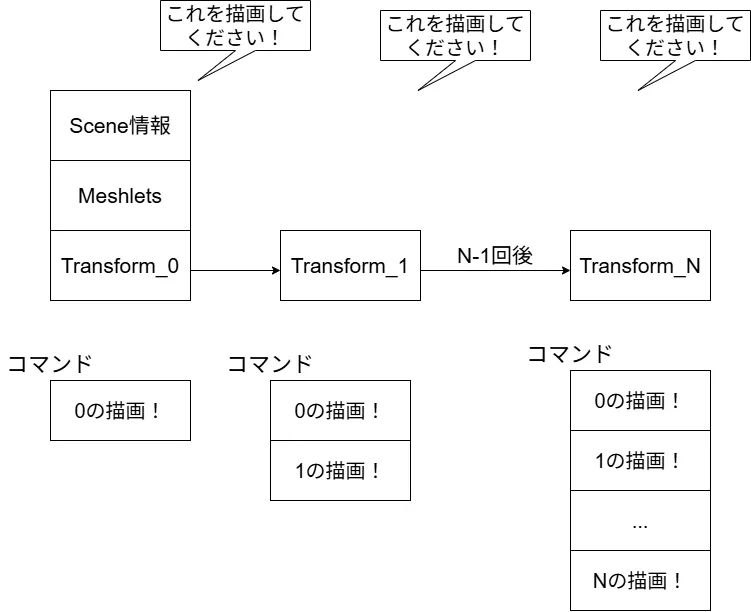
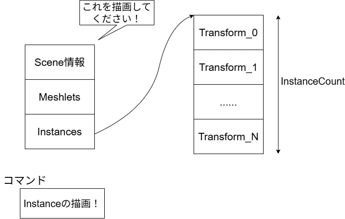
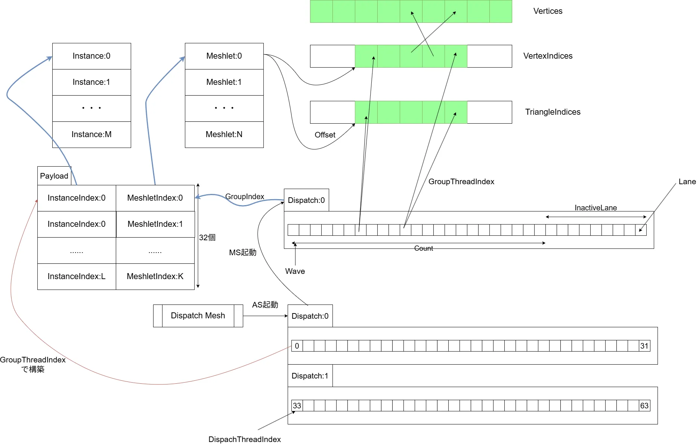
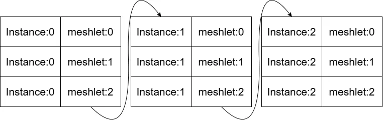
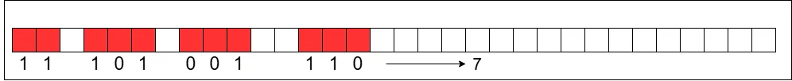
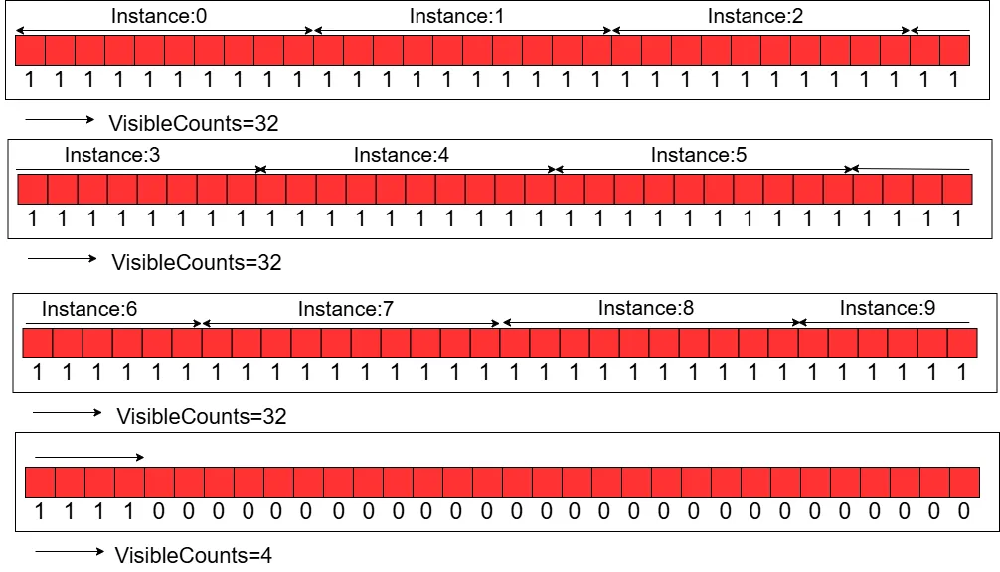
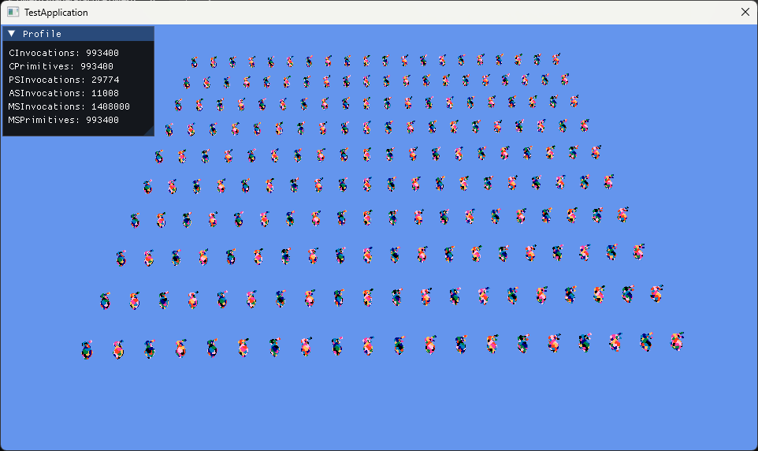

# Instancingで沢山出してみよう！ ～ ASを添えて ～
前回まででモデルを出せるようになったので、次はInstancingをやってみよう.  
Instancingはとても単純で、必要なデータをまとめて命令として投げれば1つずつ投げていくよりも効率いいよねというやつ.  
今回も参考文献[^1]を見つつ、自分なりに理解しながらやってみた.  

まず普通に1つずつ描画していく場合を考えてみる.  
UnityとかでもGPU Instancingを使わない場合はこんな感じになるはず.  

  

これを今まで書いたコードを参考に疑似コードで書くならこんな感じ.  
```c++
    auto obj = objects[index]; 

    // set descriptor heap table
    for (auto i = 0u; i < m_model.GetMeshCount(); i++)
    {
        auto mesh = m_model.GetMesh(i).lock();

        //camera
        command->SetGraphicsRootConstantBufferView(0, m_cameraCB[index].GetGpuAddress());

        // meshlet
        command->SetGraphicsRootShaderResourceView(1, mesh->GetPositions().GetGpuAddress());
        command->SetGraphicsRootShaderResourceView(2, mesh->GetMeshlets().GetGpuAddress());
        command->SetGraphicsRootShaderResourceView(3, mesh->GetUniqueVertexIndices().GetGpuAddress());
        command->SetGraphicsRootShaderResourceView(4, mesh->GetPrimitiveIndices().GetGpuAddress());
        command->SetGraphicsRootShaderResourceView(5, obj->GetTransformBuffer().GetGpuAddress()); // Transformが毎回変更必要
        command->SetGraphicsRootShaderResourceView(6, obj->GetMaterialBuffer().GetGpuAddress()); // Materialがあればこういうのもあるかも

        // Draw
        command->DispatchMesh(static_cast<UINT>(mesh->GetMeshletCount()), 1, 1);
    }
```

実際はマテリアルだったりの情報も必要だったりはするけど、今回はTransform,さらに言えばWorld Matrixのみで考えてもらっても良い.  
Transformが違うだけなのであるが、そのために毎回コマンドは詰まれて行くことになる.  
コマンドの呼び出しが多いとその分CPUからGPUにデータを送る必要がある.  
一つのコマンドを実行した後にまた変更して、これも変更して...というのは結構処理負荷が高い.  
これはTextureなんかだったりした場合はとても処理負荷が高くなってしまう...  
そのためどうにかしてここを早くしたい、どうするか.  
1回のドローコールでまとめて処理できるようにデータを参照するようにしてしまいましょう.これが今回の目標.  

データのまとめ方は非常に今回の場合は非常に簡単、Transformをまとめてあげるだけ.  

  

こんな感じでInstanceのBuffer自体を渡してあげることで、実際に処理をするようにしてあげることにする.  
単純だけどこうしてまとめてあげるだけでも、余計なドローコールが一気に減るので結構効果がある.  
UnityのGPU Instancingだったり、UEのAuto Instancingとかも大体同じ考え方の高速化手法ですよね.  

さて、そしたらまず何から手を付けようかとなりますが、とりあえずリソースを用意してみる.  
MATRIXを保持する用とGPU側で使用するためにStructuredBufferを今回は用意.  
```c++
	// instance
	std::vector<XMMATRIX> m_instances;
	StructuredBuffer m_instancesBuffer;
```

今回は適当に並べるために定数も用意.  
```c++
	static constexpr uint32_t InstanceColsNum = 20;
	static constexpr uint32_t InstanceRowsNum = 10;
```

そしたらX-Z平面に対してモデルを並べていく.  
まず最初に必要な分だけ`m_instances`をresizeしてMATRIXを確保しておく.  
モデルの大きさに関してはSpanで取れるようにしてあるため、大体の大きさは最大のSpanを取ればわかる.  
これを後は使って`instanceSpanX`のようにoffsetを作ってずらして配置すればOK.  
昔に分子動力学シミュレーションの動画を作ったけど、あの時に似たようなことやったね.  
最後に現状の`m_instances`を使って、StructuredBufferである`m_instancesBuffer`を初期化すれば準備は完了.  
```c++
bool SimpleInstancedApp::OnInitialize()
{
    // ...

    // setup instances
    {
        m_instances.resize(InstanceColsNum * InstanceRowsNum);

        // Calculate max span
        XMFLOAT3 span = m_model.GetBounds().GetSpan();
        float maxSpan = std::max(span.x, span.z);

        // per instance
        float instanceSpanX = 2.0f * maxSpan;
        float instanceSpanZ = 4.0f * maxSpan;

        // total span
        float totalSpanX = InstanceColsNum * instanceSpanX;
        float totalSpanZ = InstanceRowsNum * instanceSpanZ;

        // Calculate Position
        for (auto j = 0u; j < InstanceRowsNum; ++j)
        {
            for (auto i = 0u; i < InstanceColsNum; ++i)
            {
                float x = i * instanceSpanX - (totalSpanX / 2.0f) + instanceSpanX / 2.0f;
                float y = 0.0f;
                float z = j * instanceSpanZ - (totalSpanZ / 2.0f) - 2.15f * instanceSpanZ;

                uint32_t index = j * InstanceColsNum + i;
                m_instances[index] = DirectX::XMMatrixTranslation(x, y, z);
            }
        }

        // Write Buffer
        m_instancesBuffer.Initialize(command, m_instances.size(), sizeof(XMMATRIX), m_instances.data());
    }

    // ...
}
```

削除も追加を忘れずに.  
```c++
bool SimpleInstancedApp::OnTerminate()
{
    // ...

    m_instancesBuffer.Terminate();

    // ...
}
```

更新は特にやらなくてもいいけど、今回は見栄えをよくするために回転をするようにしてみた.  
ほぼ上記のコードと同じですが、回転をするところが`DirectX::XMMatrixRotationY(angle)`で追加されてるくらい.  
今見返すとまとめた方が綺麗だったな...という気がしてきてしまったけど、まあそういうときもある.  
```c++
void SimpleInstancedApp::OnUpdate(double deltaTime)
{
    // Calculate max span
    XMFLOAT3 span = m_model.GetBounds().GetSpan();
    float maxSpan = std::max(span.x, span.z);

    // per instance
    float instanceSpanX = 2.0f * maxSpan;
    float instanceSpanZ = 4.0f * maxSpan;

    // total span
    float totalSpanX = InstanceColsNum * instanceSpanX;
    float totalSpanZ = InstanceRowsNum * instanceSpanZ;

    // Calculate Position
    for (auto j = 0u; j < InstanceRowsNum; ++j)
    {
        for (auto i = 0u; i < InstanceColsNum; ++i)
        {
            float x = i * instanceSpanX - (totalSpanX / 2.0f) + instanceSpanX / 2.0f;
            float y = 0.0f;
            float z = j * instanceSpanZ - (totalSpanZ / 2.0f) - 2.15f * instanceSpanZ;

            uint32_t index = j * InstanceColsNum + i;
            double angle = GetGlobalRelativeTime();
            m_instances[index] = 
                DirectX::XMMatrixRotationY(angle) * DirectX::XMMatrixTranslation(x, y, z);
        }
    }

    // ...
}
```

そしたら実際にデータを使えるようにしておく.  
これでGPU側に渡るデータが回転後のデータが渡されることになる.  
```c++
void SimpleInstancedApp::OnRender()
{
    // ...

    // update instance
    GraphicsProxy::UpdateBuffer(command, m_instancesBuffer.GetResource(), m_instances.data());
    m_instancesBuffer.ChangeState(command, D3D12_RESOURCE_STATE_GENERIC_READ);

    // ...
}
```

あとはRootSignatureにも拡張をしておくのを忘れずに.  
```c++
params.push_back(PARAM_SRV{ D3D12_SHADER_VISIBILITY_MESH, 0, 0 });
params.push_back(PARAM_SRV{ D3D12_SHADER_VISIBILITY_MESH, 1, 0 });
params.push_back(PARAM_SRV{ D3D12_SHADER_VISIBILITY_MESH, 2, 0 });
params.push_back(PARAM_SRV{ D3D12_SHADER_VISIBILITY_MESH, 3, 0 });
params.push_back(PARAM_SRV{ D3D12_SHADER_VISIBILITY_MESH, 4, 0 }); // ここを追加,m_instanceBuffer用
```

そして、データを実際に渡すように.  
ということで、これでCPU側のInstanceの情報に関しては完結した.  
```c++
    // set descriptor heap table
    GraphicsProxy::BeginQuery(command);
    for (auto i = 0u; i < m_model.GetMeshCount(); i++)
    {
        // ...

        // meshlet
        command->SetGraphicsRootShaderResourceView(1, mesh->GetPositions().GetGpuAddress());
        command->SetGraphicsRootShaderResourceView(2, mesh->GetMeshlets().GetGpuAddress());
        command->SetGraphicsRootShaderResourceView(3, mesh->GetUniqueVertexIndices().GetGpuAddress());
        command->SetGraphicsRootShaderResourceView(4, mesh->GetPrimitiveIndices().GetGpuAddress());
        command->SetGraphicsRootShaderResourceView(5, m_instancesBuffer.GetGpuAddress()); // ここを追加

        // ...
    }
```

ここまできたらShader側をちょっとずつ準備をしよう.  
これまではMesh ShaderとPixel Shaderの二つを書いていた.  
Mesh Shaderには前にも書いたが、これよりも前にAmplified Shaderという書いても書かなくてもよいShaderがある.  
これは頂点を増やしたり減らしたりカリングしたり、そしてShaderでMesh Shaderを起動するといった前処理をする場所.  
今回大事なのはこの中の「ShaderでMesh Shaderを起動する」という点！これが大事.  
文字通りなんとShader側でMesh Shaderを使うかどうかを判断できるわけである.  
構造が変わるので、画像でちょっと見てみよう.  

  

う～ん、とんでもない感じになってきた.自分なりにどんな感じの処理をやってるのかなというのをまとめた図である.  
今まではDispatchMeshを呼び出した際は`Mesh Shader`を直接コールするような見た目になっていた.  
しかし、実はこれよりも更に下の方に`Amplification Shader`をコールするという風な見た目になっている.  
あくまで`AS`がCPU側のDispatchMeshでコールされており、`MS`は`AS`,つまりGPU側でコールされるものというのが大事っぽい.  
`AS`では`Payload`というデータを用意することが可能で、これを受け渡して`MS`で利用するという機構がある.  
DXRでもそうだったけど、この受け渡しを駆使してデータにアクセスしていくのがミソで、Payloadを使うことで上手くMeshletにアクセスするようになる.  
今回はMeshletだけでなくInstanceも渡していくわけだけども、とりあえずまずはとにかくASをstep by stepで構築して理解した方が速そうだ.  

まずはShader側のリソースを見ていく.  
Sceneのプロパティは前回まではView-projection行列のみであったが、今回は追加でinstanceの数とmeshletの数を定義できるようにする.  
これはConstantBufferとして用意.  
```c++
struct SceneProperties
{
    float4x4 MVP;
    uint InstanceCount;
    uint MeshletCount;
};

ConstantBuffer<SceneProperties> Scene : register(b0);
```

次にRoot Signature側の拡張.  
今回、このConstantBufferは`D3D12_ROOT_PARAMETER_TYPE_32BIT_CONSTANTS`を利用する.  
これは64byteが最大ではあるけど、気軽に書き込めるパラメータで非常に有用な者.  
今回書き込むものはMVPの行列1つなので、floatが16個.つまりまず16byte.  
そして、Instance数とMeshlet数がそれぞれuint、つまり2byte.  
この合計である18を設定しておいてあげればよい.  
```c++
std::vector<D3D12_ROOT_PARAMETER> params;
params.push_back(PARAM_CONSTANT{ D3D12_SHADER_VISIBILITY_ALL, 18, 0, 0}); // 18 = sizeof(XMMATRIX) + sizeof(UINT) * 2
params.push_back(PARAM_SRV{ D3D12_SHADER_VISIBILITY_MESH, 0, 0 });
params.push_back(PARAM_SRV{ D3D12_SHADER_VISIBILITY_MESH, 1, 0 });
params.push_back(PARAM_SRV{ D3D12_SHADER_VISIBILITY_MESH, 2, 0 });
params.push_back(PARAM_SRV{ D3D12_SHADER_VISIBILITY_MESH, 3, 0 });
params.push_back(PARAM_SRV{ D3D12_SHADER_VISIBILITY_MESH, 4, 0 });
```

こいつの便利な点は直接バインドができる点.  
普通だったらCBVを作成してバインドする必要があるんだけども、直接ポインタを渡して値を設定できるのが楽で良い.  
その代わり入れられる量が64byteなんだけども、そのまま放り込むだけでいいようなのがあるの今回初めて知りました.  
```c++
//camera
// こんな感じで直接データをポインタで渡してあげるだけでOK！
command->SetGraphicsRoot32BitConstants(0, 16, &proj, 0);
command->SetGraphicsRoot32BitConstants(0, 1, &instanceCount, 16);
command->SetGraphicsRoot32BitConstants(0, 1, &meshletCount, 17);

// meshlet
command->SetGraphicsRootShaderResourceView(1, mesh->GetPositions().GetGpuAddress());
command->SetGraphicsRootShaderResourceView(2, mesh->GetMeshlets().GetGpuAddress());
command->SetGraphicsRootShaderResourceView(3, mesh->GetUniqueVertexIndices().GetGpuAddress());
command->SetGraphicsRootShaderResourceView(4, mesh->GetPrimitiveIndices().GetGpuAddress());
command->SetGraphicsRootShaderResourceView(5, m_instancesBuffer.GetGpuAddress());
```

これで値は渡せた.  
次にDispatchMeshの呼び出し.  
今までMeshlet数を呼び出すだけだったけど、今回は1つのinstanceに対してmeshlet分の処理が必要.  
つまりN個のinstanceを描画したい場合、meshletがM個あるのなら、$`m*n`$回の処理が必要という訳である.  
では`DispatchMesh`に$`m*n`$を渡せば良さそうだけど、これは違う.  

ASにもスレッド数が存在し、基本的に32スレッド毎に処理を行う.  
```c++
#define AS_GROUP_SIZE 32  // thread group size

[numthreads(AS_GROUP_SIZE, 1, 1)]
void main
```

ASは1laneで`1つのmeshletを処理する`という点が重要.  
MSは1laneでmeshletの`1つの三角形を処理する`していた、ここの差異が脳を混乱させる原因.  
なので、今後やるカリングでも  

* `meshlet単位`のカリングは`AS`で処理
* `三角形単位`のカリングは`MS`で処理

ということになる.ここの違いは非常に重要.  
そのため、今回は以下のような感じでDispatchMeshを呼び出せばよい.  
```c++ 
    const UINT instanceCount = static_cast<UINT>(m_instances.size());

    // Draw
    UINT threadGroupCountX = static_cast<UINT>((meshletCount * instanceCount) / 32) + 1;
    command->DispatchMesh(threadGroupCountX, 1, 1);
```
要はスレッド数である32で割った値に+1した数分だけのWaveを起動すればいいわけだ.  
何故+1するのか？と思うかもだけど、これは単純.  
割り算したことで余りが無視されてるので、余り分の処理をするために+1しているだけ.  

例で言うならmeshlet数が10,instance数が10なら,intは余りが切り捨てなので$`((10*10)/32)+1 =(100/32)+1=3+1=4`$.  
もし+1をしない場合は3なんだけど、この場合スレッド数は$`32*3=96`$となってしまい100個に足りない.  
そのため、+1をして4にすることで$`32*4=128`$と余りを満たすようになるわけである.  

GPUとCPUを行き来しすぎて世話しないが、これでやっとCPU側は全部終了.  
ここからは後はShader側を見るだけでいけるはず.  
ということでASに戻って次はPayloadを見ていく.  
Payloadに関してはThread数を最大にした配列で指定しておく.32個ってことだね.  
```c++
struct Payload
{
    uint InstanceIndices[AS_GROUP_SIZE];
	uint MeshletIndices[AS_GROUP_SIZE];
};

groupshared Payload sPayload;
```
因みにこのサイズはデータとして更に大きくてもいいが、最大16kbが最大らしい.  
なのでこれを満たすように設定する必要がある.  

mainに引数として取るのは2つ.  
1つ目は`groupThreadIndex`,これはPayload分の処理用.  
0\~32となるため、全部のIndexにアクセスが可能.  
2つ目は`dispatchThreadIndex`,これはDispatchMeshで呼び出した分のIndexとなる.  
図のように各laneに対して番号がつく感じ.  
0waveの場合は0\~31だし、1waveの場合は32\~63,2waveなら64\~95といった感じの番号が手に入る.  
```c++
[numthreads(AS_GROUP_SIZE, 1, 1)]
void main
(
    uint groupThreadIndex : SV_GroupThreadID,
    uint dispatchThreadIndex : SV_DispatchThreadID
)
```

さて、まずはvisibleというboolを`false`で用意しておく.  
そして、instanceのIndexとmeshletのIndexを計算.  
これは先ほどのdispatchThreadIndexを使うことで上手く計算ができる.  
```c++
{
    bool visible = false;

    // calculate index
    uint instanceIndex = dispatchThreadIndex / Scene.MeshletCount;
    uint meshletIndex  = dispatchThreadIndex % Scene.MeshletCount;

    // ...
}
```
instanceのIndexはMeshlet数に対して一貫しているのでintによる割り算でやればよい.  
meshletのIndexはMeshlet数を何度もループするようなIndexである必要があるため、modを取ればよい.  
分かりにくい場合は以下のような感じで考えると分かりやすいのかな？  

  

meshlet数が3,instance数が3の場合についての図である.  
この時instanceは$`0,0,0,1,1,1,2,2,2`$という風なデータが欲しい.  
meshletは$`0,1,2,0,1,2,0,1,2`$が手に入ればOK.  
dispatchThreadIndexで手に入るのは基本的に$`0,1,2,3,4,5,6,7,8`$となる.  
そのため、まずinstanceは$`(0,1,2,3,4,5,6,7,8,9)/3=(0,0,0,1,1,1,2,2,2)`$となる.データはint型なのに注意.  
そして、meshletは$`(0,1,2,3,4,5,6,7,8,9)%3=(0,1,2,0,1,2,0,1,2)`$で手に入る.  
こう考えると何してるのかは分かりやすいかな～とは思う.  
まあ手計算するのが一番いいのかもしれない.  

そして、先ほどInstance数とMeshlet数に関してはCPU側から渡していた.  
なので、これを越えていない時だけ値を追加しておく.  
`visible`もtrueにする.  
```c++
    // if not exceed count, set index.
    if ((instanceIndex < Scene.InstanceCount) && (meshletIndex < Scene.MeshletCount))
    {
        visible = true;
        sPayload.InstanceIndices[groupThreadIndex] = instanceIndex;
        sPayload.MeshletIndices[groupThreadIndex] = meshletIndex;
    }
```
この時`groupThreadIndex`でアクセスは行う.  
配列数は32で`groupThreadIndex`も0\~32なのでOK.  
これでは歯抜けな配列ができてしまうのでは...と思うが、今回はまだカリングとかは入ってない.  
なので、絶対に配列内のデータの存在する範囲は連続していることが決まっているため、今回はこれでOK.  

さて、最後にActiveLane内で使いたいMeshlet数をカウントして、これを`visibleCount`とする.  
これは先ほど言ったようにASは1laneで`1つのmeshletを処理する`なので、ActiveなLaneがMeshlet数になる訳である.  
そして、MS側のDispatchは`Meshlet単位`で行うのであった！！そのため、このような呼び方でいいのである.  
```c++
    uint visibleCount = WaveActiveCountBits(visible);
    DispatchMesh(visibleCount, 1, 1, sPayload);
```
さて、`WaveActiveCountBits`という関数,参考文献[^2]を見てもらうのが一番わかりやすくて良いが、ここでも自分の理解のために説明しておく.  
Wave内は32個のLaneがあった.  
このLane内にはActive LaneとInactive Laneというものになっている.  
この中でActive Lane内でboolが`true`となっている数を返す.  
`true`になっているかどうかは`WaveActiveCountBits(visible)`のようにvisibleの値で決定する.  
図で見るとこんな感じ.  

  

赤がActive Laneで、1が`true`,0が`false`を表す.  
この時`true`の数は7個なので、すべてのLane内で同じ値7が返ってくることになる.  
更に分かりやすく今回の`visibleCount`の値をmeshlet数が10,instance数が10の場合を例にした図を書いてみた.  

  

こんな感じでInstanceのMeshlet分がASから起動されて、MSの処理に入っていく.  
追加としては非常に単純.  
まずはmainにPayloadを追加、これはASから送られてくる.  
```c++
[outputtopology("triangle")]
[numthreads(128, 1, 1)]
void main
(
    uint groupThreadIndex : SV_GroupThreadID,
    uint groupIndex : SV_GroupID,
    in payload Payload payload, // これを追加
    out vertices VertexOutput vertices[64],
    out indices uint3 triangles[128]
)
```

そして、前までは`groupIndex`でMeshletにアクセスしていたが、すでにMeshletのIndexはASで決定している.  
そのため、図と同じように`groupIndex`でMeshletのIndexを取り出す.  
同じ要領で`groupIndex`を使ってInstanceのIndexも取り出す.  
```c++
    // unpack index
    uint instanceIndex = payload.InstanceIndices[groupIndex];
    uint meshletIndex = payload.MeshletIndices[groupIndex];
```
meshletはこれを使って今までと同じ処理をするだけでOK.  
Matrixの計算はちょっと拡張が必要.  
そもそもInstanceのデータが拡張されたため、こちらを追加しておく.  
```c++
struct Instance
{
    float4x4 Mat;
};

StructuredBuffer<VertexInput>   Vertices            : register(t0);
StructuredBuffer<Meshlet>       Meshlets            : register(t1);
StructuredBuffer<uint>          VertexIndices       : register(t2);
StructuredBuffer<uint>          TriangleIndices     : register(t3);
StructuredBuffer<Instance>      Instances           : register(t4); // Instanceが追加
```

後は行列計算時にInstanceのMatrixを参照するようにすればOK!!  
```c++
// vertex transform
if (groupThreadIndex < meshlet.VertexCount)
{
    uint vertexIndex = meshlet.VertexOffset + groupThreadIndex;
    vertexIndex = VertexIndices[vertexIndex];

    float4x4 mvp = mul(Scene.MVP, Instances[instanceIndex].Mat); // ここがMatrix計算

    VertexOutput vout;
    vout.Position   = mul(mvp, float4(Vertices[vertexIndex].Position, 1.0f)); // matrixを反映！
    vout.Color      = float3(float(groupIndex & 1), float(groupIndex & 3) / 4, float(groupIndex & 7) / 8);        
    vertices[groupThreadIndex] = vout;
}
```

結果を見てみよう.  

  

うん、いい感じで大量に描画ができてる！  
今回はInstancingを試しつつASを導入してみた.  
結構大変だったけど、GPUでCPU側の処理をやるというのが分かってきたかと思う.  
今回で言えばCPUに任せていた`DispatchMesh`をGPUに任せることで高速化するというのが主であった.  
次回はやっとCullingに入れそう！本題までが長いねぇ.  

[^1]: [Mesh Shading Part 3: Instancing](https://chaoticbob.github.io/2024/01/26/mesh-shading-part-3.html)
[^2]: [HLSLのWave Intrinsicsについて](https://shikihuiku.github.io/post/wave_intrinsics1/)  