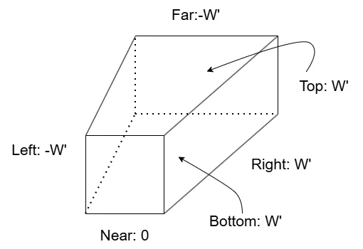
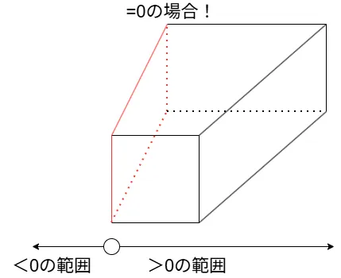
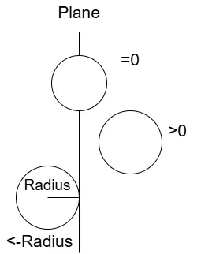
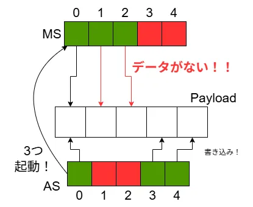
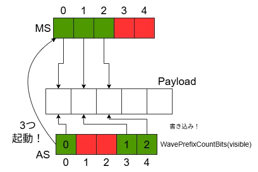
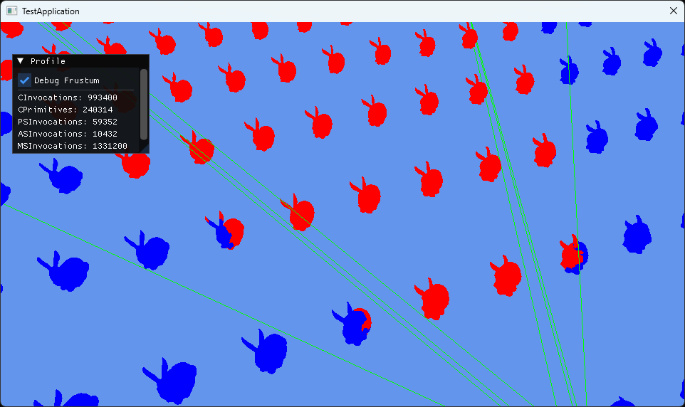

# Mesh Shaderによるカリング ～ Meshlet編1 FrustumCulling ～  
今回からMesh Shaderでのカリングに入っていく.  
前回GPU Instancingをやったが、そこではASで`DispatchMesh`を起動していた.  
これは逆を返せば`DispatchMesh`を起動しなければ、Mesh Shaderが起動されないということである.  
つまりは描画が行われないということで、カリングができるということである！  

そして、ASはMeshlet単位での処理を行っていて、MSではポリゴン単位の処理を行うのは前回見た通り.  
つまり、

* AS→Meshlet単位のカリング
* MS→ポリゴン単位のカリング

これができるわけである！  
今回は前半戦として、Meshlet単位のカリングを数回に分けて見ていこう！  
参考にするのはもちろんこちら[^1],非常にためになってます...  

さて、そしたらまずは「フラスタムカリング(Frustum Culling)」  
これはカメラの視錐台の中かどうかを判定するシンプルなもの.  
視錐台の中かどうかの判定は何でもいいっちゃいいんだけど、今回はシンプルにBounding Sphereを使ってやっていくことにする.  
そのため、MeshletのBounding Sphereをまずは作るところから.  

Meshletのデータをまずは拡張.  
float4のようなデータで用意をしておく.  
```c++
struct ResourceMeshlet
{
	uint32_t m_vertexOffset;
	uint32_t m_vertexCount;
	uint32_t m_primitiveOffset;
	uint32_t m_primitiveCount;
	uint32_t m_normalCone;
	XMFLOAT4 m_boundingSphere; // これを追加
};
```

meshletのBounding Sphereはmeshoptimizerを使えば簡単に作成可能.  
`meshopt_buildMeshlets`でMeshletを作成した後であれば、Meshletのデータに参照が可能.  
これを`meshopt_computeMeshletBounds`に頂点データと一緒に渡してあげれば、勝手にBuonding Sphereを作ってくれる.  
```c++
    // Create Bounding Sphere
    std::vector<XMFLOAT4> meshletBounds;
    std::vector<uint32_t> meshletCones;
    for (meshopt_Meshlet& meshlet : meshlets)
    {
        auto bounds = meshopt_computeMeshletBounds
        (
            &mesh->m_uniqueVertexIndices[meshlet.vertex_offset],        // start vertex index
            &meshletTriangles[meshlet.triangle_offset],                 // start triangle
            meshlet.triangle_count,                                     // num of triangle
            reinterpret_cast<const float*>(mesh->m_positions.data()),   // pointer to vertex positions
            mesh->GetVerticesNum(),                                     // num of vertex positions
            sizeof(XMFLOAT3)                                            // vertex stride
            );

        // ...
```
ここで`bounds`にはBounding Sphereの中心と半径が入っている.  
そのため、これをXYZが中心,Wが半径となるようにデータを構築すればOK.  
```c++
        // store sphere. Structure: XYZ=Center, W=Radius.
        meshletBounds.push_back(XMFLOAT4(bounds.center[0], bounds.center[1], bounds.center[2], bounds.radius));

        // ...
    }
```

後は最後にResource側に渡してやってあげればOK.  
```c++
        meshletResource.m_boundingSphere = meshletBounds[count];
```

あとはhlsl側にちゃんとデータの枠を忘れずに.  
```c++
struct Meshlet
{
    uint VertexOffset;
    uint VertexCount;
    uint TriangleOffset;
    uint TriangleCount;
    uint NormalCone;
    float4 BoundingSphere; // 追加
};
```

なんか`NormalCone`とかあるけど気にしないでください.  
これは次回にやる予定.  

さて、ここまでできればBounding Sphereは求まった！  
そしたら次は視錐台を用意する必要がある.  
これは6個の平面を使って表現を行うが,そうなると平面を求める必要がある...  
詳しい解説はFast Extraction of Viewing Frustum Planes from the WorldView-Projection Matrix[^2]というのが分かりやすい.  
ここでは単純にViewing Frustum Planeの求め方を考察してるが、日本語ではなんか説明があまり転がってなかったので、個人的に理解したものをここに残しておこうと思う.  

まず最初に座標変換はWorld行列$`W`$,ビュー行列$`V`$,射影行列$`P`$の$`M=WVP`$を掛けて変換を行う.  
簡単にするために$`W`$,$`V`$はとりあえず単位行列とする、つまり$`M=P`$を考える.  
この時、ある頂点$`v=(x,y,z,w(=1))`$を考える.  
そして、座標変換後の頂点は$`v^{\prime}=(x^{\prime},y^{\prime},z^{\prime},w^{\prime})`$とする.  
そうすると、$`v^{\prime}=vM`$となる.これを実際に計算してみると以下のようになる.  

```math
\begin{equation}
    \begin{split}
      v^{\prime} &= 
      \begin{bmatrix}
        x & y & z & w
      \end{bmatrix}
      \begin{bmatrix}
        m_{11} & m_{12} & m_{13} & m_{14} \\
        m_{21} & m_{22} & m_{23} & m_{24} \\
        m_{31} & m_{32} & m_{33} & m_{34} \\
        m_{41} & m_{42} & m_{43} & m_{44} \\
      \end{bmatrix}
      \\
      &=
      \begin{bmatrix}
        xm_{11} + ym_{21} + zm_{31} + wm_{41} \\
        xm_{12} + ym_{22} + zm_{32} + wm_{42} \\
        xm_{13} + ym_{23} + zm_{33} + wm_{43} \\
        xm_{14} + ym_{24} + zm_{34} + wm_{44} \\
      \end{bmatrix}^T 
      \\
      & = 
      \begin{bmatrix}
        v \cdot col_{1} \\
        v \cdot col_{2} \\
        v \cdot col_{3} \\
        v \cdot col_{4}
      \end{bmatrix}^T 
    \end{split}
\end{equation}
```

ただし、
```math
\begin{equation}
    \begin{split}
    col_{j}=
      \begin{bmatrix}
        m_{1j} & m_{2j} & m_{3j} & m_{4j}
      \end{bmatrix}
    \end{split}
\end{equation}
```
とする.  

DirectXではクリップ空間では、まだ$`w^{\prime}`$で割ってない場合は以下のような空間になる.  
```math
\begin{equation}
    \begin{split}
    & -w^{\prime} < x_{^\prime} < w^{\prime} \\
    & -w^{\prime} < y_{^\prime} < w^{\prime} \\
    & 0^{\prime} < z_{^\prime} < w^{\prime}
    \end{split}
\end{equation}
```

これを$`w^{\prime}`$で割ることで正規化されて0から1の範囲になり、デバイス座標に持っていけるようになるわけであるが、今回はその辺は関係ない.  
そしたら図示をしてみよう、Viewing Planeは現状次のような感じになっている.  

  

ここで各Planeに対して、FrustumPlane側かどうかを不等式であらわしてみる.  
例えばLeftとRightで考えてみる.  

今回まずLeftに関しては、$`x^{\prime}`$は左のクリップ平面よりも右側にいるのであれば内側といえる.  
そのため$`w^{\prime} < x^{\prime}`$となる.  
Rightに関しては逆に右のクリップ平面よりも左側にいる必要がある.  
そのため、$`x^{\prime} < w^{\prime}`$だ.  
こうすることでLeftとRightの両方が合わさる範囲を考える.  
すると、$`-w^{\prime} < x_{^\prime} < w^{\prime}`$という条件が見えてくるわけだ.  

この条件を全部の平面に対して定義してみると、以下のような感じになると思う.  

```math
\begin{equation}
    \begin{split}
    & -w^{\prime} < x^{\prime}: Left Planeから見た内部領域 \\
    & x^{\prime} < w^{\prime}: Right Planeから見た内部領域 \\
    & -w^{\prime} < y^{\prime}: Bottom Planeから見た内部領域 \\
    & y^{\prime} < w^{\prime}: Top Planeから見た内部領域 \\
    & 0 < z^{\prime}: Near Planeから見た内部領域 \\
    & z^{\prime} < w^{\prime}: Far Planeから見た内部領域
    \end{split}
\end{equation}
```

さて、ここまできたら次はLeft Planeにフォーカスを当てよう!!  
まず最初に$`-w^{\prime}<x^{\prime}`$に対して、一番最初に求めた$`v^{\prime}`$の関係式から値を代入すると,  

```math
\begin{equation}
    \begin{split}
    -v \cdot col_{4} &< v \cdot col_{1} \\
    0 &< v \cdot (col_{1} + col_{4})
    \end{split}
\end{equation}
```

これ、0より大きい範囲がViewPlaneのある範囲というのはわかるけど、さらに面白いことが見えてくる.  
0と同じときはViewPlane内ということになる、つまり=0の時を考えればLeft Planeが分かるということである.  

  

そういえば世の中には平面の方程式というものがあった、レイトレの交差[^3]あたりでも似たようなことはやったね.  
実は平面の方程式に今回の式を落とし込める.  
実際にやってみよう、まずは$`col_{1}, col_{4},v`$に具体的な値を代入して内積を取る.  

```math
\begin{equation}
    \begin{split}
    &\begin{bmatrix}
        x & y & z & w
    \end{bmatrix}
    \cdot 
    \begin{bmatrix}
        m_{11}+m_{14} & m_{21}+m_{24} & m_{31}+m_{34} & m_{41}+m_{44}
    \end{bmatrix}
    = 0 \\
    & x(m_{11} + m_{14}) + y(m_{21} + m_{24}) + z(m_{31} + m_{34}) + w(m_{41} + m_{44}) = 0
    \end{split}
\end{equation}
```

ここで、$`w=1`$なので、
```math
\begin{equation}
    \begin{split}
     x(m_{11} + m_{14}) + y(m_{21} + m_{24}) + z(m_{31} + m_{34}) + m_{41} + m_{44} = 0
    \end{split}
\end{equation}
```

あとは平面方程式
```math
\begin{equation}
    \begin{split}
     ax+by+cz+d=0
    \end{split}
\end{equation}
```
を考えると、

```math
\begin{equation}
    \begin{split}
    a = m_{11}+m_{14}, b=m_{21}+m_{24},c=m_{31}+m_{34},d=m_{41}+m_{44}
    \end{split}
\end{equation}
```
から成り立つということが分かる！  
こうしてLeft Planeは求まった！  
ただし、今回正規化のされていない点には注意、使う場合はちゃんと正規化をした方が色々便利なのでそこはコードを組むときはやっておくと良い.  

ここまでのLeft Planeだけど、全く同じ手順で全部のPlaneが求められる.  
全部やると流石に面倒なので、結果だけ示しておく.  

```math
\begin{equation}
    \begin{split}
    & Left Plane: v \cdot (col_{4} + col_{1}) = 0 \\
    & Right Plane: v \cdot (col_{4} - col_{1}) = 0 \\
    & Bottom Plane: v \cdot (col_{4} + col_{2}) = 0 \\
    & Top Plane: v \cdot (col_{4} - col_{2}) = 0 \\
    & Near Plane: v \cdot (0 + col_{3}) = 0 \\
    & Far Plane: v \cdot (col_{4} - col_{3}) = 0
    \end{split}
\end{equation}
```

これで式が求まったけど、ちょっと疑問が残る.  
今回はProjection行列はちゃんと値があるけど、View/World行列は単位行列である...  
これでは使いにくいのでは...と思うけど、実はこれは簡単な拡張で済む話となってる.  

今回のProjection行列の場合、つまり$`M=P`$の場合はView空間のClipping Planeとなっている.  
ここにView行列を掛けた場合、つまり$`M=VP`$の場合はWorld空間のClipping Planeが同じく$`col`$を取れば求まる.  
そしてWorld行列を掛けた場合、つまり$`M=WVP`$の場合はObject空間のClipping Planeが同じく$`col`$を取れば求まる.  

といった風にProjection行列と同じような計算で求まっちゃうわけだ、ここに変換行列の嬉しい部分が出ていますね.  

さて、ここまでくればやっとコードに落とし込める.  
今回$`v`$というのは頂点情報なので、shader側であればいいだけなのでCPUからPlaneの情報として送るのにはいらない.  
なので$`col`$の部分の情報さえ送ることができれば何とかなるという訳である.  
各`col`は行列内に配列として参照できるため、ここまでの式が理解できていればシンプルに書ける.  

```c++
XMVECTOR&& NormalizePlane(const XMVECTOR& value)
{
    auto* data = value.m128_f32;
    float magnitude = std::sqrt(data[0] * data[0] + data[1] * data[1] + data[2] * data[2]);
    return DirectX::XMVectorDivide(value, DirectX::g_XMOne * magnitude);
}

void CalculateFrustumPlanes(const XMMATRIX& view, const XMMATRIX& proj, XMVECTOR* planes)
{
    auto vp = DirectX::XMMatrixMultiplyTranspose(view, proj);

    planes[PLANE_LEFT] = NormalizePlane(DirectX::XMVectorAdd(vp.r[3], vp.r[0]));
    planes[PLANE_RIGHT] = NormalizePlane(DirectX::XMVectorSubtract(vp.r[3], vp.r[0]));
    planes[PLANE_BOTTOM] = NormalizePlane(DirectX::XMVectorAdd(vp.r[3], vp.r[1]));
    planes[PLANE_TOP] = NormalizePlane(DirectX::XMVectorSubtract(vp.r[3], vp.r[1]));
    planes[PLANE_NEAR] = NormalizePlane(vp.r[2]);
    planes[PLANE_FAR] = NormalizePlane(DirectX::XMVectorSubtract(vp.r[3], vp.r[2]));
}
```
今回は`plane`という配列にデータを収めるような関数を取った.  
$`M=VP`$を計算後、あとは上の対応に当てはめて$`col`$をAdd,Subtractで足し引きするだけである.  
一応ちゃんと正規化するのを忘れずに.  
$`M=VP`$なので、ワールド空間のFrustum Planeなわけだ.  

あとはこれを呼び出すだけ、それだけでFrustum Planeの完成！  
```c++
    CalculateFrustumPlanes(view, proj, param.m_planes);
```

Shader側もちゃんとデータを取るだけで終わる.簡単.  
今回はデバッグ用に別データ用意してますが、あくまで大事なのは`Planes`です.  
```c++
struct SceneProperties
{
    float4x4 MVP;
    float4 Planes[6]; // これ
    float4 DebugPlanes[6];
    float DebugFrustum;
};

ConstantBuffer<SceneProperties> Scene : register(b1);
```

さて、今回はASのみ書き換えていく.  
今回もIndexを取っていくところは同じ.  
```c++
void main
(
    uint groupThreadIndex : SV_GroupThreadID,
    uint dispatchThreadIndex : SV_DispatchThreadID,
    uint groupIndex : SV_GroupID
)
{
    bool visible = false;
    bool isInside = false;

    // calculate index
    uint instanceIndex = dispatchThreadIndex / Constant.MeshletCount;
    uint meshletIndex  = dispatchThreadIndex % Constant.MeshletCount;

    // if not exceed count, set index.
    if ((instanceIndex < Constant.InstanceCount) && (meshletIndex < Constant.MeshletCount))
    {   
        Meshlet meshlet = Meshlets[meshletIndex];
        Instance instance = Instances[instanceIndex];
```

今回のコードは`IsVisible`という関数で内部かどうかを判定する.  
そのためこれを呼び出す.  
デバッグ用で余計な処理を付けているが、大事なのは1行のみ.  
```c++
        if (Scene.DebugFrustum < 0.5f)
        {
            // 今回の核心
            visible = IsVisible(meshlet, Scene.Planes, instance.Mat, Scene.MVP); 
        }
        else
        {
            // debug
            isInside = IsVisible(meshlet, Scene.DebugPlanes, instance.Mat, Scene.MVP);
            visible = true;
        }
    }
```

そしたらまずは`IsVisible`を見ていこう.  
この関数は後々色々なカリング手法をやってくが、それをまとめる場所.  
```c++
bool IsVisible(Meshlet meshlet, float4 planes[6], float4x4 world, float4x4 viewProj)
{
    float4 sphere = TransformSphere(meshlet.BoundingSphere, world);

    // frustum culling
    if (!Contains(planes, sphere))
    {
        return false;
    }

    return true;
}
```
今はフラスタムカリングをやるだけなので、非常に単純.  
MeshletのBounding SphereをWorld座標系に持ってきてカリング判定を行うだけ！  

一つずつ処理を見ていこう.  
まずはWorld座標系に持っていくところを見よう.  
World座標系に持ってくのは非常に簡単.  
MeshletのBounidngSphereのデータは`XYZ->position`だった.  
そのため、このデータにWorld行列を掛けるだけである.  
```c++
float4 TransformSphere(float4 sphere, float4x4 world)
{
    // convert world coordinate.
    float4 value = mul(world, float4(sphere.xyz, 1.0f));
```

そしたら次に各軸に対して二乗した値を求める.  
その後、最大の長さを採用して平方根を取って距離を算出.  
あとはこれを使って、半径を補正しておく.  
```c++
    // calculate Length Square per axis
    float sx = dot(world._11_12_13, world._11_12_13);
    float sy = dot(world._21_22_23, world._21_22_23);
    float sz = dot(world._31_32_33, world._31_32_33);

    // adopt max length sq
    float scale = sqrt(max(sx, max(sy, sz)));

    return float4(value.xyz, sphere.w * scale);
}
```
これ単純にXYZのスケールが等倍の場合は問題ないけど、全部のスケールが等倍ではない場合はこうやって最大のスケール値で補正必要らしい.  
まあ気持ちはわからんでもない.  
とはいえ別段必要ない場合は使わなくてもよい、普通に等倍で問題ないなら普通に通常のradiusを使うのでもよい.  

さて、そしたら実際にフラスタムカリングを行う.  
まず大事なのは先ほどの図.  

  

要は平面の方程式が  

* 0より大きい→内側
* 0→平面上
* 0より小さい→外側

となる訳である.  
ただし、今回さらに大事なこととして、BoundingSphereが外に出ているのかというのが大事だということである.  

  

この時平面の方程式が0の状態は、一番上のようにBounding Sphereの中心が真ん中の状態であることを表す.  
今回出たかどうかの判定は一番下のようにRadius分ずらした状態、こうすることで完全に出た状態といえるようになる.  

ここまで分かればは中心とPlaneの情報で内積を取って計算、そして`-radius`で判定を取ればよい.  
これで外側と分かれば、内にはないとわかるため、`false`を返して終了.  
今回はPlane上に関しては内側と同じとしておいた.分けたい人は分けても良い.  
```c++
bool Contains(float4 planes[6], float4 sphere)
{
    float4 center = float4(sphere.xyz, 1.0f);

    for (int i = 0; i < 6; ++i)
    {
        if (dot(center, planes[i]) < -sphere.w) // もしPlane上も弾きたい場合は` <= `に変えればOK
        {
            return false;
        }
    }

    return true;
}
```

さて、そしたらあとは前回通り起動するだけ！！  
```c++
    if (visible)
    {
        sPayload.InstanceIndices[groupThreadIndex] = instanceIndex;
        sPayload.MeshletIndices[groupThreadIndex] = meshletIndex;
        sPayload.DebugColor[groupThreadIndex] = isInside ? 1 : 2;
    }

    uint visibleCount = WaveActiveCountBits(visible);
    DispatchMesh(visibleCount, 1, 1, sPayload);
}
```

さて、実はここには問題がある.  
カリングされてしまったら前回とは違ってデータの統一が取れていない.  

  

図を見てほしい、例えば今回Indexの1と2の場所はカリングされたとする.  
この時カリングされてるのでPayloadは`0,3,4`に書き込まれる.  

そして、ASからは3つのMeshletがDispatchMeshで起動が行われる.  
MS側では先頭からデータがあると思ってアクセスする.  
その際のIndexは...`0,1,2`！！  
これでは`1,2`はデータがない状態になってしまう...  

そこでWaveには非常に便利な関数`WavePrefixCountBits`[^4]が用意されている.  
各Laneにおいてtrueとなっている数を数えて、先頭からその数をindexとして取得できる機能.  
これを使えば先ほどの図は次のように変わる.  

  

`WavePrefixCountBits`を使ったことで、ASのLaneの緑の部分が先頭から`0,1,2`と分かった！  
このIndexを使って書き込みを行えば、ちゃんと整合性の取れるデータになるわけだ.  
後はこのIndexを使って書き込みを行うように修正するだけ.  
```c++
    if (visible)
    {
        uint index = WavePrefixCountBits(visible);
        sPayload.InstanceIndices[index] = instanceIndex;
        sPayload.MeshletIndices[index] = meshletIndex;
        sPayload.DebugColor[index] = isInside ? 1 : 2;
    }
```

結果を見てみよう.  

  

赤い部分が内側判定,青い部分が外側判定となっている.  
いい感じに弾かれているっぽいですね.  
これで一番単純なフラスタムカリングは終了！！  
次は法錐カリングの予定～.  

[^1]: [メッシュシェーダカリング](https://www.project-asura.com/articles/d3d12/d3d12_022.html)    
[^2]: [Fast Extraction of Viewing Frustum Planes from the WorldView-Projection Matrix](https://www.gamedevs.org/uploads/fast-extraction-viewing-frustum-planes-from-world-view-projection-matrix.pdf)  
[^3]: [Quad](../Intersection/Quad.md)  
[^4]: [HLSLのWave Intrinsicsについて](https://shikihuiku.github.io/post/wave_intrinsics1/)  