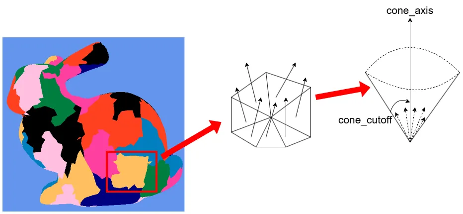

# Mesh Shaderによるカリング ～ Meshlet編2 Normal Cone Culling ～  
今回はASでのMeshlet Cullingの2つ目をやっていく.  
Normal Coneによるカリング、頑張っていこう.  
参考にするのはもちろんこちら[^1],非常にためになってます...  

さて、Normal Coneというのは何だろうというところから始める.  
そもそもMeshlet単位のカリングしかASはできないわけだけども、もしポリゴン単位であれば法線カリングという方法が使えた.  
法線カリングのやりたいことは簡単で、視線ベクトルと法線を比較して、明らかに裏面のものはカリングするというものだ.  
これをもしMeshletでやるとすると、Meshletはポリゴンの集まりであるため、法線が一つではなく複数あることになる.  

  

そこで、Meshlet内の法線全部を含むような円錐を作成する.  
法線ではなくこの円錐に対してカリング判定を取ればいいんじゃない～？というのがMeshlet版法線カリングのアイデアとなる.  
meshletは生成時に頂点の近い位置を選出しているため、ある程度方向も同じだしちょうどいい法錐になるので、こういうカリング法の実装でも中々うまくいくんだろうな～と個人的には思った.  

何はともあれ、まずは法錐のデータを作らないと始まらない.  
ということで、今回もこっから始めよう.  
この法錐も前回のBounding Sphereと同様,meshoptimizerを使うことで実装が可能!!  

まずは法錐のデータを入れる用の配列を用意、`uint32_t`でOK.  
```c++
    std::vector<uint32_t> meshletCones;
```

さて、前回のBounds計算で`meshopt_computeMeshletBounds`を行っていた.  
実はこれで投げると法錐のデータに関してもちゃんと用意ができている.  
そのため、まずはデータを抽出しよう.  
法錐は先ほどの上の図にある通り、

* 法錐の方向の軸となる`normal_axis`
* 法錐の角度となる`normal_cone`

この二つである.  
軸は$`xyz`$なのでfloat3つ分で、角度はfloat1つ分なので全部を`XMFLOAT4`に格納する.  
ただし、データは$`[-1,1]`$なので、$`[0,1]`$となるように調整をしておく.  
```c++
        XMFLOAT4 normalCone =
        {
            std::clamp(bounds.cone_axis[0] * 0.5f + 0.5f, 0.0f, 1.0f),
            std::clamp(bounds.cone_axis[1] * 0.5f + 0.5f, 0.0f, 1.0f),
            std::clamp(bounds.cone_axis[2] * 0.5f + 0.5f, 0.0f, 1.0f),
            std::clamp(bounds.cone_cutoff  * 0.5f + 0.5f, 0.0f, 1.0f) // sin(a)
        };
```

そして、そのあとは`XMFLOAT4`を8bitずつ`uint32_t`に収める.  
index bufferでもやってたのと同じような処理だ.  
```c++
        uint32_t packNormalCone = 0u;
        packNormalCone |= ((static_cast<uint8_t>(normalCone.x * 255.0f) & 0xFF) << 0);
        packNormalCone |= ((static_cast<uint8_t>(normalCone.y * 255.0f) & 0xFF) << 8);
        packNormalCone |= ((static_cast<uint8_t>(normalCone.z * 255.0f) & 0xFF) << 16);
        packNormalCone |= ((static_cast<uint8_t>(normalCone.w * 255.0f) & 0xFF) << 24);

        meshletCones.push_back(packNormalCone);
```
あとはResource側でも渡すのを忘れずに.  
```c++
        meshletResource.m_normalCone = meshletCones[count];
```

そしたらhlsl側、こっちも前回同様Meshletにデータを用意すればOK.  
```c++
struct Meshlet
{
    uint VertexOffset;
    uint VertexCount;
    uint TriangleOffset;
    uint TriangleCount;
    uint NormalCone; // 追加
    float4 BoundingSphere;
};
```
ここまででデータの追加は終わった！  
次は実際に法錐カリングの処理に入っていく.  

[^1]: [メッシュシェーダカリング](https://www.project-asura.com/articles/d3d12/d3d12_022.html)  
