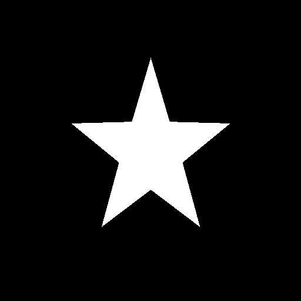
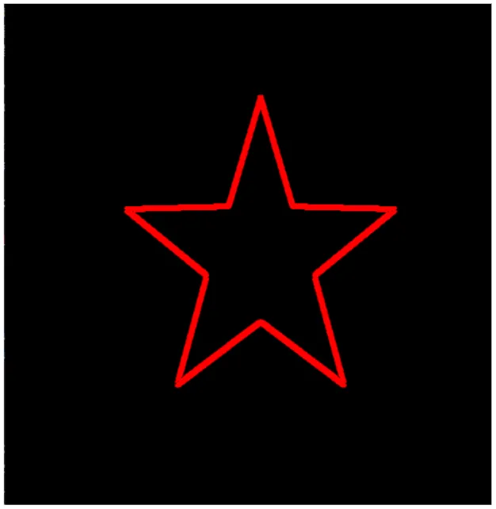
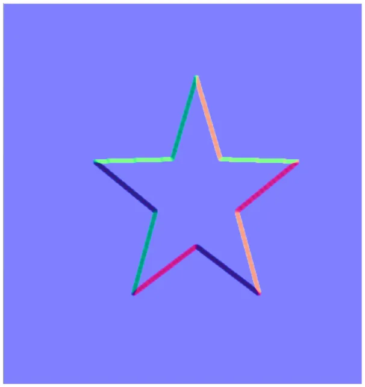
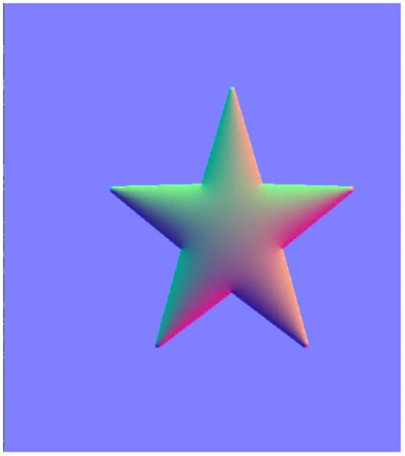
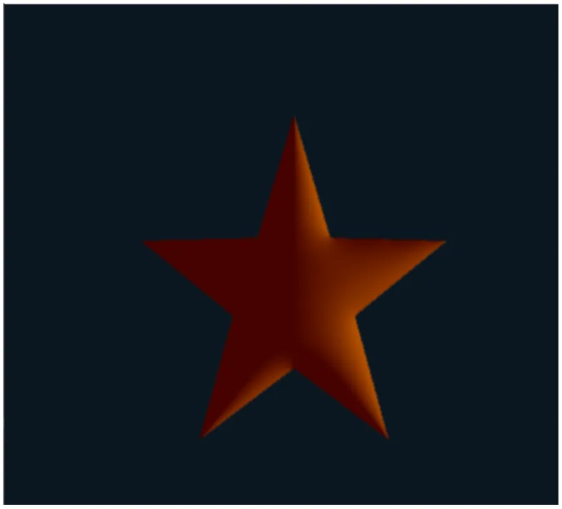

# Lumoを実装してみる  
最近ここのページ[^1]を見ていて、法線復元手法のLumo[^2]というものを知った.  
この手法に関する実装もやってくれており[^3]、非常にとっつきやすかったので今回はこれをSiv3Dで実装してみようと思う.  

この手法ではマスク画像を用意して、マスクから輪郭を抽出することで縁に法線を生成していく.  
そのため、まずは今回は星形のマスク画像を用意してみた.  

  

こんな感じの黒と白のものを用意.  
今回は2値だけど、もちろん複数のグレー画像$`(0,0.5,0.7,1)`$とかを用意してもよい.  
元の論文を読んでる感じはそういう風にアーティストがうま～く調整して、複数輪郭に分離してるっぽい.  
とはいえ自分でやるのには若干面倒なので、今回は2値で済ましてしまっている.  

そしたら実際に処理を行っていく.  
まずは現状の画像からRのみのマスクデータとして用意を行う.  

```c++
auto r = inputImage;
// AlphaをRに変換 
for (int i = 0; i < ImageWidth; i++)
{
    for (int j = 0; j < ImageHeight; j++)
    {
        r[j][i] = ColorF{ static_cast<double>(inputImage[j][i].r), 0.0, 0.0, 1.0 };
    }
}
```

その後、Siv3Dには簡易的にGaussian Blurを掛けることができるため、これを掛けて縁をぼかしてやる.  

```c++
// Gaussian Blurを適用してぼかす
r.gaussianBlur(GaussianFilterKernelSize);
```

次に輪郭の抽出を行う.  
輪郭の抽出にはSobel Filterを利用する.  
今回は5x5のソーベルフィルタを適用した、ソーベルフィルタの実装は3x3だけど別の記事でやったので略.  
また、データに関しては画像から`double`の$`[0,1]`$に直している.  
画像のまま計算すると結構面倒が起こることがSiv3Dだとあるので、この方式にしている.  
何か内部で255にしたりとかして、今どういうデータなのか分からなくなっちゃうのよね...一番この方式が手軽で良い.  
```c++
// 後々の計算を楽にするためArrayで変換
for (int i = 0; i < ImageWidth; i++)
{
    for (int j = 0; j < ImageHeight; j++)
    {
        silhoutteNormal[j][i] = r[j][i].r / 255.0;
    }
}

// Sobelで輪郭抽出
gx = SobelFilter(silhoutteNormal, weightsX);
gy = SobelFilter(silhoutteNormal, weightsY);
```

今回はy方向のみソーベルを掛けた結果を見ておこう.  



いい感じに輪郭が取れてるね.  
これで勾配となる$`g_{x},g_{y}`$が計算できたことになる.  
次にやるのはこの輪郭に対して、法線を設定してあげることである.  
$`N(p) = \frac{(g_{x},g_{y},1)}{\sqrt{g_{x}^{2}+g_{y}^{2}+1^{2}}}`$のような感じで正規化したものを法線とする.  
```c++
for (int i = 0; i < ImageWidth; i++)
{
    for (int j = 0; j < ImageHeight; j++)
    {
        auto x = gx[j][i];
        auto y = gy[j][i];
        auto n = silhoutteNormal[j][i];

        Vec3 g = { -x,y,1.0 };
        initialNormal[j][i] = g.normalized();
    }
}
```

ここまでの結果を見てみよう.  

  

いい感じに輪郭だけ法線が取れている.  
後は外の境界を排除しつつ、内側にこの法線を滑らかに伝搬させていけばよい.  
そのために以下のようなラプラス方程式を考える.  

```math
\begin{equation}
    \begin{split}
    \Delta N(p) = 0
    \end{split}
\end{equation}
```

ラプラス方程式が0になるということは、二階微分が0になっているということである.  
これはつまり傾きが一定、つまり変化が一定となり平均的な数値になることが感覚的に分かる.  
そのため、この式となるような$`N(p)`$になっていれば、内部の法線が滑らかになっているといえる.  
ただし、ラプラス方程式には境界条件が必要.  
今回はこれは外側は法線が存在せず、特に変化が起こらないという風にしておく.  
そもそも内側さえあればいいので、まあそりゃそうという感じだね.  

さて、これを解く前にもう少し面倒なポアソン方程式から見てみよう.  
参考にするのはこの記事[^4],非常に分かりやすい.  
これは以下のような形だった.  

```math
\begin{equation}
    \begin{split}
    \Delta N(p) = -f(p)
    \end{split}
\end{equation}
```

今回はテクスチャ空間なので、$`u,v`$として考えてラプラス演算子を分解する.  

```math
\begin{equation}
    \begin{split}
    \frac{\partial^{2} N(u,v)}{\partial u^{2}} + \frac{\partial^{2} N(u,v)}{\partial v^{2}} = -f(u,v)
    \end{split}
\end{equation}
```

この時,まずu方向の微小範囲$`\delta`$でテイラー展開をすると,  

```math
\begin{equation}
    \begin{split}
    N(u+\delta,y) &= N(u,v)
    + \frac{\partial N(u,v)}{\partial u} \delta 
    + \frac{1}{2}\frac{\partial^{2} N(u,v)}{\partial u^{2}} \delta^{2}
    + \frac{1}{2 \cdot 3} \frac{\partial^{3} N(u,v)}{\partial u^{3}} \delta^{3}
    + \frac{1}{2 \cdot 3 \cdot 4} \frac{\partial^{4} N(u,v)}{\partial u^{4}} \delta^{4}
    + \mathcal{O}(\delta^{5}) \\

    N(u-\delta,y) &= N(u,v)
    - \frac{\partial N(u,v)}{\partial u} \delta 
    + \frac{1}{2} \frac{\partial^{2} N(u,v)}{\partial u^{2}} \delta^{2}
    - \frac{1}{2 \cdot 3} \frac{\partial^{3} N(u,v)}{\partial u^{3}} \delta^{3}
    + \frac{1}{2 \cdot 3 \cdot 4} \frac{\partial^{4} N(u,v)}{\partial u^{4}} \delta^{4}
    + \mathcal{O}(\delta^{5})
    \end{split}
\end{equation}
```

この2式を足し合わせると,

```math
\begin{equation}
    \begin{split}
    \frac{\partial^{2} N(u,v)}{\partial u^{2}} = \frac{N(u+\delta,v) + N(u-\delta,v) - 2N(u,v)}{\delta^{2}}
    + \mathcal{O}(\delta^2)
    \end{split}
\end{equation}
```

vにも同様の計算を行うと、

```math
\begin{equation}
    \begin{split}
    \frac{\partial^{2} N(u,v)}{\partial v^{2}} = \frac{N(u,v+\delta) + N(u,v-\delta) - 2N(u,v)}{\delta^{2}}
    + \mathcal{O}(\delta^2)
    \end{split}
\end{equation}
```

これを代入すると、

```math
\begin{equation}
    \begin{split}
    \frac{4N(u,v)}{\delta^{2}} &= 
    \frac{N(u+\delta,v) + N(u-\delta,v)+N(u,v+\delta) + N(u,v-\delta)}{\delta^{2}} +f(u,v) + \mathcal{O}(\delta^2) \\
    N(u,v) &= 
    \frac{1}{4}(N(u+\delta,v) + N(u-\delta,v)+N(u,v+\delta) + N(u,v-\delta)) + \frac{f(u,v)}{4} \delta^{2} + \mathcal{O}(\delta^4)
    \end{split}
\end{equation}
```

さて、これがポアソン方程式を差分で表したものとなるが、今回は$`f(u,v)=0`$なため、もう少し簡略化して以下のようになる.  

```math
\begin{equation}
    \begin{split}
    N(u,v) &= 
    \frac{1}{4}(N(u+\delta,v) + N(u-\delta,v)+N(u,v+\delta) + N(u,v-\delta))  + \mathcal{O}(\delta^4)
    \end{split}
\end{equation}
```

うん、すごいシンプルな形になった！  
テクスチャの性質上$`\delta`$は周りのピクセル上の移動となるため,添え字として考えると,

```math
\begin{equation}
    \begin{split}
        N(u_{i},v_{i}) &= 
        \frac{1}{4}(N(u_{i+1},v_{i}) + N(u_{i-1},v_{i})+N(u_{i},v_{i+1}) + N(u_{i},v_{i-1}))
    \end{split}
\end{equation}
```

これがある程度収束するまで計算し続けるのが「ヤコビ法」となる！  
まずはこれを組んでみよう.  

まずは変数を用意.  
収束したとみなす値を`Convegence`で用意し、判定は`delta`の数値を見て行う.  
周辺の方向に関しては`direction`で用意してみた.  
```c++
double delta = 1e+2;
constexpr double Convegence = 1e-7;

const Array<Vector2D<int>> direction = { {-1,0},{1,0},{0,-1},{0,1} };
```

まず収束していなければ常に更新を行う.  
更新は画像全体だ.  
```c++
// ラプラシアンで最適化を行う
while (delta > Convegence)
{
    double maxValue = std::numeric_limits<double>::min();
    // ヤコビ法で更新
    for (int i = 0; i < ImageWidth; i++)
    {
        for (int j = 0; j < ImageHeight; j++)
        {
```

今回はマスク画像を利用して境界条件を設定している.  
そのため、境界外に関しては特に何もしない.  
```c++
            // 境界条件,外側は更新しない
            if (silhoutteNormal[j][i] < 20.0 / 255.0)
            {
                current[j][i] = prev[j][i];
                continue;
            }
```

そしたら画像の外側を取らないようにIndexを求めて、4方向を足し合わせる.  
足し合わせた後は4で割ればヤコビ法の計算終了！  
最後に以前の値と比較して最大のものを保持しておく.  
これは最後に`delta`に入れて、収束しているかの判定に利用する.  
```c++
            Vec3 sum = Vec3::Zero();

            for (const auto& dir : direction)
            {
                const int width = Clamp(i + dir.x, 0, ImageWidth - 1);
                const int height = Clamp(j + dir.y, 0, ImageHeight - 1);
                sum += prev[height][width];
            }
            current[j][i] = sum / 4.0;

            maxValue = Max(maxValue, (current[j][i] - prev[j][i]).length());
        }
    }

    // 計算した結果で更新
    delta = maxValue;
    prev = current;
}
```

あとはこれをグルグル回し続けるだけだけども、これが死ぬほど重い...  
そのため高速化のためとお勉強のために、他の2手法も試しに組み込んでみた.  
参考はこちら[^5].  

まず最初にやるのは「ガウス・ザイデル法」.  
これは特に難しいことはなく、単純に更新時に逐一更新した値を使おうねというだけの話である.  
そういえば強化学習でもDP[^6]で似たようなことをやった記憶がある.  

それはそれとして実装してみよう.  
やることは簡単で、その場更新をするだけである.  
前回までは`prev`を参照してたけど、それを消して`current`参照にしただけ.  
`current`は逐一更新されるので、既に更新されたものであればそれが使われるという仕組み.  
`prev`要らずなので、速くなるだけでなくメモリにも優しい.  
```c++
for (const auto& dir : direction)
{
    const int width = Clamp(i + dir.x, 0, ImageWidth - 1);
    const int height = Clamp(j + dir.y, 0, ImageHeight - 1);
    sum += current[height][width]; // Gauss Seidelではその場更新
}
current[j][i] = sum / 4.0;
```

これでちょっとだけ速くはなるけども、まあ焼け石に水感.  

次に「SOR法」,Successive Over-Relaxationの頭文字を取ってSORっぽい[^8].  
この方法はまずガウス・ザイデル法を以下のように分離して考える.  

```math
\begin{equation}
    \begin{split}
        N(u_{i},v_{i})^{n+1} &= N(u_{i}, v_{i})^{n} + N^{\prime} \\

        N^{\prime} &= 
        \frac{1}{4}(N(u_{i+1},v_{i})^{n} + N(u_{i-1},v_{i})^{n}+N(u_{i},v_{i+1})^{n} + N(u_{i},v_{i-1})^{n}) - N(u_{i}, v_{i})^{n}
    \end{split}
\end{equation}
```

この$`N^{\prime}`$が大事で、これが$`N(u_{i}, v_{i})^{n}`$の更新量を表している.  
ガウス・ザイデルではこの$`N(u_{i}, v_{i})^{n}`$の変化が単調になりやすいらしい.  
単調なら加速させてもよくない？収束速度を上げちゃおうよ、ということでパラメータを掛けて以下の形にする.  

```math
\begin{equation}
    \begin{split}
    N(u_{i},v_{i})^{n+1} = N(u_{i}, v_{i})^{n} + \omega_{SOR} N^{\prime}
    \end{split}
\end{equation}
```

この$`\omega_{SOR}`$を過緩和パラメータと呼び、$`\omega_{SOR}=1`$の時はガウス・ザイデルと一致する.  
大きくすればするほど探索幅が広がるので、収束が速くなる可能性もあるし、行き過ぎて逆にダメになる可能性もあるわけだ.  
SORは$`\omega_{SOR}`$というハイパーパラメータを上手く決めることで最適化する手法ともいえる.  
自分のメモの中だと強化学習のBaseline[^7]あたりがほぼほぼ近い内容ですね、こう考えると強化学習結構似たようなことをやってたものなんだねぇ...  

さて、この$`\omega_{SOR}`$はどうも矩形領域に関しては最適なものが決まってるらしい.  
これは以下のような感じ.  

```math
\begin{equation}
    \begin{split}
    \omega_{SOR} &= \frac{2}{1+ \sqrt{1-\lambda^{2}}} \\
    \lambda &= \frac{1}{2} (\cos{\frac{\pi}{N_{x}}} + \cos{\frac{\pi}{N_{y}}})
    \end{split}
\end{equation}
```

十分大きい場合、つまり$`N_{x} >> 1, N_{y} >> 1`$の場合は$`\omega_{SOR} \approx 2`$となる.  
あとはこれを実装するだけ.  
まずは最適な$`\omega_{SOR}`$を求める.  
```c++
double lambda = 0.5 * (Cos(Math::Pi / ImageWidth) + Cos(Math::Pi / ImageHeight));
double omega = 2.0 / (1.0 + Sqrt(1.0 + 1.0 - lambda * lambda));
```
後は式通り計算するだけ！  
```c++
Vec3 sum = Vec3::Zero();

for (const auto& dir : direction)
{
    const int width = Clamp(i + dir.x, 0, ImageWidth - 1);
    const int height = Clamp(j + dir.y, 0, ImageHeight - 1);
    sum += current[height][width];
}

sum = current[j][i] + (sum/4.0 - current[j][i]) * omega;
current[j][i] = sum;
```

この計算で実際に法線を計算した結果が以下のようになる.  



うん、いい感じに法線が内部にも満たされるようになった！  
こうして値が求まったからには後は法線ライティングを実装すればよい.  

今回はshaderにはこんな感じで実装してみた.  
textureを法線として用意.  
Textureのデータは$`[0,1]`$なので、法線空間の$`[-1,1]`$に移す.  
そして、この法線を利用してライト方向と内積を取って、Lambertを計算.  
```hlsl
	float2 uv = input.uv;
	float4 tex = g_texture0.Sample(g_sampler0, uv);
	float3 normal = tex.rgb * 2.0f - 1.0f;
	float alpha = tex.a;

	float4 color = float4(saturate(dot(normal, g_lightDirection)) * g_lightColor, alpha);
	color.rgb += g_lightBase;
	return (color * input.color) + g_colorAdd;
```

結果は以下のような感じ.  

  

うん、それっぽくライティングはできてるっぽい.  
アウトラインを描くだけでそれっぽく法線を構築できる手法Lumo,確かに面白い.  
自分でマスクを作る手間はあるけども、それさえできればそれっぽい法線が生成できるのは嬉しいところ.  
問題はといえばあまりにも収束が遅いところ、そこがイテレーション上問題かなぁ.  
結構楽しめたので今回はこれで良しとする.  

[^1]: [NPR向けの形状復元手法](http://hideki-todo.com/cgu/blog/article/NPR-ShapeReconstruction/)  
[^2]: [Lumo: illumination for cel animation](https://dl.acm.org/doi/10.1145/508530.508538)  
[^3]: [NPR Shape-From-Shading (Python)](https://github.com/tody411/NPR-SFS)  
[^4]: [[Pythonによる科学・技術計算] 静電位に対する2次元ラプラス・ポアソン方程式のヤコビ法による数値解法，楕円型偏微分方程式，境界値問題](https://qiita.com/sci_Haru/items/6b80c7eb8d4754fb5c2d)  
[^5]: [[Pythonによる科学・技術計算] ラプラス方程式に対するSOR法・ガウス-ザイデル法・ヤコビ法の収束速度の比較，偏微分方程式，境界値問題](https://qiita.com/sci_Haru/items/b98791f232b93690a6c3)  
[^6]: [PolicyEvaluation](../../RL/Sutton/Ex04/PolicyEvaluation.md)  
[^7]: [GradientBaseline](../../RL/Sutton/Ex02/GradientBaseline.md)  
[^8]: [SOR法](https://w.wiki/Ug58)  