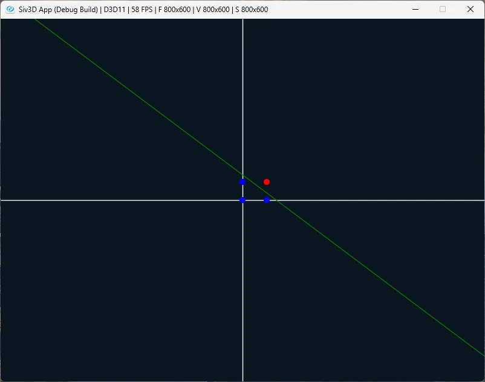

# And Gate  
ゼロから作るDeep Learning 1を進めていく.  
いつかやりたいといいつつやってないので、そろそろやるかの気分で始めた.  
とりあえずsiv3Dオンリーで進めるけど、そのうち外部ライブラリを使うかもしれない.  
ということでまずは線形分離から.  
最初にAndの真理表を考えてみる.  

| x1 | x2 | y |
| ------------ | ------------- | ------------ |
| 0 | 0 | 0 |
| 1 | 0 | 0 |
| 0 | 1 | 0 |
| 1 | 1 | 1 |  

Andは単純で$`x_1`$と$`x_2`$の値で両方が1の場合に1になる.  
たったそれだけ.  
これを$`x_1`$がx座標,$`x_2`$がy座標の座標軸を作る.  
そして、yが0なら座標の点は青,1なら座標の点は赤にする.  
これを解くために以下のような式を導入する.  

```math
\begin{equation}
    \begin{split}
    y = 
    \begin{cases}
    0(b+\omega_{1} x_{1} + \omega_{2} x_{2} \le 0) \\
    1(b+\omega_{1} x_{1} + \omega_{2} x_{2} > 0)
    \end{cases}
    \end{split}
\end{equation}
``` 
こんな感じで先ほどのxと重み$`\omega_{1}, \omega_{2}`$とバイアス$`b`$で表していく.  
この式より小さければ0,大きければ1となるようにするのである.  
そしてイコールの時が直線で、線分で分けられるため決定曲線とかいうね.  

まあいうだけでは分かりにくいので、まずはコードで書いて可視化してみよう.  
用意するのは重みとバイアスのみ.  
```c++
Vec2 m_weight;
double m_bias;
```
今回のパラメータは以下のような感じ.  
値は別段ほかでもOKだけど、本の通りに設定.  
```c++
    : m_weight({0.5, 0.5})
    , m_bias(-0.7)
```
そして、式通りに書くだけ.  
今回は0or1なので、boolで返すようにしてみる.  
```c++
bool AndGate::Evaluate(const Vec2 value)
{
    double result = Dot(value, m_weight) + m_bias;
    return result > 0.0;
}
```
更に決定境界.  
$`x_1`$は与えられているとする.  
この時イコールであるとすると以下のような式変形ができるはず.  
```math
\begin{equation}
    \begin{split}
    & b+\omega_{1} x_{1} + \omega_{2} x_{2} = 0 \\
    & \omega_{2} x_{2} = -(b + \omega_{1} x_{1}) \\
    & x_{2} = - \frac{b + \omega_{1} x_{1}}{\omega_{2}}
    \end{split}
\end{equation}
``` 
これで決定境界が求まった、後はこれを定義してみればOK.  
今回は座標軸のように返すようにしてみる.  
```c++
Vec2 AndGate::GetDecisionBoundary(const double x)
{
    return Vec2{ x, -(x * m_weight.x + m_bias) / m_weight.y };
}
```
ここまでできればあとは可視化のみ.  
まずは描画したい範囲内のxの一番小さい値と一番大きい値でy値を計算.  
そのy値を使って直線を入れれば終わり.  
```c++
// 決定境界
Vec2 left = andGate.GetDecisionBoundary(MIN_X_VALUE);
Vec2 right = andGate.GetDecisionBoundary(MAX_X_VALUE);

left = ConvertPoint(left); right = ConvertPoint(right);
Line{ left, right }.overwrite(*m_image, Palette::Green);
```
そしたら次に真理表と同じように4つの値を点として用意して、判定を行う.  
判定後は点を描画.  
```c++
// 分類データ
Array<Vec2> points = { {0,0},{0,1},{1,0},{1,1} };

for (const auto& point : points)
{
    bool result = andGate.Evaluate(point);
    Vec2 convert = ConvertPoint(point);
    Circle{ convert, 5 }.overwrite(*m_image, result ? Palette::Red : Palette::Blue);
}
```
これを可視化すると以下のような感じ.  
  
先ほど言ったように青が0で赤が1.  
緑が決定境界としてある.  
ちゃんと分けられているのが分かる.  
これが今回のやりたいこと,直線で区分するということである.  
