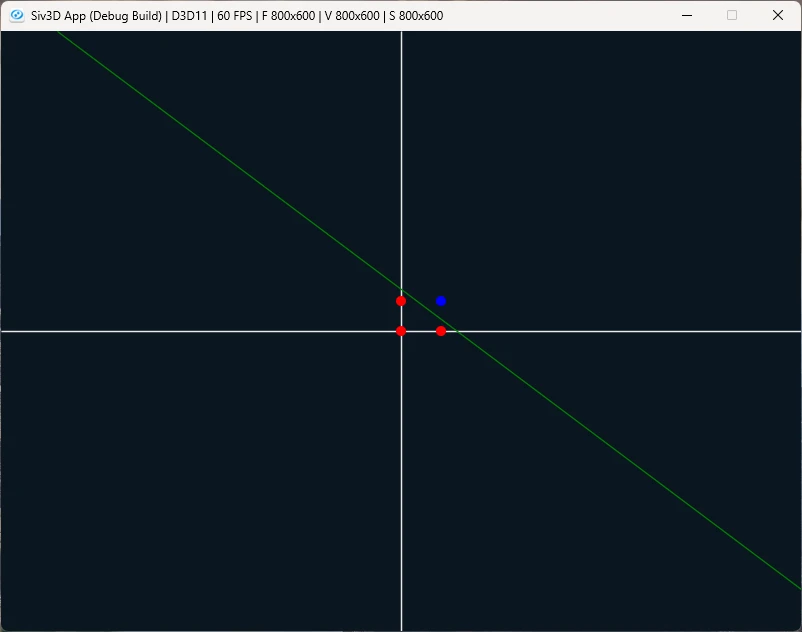

# Nand Gate  
次はNand,真理値表は以下.  

| x1 | x2 | y |
| ------------ | ------------- | ------------ |
| 0 | 0 | 1 |
| 1 | 0 | 1 |
| 0 | 1 | 1 |
| 1 | 1 | 0 |  

これもAdd Gateと同じ形で求められる.  
違うのは初期値だけ、初期値は次のような感じ.  
```c++
: m_weight({ -0.5, -0.5 })
, m_bias(0.7)
```
これを可視化したのが以下.  

Addとはちょっと違う感じの線形分離だね.  